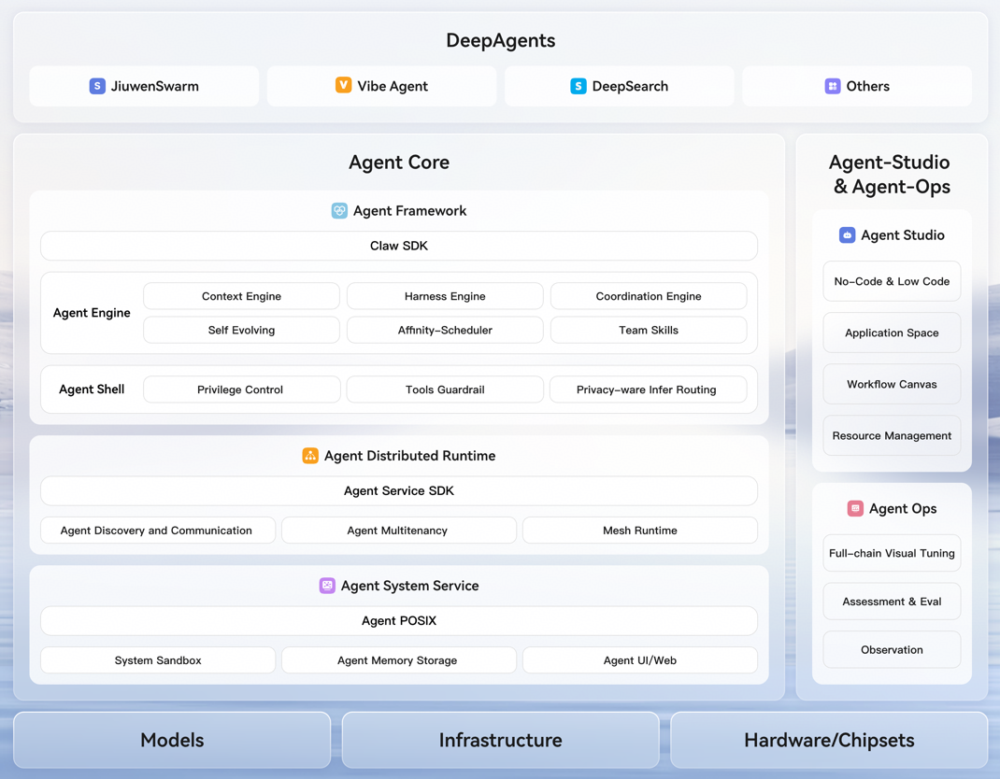
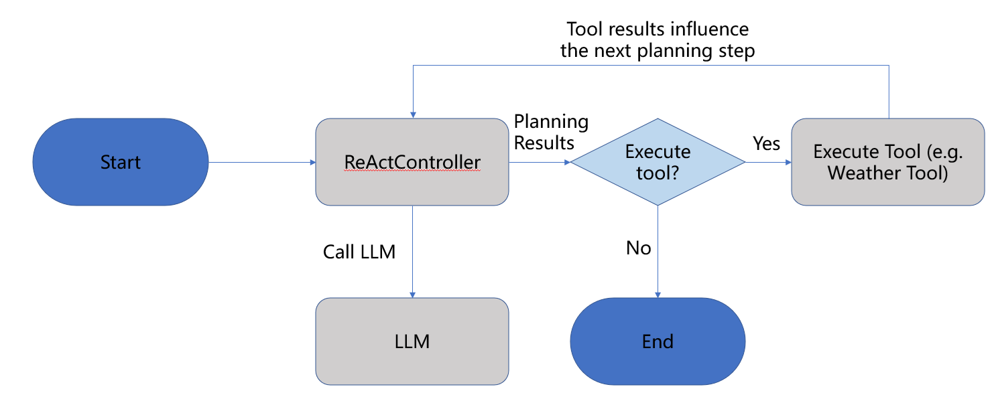
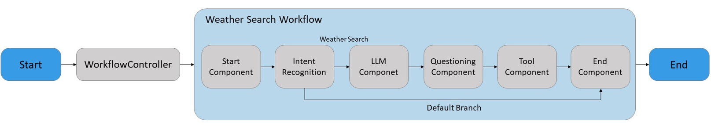

# What is openJiuwen?

With the continuous advancement of artificial intelligence, large language model (LLM) technology has rapidly matured. AI applications have evolved from systems focused on simple tasks such as speech recognition into intelligent agents capable of autonomous reasoning, decision-making, and execution of complex tasks. LLM-based agents possess autonomy, goal orientation, and interactive capabilities, enabling them to perceive information, reason, make decisions, and act effectively in complex and dynamic environments. As a result, AI Agents demonstrate strong potential across a wide range of industries and are increasingly applied in areas such as customer support, sales enablement, medical diagnosis, and financial analysis.

As an open-source agent platform, openJiuwen is dedicated to providing flexible, powerful, and easy-to-use capabilities for AI Agent development and execution. Built on this platform, developers can rapidly construct AI Agents to handle tasks of varying complexity, orchestrate collaboration and interaction among multiple agents, and efficiently develop reliable, production-grade AI Agents. openJiuwen also helps enterprises and individuals quickly build AI Agent systems or platforms, accelerating the adoption and large-scale deployment of commercial-grade Agentic AI technologies.

# Application Scenarios

openJiuwen enables the rapid development of AI Agent applications for both consumer and enterprise use cases, helping individuals and organisations improve development efficiency, execution accuracy, and overall system performance.

**Consumer-oriented Application Scenarios**

By leveraging zero-code, low-code, or SDK-based approaches in combination with prompt self-optimisation techniques, users can quickly build complex single-turn and multi-turn conversational Agents. This significantly improves development efficiency while meeting personalised requirements.

- Chat Assistant: Through natural language processing and contextual understanding, the assistant delivers natural and high-quality conversational experiences. It is widely used in customer service and user support scenarios to improve user satisfaction and engagement.
- Text generation: Leveraging the strong language generation capabilities of LLMs, the system supports article writing, creative copywriting, and press release generation to meet diverse needs in marketing and creative fields.
- Intelligent assistant: Powered by task planning and multi-agent collaboration, the system supports intelligent services such as schedule management, information retrieval, and transaction processing, improving the efficiency of individuals and teams.

**Application Scenarios for Enterprises**

Enterprises can leverage openJiuwen’s workflow engine and multi-agent collaboration capabilities to rapidly build, deploy, and efficiently execute various Workflow Agents. These agents can autonomously plan, decompose, and execute complex tasks, significantly reducing implementation costs and accelerating the commercial adoption of Agentic AI.

- Financial industry: Through multi-agent collaboration, the system supports multi-level intent routing, intelligent task allocation, and dynamic agent scheduling. This enables financial institutions to build integrated service systems with high precision, low latency, strong reliability, and robust security.
- Healthcare: Supports customised development of medical Agents for efficient medical record summarisation, preliminary screening of medical imaging data, and generation of diagnostic and treatment recommendations. By deeply integrating professional medical knowledge with contextual information, the system provides accurate and comprehensive clinical decision support, improving diagnostic efficiency and accuracy.

# Product Advantages

Key advantages of the openJiuwen platform include:

- Full-scenario adaptability: Designed for both enterprise (ToB) and consumer (ToC) use cases, supporting a wide range of application scenarios for organisations and individuals.
- Flexible development methods: Offers zero-code, low-code, and SDK-based development options to accommodate users with varying technical backgrounds and requirements.
- Efficient and precise task execution: Ensures high efficiency and accuracy in AI Agent task execution by optimising task processing workflows.
- Multi-Agent collaboration: Enables coordinated operation of multiple Agents to handle complex business processes and cross-domain tasks more effectively.
- Stable production-grade support: Provides commercial-grade stability and high availability, ensuring reliable operation in large-scale production environments and accelerating real-world deployment of Agentic AI technologies.

# System Architecture

The openJiuwen system architecture consists of three main components: openJiuwen Core, openJiuwen Studio, and openJiuwen Ops.

- openJiuwen Core: Provides a comprehensive suite of SDKs and tools for AI Agent development and optimisation. Developers can use these SDKs to build, tune, and debug intelligent agents efficiently. The Core integrates foundational tools, core components, workflow orchestration, and agent control capabilities across multiple scenarios, supporting agent task execution, cross-agent collaboration, and complex task handling while ensuring efficient and precise operation in production environments.
- openJiuwen Studio: A one-stop AI Agent development platform that delivers a full-stack solution from development to deployment. It uses low-code and zero-code visual design and orchestration tools, enabling developers to quickly build, configure, and debug Agents, applications, and workflows.
- openJiuwen Ops: A core AgentOps platform that provides full lifecycle management for AI Agents, covering debugging, evaluation, observability, and optimisation. It offers end-to-end observability, prompt engineering management, and automated evaluation. The platform records execution traces, optimises prompts, and quantifies agent quality, enabling online quality monitoring and performance comparison across iterations to ensure stable production operation.

The following figure illustrates the openJiuwen architecture (components shown within the grey dashed box will be gradually open-sourced in future releases):

- openJiuwen Core as the central component of the openJiuwen architecture, provides the following core capabilities in this open-source release:

  - **SDK interface layer:** Focuses on the development needs of LLM-based applications and provides Python SDK interfaces for developers. The SDK supports agent instantiation, workflow design and orchestration, LLM invocation, output parsing, prompt template construction and dynamic rendering, as well as local tool invocation for accessing external services.

  - **Agent engine:** Designed for both ReAct-based intelligent interaction and automated workflow transitions. By introducing an Agent controller, it supports complex task planning, tool selection and invocation, and dynamic workflow switching. The engine provides a standardised, out-of-the-box runtime environment along with core capabilities such as conversation context management and foundational toolsets, significantly lowering the barrier to Agent development.

- openJiuwen Studio, built on top of openJiuwen Core, provides visual and low-code capabilities for developing Agents and workflows. In this open-source release, its core features include:

  - **Agent development and testing:** On-demand plugin selection, visualised workflow orchestration, and flexible configuration of knowledge bases and memory allow developers to quickly equip Agents with target business capabilities. Integrated online debugging, testing, and publishing seamlessly support the entire development lifecycle.

  - **Prompt development and optimisation:** Supports one-click prompt generation, automatic optimisation, multi-version comparison testing, and full lifecycle version management, enabling developers to efficiently produce high-quality prompts while lowering the barrier to building an Agent’s core capabilities.

  - **Visualised workflow orchestration:** Provides a drag-and-drop canvas, rich node components, and configuration panels to support visual construction of Agent business logic and parameter customisation. Combined with step-by-step debugging and real-time log viewing, complex workflow development becomes more efficient and manageable.

  - **Resource management:** Offers unified management of models, plugins, knowledge bases, and memory. Supports fast model integration and switching, one-click plugin installation and updates, knowledge base import and classification, and personalised memory policy configuration, providing efficient resource support for Agent development.

# Function Features

openJiuwen provides comprehensive Agent orchestration and construction capabilities during development, enabling developers to rapidly build, configure, and iterate on Agent applications. At runtime, openJiuwen is powered by a high-reliability execution engine that serves as a robust foundation for scalable, efficient, and reliable Agent execution.

**Agent Orchestration**

openJiuwen delivers an extensible and flexible Agent application development framework, enabling users to build intelligent and automated Agent systems capable of handling complex tasks. Currently, openJiuwen provides two built-in Agent types: ReActAgent and WorkflowAgent, offering complementary execution paradigms to meet diverse application requirements.

- ReActAgent: Follows the ReAct (Reasoning + Action) paradigm and completes user tasks through an iterative control loop of “Thought → Action → Observation”. It supports multi-turn reasoning, tool invocation, and self-correction through feedback-driven state updates. With dynamic decision-making capabilities, ReActAgent can adapt to changing environments and is well suited for tasks requiring complex reasoning and strategy adjustment.

  

- Workflow Agent: A multi-step, task-oriented process automation Agent that executes complex tasks by strictly following predefined execution flows. It emphasises predictability, standardised execution, and efficiency, making it suitable for scenarios where task structures are clearly defined and decomposable into multiple steps.

  

**High-reliability Execution Engine**

openJiuwen provides a high-reliability execution engine that supports distributed deployment and cost-efficient operation. The engine addresses scalability and efficiency challenges in large-scale Agent execution, enabling reliable support for high-throughput workloads and production-grade applications.

- Hybrid batch–stream graph execution architecture: Supports the collaborative execution of batch and streaming data within a unified graph structure. Through componentization and dataflow-driven mechanisms, it enables efficient orchestration of complex workflows and real-time output.
- Automatic state management and interruption recovery: Through session-level state modeling, state persistence, and checkpoint-based resume mechanisms, it ensures continuous task execution under high-frequency interactions and abnormal termination scenarios, while supporting consistency and isolation in multi-instance deployments.
- End-to-end observability and debugging capabilities: Provides real-time monitoring, call tracing, and correlated exception analysis across the entire execution lifecycle, delivering engineering-grade assurance for stable operation and rapid issue localization in complex Agent systems under high-concurrency conditions.

# LLM Support

openJiuwen supports integration with a variety of open-source and commercial LLMs from leading providers such as Pangu, Qwen, and DeepSeek. Support for additional LLMs will continue to be added. Feedback and suggestions are welcome, and we will actively incorporate them to further enhance model support and overall platform capabilities.