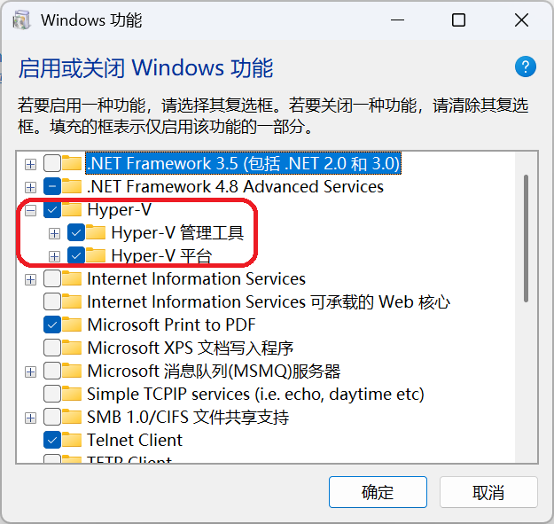
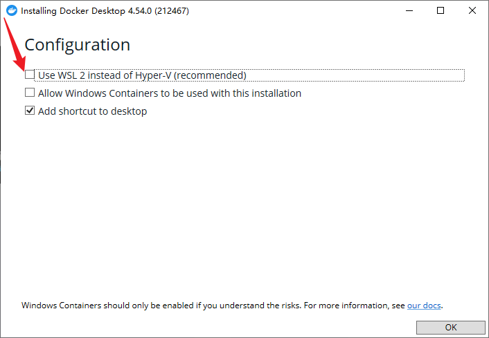

This guide explains how to install openJiuwen on Windows using Docker.

## I. Environment Preparation

Make sure your machine meets the following requirements:

* Hardware:
  * CPU: Minimum 2 cores, 4 cores or more recommended
  * RAM: Minimum 4 GB, 8 GB or more recommended

* Operating System: Windows 10 or later

* Software
  * Git: Click <a href="https://mirrors.huaweicloud.com/git-for-windows/v2.51.0.windows.1/Git-2.51.0-64-bit.exe" target="_blank" rel="nofollow noopener noreferrer">Download</a> to download and install
  * Docker: Docker Desktop is recommended. See below for installation steps

### Install Docker Desktop
Docker Desktop on Windows depends on virtualization.

**1. Enable virtualization**

* Press Win+R → enter `optionalfeatures.exe` to open the “Windows Features” window;

* Check **all sub-options** under “Hyper-V” → click “OK”:

  > **Note**: If there is no “Hyper-V” option, refer to the <a href="https://docs.docker.com/desktop/setup/install/windows-install/" target="_blank" rel="nofollow noopener noreferrer">official guide</a> to install Docker Desktop.

  
* Restart your computer after installation;
* After restarting, **please confirm again that the Hyper-V options remain checked**.

**2. Install Docker Desktop**

* Download: Go to the <a href="https://www.docker.com/products/docker-desktop/" target="_blank" rel="nofollow noopener noreferrer">Docker website</a> to download the Windows installer (for x86 machines, choose the AMD64 version);
* Run the installer: **Uncheck the “Use WSL 2 instead of Hyper-V” option** and follow the wizard to complete installation:

  
* Restart your computer after installation;
* After restarting, open Docker Desktop and wait for it to finish loading (the first launch may take 5–10 minutes);
* Once Docker Desktop starts, for a trial you can click “Continue without signing in” on the welcome screen; for long-term use, refer to the <a href="https://docs.docker.com/desktop/setup/sign-in" target="_blank" rel="nofollow noopener noreferrer">official guide</a>.

* Docker Desktop installation is now complete.

> **Note**: If you encounter errors during installation, refer to the <a href="https://docs.docker.com/desktop/setup/install/windows-install/" target="_blank" rel="nofollow noopener noreferrer">Docker Desktop official installation guide</a>.

## II. Install openJiuwen

### 1. Download the release package (skip if you already have it)

* Click the download link for the version and save it locally.

  x86_64 architecture link: <a href="https://openjiuwen-ci.obs.cn-north-4.myhuaweicloud.com/agentstudio/deployTool_0.1.2_amd64.zip" target="_blank" rel="nofollow noopener noreferrer">openJiuwen v0.1.2</a>

  arm architecture link: <a href="https://openjiuwen-ci.obs.cn-north-4.myhuaweicloud.com/agentstudio/deployTool_0.1.2_arm64.zip" target="_blank" rel="nofollow noopener noreferrer">openJiuwen v0.1.2</a>

### 2. Configure Docker Desktop Virtual file shares

* Create the openJiuwen installation directory.

* Open Docker Desktop and follow the steps shown. In step 4, enter the openJiuwen installation directory (for example: D:\openJiuwen);

* Click “Apply & restart” to restart Docker Desktop.

  

### 3. Start openJiuwen

* Place the release package in the openJiuwen installation directory and extract it.

* Go to the directory where service.sh is located, right-click in a blank area to open Git Bash, and run the following command to confirm Docker Desktop is running:

  ```bash
  docker info >nul 2>&1 && (echo Docker Desktop is running) || (echo Docker Desktop is not running)
  ```
  > **Note**: If it shows “Docker Desktop is not running,” refer to the <a href="https://docs.docker.com/desktop/setup/install/windows-install/" target="_blank" rel="nofollow noopener noreferrer">Docker Desktop official guide</a>.

  > **Note**: If you need to enable the memory feature, refer to [How to enable the memory feature](#docker-windows-memory) for configuration.

* Run the following command to start openJiuwen:

  ```bash
  ./service.sh up
  ```

  > **Note**: You may see an “up Plugin + Sandbox Server failed” error due to network issues. Please run `./service.sh up` again.

* After a successful start, it will output Local access: access URL.

### 4. Access the system

Copy the access URL above into your browser’s address bar and press Enter to see the openJiuwen interface.

## III. Frequently Asked Questions (FAQ)

### <a id="docker-windows-memory"></a>Question 1: How to enable the memory feature

The effectiveness of the memory feature relates to the parameter size of the large language model.
  
The memory feature depends on an embedding model. The following steps use Huawei Cloud as an example to obtain an embedding model.

* Click <a href="https://console.huaweicloud.com/modelarts/?locale=zh-cn&region=cn-southwest-2#/model-studio/square" target="_blank" rel="nofollow noopener noreferrer">this link</a> to enter ModelArts Model Square.

* Click “Vector Models” and find the BGE-M3 model.

  

* After finding the BGE-M3 model, click Inference to go to the model info page.

  

* Record the API endpoint (corresponds to EMBED_API_BASE) and the model parameter (corresponds to EMBED_MODEL_NAME).

* Click “API Key Management” and follow the instructions to obtain an API Key (corresponds to EMBED_API_KEY).

* After obtaining the embedding model information, configure it in the *openJiuwen installation directory* as follows:

* If you are starting the openJiuwen platform for the first time, add the embedding-related information to *.env.custom*:

  | Variable Name | Description |
  | --- | --- |
  | EMBEDDING_MODEL_DIMENTION         | The embedding vector dimension, determined by the model chosen via EMBED_MODEL_NAME |
  | EMBED_API_BASE                    | The embedding model API endpoint |
  | EMBED_MODEL_NAME                  | The embedding model name |
  | EMBED_API_KEY                     | The embedding model API key |
  | EMBED_TIMEOUT                     | Maximum wait time for the embedding model |
  | EMBED_MAX_RETRIES                 | Maximum number of retries on embedding request failure |

* After configuration, start the openJiuwen platform to use the memory feature.

* If you enable the memory feature after openJiuwen is already running, add the embedding-related information in .env. After configuration, restart the openJiuwen platform for the settings to take effect:

  ```
  ./service.sh up
  ```

> **Note**: After configuring EMBEDDING_MODEL_DIMENTION and enabling the memory feature, do not modify this value again, or the memory feature will stop working. It is also not recommended to change other embedding model configurations, as it may affect performance.

### Question 2: Docker images included in openJiuwen

| Image | Version                     | License       | Source Repository |
| ------ | ---------------------------- | ------------- | ------------------------------------------------------------ |
| mysql  | 8.4.5                        | GPL 2.0       | <a href="https://github.com/mysql/mysql-server/tree/mysql-8.4.5" target="_blank" rel="nofollow noopener noreferrer">Source link</a>       |
| minio  | RELEASE.2024-12-18T13-15-44Z | GNU AGPL 3.0      | <a href="https://github.com/minio/minio/tree/RELEASE.2024-12-18T13-15-44Z" target="_blank" rel="nofollow noopener noreferrer">Source link</a> |
| milvus | 2.6.2                       | Apache 2.0    | -                                                            |
| etcd   | 3.5.18                      | Apache 2.0    | -                                                            |

### Question 3: How to stop openJiuwen

Run the following command to stop openJiuwen:

```
./service.sh down
```