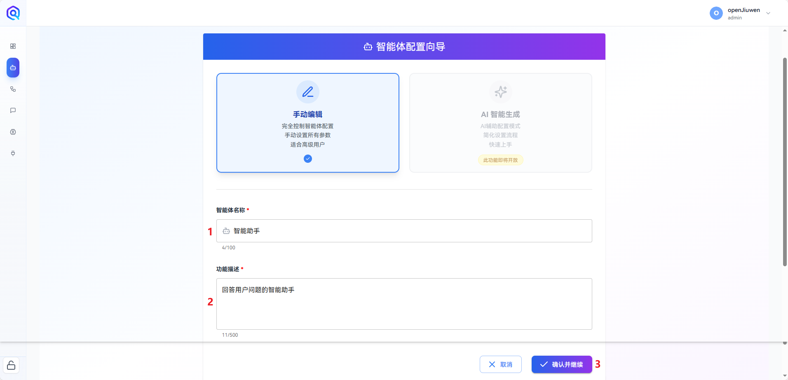

Regardless of whether you have a programming background, you can quickly build AI agents on the openJiuwen platform.

This article introduces how to build an intelligent assistant agent based on openJiuwen.

## I. Preparation

### 1. Obtain a Large Model API Key

Agent execution depends on large model services. You can purchase services from mainstream large model providers or deploy a local large model service. The following steps use Huawei Cloud as an example to illustrate how to obtain a large model service.

* Click this <a href="https://console.huaweicloud.com/modelarts/?locale=zh-cn&region=cn-southwest-2#/model-studio/deployment" target="_blank" rel="nofollow noopener noreferrer">link</a> to enter the online inference model page of Huawei Cloud Model Gallery.

* Select an appropriate model and click **“Enable Service”**.

  

* After enabling the service, click **“Invocation Guide”** to enter the model information page.

  

* Click **“OpenAI-Compatible API”** and record the *API Endpoint* and *model parameter*.

* Click **“API Key Management”** and follow the official instructions to obtain the *API Key*.

> Note: For detailed guidance on obtaining models, please refer to the <a href="https://support.huaweicloud.com/usermanual-maas-modelarts/maas-modelarts-0195.html" target="_blank" rel="nofollow noopener noreferrer">official Huawei Cloud documentation</a>.

### 2. Model Configuration

Enter the model management page and click **“Add Model”**. In the model configuration page, fill in the `Model Name`, `Model ID`, `API Key`, `Base Service URL`, and `Description` in order.

* **Model Name**: The display name in the system; customizable by the user.
* **Model ID**: The invocation name defined by the model service provider, available on the provider’s official website. (Corresponds to the *model parameter* obtained from Huawei Cloud.)
* **API Key**: The model’s API Key. (Corresponds to the *API Key* obtained from Huawei Cloud.)
* **Base Service URL**: The API endpoint defined by the model service provider, available on the provider’s official website. (Corresponds to the *API Endpoint* obtained from Huawei Cloud.)
* **Description**: A detailed description of the model; customizable by the user.

  

openJiuwen provides a convenient model testing feature.

* On the model management page, click the **Test** button of the added model.
* Select a commonly used test prompt.
* Click **Start**. After a short wait, an output of **“Test Successful”** indicates the model is configured correctly.

  

> Note: If the model test fails, please verify that all provided model configuration information is correct.

## II. Building the Agent

* After preparing the large model service, enter the agent development page and click **“Create Agent”**.

  

* In the agent configuration wizard, fill in the **Agent Name** and **Function Description**. Scroll to the bottom of the page and click **“Confirm and Continue”**.

  

* The agent development interface consists of three main parts:

  * **Left**: System prompt configuration. You can freely set prompts according to your needs, for example:

    ```text
    # Role
    You are an intelligent assistant.

    # Objective
    Please answer the questions asked by the user.
    ```

  * **Center**: Agent orchestration configuration, where you can select a configured model.

  * **Right**: Debug and preview area. You can interact with the agent in real time. Enter a question in the dialog box and click **Send**; the agent will respond accordingly.

    

At this point, the intelligent assistant agent has been successfully built. To explore more features, please refer to the **Development Guide** and **Practical Tutorials**.
