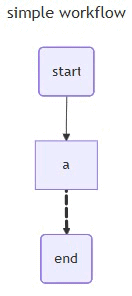

# openjiuwen.core.workflow.base

## class openjiuwen.core.workflow.base.WorkflowOutput

Data class for the output of a workflow invoke execution.

- result (Union(list[[WorkflowChunk](./base.md#class-openjiuwencoreworkflowbaseworkflowchunk)], dict)): The output data. Its type varies by execution state.
- state ([WorkflowExecutionState](./base.md#class-openjiuwencoreworkflowbaseworkflowexecutionstate)): The current execution state.

> Notes
>
> - When state is WorkflowExecutionState.INPUT_REQUIRED, result is of type list[WorkflowChunk], where each item describes an interrupt node.
> - When state is WorkflowExecutionState.COMPLETED, result is a dict containing the final batched output of the workflow.

## class openjiuwen.core.workflow.base.WorkflowChunk

Data class for frames returned by workflow stream. Each frame is one of [CustomSchema](../stream/base.md#class-openjiuwencorestreambasecustomschema), [TraceSchema](../stream/base.md#class-openjiuwencorestreambasetraceschema), or [OutputSchema](../stream/base.md#class-openjiuwencorestreambaseoutputschema).

## class openjiuwen.core.workflow.base.WorkflowExecutionState

Enum for the execution state of a workflow invoke.

- COMPLETED: Execution finished.
- INPUT_REQUIRED: Interrupted state, waiting for user input.

## class openjiuwen.core.workflow.base.Workflow
```
Workflow(workflow_config: WorkflowConfig = None)
```

Workflow is the core class for defining and executing asynchronous computation graphs. It is a stateful execution engine that manages and runs computation graphs defined by nodes and edges. When creating a Workflow, define the graph and then add nodes and edges to ensure orderly execution.

**Parameters**:

- **workflow_config** ([WorkflowConfig](./workflow_config.md#class-openjiuwencoreworkflowworkflow_configworkflowconfig), optional): Workflow configuration including component parameters, streaming rules, and runtime controls like timeouts. Default: None (use default workflow_config).

**Example**:

```python
>>> from openjiuwen.core.workflow.base import Workflow
>>> from openjiuwen.core.workflow.workflow_config import WorkflowConfig, WorkflowMetadata
>>> 
>>> # Create a workflow config with ID, name, and version
>>> workflow_config = WorkflowConfig(metadata=WorkflowMetadata(name="workflow_name", id="workflow_id", version="version-1"))
>>> workflow = Workflow(workflow_config=workflow_config)
```

### set_start_comp
```
set_start_comp(self, start_comp_id: str, component: Union[Executable, WorkflowComponent], inputs_schema: dict = None, outputs_schema: dict = None, inputs_transformer: Transformer = None, outputs_transformer: Transformer = None)->Self
```

Define the start component and data transformation rules for the workflow. This is the entry point for execution.

**Parameters**:

- **start_comp_id** (str): Unique identifier for the start component, used for referencing in the workflow.
- **component** (Union[Executable, [WorkflowComponent](../component/base.md#class-openjiuwencorecomponentbaseworkflowcomponent)]): The component instance to add. Supports:
  - Executable: A basic executable component (e.g., function, script, tool invocation).
  - WorkflowComponent: A workflow component (a complete workflow used as a sub-node).
- **inputs_schema** (dict, optional): Structure of the component's input parameters. Keys should match parameter names; values describe types. Default: None.
- **outputs_schema** (dict, optional): Structure of the component's output, defining the output format for downstream parsing. Default: None.
- **inputs_transformer** (Transformer, optional): Transformer applied to inputs before passing to the component, allowing custom preprocessing. Default: None.
- **outputs_transformer** (Transformer, optional): Transformer applied to outputs after the component finishes, allowing custom postprocessing. Default: None.

> Notes
>
> - inputs_schema and inputs_transformer should follow the [Start component](../component/start_comp.md#class-openjiuwencorecomponentstart_compstart) requirements. Values can reference workflow inputs. outputs_schema and outputs_transformer can reference the component’s outputs.
> - If neither inputs_schema nor inputs_transformer is set, all inputs are passed through. If neither outputs_schema nor outputs_transformer is set, outputs default to the component's native output.
> - If both schema and transformer are specified, only the transformer is used.

**Example**:

```python
>>> from openjiuwen.core.component.start_comp import Start
>>> 
>>> # Example input: {"question": "What is an Agent?", "user_id": 123}
>>> workflow.set_start_comp("start", Start(), inputs_schema={"query": "${inputs.question}"})
```

### set_end_comp
```
set_end_comp(self, end_comp_id: str, component: Union[Executable, WorkflowComponent], inputs_schema: dict = None, outputs_schema: dict = None, inputs_transformer: Transformer = None, outputs_transformer: Transformer = None, stream_inputs_schema: dict = None, stream_outputs_schema: dict = None, stream_inputs_transformer: Transformer = None, stream_outputs_transformer: Transformer = None, response_mode: str = None)
```

Define the end component of the workflow—the final node that handles results, emits them outside the graph, and terminates the workflow.

**Parameters**:

- **end_comp_id** (str): Unique identifier for the end component.
- **component** (Union[Executable, [WorkflowComponent](../component/base.md#class-openjiuwencorecomponentbaseworkflowcomponent)]): The component instance to add. Supports:
  - Executable: A basic executable component (e.g., function, script, tool invocation).
  - WorkflowComponent: A workflow component (a complete workflow used as a sub-node).
- **inputs_schema** (dict, optional): Structure of the component’s input parameters. Default: None.
- **outputs_schema** (dict, optional): Structure of the component’s output, defining the workflow’s final return format. Default: None.
- **inputs_transformer** (Transformer, optional): Input data transformer. Default: None.
- **outputs_transformer** (Transformer, optional): Output data transformer. Default: None.
- **stream_inputs_schema** (dict, optional): Input structure for streaming inputs. Only applicable for components that support streaming input; same semantics as inputs_schema. Default: None.
- **stream_outputs_schema** (dict, optional): Output structure for streaming outputs. Only applicable for components that support streaming output; same semantics as outputs_schema. Default: None.
- **stream_inputs_transformer** (Transformer, optional): Real-time transformer for streaming inputs. Default: None.
- **stream_outputs_transformer** (Transformer, optional): Real-time transformer for streaming outputs. Default: None.
- **response_mode** (str, optional): Specifies the [ComponentAbility](./workflow_config.md#class-openjiuwencoreworkflowworkflow_configcomponentability) used by the end component. Currently supports two modes. Default: None.
  - If set to 'streaming', uses the component’s ComponentAbility.STREAM or ComponentAbility.TRANSFORM capability.
  - If unset or not 'streaming', uses ComponentAbility.INVOKE.

> Notes
>
> - inputs_schema and inputs_transformer should follow the [End component](../component//end_comp.md#class-openjiuwencorecomponentend_compend) requirements. Values can reference outputs from upstream components. outputs_schema and outputs_transformer can reference the component’s own output.
> - If neither inputs_schema nor inputs_transformer is set, all inputs are passed through. If neither outputs_schema nor outputs_transformer is set, outputs default to the component's native output.
> - If both schema and transformer are specified, only the transformer is used.
> - When the edge from an upstream component is streaming, configure stream_inputs_schema or stream_inputs_transformer as needed. When the edge to a downstream component is streaming, configure stream_outputs_schema or stream_outputs_transformer as needed. Non-stream schemas/transformers will not be applied in these cases.

**Example**:

```python
>>> from openjiuwen.core.component.end_comp import End
>>> # Create an End component (with a response template)
>>> end = End({"responseTemplate": "Result:{{final_output}}"})
>>> 
>>> # Register the End component to the workflow (batch output mode)
>>> workflow.set_end_comp("end", end, inputs_schema={"final_output": "${llm.query}"})
```

### add_conditional_connection
```
add_conditional_connection(self, src_comp_id: str, router: Router) -> Self
```

Create a conditional connection from a source component to multiple potential targets. The next step is chosen dynamically based on the routing logic.

**Parameters**:

- **src_comp_id** (str): Unique identifier of the source component.
- **router** ([Router](../graph/base.md#type-alias-router)): A simple Python function that decides the next target.

**Example**:

```python
>>> from openjiuwen.core.runtime.runtime import Runtime
>>> 
>>> # Read the "query" field from the "start" component output in Context.
>>> # Route to the next component based on the value of query.
>>> def router(runtime: Runtime):
...     num = runtime.get_global_state("start.query")
...     if num == 0:
...         return "llm"
...     elif num == 1:
...         return "abc"
...     else:
...         return "end"
... 
>>> # Add conditional connection: start -> llm/abc/end
>>> workflow.add_conditional_connection("start", router=router)
```

### add_stream_connection
```
add_stream_connection(self,  src_comp_id: str,  target_comp_id: str) -> Self
```

Create a streaming connection between a source and a target component for real-time data transfer and processing.

**Parameters**:

- **src_comp_id** (str): Unique identifier for the source component (the producer of streaming messages). The component must implement stream or transform to produce streaming data.
- **target_comp_id** (str): Unique identifier for the target component (the consumer of streaming messages). The component must implement transform or collect to receive streaming data.

**Example**:

```python
>>> # When registering the End component, specify stream_inputs_schema for the streaming input
>>> workflow.set_end_comp("end_stream", end, stream_inputs_schema={"data": "${llm.output}"})
>>> 
>>> # Add streaming connection: from "llm" to "end".
>>> # The LLM component typically implements stream or transform;
>>> # the End component typically implements stream or transform as well.
>>> workflow.add_stream_connection("llm", "end_stream")
>>> # Note: The example LLM node can be found in the add_workflow_comp() section above
```

### invoke

```
async invoke(self, inputs: Input, runtime: BaseRuntime,  context: Context = None) -> Output
```

Execute the workflow in batch mode. It takes a complete input, processes it through the workflow, and returns the full result at once.

**Parameters**:

- **inputs** (Input): Workflow input data serving as the initial parameters.
- **runtime** (BaseRuntime): Runtime environment providing execution context and state management.
- **context** (Context, optional): Context engine for storing user conversation information. Default: None (context engine disabled).

**Returns**:

**WorkflowOutput**, the execution result of the workflow, which may be a regular or interactive output.

**Example**:

```python
>>> import asyncio
>>> from openjiuwen.core.runtime.workflow import WorkflowRuntime
>>> 
>>> result = asyncio.run(workflow.invoke("Query the weather in Shanghai", WorkflowRuntime()))
>>> print(f"{result}")
{"state": "COMPLETED", "result": "Result:Check the weather in Shanghai on 2025-08-22"}
```

### stream

```
async stream(self,  inputs: Input,  runtime: BaseRuntime, context: Context = None， stream_modes: list[StreamMode] = None) -> AsyncIterator[WorkflowChunk]
```

An async generator method. Executing the workflow via stream returns an async generator that yields chunks progressively throughout the execution. It supports multiple streaming modes and real-time data transfer, enabling users to see progress and receive incremental content until completion.

**Parameters**:

- **inputs** (Input): Workflow input data serving as the initial parameters.
- **runtime** (BaseRuntime): Runtime environment providing execution context and state management.
- **context** (Context, optional): Context engine for storing user conversation information. Default: None (context engine disabled).
- **stream_modes** (list[[StreamMode](../stream/base.md#class-openjiuwencorestreambasebasestreammode)], optional): A list of stream modes to control streaming behavior and output. Default: None (same as TRACE logic).

**Returns**:

**AsyncIterator(WorkflowChunk)**, an async iterator emitting workflow processing chunks.

**Example**:

openJiuwen provides three streaming output modes for customizing streaming output. Since all streaming messages share an internal output pipeline, distinguishing modes improves scalability.

- Example 1: When stream_modes is BaseStreamMode.OUTPUT, only standardized framework streaming data is output (type: OutputSchema).
  
  ```python
  >>> from openjiuwen.core.runtime.workflow import WorkflowRuntime
  >>> from openjiuwen.core.stream.base import BaseStreamMode, OutputSchema
  >>> async for chunk in workflow.stream({"query": "Query the weather in Shanghai"}, WorkflowRuntime(), stream_modes=[BaseStreamMode.OUTPUT]):
  ...    print(chunk)
  >>> OutputSchema(type = 'end node stream', index = 0, payload = {'answer': 'Result:'}),
  >>> OutputSchema(type = 'end node stream', index = 1, payload ={ 'answer': 'Check the weather in Shanghai on 2025-08-22' })
  ```

- Example 2: When stream_modes is BaseStreamMode.TRACE, only framework-defined tracing data is output (type: TraceSchema).
  
  ```python

  >>> import asyncio
  >>> import datetime
  >>> 
  >>> from openjiuwen.core.component.base import WorkflowComponent
  >>> from openjiuwen.core.component.end_comp import End
  >>> from openjiuwen.core.component.loop_comp import LoopGroup, LoopComponent
  >>> from openjiuwen.core.component.start_comp import Start
  >>> from openjiuwen.core.component.workflow_comp import SubWorkflowComponent
  >>> from openjiuwen.core.context_engine.base import Context
  >>> from openjiuwen.core.runtime.base import ComponentExecutable, Input, Output
  >>> from openjiuwen.core.runtime.runtime import Runtime
  >>> from openjiuwen.core.runtime.workflow import WorkflowRuntime
  >>> from openjiuwen.core.stream.base import BaseStreamMode, TraceSchema
  >>> from openjiuwen.core.workflow.base import Workflow
  >>> # 1. Basic workflow
  >>> # A custom component `CustomComponent` that returns its inputs as outputs
  >>> class CustomComponent(ComponentExecutable, WorkflowComponent):
  ...     async def invoke(self, inputs: Input, runtime: Runtime, context: Context) -> Output:
  ...         return inputs
  ... 
  >>> # Build a basic workflow
  >>> # start -> a -> end
  >>> workflow = Workflow()
  >>> # Set the start component
  >>> workflow.set_start_comp("start", Start(), inputs_schema={"num": "${num}"})
  >>> # Set the custom component "a"
  >>> workflow.add_workflow_comp("a", CustomComponent(), inputs_schema={"a_num": "${start.num}"})
  >>> # Set the end component
  >>> workflow.set_end_comp("end", End(conf={"responseTemplate": "hello:{{result}}"}),
  ...                   inputs_schema={"result": "${a.a_num}"})
  >>> # Connect components: start -> a -> end
  >>> workflow.add_connection("start", "a")
  >>> workflow.add_connection("a", "end")
  >>> async def run_workflow_base():
  ...     async for chunk in workflow.stream({"num": 1}, WorkflowRuntime(), stream_modes=[BaseStreamMode.TRACE]):
  ...         print(f"stream chunk: {chunk}")

  >>> asyncio.run(run_workflow_base())
  
   >>> # Below is the trace information for component "a". You will receive two frames:
   >>> # a start event and an end event. "traceId" identifies the trace event.
   >>> # The start event has "startTime" and status "start".
   >>> # The end event records "endTime" and status "finish".
   >>> # "parentInvokeId" is the invokeId of the previous component ("start").
   >>> # Trace start event for component "a"
   TraceSchema(type = 'tracer_workflow', payload = {
       'traceId': '86b76988-5549-482b-8401-444b2621641e',
       'startTime': datetime.datetime(2025, 8, 22, 14, 39, 9, 678133),
       'endTime': None,
       'inputs': {
           'a_num': 1,
       },
       'outputs': None,
       'error': None,
       'invokeId': 'a',
       'parentInvokeId': 'start',
       'executionId': '86b76988-5549-482b-8401-444b2621641e',
       'onInvokeData': None,
       'componentId': '',
       'componentName': '',
       'componentType': 'a',
       'loopNodeId': None,
       'loopIndex': None,
       'status': 'start',
       'parentNodeId': ''
   })
   >>> # Trace end event for component "a"
   TraceSchema(type = 'tracer_workflow', payload = {
       'traceId': '86b76988-5549-482b-8401-444b2621641e',
       'startTime': datetime.datetime(2025, 8, 22, 14, 39, 9, 678133),
       'endTime': datetime.datetime(2025, 8, 22, 14, 39, 9, 679167),
       'inputs': {
           'a_num': 1,
       },
       'outputs': {
           'a_num': 1,
       },
       'error': None,
       'invokeId': 'a',
       'parentInvokeId': 'start',
       'executionId': '86b76988-5549-482b-8401-444b2621641e',
       'onInvokeData': None,
       'componentId': '',
       'componentName': '',
       'componentType': 'a',
       'loopNodeId': None,
       'loopIndex': None,
       'status': 'finish',
       'parentNodeId': ''
   })
  
  >>> # 2. Loop workflow
  >>> # Using `CustomComponent`, build a workflow that includes a loop component, start, and end.
  >>> # The loop runs over an array, with three serial components "a", "b", and "c" inside the loop,
  >>> # each outputting the array element for the current iteration:
  >>> # Custom component returns the "value" field from its input as "output"
  >>> class CustomComponent(ComponentExecutable, WorkflowComponent):
  ...     async def invoke(self, inputs: Input, runtime: Runtime, context: Context) -> Output:
  ...         return {"output": inputs["value"]}
  ... 
  >>> # Create a LoopGroup
  >>> loop_group = LoopGroup()
  >>> 
  >>> # Add 3 workflow components to the LoopGroup (array loop example)
  >>> loop_group.add_workflow_comp("a", CustomComponent(), inputs_schema={"value": "${loop.item}"})
  >>> loop_group.add_workflow_comp("b", CustomComponent(), inputs_schema={"value": "${loop.item}"})
  >>> loop_group.add_workflow_comp("c", CustomComponent(), inputs_schema={"value": "${loop.item}"})
  >>> 
  >>> # Set "a" as loop start and "c" as loop end
  >>> loop_group.start_nodes(["a"])
  >>> loop_group.end_nodes(["c"])
  >>> 
  >>> # Connect a->b->c inside the LoopGroup
  >>> loop_group.add_connection("a", "b")
  >>> loop_group.add_connection("b", "c")
  >>> 
  >>> # Create the LoopComponent
  >>> # The first argument is the LoopGroup, the second defines the component's output mode
  >>> loop_component = LoopComponent(
  ...   loop_group, 
  ...   {"output": {"a": "${a.output}", "b": "${b.output}", "c": "${c.output}"}}
  ... )
  ... 
  >>> workflow = Workflow()
  >>> 
  >>> # Add start/end components; the end component consumes the loop's output
  >>> workflow.set_start_comp("start", Start(), inputs_schema={"query": "${user_input}"})
  >>> workflow.set_end_comp("end", End(), inputs_schema={"user_var": "${loop.output}"})
  >>> 
  >>> # Add the loop component, with the input array from start.query
  >>> workflow.add_workflow_comp("loop", loop_component,
  ...                         inputs_schema={"loop_type": "array",
  ...                                      "loop_array": {"item": "${start.query}"}
  ...                                        })
  ... 
  >>> # Connect in series: start->loop->end
  >>> workflow.add_connection("start", "loop")
  >>> workflow.add_connection("loop", "end")
  >>> 
  >>> # Execute via flow.stream with stream_modes=[BaseStreamMode.TRACE] to get loop tracing info
  >>> async def run_workflow_loop():
  >>>     async for chunk in workflow.stream({"user_input": [1, 2, 3]}, runtime=WorkflowRuntime(), stream_modes=[BaseStreamMode.TRACE]):
  ...         print(f"stream chunk: {chunk}")
  >>> asyncio.run(run_workflow_loop())
   >>> # Below is the trace information for component "a" inside the loop.
   >>> # You will see two frames: start and end.
   >>> # "loopIndex" indicates the component is inside loop "loop" at index 2 (0-based), i.e., the 3rd iteration.
   >>> # The invokeId of "a" is "loop.a", and its parentInvokeId is "loop.c",
   >>> # indicating the previous component was "c" in the previous loop iteration.
   >>> # Third run of component "a" in the loop, trace start frame
   TraceSchema(type = 'tracer_workflow', payload = {
       'traceId': 'dad9cd8c-ac77-484f-90ae-20b263276e3f',
       'startTime': datetime.datetime(2025, 8, 25, 19, 31, 48, 361042),
       'endTime': None,
       'inputs': {
           'value': 3
       },
       'outputs': None,
       'error': None,
       'invokeId': 'loop.a',
       'parentInvokeId': 'loop.c',
       'executionId': 'dad9cd8c-ac77-484f-90ae-20b263276e3f',
       'onInvokeData': None,
       'componentId': '',
       'componentName': '',
       'componentType': 'loop.c',
       'loopNodeId': 'loop',
       'loopIndex': 2,
       'status': 'start',
       'parentNodeId': ''
     })
   # Third run of component "a" in the loop, trace end frame
   TraceSchema(type = 'tracer_workflow', payload = {
       'traceId': 'dad9cd8c-ac77-484f-90ae-20b263276e3f',
       'startTime': datetime.datetime(2025, 8, 25, 19, 31, 48, 361042),
       'endTime': datetime.datetime(2025, 8, 25, 19, 31, 48, 361042),
       'inputs': {
           'value': 3
       },
       'outputs': {
           'output': 3
       },
       'error': None,
       'invokeId': 'loop.a',
       'parentInvokeId': 'loop.c',
       'executionId': 'dad9cd8c-ac77-484f-90ae-20b263276e3f',
       'onInvokeData': None,
       'componentId': '',
       'componentName': '',
       'componentType': 'loop.a',
       'loopNodeId': 'loop',
       'loopIndex': 2,
       'status': 'finish',
       'parentNodeId': ''
     })
   ...
  
  >>> # 3. Nested workflows
  >>> # Build a sub-workflow with start, end, and CustomComponent.
  >>> # The sub-workflow's output equals its input:
  >>> # Sub-workflow: sub_start -> sub_a -> sub_end
  >>> sub_workflow = Workflow()
  >>> # Sub-workflow start component sub_start
  >>> sub_workflow.set_start_comp("sub_start", Start(),
  ...                             inputs_schema={
  ...                                 "num": "${a_num}"})
  >>> # Sub-workflow component sub_a
  >>> sub_workflow.add_workflow_comp("sub_a", CustomComponent(),
  ...                                inputs_schema={
  ...                                    "a_num": "${sub_start.num}"})
  >>> # Sub-workflow end component sub_end
  >>> sub_workflow.set_end_comp("sub_end",
  ...                           End(),
  ...                           inputs_schema={
  ...                               "result": "${sub_a.a_num}"
  ...                           })
  >>> # Connect sub-workflow: sub_start -> sub_a -> sub_end
  >>> sub_workflow.add_connection("sub_start", "sub_a")
  >>> sub_workflow.add_connection("sub_a", "sub_end")
  >>> 
  >>> # Build a main workflow using the sub-workflow as component "a".
  >>> # The main workflow's output equals its input:
  >>> # Main: start -> a (sub-workflow) -> end
  >>> # Sub-workflow: sub_start -> sub_a -> sub_end
  >>> main_workflow = Workflow()
  >>> # Set start
  >>> main_workflow.set_start_comp("start", Start(),
  ...                              inputs_schema={
  ...                                  "num": "${num}"})
  >>> # Define workflow component "a"
  >>> main_workflow.add_workflow_comp("a", SubWorkflowComponent(sub_workflow),
  ...                                 inputs_schema={
  ...                                     "a_num": "${start.num}"})
  >>> # Set end
  >>> # Sub-workflow’s End outputs {"output": {"result": ...}}, so main references ${a.result}
  >>> main_workflow.set_end_comp("end",
  ...                            End(conf={"responseTemplate": "hello:{{result}}"}),
  ...                            inputs_schema={
  ...                                "result": "${a.result}"
  ...                            })
  >>> # Connect: start -> a -> end
  >>> main_workflow.add_connection("start", "a")
  >>> main_workflow.add_connection("a", "end")
  >>> 
  >>> # Execute via flow.stream with stream_modes=[BaseStreamMode.TRACE] to get nested traces
  >>> async def run_workflow_sub():
  >>>     async for chunk in main_workflow.stream({"num": 1}, WorkflowRuntime(), stream_modes=[BaseStreamMode.TRACE]):
  ...         print(f"stream chunk: {chunk}")
  >>> asyncio.run(run_workflow_sub())
  >>> # Below is the trace for sub-workflow component "sub_a": two frames (start and end).
  >>> # "parentNodeId" records the invokeId of the sub-workflow owner ("a"),
  >>> # clarifying hierarchical relationships in nested workflows.
  >>> # The invokeId is "a.sub_a".
  >>> # Sub-workflow component sub_a, trace start frame
  TraceSchema(type = 'tracer_workflow', payload = {
      'traceId': '416c45dd-12f1-427e-943f-e16c2171c69d',
      'startTime': datetime.datetime(2025, 8, 22, 17, 38, 13, 535141),
      'endTime': None,
      'inputs': {
        'a_num': 1
      },
      'outputs': None,
      'error': None,
      'invokeId': 'a.sub_a',
      'parentInvokeId': 'a.sub_start',
      'executionId': '416c45dd-12f1-427e-943f-e16c2171c69d',
      'onInvokeData': None,
      'componentId': '',
      'componentName': '',
      'componentType': 'a.sub_a',
      'loopNodeId': None,
      'loopIndex': None,
      'status': 'start',
      'parentNodeId': 'a'
  }), 
  >>> # Sub-workflow component sub_a, trace end frame
  TraceSchema(type = 'tracer_workflow', payload = {
      'traceId': '416c45dd-12f1-427e-943f-e16c2171c69d',
      'startTime': datetime.datetime(2025, 8, 22, 17, 38, 13, 535141),
      'endTime': datetime.datetime(2025, 8, 22, 17, 38, 13, 535141),
      'inputs': {
        'a_num': 1
      },
      'outputs': {
        'a_num': 1,
      },
      'error': None,
      'invokeId': 'a.sub_a',
      'parentInvokeId': 'a.sub_start',
      'executionId': '416c45dd-12f1-427e-943f-e16c2171c69d',
      'onInvokeData': None,
      'componentId': '',
      'componentName': '',
      'componentType': 'a.sub_a',
      'loopNodeId': None,
      'loopIndex': None,
      'status': 'finish',
      'parentNodeId': 'a'
  })
  ```

Example 3: When stream_modes is BaseStreamMode.CUSTOM, only user-defined streaming data is output (type: CustomSchema).
  
  ```python
  >>> from openjiuwen.core.runtime.runtime import Runtime
  >>> from openjiuwen.core.component.base import WorkflowComponent
  >>> from openjiuwen.core.runtime.base import ComponentExecutable, Input, Output
  >>> from openjiuwen.core.context_engine.base import Context
  >>> from openjiuwen.core.runtime.workflow import WorkflowRuntime
  >>> from openjiuwen.core.stream.base import BaseStreamMode, CustomSchema
  >>> 
  >>> # 1. Create a custom component and stream data
  >>> class LLMComponent(WorkflowComponent, ComponentExecutable):
  ...     async def invoke(self, inputs: Input, runtime: Runtime, context: Context) -> Output:
  ...         ...
  ...         llm_response = await self._llm.ainvoke(model_inputs)
  ...         # If response is {"role": "user", "content": "Check the weather in Shanghai on 2025-08-22"}
  ...         response = llm_response.content
  ...         await runtime.write_custom_stream(**dict(custom_output=response))
  ...         ...
  ... 
  >>> # 2. Stream output from the workflow
  >>> async for chunk in workflow.stream({"query": "Query the weather in Shanghai"}, WorkflowRuntime(), stream_modes=[BaseStreamMode.CUSTOM]):
  ...      print(chunk)
  >>> CustomSchema(custom_output = 'Check the weather in Shanghai on 2025-08-22')
  ```

### to_mermaid

```python
to_mermaid(self, title, expand_subgraph, enable_animation) -> str
```

Convert the workflow to a [mermaid](https://mermaid.js.org/) script for visualization.

**Parameters**:

- **title** (str): The title in the mermaid script, which renders as the diagram title. Default: "".
- **expand_subgraph** (bool | int):
  - bool: Whether to expand subgraphs when generating the script. True expands all subgraphs; False does not expand subgraphs.
  - int: A non-negative integer indicating how many levels of subgraphs to expand.
  
  Default: False.
- **enable_animation** (bool): Whether to enable animation for streaming edges in the mermaid script.
  - True: Enable animation (streaming edges will be animated).
  - False: Disable animation.  

  Default: False.

**Returns**:
- **str**, the mermaid script.

**Example**:

```python
>>> from openjiuwen.core.component.base import WorkflowComponent
>>> from openjiuwen.core.component.end_comp import End
>>> from openjiuwen.core.component.start_comp import Start
>>> from openjiuwen.core.context_engine.base import Context
>>> from openjiuwen.core.graph.executable import Output
>>> from openjiuwen.core.runtime.base import ComponentExecutable, Input
>>> from openjiuwen.core.runtime.runtime import Runtime
>>> from openjiuwen.core.workflow.base import Workflow
>>> 
>>> 
>>> # A custom component
>>> class Node1(ComponentExecutable, WorkflowComponent):
...     def __init__(self):
...         super().__init__()
... 
...     async def invoke(self, inputs: Input, runtime: Runtime, context: Context) -> Output:
...         return {}
>>> 
>>> 
>>> # Set environment variable to enable workflow visualization
>>> import os
>>> os.environ["WORKFLOW_DRAWABLE"] = "true"
>>> 
>>> # Build the workflow
>>> flow = Workflow()
>>> flow.set_start_comp("start", Start())
>>> flow.add_workflow_comp("a", Node1())
>>> flow.set_end_comp("end", End())
>>> flow.add_connection("start", "a")
>>> flow.add_connection("a", "end")
>>> 
>>> # Print the workflow's mermaid script
>>> print(flow.to_mermaid(title="simple workflow"))
---
title: simple workflow
---
flowchart TB
	node_1("start")
	node_2["a"]
	node_3("end")
	node_1 --> node_2
	node_2 --> node_3
```

Render the mermaid script using [mermaid.live](https://mermaid.live) to get the following image:

<div style="text-align: center">
</div>

> Notes
> 
> To enable workflow visualization, set the environment variable WORKFLOW_DRAWABLE to true before constructing the workflow. You can use Python’s built-in os package, see [os.environ](https://docs.python.org/3.11/library/os.html#os.environ).

### to_mermaid_png

```python
to_mermaid_png(self, title, expand_subgraph) -> bytes
```

Render the script generated by [to_mermaid](#to_mermaid) as a PNG image and return it as bytes. PNG supports only static images.

**Parameters**:

- **title** (str): Title of the rendered image. Default: "".
- **expand_subgraph** (bool | int):
  - bool: Whether the rendered image includes expanded subgraphs. True includes subgraphs; False does not.
  - int: Non-negative integer indicating how many levels of subgraphs to include.

  Default: False.

**Returns**:
- **bytes**, the binary content of the image.

**Example**:

```python
>>> from openjiuwen.core.component.base import WorkflowComponent
>>> from openjiuwen.core.component.end_comp import End
>>> from openjiuwen.core.component.start_comp import Start
>>> from openjiuwen.core.context_engine.base import Context
>>> from openjiuwen.core.graph.executable import Output
>>> from openjiuwen.core.runtime.base import ComponentExecutable, Input
>>> from openjiuwen.core.runtime.runtime import Runtime
>>> from openjiuwen.core.workflow.base import Workflow
>>> 
>>> 
>>> # A custom component
>>> class Node1(ComponentExecutable, WorkflowComponent):
...     def __init__(self):
...         super().__init__()
... 
...     async def invoke(self, inputs: Input, runtime: Runtime, context: Context) -> Output:
...         return {}
>>> 
>>> 
>>> # Set environment variable to enable workflow visualization
>>> import os
>>> os.environ["WORKFLOW_DRAWABLE"] = "true"
>>> 
>>> # Build the workflow
>>> flow = Workflow()
>>> flow.set_start_comp("start", Start())
>>> flow.add_workflow_comp("a", Node1())
>>> flow.set_end_comp("end", End())
>>> flow.add_connection("start", "a")
>>> flow.add_connection("a", "end")
>>> 
>>> # Display the rendered image
>>> from IPython.display import Image, display
>>> display(Image(flow.to_mermaid_png(title="simple workflow")))
```

Displays the following image:

<div style="text-align: center">
</div>

> Notes
> 
> - To enable workflow visualization, set the environment variable WORKFLOW_DRAWABLE to true. See [os.environ](https://docs.python.org/3.11/library/os.html#os.environ).
> - This example should be run in a [Jupyter Notebook](https://jupyter.org/).

### to_mermaid_svg

```python
to_mermaid_svg(self, title, expand_subgraph) -> bytes
```

Render the script generated by [to_mermaid](#to_mermaid) as an SVG image and return it as bytes. SVG supports dynamic images.

**Parameters**:

- **title** (str): Title of the rendered image. Default: "".
- **expand_subgraph** (bool | int):
  - bool: Whether the rendered image includes expanded subgraphs. True includes subgraphs; False does not.
  - int: Non-negative integer indicating how many levels of subgraphs to include.

  Default: False.

**Returns**:
- **bytes**, the binary content of the image.

**Example**:

```python
>>> from openjiuwen.core.component.base import WorkflowComponent
>>> from openjiuwen.core.component.end_comp import End
>>> from openjiuwen.core.component.start_comp import Start
>>> from openjiuwen.core.context_engine.base import Context
>>> from openjiuwen.core.graph.executable import Output
>>> from openjiuwen.core.runtime.base import ComponentExecutable, Input
>>> from openjiuwen.core.runtime.runtime import Runtime
>>> from openjiuwen.core.workflow.base import Workflow
>>> 
>>> 
>>> # A custom component
>>> class Node1(ComponentExecutable, WorkflowComponent):
...     def __init__(self):
...         super().__init__()
... 
...     async def invoke(self, inputs: Input, runtime: Runtime, context: Context) -> Output:
...         return {}
>>> 
>>> 
>>> # Set environment variable to enable workflow visualization
>>> import os
>>> os.environ["WORKFLOW_DRAWABLE"] = "true"
>>> 
>>> # Build the workflow
>>> flow = Workflow()
>>> flow.set_start_comp("start", Start())
>>> flow.add_workflow_comp("a", Node1())
>>> flow.set_end_comp("end", End())
>>> flow.add_connection("start", "a")
>>> flow.add_stream_connection("a", "end")
>>> 
>>> # Display the rendered image
>>> from IPython.display import SVG, display, HTML
>>> svg_data = SVG(flow.to_mermaid_svg(title="simple workflow")).data
>>> # Directly displaying SVG might be clipped; scale it
>>> display(HTML(f'<div style="zoom:0.9">{svg_data}</div>'))
```

Displays the following image:

<div style="text-align: center">
</div>

> Notes
> 
> - To enable workflow visualization, set the environment variable WORKFLOW_DRAWABLE to true. See [os.environ](https://docs.python.org/3.11/library/os.html#os.environ).
> - The edge between component "a" and "end" is a streaming edge; rendering as SVG shows an animation.
> - This example should be run in a [Jupyter Notebook](https://jupyter.org/).