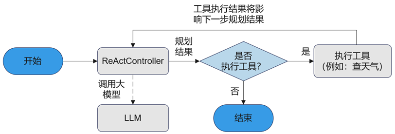

This chapter demonstrates how to build a weather query `ReActAgent` application based on openJiuwen. This application supports guiding the LLM to generate plugin invocation commands through the ReAct planning pattern, and subsequently generating the final answer by combining the plugin execution results. Through this example, you will learn the following information:

- How to create prompts.
- How to use plugin modules.
- How to create and execute a `ReActAgent`.

# Application Design Flow

`ReActAgent` is an Agent that follows the ReAct (Reasoning + Action) planning pattern, completing user tasks through a cyclical iteration of "Thought → Action → Observe".

1.  **Thought**: The `ReActController` calls the LLM for task planning and parses whether the LLM output contains tool execution instructions.
2.  **Action**: Based on the LLM output from the thought phase, operations are performed in two scenarios:
    -   **With tool execution instructions**: Invoke tool. Select and call the appropriate tool (such as retrieval, database, third-party API, code execution, etc.) to perform specific operations. In this use case, a tool that queries weather based on time and location is called.
    -   **Without tool execution instructions**: Use the LLM output as the final answer.
3.  **Observe**: The `ReActController` appends the Observation returned by the tool to the conversation history, and then calls the LLM for the next round of task planning.

`ReActAgent` can constantly adjust strategies and optimize reasoning paths based on tool execution results, observations, and feedback, until the task goal is achieved or a final answer is obtained. Its powerful multi-turn reasoning and self-correction capabilities enable the ReActAgent to possess dynamic decision-making abilities and flexibly adapt to environmental changes, making it suitable for diverse task scenarios requiring complex reasoning and strategy adjustment.

  <div align="center">
    
  </div>

# Prerequisites

The Python version should be higher than or equal to Python 3.11. Version 3.11.4 is recommended. Please check the Python version information before use.

# Install openJiuwen

Execute the following command to install openJiuwen:

```bash
pip install -U openjiuwen
```

# Creating Prompt Templates

Create a system prompt template to set the overall behavior and persona of the `ReActAgent`. The following system prompt not only defines the persona and task goals but also provides current date information and sets constraints, helping the `ReActAgent` correctly understand the current time to complete task goals during interaction with the user. The example code is as follows:

```python
def build_current_date():
    """获取当前日期"""
    from datetime import datetime
    current_datetime = datetime.now()
    return current_datetime.strftime("%Y-%m-%d")

def _create_prompt_template():
    system_prompt = ("你是一个AI助手，在适当的时候调用合适的工具，帮助我完成任务！\n"  # 人设&任务目标
                     "今天的日期为：{}\n"                                       # 当前日期
                     "注意：1. 如果用户请求中未指定具体时间，则默认为今天。")         # 约束限制
    return [
        dict(role="system", content=system_prompt.format(build_current_date()))
    ]
```

# Creating Plugin Objects and Their Description Information

This example creates a weather query plugin and defines the structure and requirements of its input parameters. First, the weather query service is encapsulated via the `RestfulApi` interface into a tool class that can be used by the framework. The example code is as follows:

> **Note**
> For local testing request services (starting with http), you can disable SSL verification by configuring relevant environment variables. However, disabling SSL skips certificate validation, which may lead to data tampering and man-in-the-middle attacks, resulting in the leakage of sensitive information. It is only allowed for temporary use in testing environments; **SSL verification must be enabled in production environments to ensure security.**

```python
import os
from openjiuwen.core.utils.tool.service_api.restful_api import RestfulApi
from openjiuwen.core.utils.tool.param import Param

os.environ["LLM_SSL_VERIFY"] = "false"  # 关闭SSL校验仅用于本地调试，生产环境请务必打开
os.environ["RESTFUL_SSL_VERIFY"] = "false"  # 关闭SSL校验仅用于本地调试，生产环境请务必打开

def _create_tool():
    weather_plugin = RestfulApi(
        name="WeatherReporter",
        description="天气查询插件",
        params=[
            Param(name="location", description="天气查询的地点，必须为英文", type="string", required=True),
            Param(name="date", description="天气查询的时间，格式为YYYY-MM-DD", type="string", required=True),
        ],
        path="your weather search api url",  # 天气查询服务部署地址
        headers={},
        method="GET",
        response=[],
    )
    return weather_plugin
```

At the same time, the plugin description information is created through the `PluginSchema` interface. This description information will subsequently become part of the LLM input, guiding the LLM to generate tool invocation commands. The example code is as follows:

```python
from openjiuwen.agent.common.schema import PluginSchema

def _create_tool_schema():
    tool_info = PluginSchema(
        name='WeatherReporter',
        description='天气查询插件',
        inputs={
            "type": "object",
            "properties": {
                "location": {
                    "type": "string",
                    "description": "天气查询的地点。\n注意：地点名称必须为英文",
                    "required": True
                },
                "date": {
                    "type": "string",
                    "description": "天气查询的时间，格式为YYYY-MM-DD",
                    "required": True
                }
            }
        }
    )
    return tool_info
```

## Creating MCP Plugin

openJiuwen supports the creation of plugins integrated with the MCP (Model Context Protocol) protocol.
This example demonstrates how to create an MCP plugin for weather queries based on the SSE protocol.
openJiuwen provides `connect` and `disconnect` methods for the MCP client, enabling the MCP client to establish and terminate connections with the MCP server.

```python
from openjiuwen.core.utils.tool.mcp.base import MCPTool, SseClient, McpToolInfo

class McpToolWrapper:
    def __init__(self, server_path, name):
        self.mcp_client = SseClient(server_path=server_path, name=name)

    async def connect(self):
        await self.mcp_client.connect()

    async def disconnect(self):
        await self.mcp_client.disconnect()

    def create_mcp_tools(self):
        mcp_tool_info = McpToolInfo(
            type="function",
            name="query_weather",
            server_name="McpSseServer",
            input_schema={
                "type": "object",
                "title": "query_weatherArguments",
                "properties": {
                    "location": {
                        "title": "Location",
                        "type": "string"
                    }
                },
                "required": [
                    "location"
                ],
            }
        )
        mcp_tool = MCPTool(mcp_client=self.mcp_client, tool_info=mcp_tool_info)
        return [mcp_tool]
```

# Creating ReActAgent

First, use the `create_react_agent_config` method provided by openJiuwen to quickly create a `ReActAgentConfig` object for weather queries. This covers configuration parameter information related to the `ReActAgent`, such as prompt definitions and LLM configuration information. The example code is as follows:

```python
from openjiuwen.agent.react_agent import create_react_agent_config

react_agent_config = create_react_agent_config(
    agent_id="react_agent_123",
    agent_version="0.0.1",
    description="AI助手",
    model=_create_model_config(),    # 大模型的配置信息
    prompt_template=_create_prompt_template()  # 自定义提示词
)
```

Among them, `_create_model_config` is used to define the relevant configuration information of the LLM, such as model provider, model name, API call, and model temperature:

```python
import os
from openjiuwen.core.utils.llm.base import BaseModelInfo
from openjiuwen.core.component.common.configs.model_config import ModelConfig

API_BASE = os.getenv("API_BASE", "your api base")
API_KEY = os.getenv("API_KEY", "your api key")
MODEL_NAME = os.getenv("MODEL_NAME", "")
MODEL_PROVIDER = os.getenv("MODEL_PROVIDER", "")


def _create_model_config() -> ModelConfig:
    return ModelConfig(
        model_provider=MODEL_PROVIDER,
        model_info=BaseModelInfo(
            model=MODEL_NAME,
            api_base=API_BASE,
            api_key=API_KEY,
            temperature=0.7,
            top_p=0.9,
            timeout=30,
        ),
    )
```

Next, use the constructor of the `ReActAgent` class provided by openJiuwen to instantiate the object, including the weather query assistant configuration. The example code is as follows:

```python
from openjiuwen.agent.react_agent import ReActAgent

react_agent = ReActAgent(react_agent_config)
react_agent.add_tools([_create_tool()])
```

### ReActAgent Binding MCP Plugin

openJiuwen supports `ReActAgent` binding with MCP plugins. Developers specify the IP address for connecting to the MCP server and establish a connection with the MCP server via the `connect` method. After the execution of `ReActAgent` is completed, developers terminate the connection with the MCP server through the `disconnect` method.

```python
import asyncio
from openjiuwen.agent.react_agent import ReActAgent
from openjiuwen.core.runner.runner import Runner

async def main():
   react_agent = ReActAgent(react_agent_config)
   wrapper = McpToolWrapper(server_path="your path to mcp server", name="McpSseServer")
   await wrapper.connect()
   react_agent.add_tools(wrapper.create_mcp_tools())
   
   try:
       # Running ReActAgent
       result = await Runner.run_agent(react_agent, {"query": "what is Beijing's weather?"})
       print(f"ReActAgent final result：{result}")
   finally:
       await wrapper.disconnect()

asyncio.run(main())
```

# Running ReActAgent

After creating the `ReActAgent` object, you can call the `invoke` method to get the response to the user query. The `invoke` method of `ReActAgent` implements the ReAct planning flow: it generates a plan through the LLM, determines if tools need to be executed, executes tool calls to complete the task if necessary, returns the final result, or directly returns the model output result to end the process. The example code is as follows:

```python
import asyncio

result = asyncio.run(react_agent.invoke({"query": "查询杭州的天气"}))
print(f"ReActAgent 最终输出结果：{result.get("output")}")
```

After a successful query, you will get the following result:

```text
ReActAgent 最终输出结果：
当前杭州的天气情况如下：
- 天气现象：小雨
- 实时温度：30.78℃
- 体感温度：37.78℃
- 空气湿度：74%
- 风速：0.77米/秒（约2.8公里/小时）

建议外出时携带雨具，注意防雨防滑。需要其他天气信息可以随时告诉我哦~
```

# Complete Example Code

```python
import asyncio
import os
from datetime import datetime

from openjiuwen.agent.react_agent import create_react_agent_config, ReActAgent
from openjiuwen.core.component.common.configs.model_config import ModelConfig
from openjiuwen.core.utils.llm.base import BaseModelInfo
from openjiuwen.core.utils.tool.param import Param
from openjiuwen.core.utils.tool.service_api.restful_api import RestfulApi

API_BASE = os.getenv("API_BASE", "your api base")
API_KEY = os.getenv("API_KEY", "your api key")
MODEL_NAME = os.getenv("MODEL_NAME", "")
MODEL_PROVIDER = os.getenv("MODEL_PROVIDER", "")
os.environ.setdefault("LLM_SSL_VERIFY", "false")  # 关闭SSL校验仅用于本地调试，生产环境请务必打开
os.environ.setdefault("RESTFUL_SSL_VERIFY", "false")  # 关闭SSL校验仅用于本地调试，生产环境请务必打开

def build_current_date():
    current_datetime = datetime.now()
    return current_datetime.strftime("%Y-%m-%d")

class ReactAgentImpl:
    @staticmethod
    def _create_model():
        return ModelConfig(model_provider=MODEL_PROVIDER,
                           model_info=BaseModelInfo(
                               model=MODEL_NAME,
                               api_base=API_BASE,
                               api_key=API_KEY,
                               temperature=0.7,
                               top_p=0.9,
                               timeout=30  # 添加超时设置
                           ))

    @staticmethod
    def _create_tool():
        weather_plugin = RestfulApi(
            name="WeatherReporter",
            description="天气查询插件",
            params=[
                Param(name="location", description="天气查询的地点，必须为英文", type="string", required=True),
                Param(name="date", description="天气查询的时间，格式为YYYY-MM-DD", type="string", required=True),
            ],
            path="user's path to weather service",
            headers={},
            method="GET",
            response=[],
        )
        return weather_plugin

    @staticmethod
    def _create_prompt_template():
        system_prompt = "你是一个AI助手，在适当的时候调用合适的工具，帮助我完成任务！今天的日期为：{}\n注意：1. 如果用户请求中未指定具体时间，则默认为今天。"
        return [
            dict(role="system", content=system_prompt.format(build_current_date()))
        ]

async def main():
    model_config = ReactAgentImpl._create_model()
    prompt_template = ReactAgentImpl._create_prompt_template()

    react_agent_config = create_react_agent_config(
        agent_id="react_agent_123",
        agent_version="0.0.1",
        description="AI助手",
        model=model_config,
        prompt_template=prompt_template
    )

    react_agent: ReActAgent = ReActAgent(react_agent_config)
    react_agent.add_tools([ReactAgentImpl._create_tool()])

    result = await react_agent.invoke({"query": "查询杭州的天气"})
    print(f"ReActAgent 最终输出结果：{result}")

if __name__ == "__main__":
    asyncio.run(main())
```

The final output result is:

```
ReActAgent 最终输出结果：
当前杭州的天气情况如下：
- 天气现象：小雨
- 实时温度：30.78℃
- 体感温度：37.78℃
- 空气湿度：74%
- 风速：0.77米/秒（约2.8公里/小时）

建议外出时携带雨具，注意防雨防滑。需要其他天气信息可以随时告诉我哦~
```