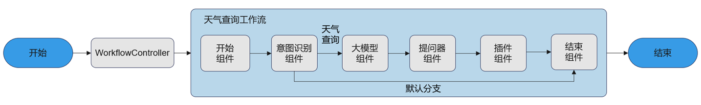

This chapter demonstrates how to build and execute a complete weather query `WorkflowAgent` based on the openJiuwen platform, ranging from creating built-in components to orchestrating workflows. Through this example, you will learn the following information:

- How to create components, specifically including the following openJiuwen built-in components: Start Component, End Component, LLM Component, Plugin Component, Intent Recognition Component, and Questioner Component.
- How to create a Workflow chart.
- How to create and execute a `WorkflowAgent`.

# Application Design Flow

`WorkflowAgent` is a multi-step, task-oriented process automation Agent that efficiently executes complex tasks by strictly following user-defined task processes. Users can pre-define clear task steps, execution conditions, and role assignments, decomposing the task into multiple executable sub-tasks or tools. Through topological connections and data transmission between components, the entire workflow is advanced step by step, ultimately outputting the expected result. It focuses on the standardized and efficient execution of tasks based on preset processes and is suitable for scenarios with clear task structures that can be decomposed into multiple steps.

In this example, a weather query workflow is created to ensure that weather information can be queried accurately and efficiently according to the preset process:

- The **Start Component** defines the input parameter specifications of the workflow.
- The **Intent Recognition Component** determines whether the user's request intent is to query the weather. If it is a weather query intent, it routes to the weather query branch for processing; otherwise, it routes to the default branch to end the process.
- The **LLM Component** is used to rewrite the user's original query, automatically supplementing the current date information and converting place names into English to facilitate the extraction of date and place name information by the Questioner component.
- The **Questioner Component** is used to extract date and place name information from the user input.
- The **Plugin Component** is used to call the weather plugin for weather queries using the date and place names extracted by the Questioner as input parameters.
- The **End Component** defines the output result format of the workflow.



# Prerequisites

The Python version should be higher than or equal to Python 3.11. Version 3.11.4 is recommended. Please check the Python version information before use. For detailed specification constraints, please refer to the documentation.

# Install openJiuwen

Execute the following command to install openJiuwen:

```bash
pip install -U openjiuwen
```

# Creating Workflow Process

The overall process of creating a Workflow is as follows: First, initialize the workflow via `Workflow` and specify the `workflow_config` configuration parameters. Then define each component, register the components to the workflow, and set the connections between components to complete the creation of the entire workflow. The weather query Workflow designed in this example is as follows: User Input → Intent Recognition → Query Rewrite → Parameter Extraction → Call Weather API → Return Result. The example code is as follows:

## Initialize Workflow

Initialize the workflow and specify the `workflow_config` configuration parameters:

```python
from openjiuwen.core.workflow.workflow_config import WorkflowConfig, WorkflowMetadata, WorkflowInputsSchema
from openjiuwen.core.workflow.base import Workflow

# 初始化工作流与上下文
id = "test_weather_agent"
version = "1.0"
name = "weather"
workflow_config = WorkflowConfig(
    metadata=WorkflowMetadata(
        name=name,
        id=id,
        version=version,
        description="天气查询工作流"   
    ),
    workflow_inputs_schema = WorkflowInputsSchema(
        type="object",
        properties={
            "query": {
                "type": "string",
                "description": "用户输入",
                "required": True
            }
        },
        required=['query']
    )
)
flow = Workflow(workflow_config=workflow_config)
```

## Register Components to Workflow

Create core component instances according to task requirements, configure the input/output rules for each component, and register the components to the workflow. This tutorial mainly uses the following openJiuwen built-in components: Start Component, End Component, LLM Component, Plugin Component, Intent Recognition Component, and Questioner Component.

### Start Component

Create a Start component object via `Start`. As the beginning of the workflow, the Start component defines the input parameter specifications of the workflow. In this example, the input parameter of the Start component is a fixed input parameter `query`, which is of string type, and the parameter value references the input of the workflow. The example code is as follows:

```python
from openjiuwen.core.component.start_comp import Start

def create_start_component():
	return Start({"inputs": [{"id": "query", "type": "String", "required": "true", "sourceType": "ref"}]})
```

> **Note**
> Here, the fixed input parameter `query` of the Start component is defined. The value of this parameter references the input of the WorkflowAgent. That is, when the user calls the WorkflowAgent execution interface `invoke` or `stream`, the input must contain the `query` field. For example, when calling `workflow_agent.invoke({"query": "Hello"})`, the input received by the Start component is `{"query": "Hello"}`.

### End Component

Create an End component object via `End`. As the termination of the workflow, the End component defines the output result format of the workflow. In this example, the format of the output result is output text. The example code is as follows:

```python
from openjiuwen.core.component.end_comp import End

def create_end_component():
	return End({"responseTemplate": "最终结果为：{{output}}"})
```

> **Note**
> Here, the End component is configured with the output text template `responseTemplate`. Therefore, the final result will be a string concatenated according to the value of the output variable `output` field, output as the `responseContent` field of the End component.

### Intent Recognition Component

Construct an Intent Recognition component via `IntentDetectionComponent` to determine user intent. The Intent Recognition component provides the `add_branch` method to define routing to corresponding branch paths based on different intents. This example is used to determine whether the user's request intent is to query the weather. If it is a weather query intent, it routes to the `llm` branch for processing; otherwise, it routes to the `end` branch to terminate the process. The code is as follows:

```python
import os
from openjiuwen.core.component.common.configs.model_config import ModelConfig
from openjiuwen.core.component.intent_detection_comp import (
    IntentDetectionComponent, IntentDetectionCompConfig)
from openjiuwen.core.utils.llm.base import BaseModelInfo

API_BASE = os.getenv("API_BASE", "your api base")
API_KEY = os.getenv("API_KEY", "your api key")
MODEL_NAME = os.getenv("MODEL_NAME", "")
MODEL_PROVIDER = os.getenv("MODEL_PROVIDER", "")

def create_model_config() -> ModelConfig:
    """根据环境变量构造模型配置。"""
    return ModelConfig(
        model_provider=MODEL_PROVIDER,
        model_info=BaseModelInfo(
            api_key=API_KEY,
            api_base=API_BASE,
            model=MODEL_NAME,
            temperature=0.8,
            top_p=0.9,
            stream=False,
            timeout=30,
        ),
    )

def create_intent_detection_component() -> IntentDetectionComponent:
    """创建意图识别组件。"""
    model_config = create_model_config()
    user_prompt = "请识别意图"
    config = IntentDetectionCompConfig(
        user_prompt=user_prompt,
        category_name_list=["查询某地天气"],
        model=model_config,
    )
    intent_component = IntentDetectionComponent(config)
    intent_component.add_branch("${intent.classification_id} == 0", ["llm"], "默认分支")
    intent_component.add_branch("${intent.classification_id} == 1", ["llm"], "查询天气分支")
    return intent_component
```

It should be noted that the prompt template filling of the Intent Recognition component relies on the field information in `IntentDetectionCompConfig`, which can better guide the LLM to recognize the request entered by the user.

> - `{{user_prompt}}`: The user can customize the prompt for the Intent Recognition component.
> - `{{category_name_list}}`: It is a **pre-defined intent category list** used to limit the range of functional classifications that the Intent Recognition component can recognize. It must contain at least one element, "Default Intent".
> - `{{model}}`: Model information.

### LLM Component

Construct an LLM component object via `LLMComponent` and guide the LLM to output results in a pre-defined format by setting prompts. This example is used to rewrite the user's original input query, automatically supplement the current date information, facilitate the subsequent extraction of `location` and `date` field information by the Questioner component, and finally output it as text type. The example code is as follows:

```python
from datetime import datetime
from openjiuwen.core.component.llm_comp import LLMComponent, LLMCompConfig

def build_current_date():
    current_datetime = datetime.now()
    return current_datetime.strftime("%Y-%m-%d")

def create_llm_component() -> LLMComponent:
    """创建 LLM 组件，仅用于抽取结构化字段（location/date）。"""
    model_config = create_model_config()
    current_date = build_current_date()
    user_prompt_prefix = "你是一个query改写的AI助手。今天的日期是{}。"
    user_prompt = "\n原始query为：{{query}}\n\n帮我改写原始query，要求：\n1. 只把地名改为英文，其他信息保留中文；\n2. 默认日期为今天；\n3. 时间为YYYY-MM-DD格式。"
    config = LLMCompConfig(
        model=model_config,
        template_content=[{"role": "user", "content": user_prompt_prefix.format(current_date) + user_prompt}],
        response_format={"type": "text"},
        output_config={
            "query": {"type": "string", "description": "改写后的query", "required": True}
        },
    )
    return LLMComponent(config)
```

### Questioner Component

Construct a Questioner component object via `QuestionerComponent`, which supports extracting specified parameters from user input information; if parameter extraction is incomplete, it supports proactive questioning and collecting user feedback information. This example mainly uses the Questioner's ability to extract parameters to extract the values of the `location` and `date` fields at once. The example code is as follows:

```python
from openjiuwen.core.component.questioner_comp import FieldInfo, QuestionerComponent, QuestionerConfig

def create_questioner_component() -> QuestionerComponent:
    """创建提问器组件。"""
    key_fields = [
        FieldInfo(field_name="location", description="地点", required=True),
        FieldInfo(field_name="date", description="时间", required=True, default_value="today"),
    ]
    model_config = create_model_config()
    config = QuestionerConfig(
        model=model_config,
        question_content="",
        extract_fields_from_response=True,
        field_names=key_fields,
        with_chat_history=False,
    )
    return QuestionerComponent(config)
```

The prompt template filling of the Questioner component relies on the field information in `QuestionerConfig`, which can better guide the LLM to extract user-defined parameters to be extracted.

> - `{{required_name}}` corresponds to `field_names`: Extracts the parameter names of the parameters to be extracted and concatenates them into a text according to a fixed template; the current concatenation result is: `"Location, Time 2 necessary pieces of information"`.
> - `{{required_params_list}}` also corresponds to `field_names`: Extracts the parameter names and parameter description information of all parameters to be extracted and concatenates them into a text according to a fixed template; the current concatenation result is: `"location: Location\n date: Time"`.
> - `{{extra_info}}` corresponds to `extra_prompt_for_fields_extraction`: Optional configuration, supports user-defined constraints.
> - `{{example}}` corresponds to `example_content`: Optional configuration, supports user-defined examples.
> - `{{dialogue_history}}` corresponds to dialogue history: The Questioner component can obtain dialogue history information from the context by default.

### Plugin Component

Construct a Plugin component node via `ToolComponent`, used to call plugins, and associate the `Tool` plugin object that actually executes the plugin logic via the `bind_tool` method. This example is used to call the weather component for weather queries. The example code is as follows:

```python
from openjiuwen.core.component.tool_comp import ToolComponent, ToolComponentConfig
from openjiuwen.core.utils.tool.param import Param
from openjiuwen.core.utils.tool.service_api.restful_api import RestfulApi

def create_plugin_component() -> ToolComponent:
    """创建插件组件，可调用外部 RESTful API。"""
    tool_config = ToolComponentConfig()
    weather_plugin = RestfulApi(
        name="WeatherReporter",
        description="天气查询插件",
        params=[
            Param(name="location", description="天气查询的地点，必须为英文", type="string", required=True),
            Param(name="date", description="天气查询的时间，格式为YYYY-MM-DD", type="string", required=True),
        ],
        path="your weather search api url",  # 天气查询服务部署地址
        headers={},
        method="GET",
        response=[],
    )
    return ToolComponent(tool_config).bind_tool(weather_plugin)
```

The above part introduced the instantiation process of each component. The following unifies the introduction of registering components to the workflow:

```python
# 实例化各组件
start = create_start_component()
intent = create_intent_detection_component()
llm = create_llm_component()
questioner = create_questioner_component()
plugin = create_plugin_component()
end = create_end_component()

# 注册组件到工作流
flow.set_start_comp(
    "start",
    start,
    inputs_schema={"query": "${query}"},
)
flow.add_workflow_comp(
    "intent",
    intent,
    inputs_schema={"query": "${start.query}"},
)
flow.add_workflow_comp(
    "llm",
    llm,
    inputs_schema={"query": "${start.query}"},
)
flow.add_workflow_comp(
    "questioner",
    questioner,
    inputs_schema={"query": "${llm.query}"}
)
flow.add_workflow_comp(
    "plugin",
    plugin,
    inputs_schema={
        "location": "${questioner.location}",
        "date": "${questioner.date}",
        "validated": True,
    },
)
flow.set_end_comp("end", end, inputs_schema={"output": "${plugin.data}"})
```

## Connecting Components

Set the connection relationships between components via the `flow.add_connection` method to complete the workflow creation:

```python
# 连接组件
flow.add_connection("start", "intent")
flow.add_connection("llm", "questioner")
flow.add_connection("questioner", "plugin")
flow.add_connection("plugin", "end")
```

# Creating WorkflowAgent

First, create the workflow description information via `WorkflowSchema` and specify the type of workflow input parameters. The example code is as follows:

```python
from openjiuwen.agent.common.schema import WorkflowSchema

schema = WorkflowSchema(
    id=flow.config().metadata.id,
    name=flow.config().metadata.name,
    version=flow.config().metadata.version,
    description="天气查询工作流",
    inputs={"query": {"type": "string"}},
)
```

Then create a WorkflowAgentConfig object via the initialization method of `WorkflowAgentConfig`, covering the description information related to `WorkflowAgent`, etc. The example code is as follows:

```python
from openjiuwen.agent.config.workflow_config import WorkflowAgentConfig

agent_config = WorkflowAgentConfig(
    id="weather_agent",
    version="0.1.0",
    description="天气查询agent",
    workflows=[schema],
)
```

Create a `WorkflowAgent` object by specifying relevant configuration parameter information via the initialization method of `WorkflowAgent`, and then bind the workflow object via the `bind_workflows` method. The example code is as follows:

```python
from openjiuwen.agent.workflow_agent.workflow_agent import WorkflowAgent

workflow_agent = WorkflowAgent(agent_config)
workflow_agent.bind_workflows([flow])
```

# Running WorkflowAgent

You can call the `invoke` method to get the response to the user query. The example code is as follows:

```python
import asyncio

async def test_weather_workflow():
    result = await workflow_agent.invoke({"conversation_id": "12345","query": "上海天气如何"})
    print(f"{result}")


asyncio.run(test_weather_workflow())
```

After a successful query, you will get the following result:

```text
{"responseContent":"最终结果为：{'city': 'Shanghai', 'country': 'CN', 'feels_like': 36.21, 'humidity': 86, 'temperature': 29.21, 'weather': '多云', 'wind_speed': 5.81}"}
```

# Complete Code

```python
import os
from datetime import datetime

from openjiuwen.agent.common.schema import WorkflowSchema, PluginSchema
from openjiuwen.agent.config.workflow_config import WorkflowAgentConfig
from openjiuwen.agent.workflow_agent.workflow_agent import WorkflowAgent
from openjiuwen.core.component.end_comp import End
from openjiuwen.core.component.intent_detection_comp import (
    IntentDetectionComponent, IntentDetectionCompConfig)
from openjiuwen.core.component.common.configs.model_config import ModelConfig
from openjiuwen.core.component.llm_comp import LLMComponent, LLMCompConfig
from openjiuwen.core.component.questioner_comp import QuestionerComponent, FieldInfo, QuestionerConfig
from openjiuwen.core.component.start_comp import Start
from openjiuwen.core.component.tool_comp import ToolComponent, ToolComponentConfig
from openjiuwen.core.utils.llm.base import BaseModelInfo
from openjiuwen.core.utils.tool.param import Param
from openjiuwen.core.utils.tool.service_api.restful_api import RestfulApi
from openjiuwen.core.workflow.base import Workflow
from openjiuwen.core.workflow.workflow_config import WorkflowConfig, WorkflowMetadata, WorkflowInputsSchema
import asyncio

API_BASE = os.getenv("API_BASE", "your api base")
API_KEY = os.getenv("API_KEY", "your api key")
MODEL_NAME = os.getenv("MODEL_NAME", "")
MODEL_PROVIDER = os.getenv("MODEL_PROVIDER", "")

def build_current_date():
    current_datetime = datetime.now()
    return current_datetime.strftime("%Y-%m-%d")

def create_model_config() -> ModelConfig:
    """根据环境变量构造模型配置。"""
    return ModelConfig(
        model_provider=MODEL_PROVIDER,
        model_info=BaseModelInfo(
            api_key=API_KEY,
            api_base=API_BASE,
            model=MODEL_NAME,
            temperature=0.8,
            top_p=0.9,
            streaming=True,
            timeout=30.0,
        ),
    )

def create_llm_component() -> LLMComponent:
    """创建 LLM 组件，仅用于抽取结构化字段（location/date）。"""
    model_config = create_model_config()
    current_date = build_current_date()
    user_prompt_prefix = "你是一个query改写的AI助手。今天的日期是{}。"
    user_prompt = "\n原始query为：{{query}}\n\n帮我改写原始query，要求：\n1. 只把地名改为英文，其他信息保留中文；\n2. 默认日期为今天；\n3. 时间为YYYY-MM-DD格式。"
    config = LLMCompConfig(
        model=model_config,
        template_content=[{"role": "user", "content": user_prompt_prefix.format(current_date) + user_prompt}],
        response_format={"type": "text"},
        output_config={
            "query": {"type": "string", "description": "改写后的query", "required": True}
        },
    )
    return LLMComponent(config)

def create_intent_detection_component() -> IntentDetectionComponent:
    """创建意图识别组件。"""
    model_config = create_model_config()
    user_prompt = "请识别意图"
    config = IntentDetectionCompConfig(
        user_prompt=user_prompt,
        category_name_list=["查询某地天气"],
        model=model_config,
    )
    intent_component = IntentDetectionComponent(config)
    intent_component.add_branch("${intent.classification_id} == 0", ["end"], "默认分支")
    intent_component.add_branch("${intent.classification_id} == 1", ["llm"], "查询天气分支")
    return intent_component

def create_questioner_component() -> QuestionerComponent:
    """创建提问器组件。"""
    key_fields = [
        FieldInfo(field_name="location", description="地点", required=True),
        FieldInfo(field_name="date", description="时间", required=True, default_value="today"),
    ]
    model_config = create_model_config()
    config = QuestionerConfig(
        model=model_config,
        question_content="",
        extract_fields_from_response=True,
        field_names=key_fields,
        with_chat_history=False,
    )
    return QuestionerComponent(config)

def create_start_component():
    """创建开始组件"""
    return Start({"inputs": [{"id": "query", "type": "String", "required": "true", "sourceType": "ref"}]})

def create_end_component():
    """创建结束组件"""
    return End({"responseTemplate": "最终结果为：{{output}}"})

def create_plugin_component() -> ToolComponent:
    """创建插件组件，可调用外部 RESTful API。"""
    tool_config = ToolComponentConfig()
    weather_plugin = RestfulApi(
        name="WeatherReporter",
        description="天气查询插件",
        params=[
            Param(name="location", description="天气查询的地点，必须为英文", type="string", required=True),
            Param(name="date", description="天气查询的时间，格式为YYYY-MM-DD", type="string", required=True),
        ],
        path="your weather search api url",  # 天气查询服务部署地址
        headers={},
        method="GET",
        response=[],
    )
    return ToolComponent(tool_config).bind_tool(weather_plugin)

def bind_agent():
    id = "weather_workflow"
    version = "1.0"
    name = "weather"
    workflow_config = WorkflowConfig(
        metadata=WorkflowMetadata(name=name, id=id, version=version, description="天气查询工作流"),
        workflow_inputs_schema=WorkflowInputsSchema(
            type="object",
            properties={
                "query": {
                    "type": "string",
                    "description": "用户输入",
                    "required": True
                }
            },
            required=['query']
        )
    )

    flow = Workflow(workflow_config=workflow_config)

    start = create_start_component()  # 起始组件
    intent = create_intent_detection_component()  # 意图识别组件

    llm = create_llm_component()  # LLM改写组件
    questioner = create_questioner_component()  # 参数收集组件
    end = create_end_component()  # 结束组件
    plugin = create_plugin_component()  # 插件组件

    # 注册组件到工作流
    flow.set_start_comp(
        "start",
        start,
        inputs_schema={"query": "${query}"},
    )
    flow.add_workflow_comp(
        "intent",
        intent,
        inputs_schema={"query": "${start.query}"},
    )

    flow.add_workflow_comp(
        "llm",
        llm,
        inputs_schema={"query": "${start.query}"},
    )
    flow.add_workflow_comp(
        "questioner",
        questioner,
        inputs_schema={"query": "${llm.query}"}
    )
    flow.add_workflow_comp(
        "plugin",
        plugin,
        inputs_schema={
            "location": "${questioner.location}",
            "date": "${questioner.date}",
            "validated": True,
        },
    )
    flow.set_end_comp("end", end, inputs_schema={"output": "${plugin.data}"})

    flow.add_connection("start", "intent")
    flow.add_connection("llm", "questioner")
    flow.add_connection("questioner", "plugin")
    flow.add_connection("plugin", "end")

    schema = WorkflowSchema(
        id=flow.config().metadata.id,
        name=flow.config().metadata.name,
        version=flow.config().metadata.version,
        description="天气查询工作流",
        inputs={"query": {"type": "string"}},
    )

    agent_config = WorkflowAgentConfig(
        id="weather_agent",
        version="0.1.0",
        description="天气查询agent",
        workflows=[schema]
    )

    workflow_agent = WorkflowAgent(agent_config)
    workflow_agent.bind_workflows([flow])
    return workflow_agent

async def weather_workflow(workflow_agent):
    result = await workflow_agent.invoke({"conversation_id": "12345", "query": "上海今天天气如何"})
    print(result)

if __name__ == "__main__":
    os.environ.setdefault("RESTFUL_SSL_VERIFY", "false")  # 关闭SSL校验仅用于本地调试，生产环境请务必打开
    os.environ.setdefault("LLM_SSL_VERIFY", "false")  # 关闭SSL校验仅用于本地调试，生产环境请务必打开
    workflow_agent = bind_agent()
    asyncio.run(weather_workflow(workflow_agent))
```