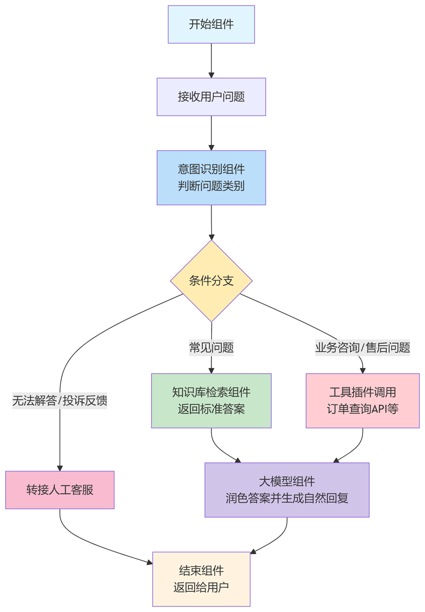
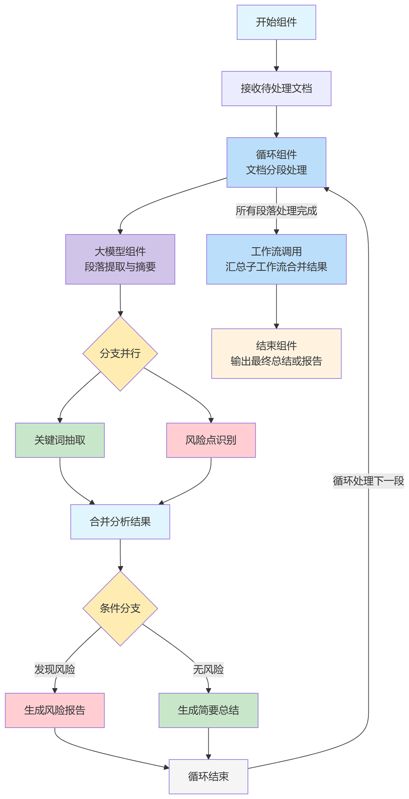
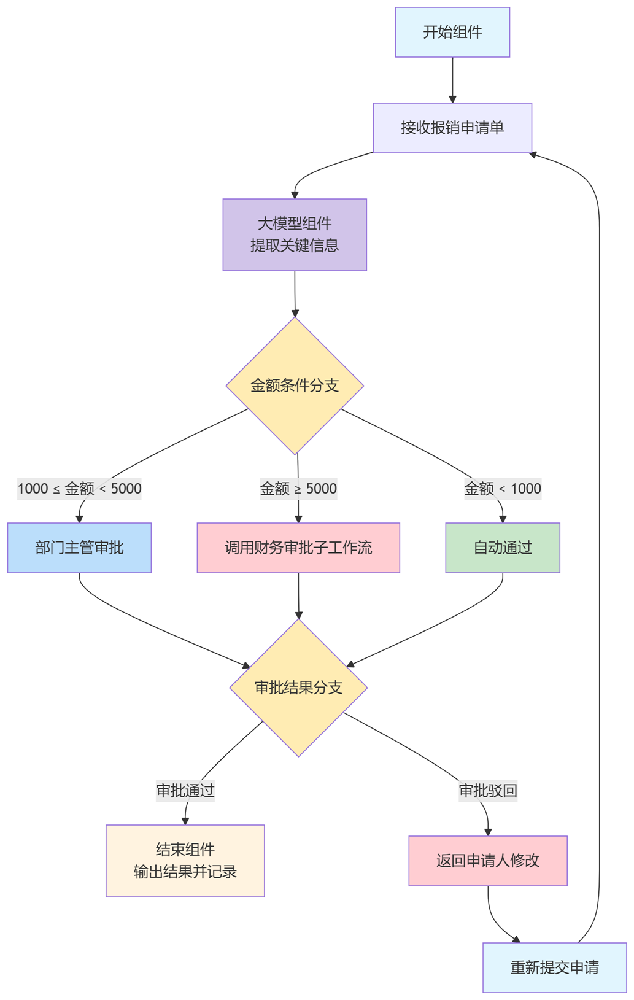

Workflow refers to a mechanism where multiple components or Agents collaborate in an orderly manner according to a pre-designed orchestration process to complete complex tasks. It aims to improve the efficiency and stability of processing complex tasks. With the enhancement of Large Language Model (LLM) capabilities, although a single model possesses certain reasoning and planning abilities, it often encounters issues such as omissions, errors, or context loss when facing long-chain, multi-step, or cross-domain tasks. Furthermore, practical tasks often require the synergistic combination of multiple capabilities (such as knowledge retrieval, API calls, and data processing). Model calls lacking procedural orchestration find it difficult to ensure task stability and reproducibility. Therefore, introducing workflows to decompose and rationally orchestrate tasks, enabling each component to perform its specific duty and connect tightly, is the key foundation for achieving systematic intelligence and building deployable LLM applications.

The core advantages of workflows include:

* **Structure and Controllability**: Decomposing complex tasks into step-by-step processes reduces uncertainty during execution.
* **Modularity and Reusability**: Components with different functions can be combined as needed to form flexible and reusable task pipelines.
* **Stability and Success Rate Improvement**: Through clear execution sequences and error handling mechanisms, LLM "hallucinations" or process interruptions are reduced.
* **Scalability**: Workflows are easy to integrate with external systems (databases, tool APIs, etc.), supporting more complex application scenarios.
* **Observability and Optimization**: Task execution results can be continuously optimized through monitoring and feedback on each step.

## Basic Functions

In the openJiuwen development framework, the construction of workflows relies on two core types of components: Control Components and Functional Components. Control Components are responsible for process execution control and orchestration logic, while Functional Components provide specific capability support, such as LLM invocation, Questioners, Intent Recognition, Tool Plugins, and Knowledge Base access. By flexibly combining these two types of components, functionally complete and independently runnable workflows can be built.

Basic workflow execution control capabilities provide solid support for the construction of complex workflows, enabling various functional components to be flexibly orchestrated within the process. This realizes conditional, parallel, cyclical, and hierarchical execution logic, thereby meeting diverse business requirements. Specifically, these basic control capabilities include:

* **Start/End**: Used to define the entry and termination points of the workflow, identifying the lifecycle scope of the process.
* **Conditional Branching**: Based on branching components or other functional components with judgment capabilities (such as Intent Recognition components), subsequent execution paths are dynamically selected according to set conditions to implement logical branching.
* **Parallel Branching**: When a component is followed by multiple branches, these branches can execute in parallel by default, thereby improving process efficiency.
* **Loop**: Through conditional connections, the flow can jump back to specific preceding components to implement loop logic. If a local process needs to be looped, customized Loop components can be used for finer control.
* **Jump**: The next execution node can be dynamically determined based on execution results, making the workflow more flexible and controllable.
* **Workflow Invocation**: A workflow can call and execute a sub-workflow, thereby achieving layering and reuse of complex processes.

## Application Scenario Examples

### Intelligent Customer Service Q&A Workflow

**Application Scenario**: Users ask questions to the enterprise customer service system, and the system needs to automatically understand the question and provide an accurate answer. This improves customer service efficiency, reduces labor costs, and ensures user experience.

**Workflow Logic**:

1.  **Start Component** → Receives user question.
2.  **Intent Recognition Component** → Determines the question category (e.g., "FAQ", "Business Inquiry/After-sales Issue", "Unsolvable/Complaint Feedback").
3.  **Conditional Branching**:
    * If "FAQ", enter **Knowledge Base Retrieval Component**, return standard answer;
    * If "Business Inquiry/After-sales Issue", involving business operations, call **Tool Plugin** (e.g., Order Query API) to retrieve data;
    * If "Unsolvable/Complaint Feedback", transfer to a human agent.
4.  **LLM Component** → Polishes the answer and generates a natural language response.
5.  **End Component** → Returns the response to the user.

   

      
   

### Intelligent Document Processing and Summarization Workflow

**Application Scenario**: Batch processing and summarizing long documents (such as contracts, papers, reports). Significantly reduces manual reading time and achieves rapid structured information extraction and summarization.

**Workflow Logic**:

1.  **Start Component** → Receives the document to be processed.
2.  **Loop Component** → Processes the document in segments.
3.  **LLM Component** → Performs extraction and summarization for each paragraph.
4.  **Parallel Branching**: Simultaneously executes keyword extraction and risk point identification.
5.  **Conditional Branching** → Selects different subsequent actions based on analysis results (e.g., "Risk Found → Generate Risk Report", "No Risk → Generate Brief Summary").
6.  **Workflow Invocation** → Calls the Summary Sub-workflow to merge the results of each segment.
7.  **End Component** → Outputs the final summary or report.

  

    
  

### Enterprise Internal Automated Approval Process

**Application Scenario**: Employees submit expense reimbursement applications, and the system needs to automatically audit and decide whether to approve. This reduces manual audit workload, shortens process duration, and improves compliance and transparency.

**Workflow Logic**:

1.  **Start Component** → Receives reimbursement application form.
2.  **LLM Component** → Extracts key information (e.g., reimbursement amount).
3.  **Conditional Branching**:
    * If reimbursement amount < 1000 → Auto-approve.
    * If reimbursement amount >= 1000 and < 5000 → Jump to **Department Manager Approval** (Human interaction or automated message push).
    * If reimbursement amount >= 5000 → Call **Finance Approval Sub-workflow**.
4.  **Conditional Branching**:
    * If approval is rejected, return to applicant for modification and resubmission.
    * If approval is passed, complete the process.
5.  **End Component** → Output approval result and record it in the system.

   

      
   
