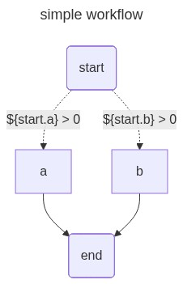
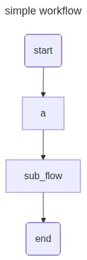
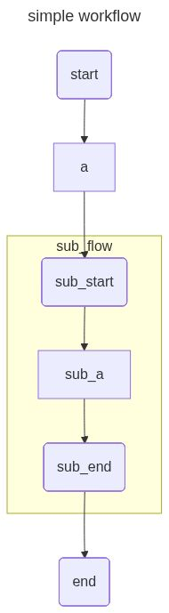
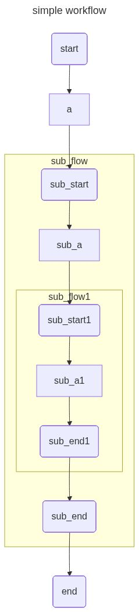
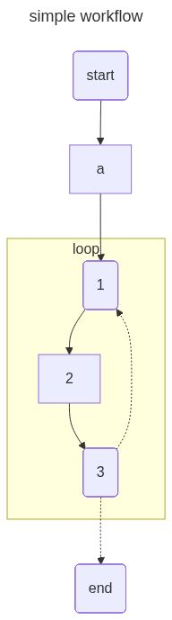

The openJiuwen development framework supports the visual representation of constructed workflows. After building a workflow, users can generate [mermaid](https://mermaid.js.org/) scripts or rendered images by calling the workflow's visualization-related interfaces, facilitating intuitive workflow display and troubleshooting.

# Prerequisites

-   Before using the workflow visualization function, you need to install and run [Jupyter Notebook](https://jupyter.org/).

1.  Execute the following command to install Jupyter Notebook:

    ```bash
    pip install notebook
    ```

2.  Execute the following command to start Jupyter Notebook:

    ```bash
    jupyter notebook
    ```

-   Default image rendering requires internet access to `https://mermaid.ink`. If the environment has normal internet access, no configuration is needed. If the environment cannot access the internet, you need to install [mermaid.ink](https://github.com/jihchi/mermaid.ink) locally and configure the environment variable `MERMAID_INK_SERVER` to the address of the local `mermaid.ink`. Environment variables can be configured using Python's built-in `os` package; please refer to [os.environ](https://docs.python.org/3.11/library/os.html#os.environ).

# Visualizing a Simple Workflow

First, import the modules required to construct the workflow and set the environment variable to enable the workflow visualization function.

```python
from openjiuwen.core.component.base import WorkflowComponent
from openjiuwen.core.component.end_comp import End
from openjiuwen.core.component.start_comp import Start
from openjiuwen.core.context_engine.base import Context
from openjiuwen.core.graph.executable import Output
from openjiuwen.core.runtime.base import ComponentExecutable, Input
from openjiuwen.core.runtime.runtime import Runtime
from openjiuwen.core.workflow.base import Workflow

# 设置环境变量，启用工作流可视化功能
import os
os.environ["WORKFLOW_DRAWABLE"] = "true"
```

Next, define a custom component class to receive input and return an empty result.

```python
# 自定义的组件
class Node1(ComponentExecutable, WorkflowComponent):
    def __init__(self):
        super().__init__()

    async def invoke(self, inputs: Input, runtime: Runtime, context: Context) -> Output:
        return {}
```

Then, build a simple workflow based on the custom component, executing in the order of the start component `start`, custom component `a`, and end component `end`. The connections between the components are all [normal connections](Build%20Workflow.md#normal-connection).

```python
# 构建工作流
flow = Workflow()
flow.set_start_comp("start", Start())
flow.add_workflow_comp("a", Node1())
flow.set_end_comp("end", End())
flow.add_connection("start", "a")
flow.add_connection("a", "end")
```

Visualize the workflow as a PNG image with the title set to `simple workflow`.

```python
# 展示渲染出的图片
from IPython.display import Image, display
display(Image(flow.to_mermaid_png(title="simple workflow")))
```

The rendered image is displayed as follows:

<div style="text-align: center">
</div>

# Visualizing a Workflow with Streaming Edges

First, import the modules required to construct the workflow and set the environment variable to enable the workflow visualization function.

```python
from openjiuwen.core.component.base import WorkflowComponent
from openjiuwen.core.component.end_comp import End
from openjiuwen.core.component.start_comp import Start
from openjiuwen.core.context_engine.base import Context
from openjiuwen.core.graph.executable import Output
from openjiuwen.core.runtime.base import ComponentExecutable, Input
from openjiuwen.core.runtime.runtime import Runtime
from openjiuwen.core.workflow.base import Workflow

# 设置环境变量，启用工作流可视化功能
import os
os.environ["WORKFLOW_DRAWABLE"] = "true"
```

Next, define a custom component class to receive input and return an empty result.

```python
# 自定义的组件
class Node1(ComponentExecutable, WorkflowComponent):
    def __init__(self):
        super().__init__()

    async def invoke(self, inputs: Input, runtime: Runtime, context: Context) -> Output:
        return {}
```

Then, build a workflow with streaming edges based on the custom component, executing in the order of the start component `start`, custom component `a`, and end component `end`. The connection between custom component `a` and end component `end` is a [streaming connection](Build%20Workflow.md#streaming-connection), while the connections between other components are [normal connections](Build%20Workflow.md#normal-connection).

```python
# 搭建工作流
flow = Workflow()
flow.set_start_comp("start", Start())
flow.add_workflow_comp("a", Node1())
flow.set_end_comp("end", End())
flow.add_connection("start", "a")
# 组件间使用流式连接
flow.add_stream_connection("a", "end")
```

To dynamically display the [streaming connection](Build%20Workflow.md#streaming-connection) between component `a` and component `end`, visualize the workflow as an SVG image with the title set to `simple workflow`.

```python
from IPython.display import SVG, display, HTML

svg_data = SVG(flow.to_mermaid_svg(title="simple workflow")).data
display(HTML(f'<div style="zoom:0.9">{svg_data}</div>'))
```

> **Note**
>
> Directly displaying SVG images might result in incomplete display; here, HTML tags are used to scale the image.

The rendered image is displayed as follows:

<div style="text-align: center">
</div>

# Visualizing a Workflow with Branches

First, import the modules required to construct the workflow and set the environment variable to enable the workflow visualization function.

```python
from openjiuwen.core.component.base import WorkflowComponent
from openjiuwen.core.component.end_comp import End
from openjiuwen.core.component.start_comp import Start
from openjiuwen.core.context_engine.base import Context
from openjiuwen.core.graph.executable import Output
from openjiuwen.core.runtime.base import ComponentExecutable, Input
from openjiuwen.core.runtime.runtime import Runtime
from openjiuwen.core.workflow.base import Workflow
from openjiuwen.core.component.branch_router import BranchRouter

# 设置环境变量，启用工作流可视化功能
import os
os.environ["WORKFLOW_DRAWABLE"] = "true"
```

Next, define a custom component class to receive input and return an empty result.

```python
# 自定义的组件
class Node1(ComponentExecutable, WorkflowComponent):
    def __init__(self):
        super().__init__()

    async def invoke(self, inputs: Input, runtime: Runtime, context: Context) -> Output:
        return {}
```

Then, build a workflow with branches based on the custom component. The start component `start` proceeds to custom component `a` based on the condition `${start.a} > 0`, and proceeds to custom component `b` based on the condition `${start.b} > 0`. Both components `a` and `b` proceed to the end component `end`. The connections between the start component `start` and custom components `a` and `b` are [conditional connections](Build%20Workflow.md#conditional-connection), while the connections between other components are [normal connections](Build%20Workflow.md#normal-connection).

```python

# 工作流添加分支
router = BranchRouter()
router.add_branch("${start.a} > 0", "a")
router.add_branch("${start.b} > 0", "b")

flow = Workflow()
flow.set_start_comp("start", Start(), inputs_schema={"a": "${a}", "b": "${b}"})
flow.add_workflow_comp("a", Node1())
flow.add_workflow_comp("b", Node1())
flow.set_end_comp("end", End())
flow.add_conditional_connection("start", router=router)
flow.add_connection("a", "end")
flow.add_connection("b", "end")
```

Visualize the workflow as a PNG image with the title set to `simple workflow`.

```python
from IPython.display import Image, display

display(Image(flow.to_mermaid_png(title="simple workflow")))
```

The rendered image is displayed as follows:

<div style="text-align: center"></div>

# Visualizing Nested Workflows

First, import the modules required to construct the workflow and set the environment variable to enable the workflow visualization function.

```python
from openjiuwen.core.component.base import WorkflowComponent
from openjiuwen.core.component.end_comp import End
from openjiuwen.core.component.start_comp import Start
from openjiuwen.core.context_engine.base import Context
from openjiuwen.core.graph.executable import Output
from openjiuwen.core.runtime.base import ComponentExecutable, Input
from openjiuwen.core.runtime.runtime import Runtime
from openjiuwen.core.workflow.base import Workflow
from openjiuwen.core.component.workflow_comp import SubWorkflowComponent

# 设置环境变量，启用工作流可视化功能
import os
os.environ["WORKFLOW_DRAWABLE"] = "true"
```

Next, define a custom component class to receive input and return an empty result.

```python
# 自定义的组件
class Node1(ComponentExecutable, WorkflowComponent):
    def __init__(self):
        super().__init__()

    async def invoke(self, inputs: Input, runtime: Runtime, context: Context) -> Output:
        return {}
```

Then, create a sub-workflow `sub_flow` and a main workflow `flow` respectively. The sub-workflow executes in the order of start component `sub_start`, custom component `sub_a`, and end component `sub_end`. The main workflow executes in the order of start component `start`, custom component `a`, sub-workflow component `sub_flow`, and end component `end`. The sub-workflow component `sub_flow` is constructed from the sub-workflow. All connections between components are [normal connections](Build%20Workflow.md#normal-connection).

```python

# 创建子工作流
sub_flow = Workflow()
sub_flow.set_start_comp("sub_start", Start())
sub_flow.add_workflow_comp("sub_a", Node1())
sub_flow.set_end_comp("sub_end", End())
sub_flow.add_connection("sub_start", "sub_a")
sub_flow.add_connection("sub_a", "sub_end")

# 创建主工作流，并将子工作流加入主工作流中
flow = Workflow()
flow.set_start_comp("start", Start())
flow.add_workflow_comp("a", Node1())
flow.add_workflow_comp("sub_flow", SubWorkflowComponent(sub_flow))
flow.set_end_comp("end", End())
flow.add_connection("start", "a")
flow.add_connection("a", "sub_flow")
flow.add_connection("sub_flow", "end")
```

Visualize the workflow as a PNG image with the title set to `simple workflow`. Do not expand the sub-workflow initially, meaning the `expand_subgraph` parameter of the `to_mermaid_png` function uses the default value `False`.

```python
from IPython.display import Image, display

# 不展开子工作流
display(Image(flow.to_mermaid_png(title="simple workflow")))
```

The rendered image is displayed as follows:

<div style="text-align: center"></div>

Visualize the workflow as a PNG image with the title set to `simple workflow`. Expand the sub-workflow, meaning the `expand_subgraph` parameter of the `to_mermaid_png` function is set to `True`.

```python
# 展开子工作流
display(Image(flow.to_mermaid_png(title="simple workflow", expand_subgraph=True)))
```

The rendered image is displayed as follows:

<div style="text-align: center"></div>

# Visualizing Multi-layer Nested Workflows

First, import the modules required to construct the workflow and set the environment variable to enable the workflow visualization function.

```python
from openjiuwen.core.component.base import WorkflowComponent
from openjiuwen.core.component.end_comp import End
from openjiuwen.core.component.start_comp import Start
from openjiuwen.core.context_engine.base import Context
from openjiuwen.core.graph.executable import Output
from openjiuwen.core.runtime.base import ComponentExecutable, Input
from openjiuwen.core.runtime.runtime import Runtime
from openjiuwen.core.workflow.base import Workflow
from openjiuwen.core.component.workflow_comp import SubWorkflowComponent

# 设置环境变量，启用工作流可视化功能
import os
os.environ["WORKFLOW_DRAWABLE"] = "true"
```

Next, define a custom component class to receive input and return an empty result.

```python
# 自定义的组件
class Node1(ComponentExecutable, WorkflowComponent):
    def __init__(self):
        super().__init__()

    async def invoke(self, inputs: Input, runtime: Runtime, context: Context) -> Output:
        return {}
```

Then, create the workflow as follows:
- The main workflow executes in the order of start component `start`, custom component `a`, sub-workflow component `sub_flow`, and end component `end`. The sub-workflow component `sub_flow` is constructed from the first-level sub-workflow.
- The first-level sub-workflow executes in the order of start component `sub_start`, custom component `sub_a`, sub-workflow component `sub_flow1`, and end component `sub_end`. The sub-workflow component `sub_flow1` is constructed from the second-level sub-workflow.
- The second-level sub-workflow executes in the order of start component `sub_start1`, custom component `sub_a1`, and end component `sub_end1`.

All connections between components are [normal connections](Build%20Workflow.md#normal-connection).

```python

# 创建二级子工作流
sub_flow1 = Workflow()
sub_flow1.set_start_comp("sub_start1", Start())
sub_flow1.add_workflow_comp("sub_a1", Node1())
sub_flow1.set_end_comp("sub_end1", End())
sub_flow1.add_connection("sub_start1", "sub_a1")
sub_flow1.add_connection("sub_a1", "sub_end1")

# 创建一级子工作流，并将二级子工作流放入创建的工作流中
sub_flow = Workflow()
sub_flow.set_start_comp("sub_start", Start())
sub_flow.add_workflow_comp("sub_a", Node1())
sub_flow.add_workflow_comp("sub_flow1", SubWorkflowComponent(sub_flow1))
sub_flow.set_end_comp("sub_end", End())
sub_flow.add_connection("sub_start", "sub_a")
sub_flow.add_connection("sub_a", "sub_flow1")
sub_flow.add_connection("sub_flow1", "sub_end")

# 创建主工作流，并将一级子工作流加入主工作流中
flow = Workflow()
flow.set_start_comp("start", Start())
flow.add_workflow_comp("a", Node1())
flow.add_workflow_comp("sub_flow", SubWorkflowComponent(sub_flow))
flow.set_end_comp("end", End())
flow.add_connection("start", "a")
flow.add_connection("a", "sub_flow")
flow.add_connection("sub_flow", "end")
```

Visualize the workflow as a PNG image with the title set to `simple workflow`. Do not expand the sub-workflow initially, meaning the `expand_subgraph` parameter of the `to_mermaid_png` function uses the default value `False`.

```python
from IPython.display import Image, display

# 不展开子工作流
display(Image(flow.to_mermaid_png(title="simple workflow")))
```

The rendered image is displayed as follows:

<div style="text-align: center"></div>

Visualize the workflow as a PNG image with the title set to `simple workflow`. Expand one layer of the sub-workflow, meaning the `expand_subgraph` parameter of the `to_mermaid_png` function is set to `1`.

```python
# 展开一层子工作流
display(Image(flow.to_mermaid_png(title="simple workflow", expand_subgraph=1)))
```

The rendered image is displayed as follows:

<div style="text-align: center"></div>

Visualize the workflow as a PNG image with the title set to `simple workflow`. Expand two layers of sub-workflows, meaning the `expand_subgraph` parameter of the `to_mermaid_png` function is set to `2`. Since there are only two layers of sub-workflows in total, the effect is the same as setting `expand_subgraph` to `True`.

```python
# 展开两层子工作流
display(Image(flow.to_mermaid_png(title="simple workflow", expand_subgraph=2)))
```

The rendered image is displayed as follows:

<div style="text-align: center"></div>

# Visualizing a Workflow with Loops

First, import the modules required to construct the workflow and set the environment variable to enable the workflow visualization function.

```python
from openjiuwen.core.component.base import WorkflowComponent
from openjiuwen.core.component.end_comp import End
from openjiuwen.core.component.start_comp import Start
from openjiuwen.core.context_engine.base import Context
from openjiuwen.core.graph.executable import Output
from openjiuwen.core.runtime.base import ComponentExecutable, Input
from openjiuwen.core.runtime.runtime import Runtime
from openjiuwen.core.workflow.base import Workflow
from openjiuwen.core.component.loop_comp import LoopGroup, LoopComponent

# 设置环境变量，启用工作流可视化功能
import os
os.environ["WORKFLOW_DRAWABLE"] = "true"
```

Next, define a custom component class to receive input and return an empty result.

```python
# 自定义的组件
class Node1(ComponentExecutable, WorkflowComponent):
    def __init__(self):
        super().__init__()

    async def invoke(self, inputs: Input, runtime: Runtime, context: Context) -> Output:
        return {}
```

Then, create the loop body and the workflow respectively. The loop body executes in the order of custom component `1`, custom component `2`, and custom component `3`. The workflow executes in the order of start component `start`, custom component `a`, loop component `loop`, and end component `end`. The loop component is constructed from the loop body. All connections between components are [normal connections](Build%20Workflow.md#normal-connection).

```python

# 创建循环体
loop_group = LoopGroup()
loop_group.add_workflow_comp("1", Node1())
loop_group.add_workflow_comp("2", Node1())
loop_group.add_workflow_comp("3", Node1())
loop_group.start_comp("1")
loop_group.end_comp("3")
loop_group.add_connection("1", "2")
loop_group.add_connection("2", "3")

# 创建工作流，并将循环体通过循环组件放入工作流中
flow = Workflow()
flow.set_start_comp("start", Start())
flow.add_workflow_comp("a", Node1())
flow.add_workflow_comp("loop", LoopComponent(loop_group, output_schema={}))
flow.set_end_comp("end", End())
flow.add_connection("start", "a")
flow.add_connection("a", "loop")
flow.add_connection("loop", "end")
```

Visualize the workflow as a PNG image with the title set to `simple workflow`. Do not expand the loop component initially, meaning the `expand_subgraph` parameter of the `to_mermaid_png` function uses the default value `False`.

```python
from IPython.display import Image, display

# 不展开循环组件
display(Image(flow.to_mermaid_png(title="simple workflow")))
```

The rendered image is displayed as follows:

<div style="text-align: center"></div>

Visualize the workflow as a PNG image with the title set to `simple workflow`. Expand the loop component, meaning the `expand_subgraph` parameter of the `to_mermaid_png` function is set to `True`.

```python
# 展开循环组件
display(Image(flow.to_mermaid_png(title="simple workflow", expand_subgraph=True)))
```

The rendered image is displayed as follows:

<div style="text-align: center"></div>