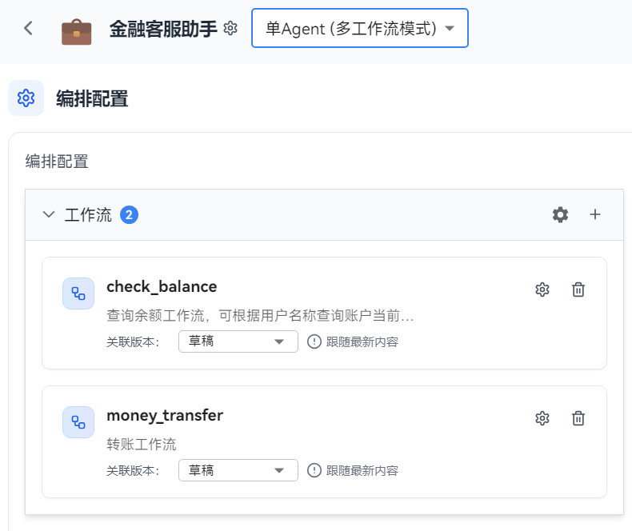
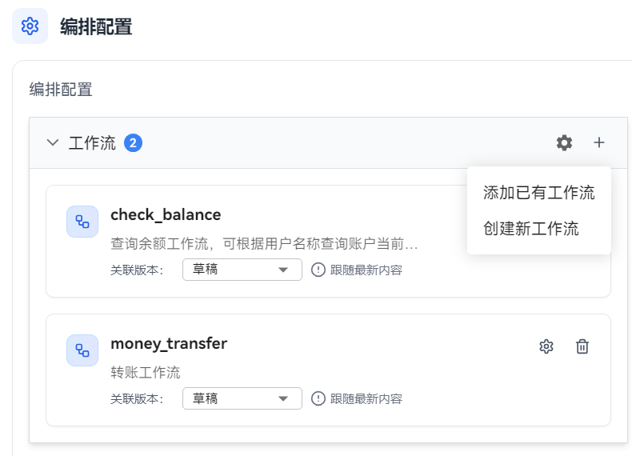
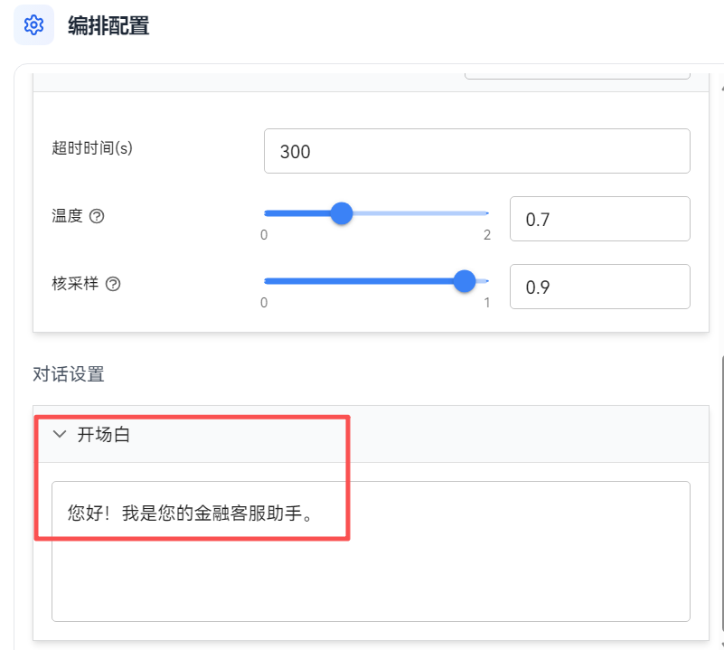
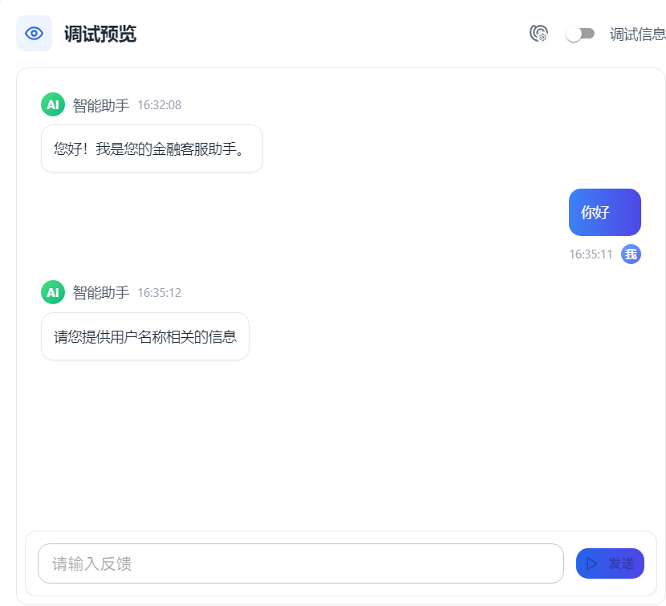
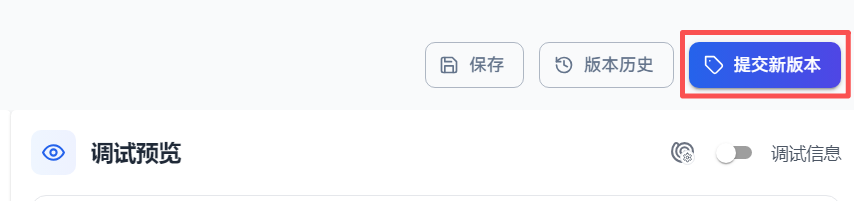
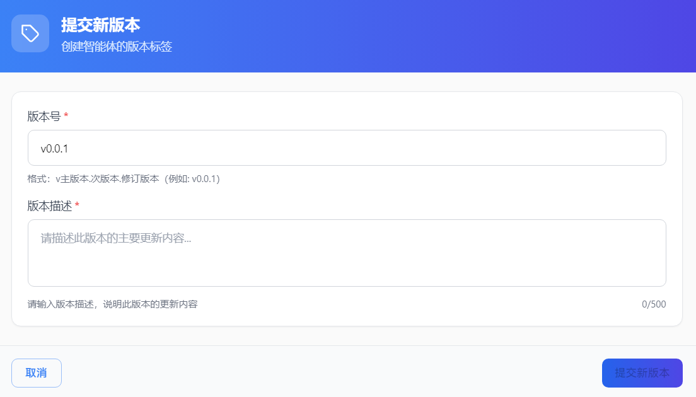

# Building Multi-workflow Agent

OpenJiuwen supports setting multi-workflow mode for agents. In this mode, all user conversations with the agent will trigger corresponding workflows for processing. The agent passes questions through the workflow start node's input and uses the workflow end node's output as the agent's reply. Multi-workflow mode is suitable for scenarios where the agent process is relatively fixed, such as customer service scenarios.

## Differences Between Multi-workflow Mode and Autonomous Planning Mode

"Multi-workflow" and "Autonomous Planning Mode" are two different core working modes under single agent. Their most fundamental difference is: Autonomous Planning Mode is led by the Large Language Model (LLM) for thinking and decision-making, while Multi-workflow Mode is led by user-predefined and fixed processes for each step of the conversation.

Their key differences are shown in the following table:

| Comparison Dimension       | Autonomous Planning Mode (Single Agent)                                           | Multi-workflow (Single Agent)                                                       |
| -------------- | ---------------------------------------------------------------- | ------------------------------------------------------------------------ |
| **Core Logic**   | The large model (LLM) autonomously thinks, makes decisions, and calls tools.                        | Strictly executes according to preset workflows, with processes determining each step.                               |
| **Controllability**     | Flexible but uncontrollable. The model freely performs based on prompts and context, and behavior may deviate from expectations. | Highly controllable and stable. The process is fixed, ensuring key steps (such as information collection, logical judgment) are executed. |
| **Processing Complexity** | Suitable for relatively simple open-ended conversations or consultations.                             | Suitable for structured, complex tasks with clear processes, such as customer service, data queries, and multi-step information processing.     |
| **Configuration Core**   | Relies on system prompts to define roles, goals, skills, and limitations.                     | Relies on visually orchestrated workflows, building processes by adding conditional branches, calling plugins, and other nodes.     |
| **Applicable Scenarios**   | Personal assistants, knowledge Q&A, creative generation, and other scenarios requiring flexibility.                 | Intelligent customer service, interview assistants, order queries, standardized service processes, and other scenarios requiring process consistency. |

# Configure Multi-workflow Mode Agent

## Notes
- The workflow bound to a multi-workflow mode agent must have a start node that takes `query` as input.
- The workflow bound to a multi-workflow mode agent must have an end node with streaming output enabled.
- Multi-workflow mode agents do not support adding memory, knowledge, and other configurations.

## Operation Steps
1. Enter the OpenJiuwen development platform.
2. Edit an existing agent or create a new agent.
3. In the agent orchestration page, select the agent mode as Single Agent (Multi-workflow) mode. 

4. In the workflow configuration area, click to add a workflow.
5. Create a new workflow or use an existing workflow. 
   
6. Add agent configuration. Add model configuration and opening statement for multi-workflow mode agents. Refer to Single Agent (Autonomous Planning Mode) for configuration methods. 

7. Debug and preview the agent. After completing the settings on the agent orchestration page, you can have a conversation with the agent in the debug preview area to experience the agent's interaction effects. 

8. After debugging is complete, click "Submit New Version" in the upper right corner to publish. 

9. Fill in the version number and version description, then click "Submit New Version" in the lower right corner to publish 

