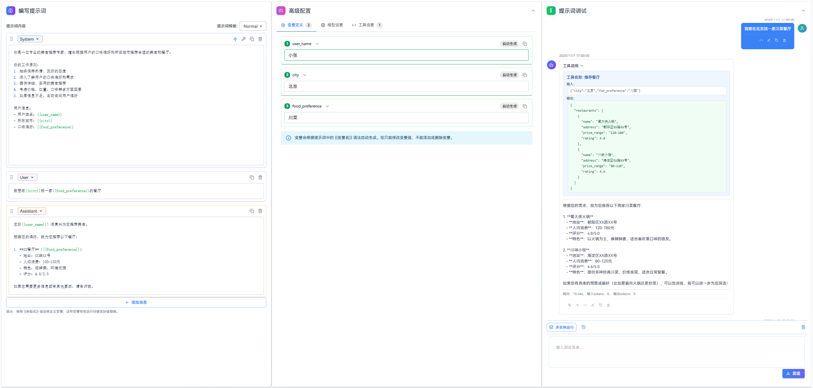
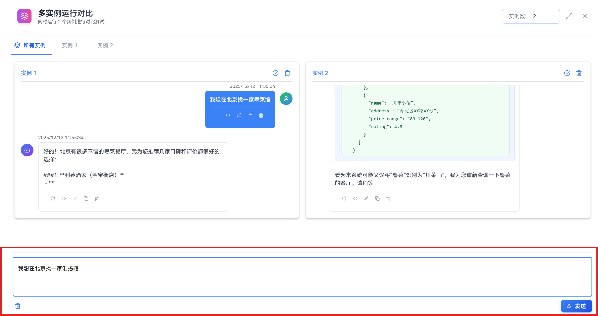
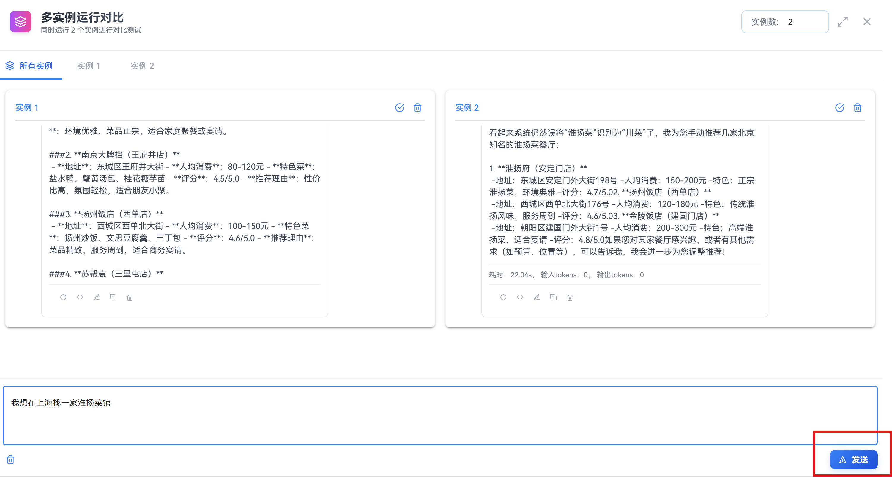
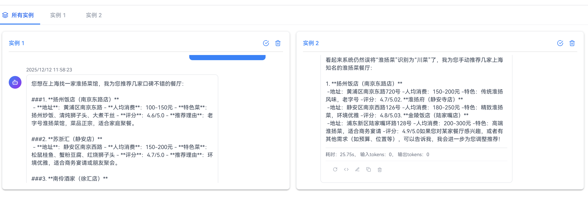
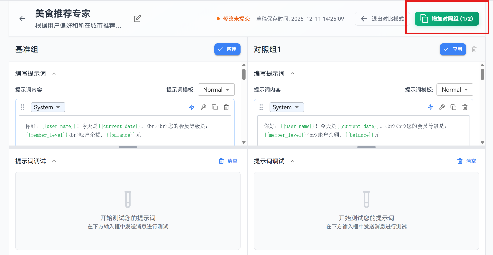
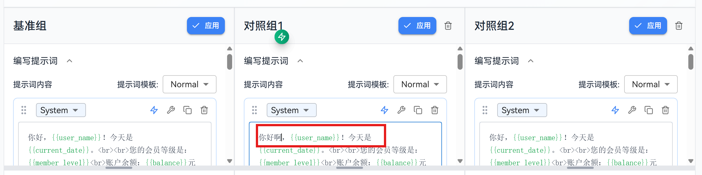
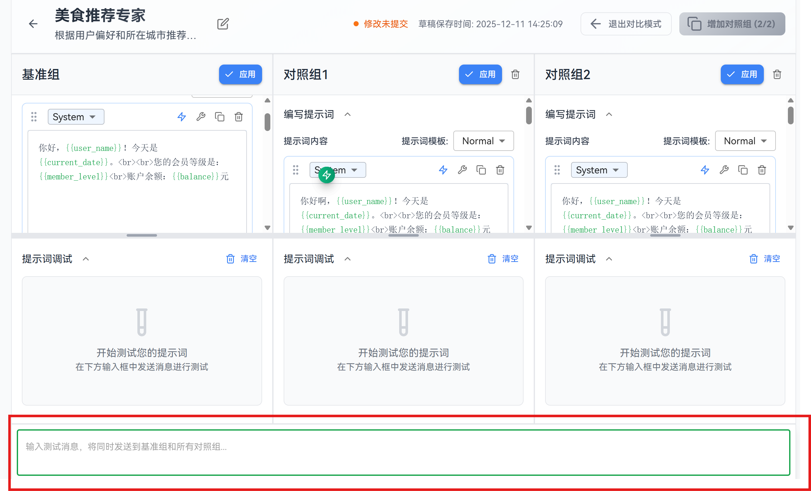

# Debugging Prompts

This guide provides a detailed introduction to prompt debugging features, including **Normal Debug Mode**, **Multi-Instance Execution Mode**, and **Comparison Mode**, helping you fully master prompt debugging methods.

**1. Normal Debug Mode**: A basic debugging approach where you send test messages, review AI responses, and verify prompt effectiveness. It supports message retry, editing, copying, and other operations, making rapid iteration easy. This mode is suitable for rapid iteration (quickly adjusting and validating prompts through editing and retrying) and troubleshooting (identifying and fixing issues in prompts).

**2. Multi-Instance Execution**: Runs multiple instances simultaneously to batch-validate output behavior under the same configuration. By comparing response quality across instances, you can verify prompt stability. This mode is suitable for stability verification (checking output consistency under identical inputs) and batch testing (testing multiple instances at once to quickly evaluate prompt quality).

**3. Comparison Mode**: Creates a baseline group and comparison groups to evaluate the effects of different prompts or configurations under the same input, helping you quickly identify the optimal solution. It supports independent editing and testing, making it convenient to experiment with different configurations. This mode is suitable for comparing different model parameters or prompt versions, testing multiple configurations in parallel, and identifying the best solution through side-by-side comparison.

## Notes

- **Pay attention to model parameters**: Different models or parameter configurations can significantly affect response quality. Adjust them in **Advanced Configuration** if necessary before debugging.
- **Keep conversations concise**: During debugging, periodically clear historical messages to avoid overly long contexts that may affect results.

## Steps

### 1. Normal Debug Mode

**Method 1**: After configuring variable values in **Variable Definition**, directly click **Send**. This method is suitable for precise testing of specific functionality and quick logic verification, such as testing whether a particular plugin is correctly invoked when the user input contains specific keywords.


**Method 2**: In the **Prompt Debugging** module, enter a test message and click **Send**. This method is suitable for simulating real user conversations and testing the complete interaction flow.

Test message:
```
I want to find a Sichuan cuisine restaurant in Beijing
```



Review the AI response to confirm whether the behavior meets expectations.

### 2. Multi-Instance Debug Mode

**Multi-Instance Execution** is suitable for batch validation of output behavior under the same configuration and is used to verify prompt stability.

1. Click the **“Multi-Instance Execution”** button in the toolbar of the prompt debugging module.


2. Enter the test message at the bottom of the pop-up window.



3. Click **Send**. The system will initiate multiple sessions simultaneously and display the results.



4. Compare the response quality across different instances.



5. If an instance produces particularly good results, click **Adopt This Instance** to add that instance’s conversation history to the main prompt debugging session on the main page.


### 3. Comparison Mode

Comparison mode allows you to evaluate prompt effectiveness under different configurations and quickly identify the optimal solution.

1. Click the **“Comparison Mode”** button at the top of the page.


The page will switch to a multi-column layout, including:
- **Baseline Group**: The current main version.
- **Comparison Groups**: Up to two additional groups can be added for experimentation.

2. Click **“Add Comparison Group”** to create an experimental version.



3. Comparison groups can independently edit prompts and configurations without affecting each other.



4. Debug inputs are executed simultaneously across all groups, making side-by-side comparison convenient.


