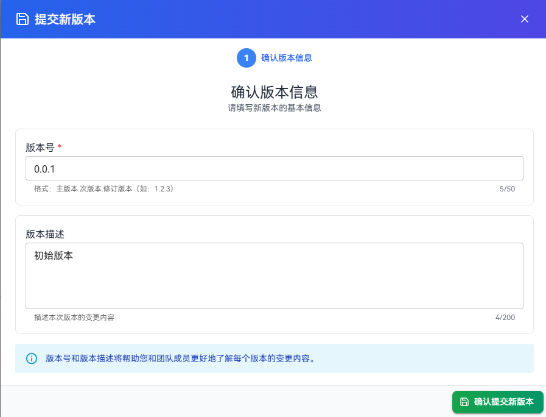
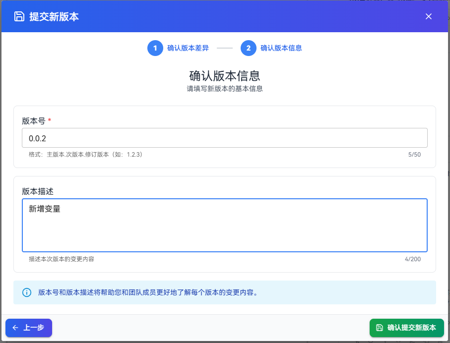
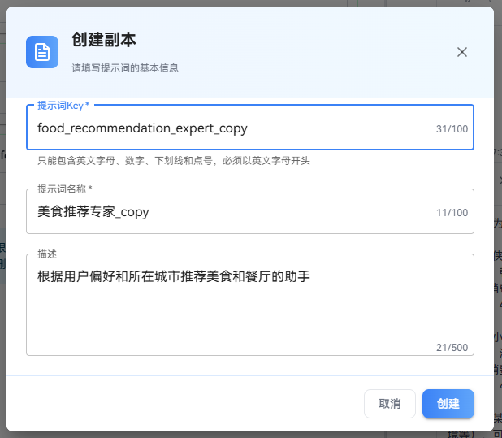

This guide provides a detailed introduction to the prompt version management system, including the official version submission workflow, version difference comparison, historical version viewing and operations, helping you establish a complete prompt version control and collaboration process.

# Submit a New Version

## Steps

1. Click the **“Submit New Version”** button at the top of the page. The system will automatically retrieve detailed information about the current draft and the latest official version. If an official version already exists, the system will display a version difference comparison.

   

2. If an official version already exists, the system will display a detailed version difference comparison. The system automatically detects whether there are substantive changes. If no changes are detected, submission is not allowed. If this is the first time submitting a new version, no difference comparison will be shown.

   Example:

   

3. After confirming the differences (or directly entering this step for the first submission), fill in the version information.

   The prompt version information parameters are as follows:

   | Parameter Name | Description | Constraints |
   |---------------|-------------|-------------|
   | Version Number | Enter a version number that conforms to the specification | Required, up to 50 characters |
   | Version Description | Enter the version update description | Optional, up to 200 characters |

   Example of filling in version information for the first submission:

   

   Example of filling in version information for subsequent submissions:

   

4. Click **“Confirm Submit New Version”** to complete the version release.

# View Version History

Version history records all official versions for easy traceability and collaboration.

## Steps

1. Click the **“Version History”** button at the top of the page. In the pop-up panel, you can view the release time, creator, and description of each version.

   

2. Select a specific version to load its content into the editing area. Selecting a draft will load the draft content into the editing area.

   

# Create a Copy

## Steps

1. Select the target version from the version history list.
2. Click the **“Create Copy”** button.
3. In the pop-up dialog, fill in the basic information for the new prompt:

   

   The parameters for creating a prompt copy are as follows:

   | Parameter Name | Description | Default Value |
   |---------------|-------------|---------------|
   | Prompt Identifier | Unique identifier for the new prompt | original_identifier_copy |
   | Prompt Name | Display name of the new prompt | original_name_copy |
   | Description | Description of the new prompt | - |

4. Click the **“Create”** button to create a new prompt copy and automatically navigate to the editing page of the new prompt copy.

# Restore a Version

## Notes

- Restoring a version will overwrite the latest edited prompt. Please proceed with caution.

## Steps

1. Select the target version from the version history list.
2. Click the **“Restore to This Version”** button.

   

3. Click the **“Confirm Restore”** button to confirm restoring to the specified version.

   
