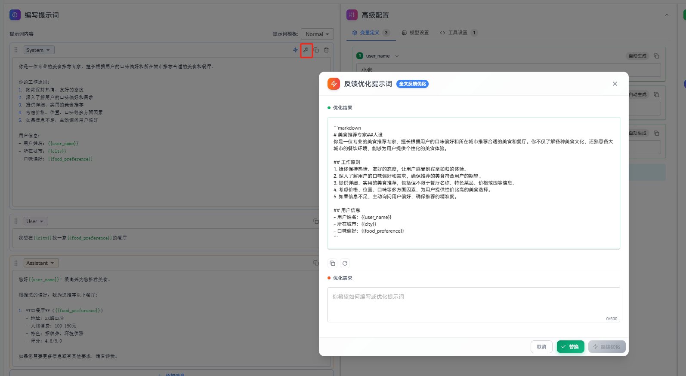
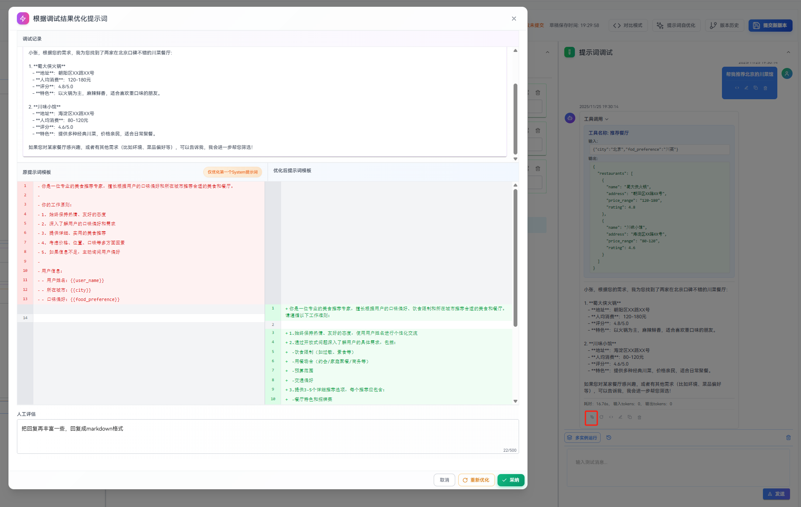
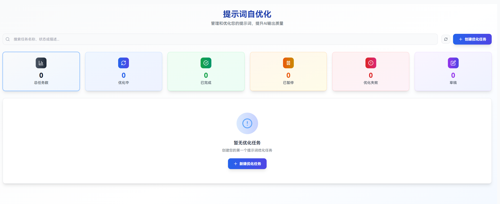
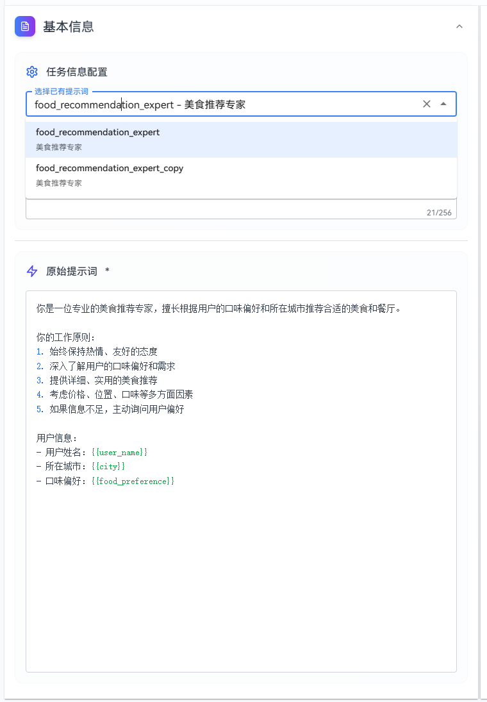
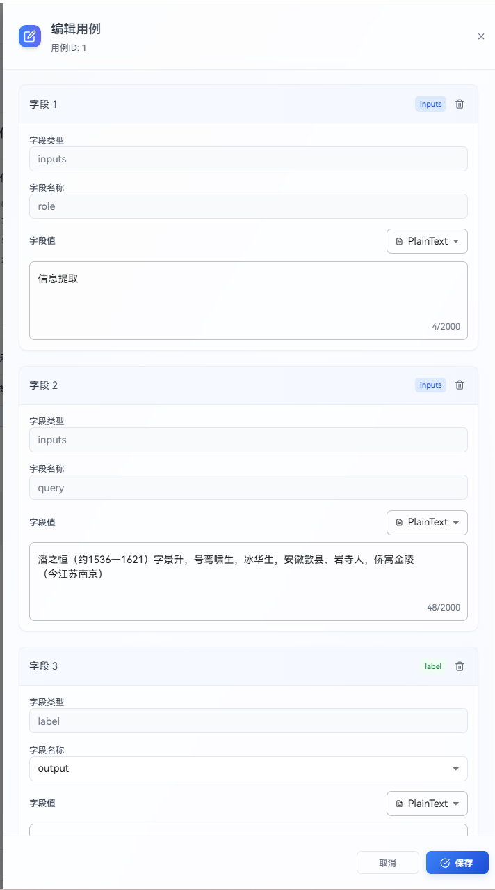
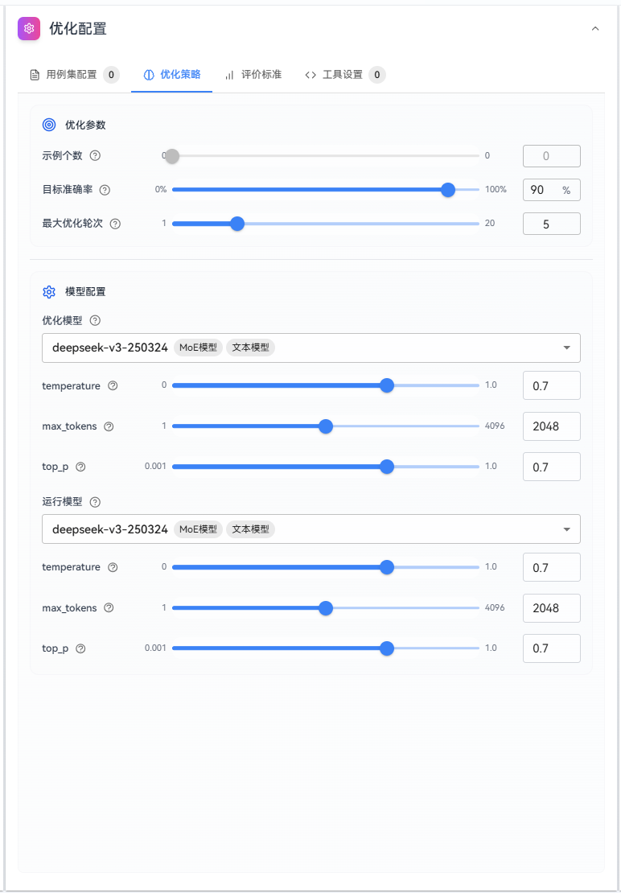
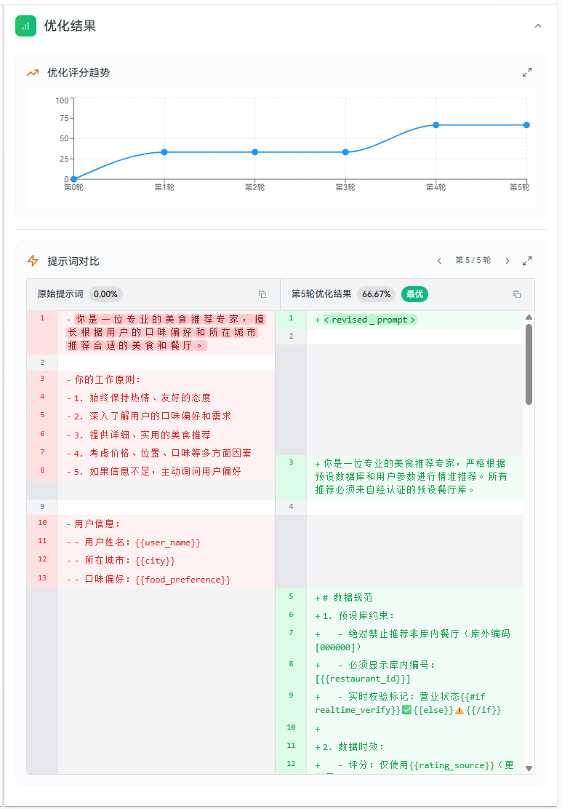

# Prompt Optimization

This guide provides a comprehensive overview of the prompt optimization feature, covering the complete workflow across four approaches: **Quick Optimization**, **Feedback Optimization**, **Optimization Based on Debug Results**, and **Self-Optimization**.

- **Quick Optimization**: Quickly performs global improvements and refinements on the entire prompt. Suitable for scenarios where you need to rapidly enhance the overall quality of a prompt.
- **Feedback Optimization**: Precisely optimizes a prompt locally or globally based on specific requirements. It supports three modes: Full-text Feedback Optimization, Selected-text Feedback Optimization, and Insert Feedback Optimization, to meet different optimization scenarios.
- **Optimization Based on Debug Results**: Optimizes the prompt based on AI responses from actual debugging conversations combined with human evaluation. Suitable for identifying real-world issues during usage and making targeted improvements.
- **Self-Optimization**: Automatically iterates and optimizes prompts using a dataset of test cases. The system compares actual outputs with expected outputs and continuously refines the prompt to reach a target accuracy, making it suitable for batch testing and continuous optimization.

## Quick Optimization

Quick Optimization is suitable for rapidly applying global improvements and refinements to the entire prompt.

### Steps

1. On the prompt editing page, click the **“Quick Optimization”** button in the message header of the prompt editing area.
2. The Quick Optimization dialog displays a comparison between the original and optimized prompt. You can click **“Apply”** to replace the current prompt with the optimized version, or click **“Cancel”** to discard the optimized result.

## Feedback Optimization

Feedback Optimization allows you to precisely optimize a prompt locally or globally based on specific requirements. The system supports three feedback optimization modes: **Full-text Feedback Optimization**, **Selected-text Feedback Optimization**, and **Insert Feedback Optimization**.

### Full-text Feedback Optimization

Full-text Feedback Optimization is suitable for applying global improvements and refinements to the entire prompt.

#### Steps

1. On the prompt editing page, click the **“Full-text Feedback Optimization”** button in the message header.
2. In the feedback optimization dialog, enter your optimization requirements and click **“Send”**. The system will optimize the prompt based on your feedback.
3. After optimization is complete, click **“Replace”** to overwrite the original prompt with the optimized version.

### Selected-text Feedback Optimization

Selected-text Feedback Optimization is suitable for optimizing a specific selected text fragment within the prompt.

#### Steps

1. On the prompt editing page, select the text fragment to be optimized. A floating **“Selected-text Feedback Optimization”** button will appear.
2. Click the **“Selected-text Feedback Optimization”** button to open the feedback optimization dialog.
3. Enter your optimization requirements in the dialog.
4. Click **“Send”**. The system will optimize the selected text based on your feedback.
5. After optimization is complete, click **“Replace”** to substitute the selected text fragment with the optimized content.

### Insert Feedback Optimization

Insert Feedback Optimization is suitable for inserting newly generated optimized content at a specific position within the prompt.

#### Steps

1. On the prompt editing page, place the cursor at the position where you want to insert content. A floating **“Insert Feedback Optimization”** button will appear.
2. Click the **“Insert Feedback Optimization”** button to open the feedback optimization dialog.
3. In the dialog, describe the content you want to insert.
4. Click **“Send”**. The system will generate optimized content based on your requirements.
5. After optimization is complete, click **“Replace”** to insert the optimized content at the cursor position.

## Optimization Based on Debug Results

The Optimization Based on Debug Results feature allows you to improve prompts by manually evaluating AI responses from actual debugging conversations. This feature is especially useful for identifying issues that arise during real usage and making targeted improvements.

### Steps

1. In the debugging area of the prompt editing page, locate the AI response that needs improvement. Click the **“Optimize Prompt”** button on the AI response to open the **“Optimize Prompt Based on Debug Results”** dialog. The dialog will display the corresponding user question and AI response.
2. In the **“Human Evaluation”** input box, describe in detail the issues with the AI response or the direction for improvement. For example: “The answer is too brief and lacks details”, “The user’s true intent was not understood”, or “The output format does not meet requirements”.
3. Click the **“Start Optimization”** button. The system will automatically optimize the prompt based on your evaluation and the conversation history.
4. After optimization is complete, the dialog will display the optimized prompt along with a before-and-after comparison.  
   - If you are satisfied, click **“Apply”** to replace the original prompt with the optimized version.  
   - If you are not satisfied, click **“Re-optimize”** to regenerate the optimized result based on the same evaluation, or modify the human evaluation and try again.

> **Tip**: The quality of the human evaluation directly affects the optimization outcome. It is recommended to provide specific and detailed feedback, including problem descriptions and expected improvement directions, so the system can better understand your needs and generate higher-quality optimization results.

## Self-Optimization

### Steps

**Method 1: Create from the Task List**

1. On the optimization task list page, click the **“Create Optimization Task”** button.

   

2. Fill in the task name, task description, and original prompt. You can also directly select an existing prompt to auto-fill this information.

   

**Method 2: Create from the Prompt Editing Page**

1. On the prompt editing page, click the **“Prompt Self-Optimization”** button.

   

2. You will be redirected to the self-optimization task creation page, where the basic task information will be automatically filled in.

## Test Case Set Management

The test case set is the core of an optimization task. It contains test cases used to evaluate prompt performance and guide prompt optimization. Each test case consists of inputs and an expected output (label).

A high-quality test case set should cover scenarios of varying difficulty levels, edge cases, and abnormal inputs to comprehensively evaluate prompt performance across real-world scenarios. By comparing actual outputs with expected outputs, the system can identify gaps and guide optimization directions to improve overall effectiveness.

### Test Case Format

Each test case uses JSON format and contains two main parts:

1. **inputs**: Input data containing one or more fields. Each field corresponds to a `{{variable}}` in the prompt.
   - If the original prompt contains `{{variable}}`, the field names in `inputs` must exactly match the variable names.
   - If the original prompt does not contain variables, `inputs` must contain only one field named `query`.
   - Field names must not exceed 50 characters.
2. **label**: The expected output, which must contain only one field. The field name must be either `output` or `tool_calls`.
   - `output` is used for normal text output, while `tool_calls` is used for tool invocation scenarios.
   - Field names must not exceed 50 characters.

### Adding Test Cases

#### Manual Entry

1. Click the **“Add Test Case”** button. A blank test case will appear in the list. Click the edit button next to the blank test case to open the edit page.
2. Fill in the message content on the edit page.
3. Click **“Save”**.

#### Batch Upload

1. Click the **“Upload File”** button.
2. Select an Excel file (.xlsx, .xls, or .csv). You can first click **“Download Dataset Template”** to download a sample Excel file.
3. Confirm the upload.

> Note: Only the first sheet of the uploaded file will be read.

**Excel File Requirements**:

The Excel file must contain the following columns:

- **inputs-related columns**: Column names starting with `inputs_`, such as `inputs_role`, `inputs_query`, etc.
- **label-related columns**: Column names starting with `label_`, such as `label_output`, `label_tool_calls`, etc.

**Excel Examples**:

*Without tool calls*:

| inputs_role | inputs_query | label_output |
|-------------|--------------|--------------|
| Information Extraction | Pan Zhiheng (c. 1536–1621), courtesy name Jingsheng, sobriquets Luanxiaosheng and Binghuasheng; a native of Yansi (now in Shexian County), Anhui, who later resided in Jinling (present-day Nanjing, Jiangsu). | [Pan Zhiheng] |
| Information Extraction | The Emperor Gaozu had twenty-two sons: Empress Dou bore Jiancheng (Li Jiancheng), the Taizong Emperor (Li Shimin), Xuanba (Li Xuanba), and Yuanji (Li Yuanji); Consort Wan bore Zhiyun (Li Zhiyun); Consort Mo bore Yuanjing (Li Yuanjing); and Consort Sun bore Yuanchang (Li Yuanchang). | [Li Jiancheng, Li Shimin, Li Xuanba, Li Yuanji, Li Zhiyun, Li Yuanjing, Li Yuanchang] |

*With tool calls*:

| inputs_query | label_tool_calls |
|--------------|------------------|
| Please turn on the air conditioner | [{ "name": "ac_open", "arguments": {} }] |
| Please turn off the air conditioner | [{ "name": "ac_close", "arguments": {} }] |
| It’s a bit cold, close the window first, then set it to 29 degrees | [{ "name": "ac_control", "arguments": { "temperature": 29 } }] |
| It’s a bit hot, open the window first, then set it to 21 degrees | [{ "name": "ac_control", "arguments": { "temperature": 21 } }] |

## Optimization Strategy

**Optimization Parameters**:

- **Number of Examples**: The number of examples used in each optimization round. A certain number of examples are selected according to a strategy and appended to the end of the prompt as sample guidance (default: min(total number of test cases, 20); range: 0 to min(total number of test cases, 20)).
- **Target Accuracy**: The accuracy target that the optimization task aims to reach. The task can terminate early once the target is achieved (default: 90%; range: 0–100%).
- **Maximum Optimization Rounds**: The maximum number of optimization rounds to prevent infinite optimization loops (default: 5 rounds; range: 1–20 rounds).

**Model Configuration**:

- **Optimization Model**: The model used to optimize the prompt and its parameters. It is recommended to choose a model with stronger capabilities.
- **Runtime Model**: The model and parameters used when the prompt actually runs. It is recommended to keep this consistent with real production scenarios.

## Evaluation Criteria

**Evaluation Types**:

- **Objective Evaluation**: Suitable for scenarios where outputs are quantifiable and have clear standard answers, such as data extraction, format conversion, and classification tasks. The system automatically scores results using methods such as exact matching and format validation.
- **Subjective Evaluation**: Suitable for scenarios where outputs are difficult to quantify and require holistic judgment, such as creative writing, sentiment analysis, and open-ended Q&A. The system uses evaluation models to score outputs based on dimensions such as quality, relevance, and fluency.

**Evaluation Rules**: A detailed description of evaluation rules and scoring standards used to guide the system in judging output quality. This should include specific scoring dimensions, weight distribution, and qualification criteria.  
For example: “Answer accuracy accounts for 60%, language fluency for 30%, and format compliance for 10%.”

**Background Knowledge**: Provide professional knowledge, contextual information, or domain-specific rules related to the task to help the optimization process better understand the business context and requirements. This may include industry terminology, business rules, and special constraints.

## Tool Settings

Tool settings allow you to configure callable tools for prompts, suitable for scenarios where the AI needs to execute tools.

### Tool Configuration Steps

1. In the **“Optimization Configuration > Tool Settings”** tab, enable the **“Enable Tools”** switch and click **“Add Tool”**.
2. In the dialog, fill in the tool information:
   - **Tool Name**: A unique identifier for the tool.
   - **Tool Description**: Clearly describes the tool’s functionality and purpose to help the model understand when to invoke it.
   - **Parameter Configuration**: Defines the tool’s input parameters, including parameter name, type, whether it is required, and parameter description.

     

### Parameter Configuration Method

The parameter configuration method is the same as described in **Prompt Writing > Tool Configuration > Parameter Configuration**.

## Launching and Viewing Results

### Start Optimization

Click the **“Start Optimization”** button. The system will automatically perform the following validations:

1. Confirm that all required configuration items are completed.
2. Validate test case formats:
   - Check whether `inputs` fields match prompt variables.
   - Verify that the `label` field format is correct.
   - Confirm that all field name lengths meet the requirements.
   - Validate tool call formats (if tools are used).

After validation passes, the system will create an optimization task and begin execution.

## Viewing Results

After optimization is complete, you can view:

1. **Optimization Score Trend Chart**:
   - Displays accuracy changes across optimization rounds.
   - Supports full-screen viewing for detailed trends.

2. **Prompt Comparison**:
   - The left side shows the original prompt and its score.
   - The right side shows the optimized prompt and its score, defaulting to the best-performing round.
   - Supports switching between different optimization rounds.
   - Supports full-screen viewing for detailed comparisons.

