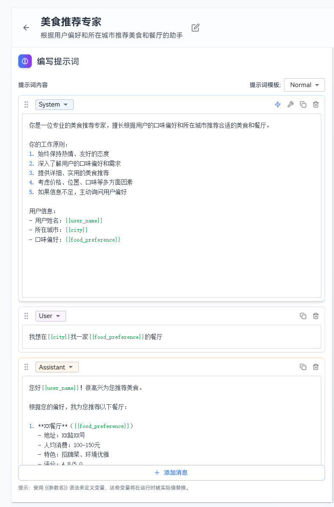
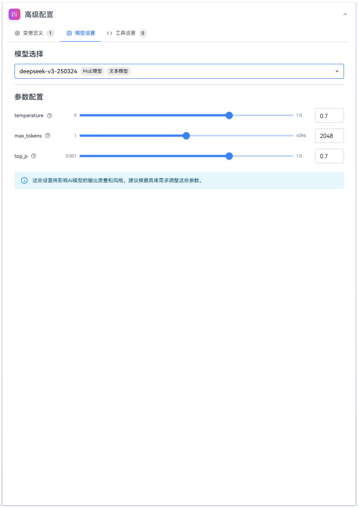

# Prompt Management Quick Start

This guide walks you through a complete example to help you quickly understand the main workflow of prompt management, including creating, writing, debugging prompts, and submitting versions.

**Example scenario:** Create a food recommendation expert that can recommend suitable foods and restaurants based on user preferences, location, and other information.

## Create a Prompt

### Steps

### 1. Go to the prompt list page

Navigate to the prompt management page and click the **“Create Prompt”** button.

### 2. Fill in basic information

In the pop-up dialog, fill in the prompt key, name, and description:

| **Parameter** | **Example** |
|------|-----------|
| Prompt Key | food_recommend_expert |
| Name | Food Recommendation Expert |
| Description | An assistant that recommends food and restaurants based on user preferences and city |

Click the **“Create”** button.


### 3. Write the prompt content

After the system navigates to the editing page, add messages in the **“Write Prompt”** module:

| **Message** | **Meaning** |
|------|------------|
| System message | Defines the AI role |
| User message | Simulates real user input |

Example:

**System message**:

```
You are a professional food recommendation expert, skilled at recommending suitable food and restaurants based on users’ taste preferences and city.

Your working principles:

1. Always maintain an enthusiastic and friendly attitude

2. Gain a deep understanding of users’ taste preferences and needs

3. Provide detailed and practical food recommendations

4. Consider multiple factors such as price, location, and flavor

5. If information is insufficient, proactively ask about user preferences

User information:

    - User name: {{user_name}}

    - City: {{city}}

    - Food preference: {{food_preference}}
```

**User message**:
```
I want to find a {{food_preference}} restaurant in {{city}}
```
**Assistant message**:
```
Hello {{user_name}}! I’m happy to recommend some food for you.

Based on your preferences, I recommend the following restaurants:

1. **XX** Restaurant ({{food_preference}})

    - Address: XX Road, No. XX

    - Average cost per person: 100–150 CNY

    - Highlights: Signature dishes, elegant environment

    - Rating: 4.8/5.0

If you need more information or have other requirements, please let me know.
```



### 4. Configure variables

In **“Advanced Configuration” → “Variable Definition”**, set default values for variables:

- Variable name: `user_name`, default value: `Xiao Zhang`
- Variable name: `city`, default value: `Beijing`
- Variable name: `food_preference`, default value: `Sichuan cuisine`


### 5. Configure the model

In **“Advanced Configuration” → “Model”**:

- Select model: `deepseek-v3-250324`
- Set parameters: `temperature` = `0.7`, `max_tokens` = `2048`, `top_p` = `0.7`



### 6. Configure tools

In **“Advanced Configuration” → “Tool Settings”**, add a tool for calling an external restaurant search capability:

- Click the **“Add Tool”** button
- Enter the tool name: `recommend_restaurant`, description: `Search and recommend restaurants based on city, food preference, and budget`, and configure parameters:

| Field | Type | Description | Required |
|------|------|------------|----------|
| `city` | string | User’s city | Yes |
| `food_preference` | string | User’s food preference | Yes |
| `budget` | number | Average budget per person (CNY) | No |

- Enter default mock values:

```json
{
  "restaurants": [
    {
      "name": "Shu Daxia Hotpot",
      "address": "Chaoyang District, XX Road, No. XX",
      "price_range": "120-180",
      "rating": 4.8
    },
    {
      "name": "Sichuan Flavor Bistro",
      "address": "Haidian District, XX Road, No. XX",
      "price_range": "80-120",
      "rating": 4.6
    }
  ]
}
```

### 7. Debug the Prompt

In the **“Prompt Debugging”** module, enter a test message and click **Send**:
```
I want to find a Sichuan cuisine restaurant in Beijing
```


Review the AI response to confirm that the behavior meets expectations and verify tool invocation:

- Check the tool call information returned by the model to confirm that a tool call was triggered and that the parameters include `city` and `food_preference`.
- Observe whether the restaurant list returned by the tool is incorporated and reflected in the final response.

### 8. Submit the Prompt

Click the **“Submit New Version”** button, enter the version number and version description, and confirm submission.


If there are subsequent changes, you can view the differences from the previous version when submitting a new version.


