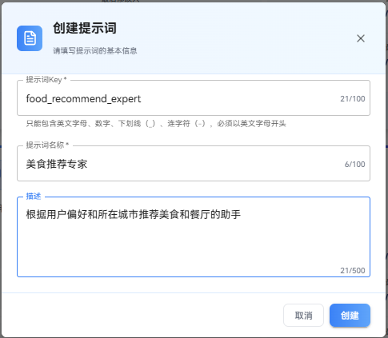
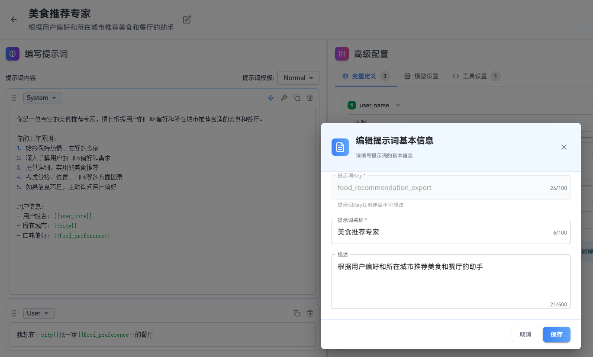
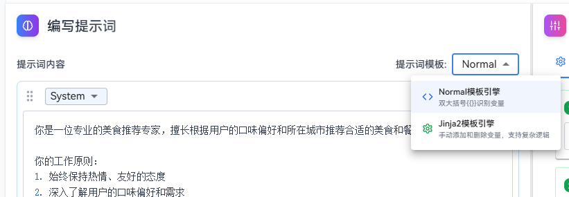
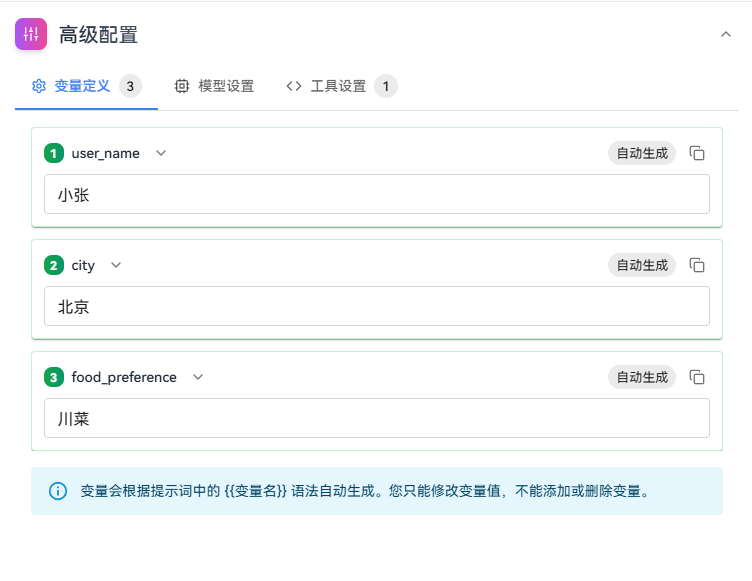
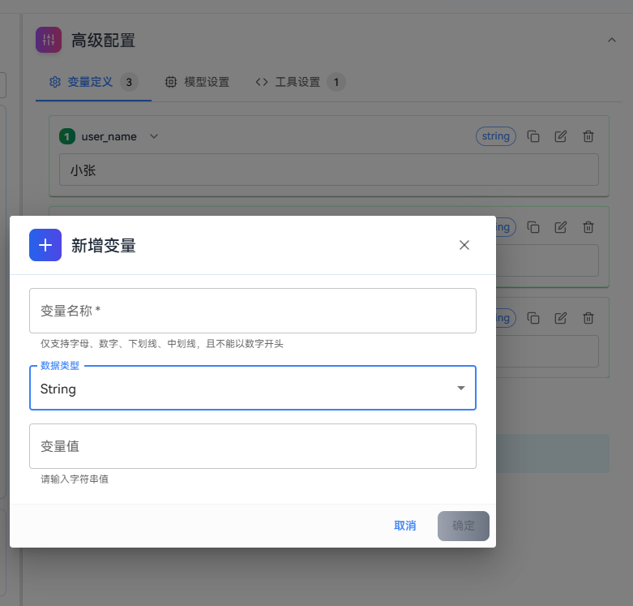
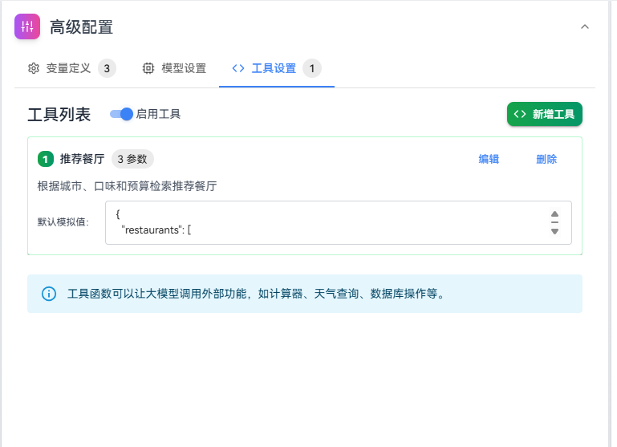
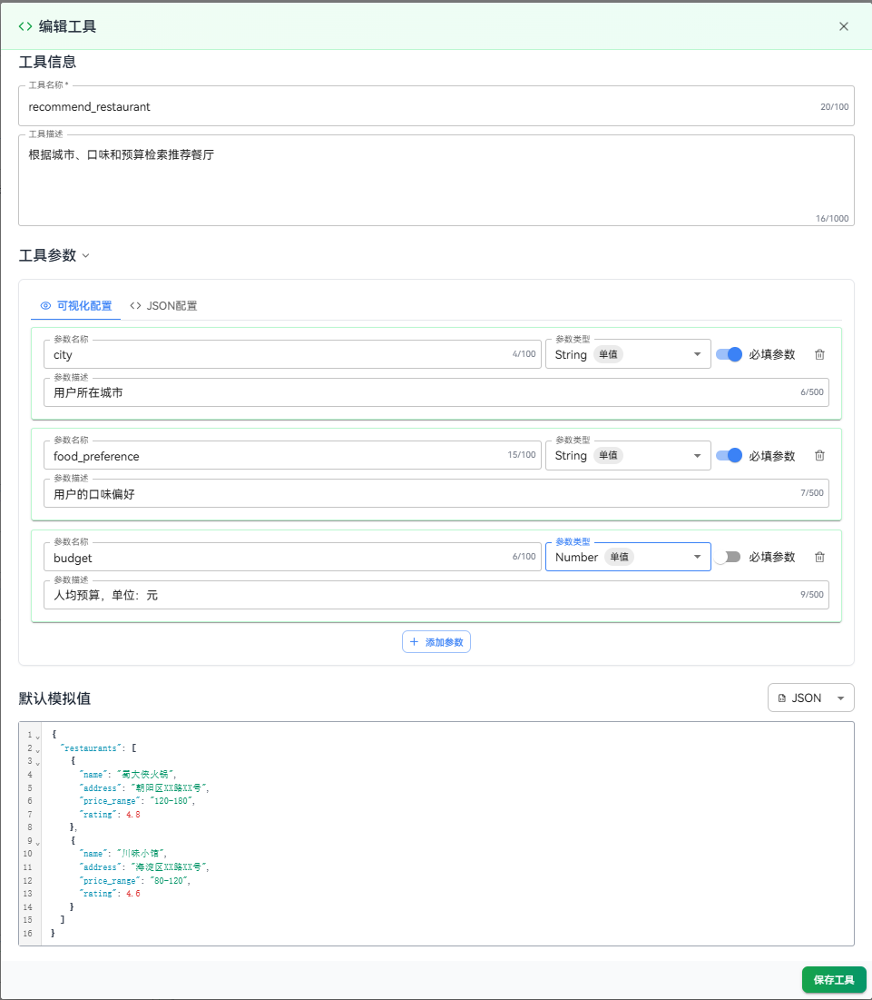

# Writing Prompts

This guide provides detailed instructions on how to write and configure prompts in the system, including the complete workflow of prompt creation, basic information editing, message template construction, template engine and variable usage, model parameter settings, and tool configuration, helping you create high-quality prompts.

## Creating Prompts

### Procedure
1. **Click the Create button**: Select "Create Prompt" in the upper right corner of the page.
2. **Fill in basic information**: Fill in the Prompt Key (the Prompt Key must be unique; duplicates will cause creation to fail), Prompt Name, and Description fields as required.



3. **Confirm creation**: After clicking "Create", the system will create a new prompt and jump to the editing page.


## Editing Prompt Basic Information

### Procedure
1. Click the edit basic information button at the top of the page to open the basic information dialog.
2. Fill in the following fields:

| **Field** | **Requirements**      |
|----|-------------|
| Prompt Name | Required, 1-100 characters      |
| Description | Optional, 0-500 characters      |

3. Click "Save" to complete the update of the prompt's basic information.



## Writing Prompt Templates

Prompt templates support four message types for building context to support complex business requirements. These message types are designed based on modern large language model dialogue architecture, which can effectively guide model behavior and improve output quality.

### Procedure

1. In the "Write Prompt" module, click the "Add Message" button at the bottom of the message list.
2. Select the message type to add (System / User / Assistant / Placeholder).
3. Edit the message content by directly entering or pasting existing text.
4. Messages can be reordered by dragging to adjust contextual relationships.
5. Click the button in the upper right corner of any message to copy or delete that message.


#### System Messages

- **Core Function**: Define the model's role, tone, style, and rules that must be followed, serving as the model's "ID card" and "code of conduct", taking effect throughout the entire conversation. Suitable for defining the model's identity background (customer service, consultant, expert, etc.), constraining core responsibilities and work principles, specifying language style and values, declaring behaviors that must be followed or prohibited, and setting output formats and security boundaries.
- **Best Practices**:
  - Clearly define role identity (such as "professional doctor", "technical expert", "creative writer").
  - Clarify task objectives (explain what you want the model to accomplish and expected results).
  - Structured expression (organize content using headings, lists, step-by-step methods, etc.).
  - Provide context (supplement background information, historical records, or existing data to help the model understand the scenario).
  - Provide examples (give sample responses or format examples for the model to reference).
  - Use dynamic templates (combine variables or Jinja2 templates to generate personalized content based on different inputs).
  - Set response style (formal/informal, concise/detailed, technical/popular).
  - Specify output format requirements (JSON, Markdown, specific structure).
  - Set behavioral boundaries and restrictions (types of information that cannot be provided, rules that must be followed).
- **Practical Application Example**:
```
You are a senior product manager with over 10 years of internet product planning experience, skilled at breaking down business objectives and delivering high-quality product solutions.

Core Responsibilities:
- Align business objectives with user value, clarify root causes of problems and success metrics
- Propose executable product strategies and interaction solutions based on data and research insights
- Coordinate roles such as design, development, and operations to advance solution implementation

Working Principles:
1. Express professionally and calmly, maintain logical rigor and clear conclusions
2. Present conclusions first, then explain key reasoning processes in no more than 3 steps
3. If information is insufficient, first list required supplementary data or methods to verify assumptions
4. Prioritize citing verified industry best practices or cases

Output Requirements:
- Use Markdown uniformly, structure: Title → Key Information Points → Recommendations/Action List → Risks and Alternative Plans
- Action items must include responsible party/collaborator, timeline, expected output
- If external dependencies or risks exist, explicitly mark them and provide mitigation measures
```

#### User Messages

- **Core Function**: Simulate real user input, provide task context and trigger conditions for the model. Typically uses the placeholder `{{query}}` to bind specific content, enabling dynamic replacement at runtime. Suitable for constructing common inquiries, task descriptions, questions, etc.
- **Practical Application Example**:
  
| User Prompt Example            | User Input   | Replaced Prompt                 |
| ----------------- | ------ | -------------------- | 
| I am a product manager and currently facing the following problem:<br> {{query}}<br><br>Please provide me with specific solutions and implementation steps based on product design best practices.           | I am designing a mobile app user registration process. Please help me design a registration flow with good user experience. | I am a product manager and currently facing the following problem:<br>I am designing a mobile app user registration process. Please help me design a registration flow with good user experience. <br>Please provide me with specific solutions and implementation steps based on product design best practices.       |
  
  **Note**: Through the `{{query}}` placeholder, the system dynamically inserts the user's specific question into the prompt template at runtime, maintaining contextual consistency while achieving content flexibility. This approach is particularly suitable for scenarios that need to handle diverse user requests.

#### Assistant Messages

- **Core Function**: On one hand, it can further guide the model with prompt content in a specific role, style, or steps, supplementing and refining the guidance of System messages. On the other hand, it can work with User messages to form a small amount of historical dialogue records, providing context for the model. Suitable for role reinforcement, style adjustment, dialogue history, and context continuation.
- **Best Practices**:
  
  - When used as role guidance, it should be consistent with System messages and further refine behavioral norms.
  - When used as historical records, it should provide real dialogue context to help the model understand the current dialogue state.
  - Content should be concise and clear, avoiding conflicts with System messages.
- **Practical Application Example**:
  
| Example Name | Message List | Final AI Response |
|------------|-----------|-------------|
| Role Reinforcement Assistant Message | **System Message**:<br>You are a professional psychological counselor with extensive clinical experience.<br><br>**Assistant Message**:<br>When answering, please follow these principles:<br>1. Always maintain a professional, gentle, non-judgmental attitude<br>2. Use open-ended questions to guide users in deep thinking<br>3. Provide specific and actionable suggestions and coping strategies<br>4. Pay attention to protecting user privacy and creating a safe conversation environment<br>5. Suggest seeking professional medical help when necessary<br><br>**User Message**:<br>I've been under a lot of work pressure lately and often have insomnia. I don't know what to do. | I understand your current troubles. Insomnia caused by work pressure is a very common problem. Let's analyze and solve it step by step:<br>## Pressure Source Analysis<br>First, can you specifically tell me what work factors are causing you stress? For example:<br>- Excessive workload?<br>- Tense interpersonal relationships?<br>- Worries about work results?<br>## Insomnia Improvement Suggestions<br>**Immediately Actionable Methods**:<br>1. **Pre-sleep Relaxation**: Try deep breathing or meditation to help your brain switch from work mode to rest mode<br>2. **Regular Schedule**: Even if you have insomnia, maintain fixed bedtime and wake-up times<br>3. **Avoid Electronic Devices 1 Hour Before Bed**: Blue light affects melatonin secretion|
| Historical Record Assistant Message | **System Message**:<br>You are a food recommendation expert, skilled at recommending local specialty foods based on users' taste preferences.<br><br>**User Message**:<br>Last time I went to Chengdu, I particularly liked the Mapo tofu and Dan Dan noodles there. The spicy taste left a deep impression on me.<br><br>**Assistant Message**:<br>Chengdu's Mapo tofu and Dan Dan noodles are indeed classic representatives of Sichuan cuisine! It seems you have a special fondness for spicy flavors. This spicy and fresh taste experience is indeed unforgettable.<br><br>**User Message**:<br>I'm going to Hunan on a business trip next month. I heard Hunan cuisine is also very distinctive. Do you have any good food recommendations? | Excellent! Based on your love for Chengdu's Mapo tofu and Dan Dan noodles, Hunan cuisine is definitely for you! Hunan cuisine is also known for its spicy flavor,<br>but has a unique "sour and spicy" taste. I recommend the following must-try dishes:<br>## Hunan Classic Food Recommendations<br>### Main Dishes (Similar to Your Favorite Sichuan Cuisine)<br>**Must-Try Recommendations**:<br>- **Chopped Pepper Fish Head**: Signature Hunan dish, sour and spicy appetizing, tender fish with fragrant chopped pepper<br>- **Spicy Chicken**: Similar to your favorite spicy taste, but Hunan-style preparation emphasizes the aroma of dried chili peppers<br>- **Flavored Shrimp**: Changsha specialty, spicy and fresh, bouncy shrimp meat with rich broth<br>- **Stir-fried Pork with Chili**: Seemingly simple but extremely skillful, perfect fusion of chili aroma and meat freshness<br>### Special Snacks (Rich Taste Layers)<br><br>I believe Hunan cuisine's sour and spicy flavor will give you a completely new experience different from Sichuan cuisine's spicy taste! Do you need me to recommend specific restaurant addresses? |

**Note**: Assistant messages help the model better understand the background and expectations of the current conversation through role reinforcement or historical records, thereby providing more accurate and coherent responses.

#### **Placeholder Messages**

- **Core Function**: Reserve positions for dynamic content, with real context injected by the system at runtime, supporting context-aware dialogue systems. Suitable for long conversation scenarios, preserving multi-turn interaction history, and enhancing context memory.
- **Practical Application Example**:

| Message List | Variable Values | Complete Replaced Prompt | Final AI Response |
|------------|--------|--------------------------|-------------|
| **System Message**:<br>You are a professional travel advisor, skilled at providing personalized travel recommendations based on users' historical<br>preferences and conversation records.<br><br>**Placeholder Message**:<br>conversation_history<br><br>**User Message**:<br> {{query}} |**Placeholder Variable Value**:<br>User: Last time I went to Xi'an, I particularly liked the historical and cultural atmosphere there.<br>Assistant: Xi'an is indeed an important birthplace of Chinese civilization. What aspects impressed you most?<br>User: The magnificence of the Terracotta Warriors and the solemnity of the ancient city wall left a deep impression on me. For my next trip, I hope to have a similar historical and cultural experience.<br>Assistant: I understand, you prefer cultural attractions with deep historical heritage rather than modern commercial scenic areas.<br><br>**User Message Variable Value**:<br>query:"I plan to travel to Beijing next month and hope to experience historical culture. Do you have any recommendations?"|System: You are a professional travel advisor, skilled at providing personalized travel recommendations based on users' historical preferences and conversation records.<br>User: Last time I went to Xi'an, I particularly liked the historical and cultural atmosphere there.<br>Assistant: Xi'an is indeed an important birthplace of Chinese civilization. What aspects impressed you most?<br>User: The magnificence of the Terracotta Warriors and the solemnity of the ancient city wall left a deep impression on me. For my next trip, I hope to have a similar historical and cultural experience.<br>Assistant: I understand, you prefer cultural attractions with deep historical heritage rather than modern commercial scenic areas.<br>User: I plan to travel to Beijing next month and hope to experience historical culture. Do you have any recommendations?|  Based on your love for Xi'an's historical culture, especially your deep impression of the Terracotta Warriors and ancient city wall,<br>I recommend the following Beijing historical and cultural in-depth experience route:<br>## Recommended Destination: Beijing<br>### Ancient Capital Culture Exploration<br>**Core Recommendation Reason**: Just as Xi'an's Terracotta Warriors showcase Qin Dynasty military culture, Beijing's ancient architectural complexes showcase Ming and Qing Dynasty cultural essence.<br>**Must-Visit Attractions**:<br>- **Tiananmen Square**: Feel the solemnity and weight of national history<br>- **Badaling Great Wall**: Experience the historical heroism of "He who has not climbed the Great Wall is not a true man" <br>- **Ming Tombs**: Ming Dynasty emperor mausoleum complex, experience imperial mausoleum culture<br>## Cultural Connection Points<br>This itinerary particularly matches your interests:<br>- **Historical Impact**: From Xi'an Terracotta Warriors' military array impact to the Forbidden City's imperial grandeur, experience the historical weight of different dynasties<br>- **Ancient Architecture Art**: From Xi'an city wall's defensive function to Beijing ancient architecture's ritual culture, experience the evolution of Chinese ancient architecture|

**Note**: Through Placeholder variables, the system can dynamically inject users' historical conversation records and preference settings, enabling AI to provide highly personalized and coherent responses rather than generic standard replies. This approach is particularly suitable for long-term conversation scenarios requiring context memory.

### Template Engine and Variable Usage

Depending on the complexity of the prompt, the system supports two template engine modes. Variables have different functions and usage methods in different modes:

- **Normal Mode**: Default mode, uses `{{variable_name}}` for simple variable replacement, suitable for 80% of regular scenarios, low learning cost, fast performance. Variables wrapped in `{{}}` that comply with variable naming conventions in the prompt will automatically generate variables in the variable definition area.
- **Jinja2 Mode**: Professional template engine, uses `{{variable_name}}` syntax, supports advanced features such as conditional judgments (``), loop iteration (``), filters, etc., suitable for complex business logic. Variables must be manually added in the variable definition area first before they can be referenced with `{{}}`.

**Mode Selection Recommendations**

| Comparison Item   | Normal Mode   | Jinja2 Mode          |
| -------- | ------------- | -------------------- |
| Learning Cost | Low, simple and easy to use  | Medium, requires learning syntax   |
| Functionality | Basic variable replacement  | Supports logical judgment and loops   |
| Application Scenarios | Simple prompts    | Complex business logic         |
| Performance     | Fast          | Slightly slower (requires template parsing) |
| Maintainability   | Easy to maintain      | Requires attention to syntax norms     |
| Recommended Use | 80% of regular scenarios | 20% of complex scenarios        |



#### **Normal Mode**

**Usage Steps**:

1. Use `{{variable_name}}` to insert placeholders in prompt messages.
2. Corresponding variables will be automatically added in "Advanced Configuration > Variable Definition".
3. Fill in the default values for variables.
4. Verify whether variables are correctly populated in the debug module.



**Variable Syntax**:
Use double curly braces `{{variable_name}}` for simple variable replacement

**Example**:

| Prompt Template | Variable Configuration | Replaced Prompt |
|------------|------------------|------------------|
| Hello, {{user_name}}! Today is {{current_date}}.<br><br>Your membership level is: {{member_level}}<br>Account balance: {{balance}} yuan | user_name: "Zhang San"<br>current_date: "November 9, 2024"<br>member_level: "Gold Member"<br>balance: 1580 | Hello, Zhang San! Today is November 9, 2024.<br><br>Your membership level is: Gold Member<br>Account balance: 1580 yuan |

#### **Jinja2 Mode**

**Usage Steps**:

1. Switch to Jinja2 mode in the "Write Prompt" module.
2. Write prompt templates using Jinja2 syntax.
3. Click the "Add Variable" button in "Advanced Configuration > Variable Definition", and fill in variable information in the pop-up dialog:
   - **Variable Name**: Must comply with naming conventions (letters, numbers, underscores, hyphens, cannot start with a number).
   - **Data Type**: Select String, Integer, Float, Boolean, or Object.
   - **Default Value**: Fill in the variable's default value.
4. After saving the variable, reference it in the prompt using `{{variable_name}}`.
5. Test the template rendering results in the debug module to verify whether variables are correctly populated.
6. Variable Management: In the variable list, you can view, copy, edit, or delete variables (confirm that the prompt does not reference the variable before deleting).



**Variable Syntax**:

- Variable output: `{{ variable_name }}`
- Conditional judgment: ` ... `
- Loop iteration: ` ... `
- Filters: `{{ variable|filter_name }}`
- Access object properties: `{{ object.property }}` or `{{ object["property"] }}`, access list elements using `{{ list[index] }}`
- Comments: `{# This is a comment #}`

**Examples**:

| Type | Prompt Template | Variable Configuration | Replaced Prompt |
|------|--------------|------------|------------------|
| **Conditional Judgment** | <br>Excellent<br>  <br>Pass<br> <br> Fail<br>  | score: 85 | Pass |
| **Loop Iteration** | <br>{{ loop.index }}. {{ item.name }} - {{ item.price }} yuan<br> | items: [<br> {"name": "Apple", "price": 3.5},<br> {"name": "Orange", "price": 4.2}, <br>{"name": "Banana", "price": 2.8} <br>] | 1. Apple - 3.5 yuan <br>2. Orange - 4.2 yuan <br>3. Banana - 2.8 yuan |
| **Filters** | {{ text\|upper }}           {# Convert to uppercase #}<br> {{ text\|lower }}           {# Convert to lowercase #} <br>{{ list\|length }}          {# Get length #} <br>{{ value\|default("default value") }}  {# Set default value #}<br> {{ number\|round(2) }}      {# Round #} | text: "Hello World" <br>list: ["a", "b", "c"] <br>value: "" <br>number: 3.14159| HELLO <br>WORLD <br>hello world <br>3 <br>default value <br>3.14 |
| **Access Object Properties** | {{ user.name }} <br>{{ user['email'] }} <br>{{ products[0].price }} | user: {"name": "User", "email": "user@example.com"} <br>products: [<br> {"name": "Smart Speaker", "price": 299}, <br> {"name": "Bluetooth Earphones", "price": 199} ]| User <br>user@example.com <br>299 |
| **Comprehensive Example** | Hello, {{ user_name }}!<br><br>  <br>Welcome distinguished VIP user! You enjoy the following privileges:<br>  <br>- {{ privilege }} <br> <br> <br>You are currently a regular user. Upgrade to VIP to enjoy more privileges.<br>  <br><br> <br>Your account balance is sufficient: {{ balance }} yuan <br> <br>Your account balance: {{ balance }} yuan, please top up in time <br><br> Your account balance is insufficient, please top up as soon as possible<br>  <br><br>Historical order quantity: {{ orders\|length }} <br>Last purchase date: {{ last_purchase_date\|default("No purchase records") }} | user_name: "Li Si" <br>is_vip: true <br>vip_privileges: ["Dedicated customer service", "Priority shipping", "Double points", "Birthday gift"] <br>balance: 2580 <br>orders: ["Order 1", "Order 2", "Order 3", "Order 4", "Order 5"] <br>last_purchase_date: "November 5, 2024" | Hello, Li Si!<br><br> Welcome distinguished VIP user! You enjoy the following privileges: <br>- Dedicated customer service <br>- Priority shipping<br> - Double points <br>- Birthday gift <br><br>Your account balance is sufficient: 2580 yuan <br><br>Historical order quantity: 5 <br>Last purchase date: November 5, 2024 |

#### Template Engine Usage Tips

**Mode Switching Precautions**:

- Switching from Jinja2 to Normal: All logic statements (if/for, etc.) will be treated as plain text
- Recommended to back up current prompt content before switching
- After switching, be sure to retest in the debug module
- Search globally before deleting variables to avoid prompt reference failures

**Variable Naming Conventions**:

- **Naming Rules**: Variable names only support letters, numbers, underscores (\_), hyphens (-), and cannot start with a number
- **Use Meaningful Names**: `user_name` is better than `un`, `order_total_price` is better than `price`
- **Maintain Consistency**: Use underscore naming uniformly (such as `user_name`) or hyphen naming (such as `user-name`)
- **Case Sensitive**: `UserName` and `username` are different variables
- **Valid Examples**: `user_name`, `order-id`, `totalPrice`, `item_count_2024`
- **Invalid Examples**: `用户名` (contains Chinese), `user name` (contains space), `user.name` (contains period), `2024_year` (starts with number)

**Variable Type Selection**:

- **String**: Text content, such as name, address, description information
- **Integer**: Integer numeric values, such as quantity, age, order count
- **Float**: Decimal numeric values, such as price, rating, percentage
- **Boolean**: Conditional judgment, such as whether VIP, whether enabled, whether completed
- **Object**: Configure structured data using JSON format, can represent objects (such as `{"name": "Zhang San", "age": 25}`) or arrays (such as `["Apple", "Banana", "Orange"]`)

## Model Settings

Model settings determine the AI model and related parameters used when the prompt runs, directly affecting output quality and effectiveness.

### Select Model

In the model selection dropdown box on the "Advanced Configuration > Model Settings" tab, select a specific model. Different models have different characteristics and applicable scenarios. You can choose the appropriate model based on model descriptions and tags.

### Configure Parameters

Common model configuration parameters are as follows. Different models can configure different parameters. Please refer to what can be configured on the page:

- **Temperature**: Controls the randomness and creativity of model output
  
  - Range: 0.0 - 1.0
    - Low value (0.0-0.3): Output is more deterministic, conservative, and predictable, suitable for scenarios requiring precise answers (such as mathematical calculations, fact queries)
    - Medium value (0.5-0.8): Balances creativity and accuracy, suitable for most conversation scenarios
    - High value (0.9-1.0): Output is more diverse, creative, and random, suitable for creative writing, brainstorming, and other scenarios
  - Suggestion: When used with Top P, usually only adjust one of the parameters
- **Max Tokens**: Limits the maximum number of tokens the model can output in a single generation. Controls the length of generated text, preventing output that is too long or consumes too many resources.
  
  - Suggestion: Set according to actual needs, avoid setting too small to prevent output truncation
- **Top P** (Nucleus Sampling): Also known as Nucleus Sampling, selects the minimum word set with a cumulative probability reaching p for sampling. Dynamically adjusts the number of candidate words, balancing output diversity and quality.
  
  - Range: 0.0 - 1.0
    - Low value (0.0-0.3): Only considers words with the highest probability, output is more focused and deterministic
    - High value (0.8-1.0): Considers more candidate words, output is more diverse
  - Suggestion: Usually set to 0.9-0.95, when used with Temperature, it is recommended to only adjust one of them


## Tool Configuration

Tool configuration allows the model to call external tools at runtime, achieving more powerful feature extensions.

>Note: The prompt module currently only implements simulated tool calls and does not support actual tool invocation yet.


### Procedure

1. On the "Advanced Configuration > Tool Settings" tab, turn on the "Enable Tools" switch and click the "Add Tool" button.



2. Fill in tool information in the pop-up dialog:

- **Tool Name**: The unique identifier of the tool.
- **Tool Description**: Clearly explain the tool's functionality and purpose, helping the model understand when to call the tool.
- **Parameter Configuration**: Define the tool's input parameters, configure parameter name, parameter type, whether required, and parameter description.
- **Default Mock Value**: Configure default mock return values (text or JSON format) for the tool, used to simulate tool call return results in debug mode for testing tool call effectiveness.

### Parameter Configuration Methods

The system provides two parameter configuration methods.

**1. Visual Configuration**

Configure tool information item by item through interface forms, suitable for beginners and quick configuration scenarios. Each tool parameter needs to be configured with the following information:

- **Parameter Name**: The identifier of the parameter, must be unique.
- **Parameter Type**: Supports String, Integer, Number, Boolean, Array, and other types.
- **Is Required**: Mark whether the parameter is required.
- **Parameter Description**: Explain the purpose and format requirements of the parameter.

**2. JSON Format Configuration**

Directly edit the complete JSON Schema format:

- Supports complex parameter constraints and nested structures.
- Suitable for experienced users and complex tool definitions.
- Provides syntax highlighting and format validation.

In JSON format configuration mode, you need to write a complete JSON Schema, supporting richer validation rules:

| Type Keyword | Description | Data Examples |
|-----------|------|--------|
| string | String type. Can be used with keywords like minLength, maxLength for further constraints. | `"Hello, world"`, `"open"`, `"Username"` |
| number | Numeric type, including integers and floating-point numbers. Can use minimum/maximum (define numeric range) and other keywords for constraints. | `25.5`, `3.14`, `100` |
| integer | Integer type. Constraint keywords are similar to number type. | `1`, `42`, `-10` |
| boolean | Boolean type, values are true or false. | `true`, `false` |
| array | Array type. Must use items keyword to define the structure of elements in the array, can use minItems/maxItems to constrain length. | `["apple", "banana"]`, `[1, 2, 3]` |
| object | Object type. Must use properties keyword to define its properties, use required array to list required properties. Can optionally use additionalProperties to control whether the object allows additional properties not defined in properties | `{"name": "Zhang San", "age": 25}` |

For complete JSON Schema format instructions, see: https://json-schema.org/understanding-json-schema/reference/type.

> Note:
> 1. In JSON Schema definitions, you can allow parameters to conform to one of multiple types by setting the type value as a type array (such as ["string", "integer"]). This system does not support type arrays.
> 2. This system also does not support the null type.

**3. Configuration Switching**

- You can freely switch between visual configuration and JSON configuration.
- The system will automatically perform format conversion when switching.
- It is recommended to use visual configuration for quick setup first, then use JSON configuration for fine-tuning.

> Note: Since visual configuration only supports simple configuration methods, if you configure a complex JSON format (such as nested format) in JSON configuration mode, switching to visual configuration can only parse the parts that visual configuration supports. If you edit the visual configuration and then switch back to JSON configuration, the parts not supported by visual configuration will be lost.


### Complete Example: Restaurant Recommendation Tool

1. **Tool Name**: `recommend_restaurant`
2. **Tool Description**: `Retrieve and recommend restaurants based on city, taste preferences, and budget`
3. **Input Parameter Configuration**:
- **Visual Configuration**

| Field              | Type     | Description                 | Is Required |
| ----------------- |--------| -------------------- | -------- |
| `city`            | string | User's city         | Yes       |
| `food_preference` | string | User's taste preference       | Yes       |
| `budget`          | number | Per capita budget (unit: yuan) | No       |

- **JSON Configuration**
```json
{
  "type": "object",
  "properties": {
    "location": {
      "type": "object",
      "properties": {
        "city": {
          "type": "string",
          "description": "City name, such as: Beijing, Shanghai"
        },
        "district": {
          "type": "string", 
          "description": "Administrative district or business district, such as: Chaoyang District, Lujiazui"
        },
        "address_keyword": {
          "type": "string",
          "description": "Address keyword, such as: near subway station, mall name"
        }
      },
      "required": ["city"],
      "additionalProperties": false
    },
    "cuisine": {
      "type": "array",
      "items": {
        "type": "string",
        "enum": ["Chinese", "Western", "Hot Pot", "BBQ", "Cantonese", "Sichuan", "Hunan"]
      },
      "description": "Preferred cuisines, multiple selections allowed"
    },
    "budget_per_person": {
      "type": "integer",
      "minimum": 0,
      "maximum": 2000,
      "description": "Per capita budget (yuan)"
    },
    "occasion": {
      "type": "string",
      "enum": ["Daily dining", "Friends gathering", "Business banquet",  "Family gathering", "Birthday celebration", "Company team building"],
      "description": "Dining occasion"
    },
    "min_rating": {
      "type": "number",
      "minimum": 3.0,
      "maximum": 5.0,
      "description": "Minimum rating requirement"
    },
    "preferred_payment": {
      "type": ["string"],
      "enum": ["alipay", "wechat_pay", "credit_card", "cash"],
      "description": "Preferred payment method"
    }
  },
  "required": ["location", "budget_per_person"],
  "additionalProperties": false
}
```

4. **Default Mock Value**:
```json
{
  "restaurants": [
    {
      "name": "Shu Daxia Hot Pot",
      "address": "XX Road, Chaoyang District, No. XX",
      "price_range": "120-180",
      "rating": 4.8
    },
    {
      "name": "Sichuan Flavor Restaurant",
      "address": "XX Road, Haidian District, No. XX",
      "price_range": "80-120",
      "rating": 4.6
    }
  ]
}
```

