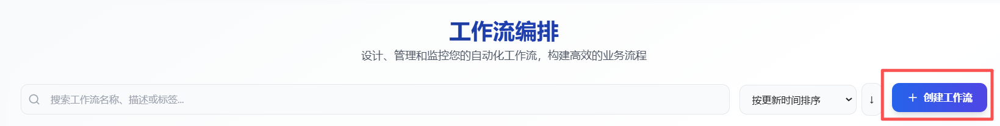
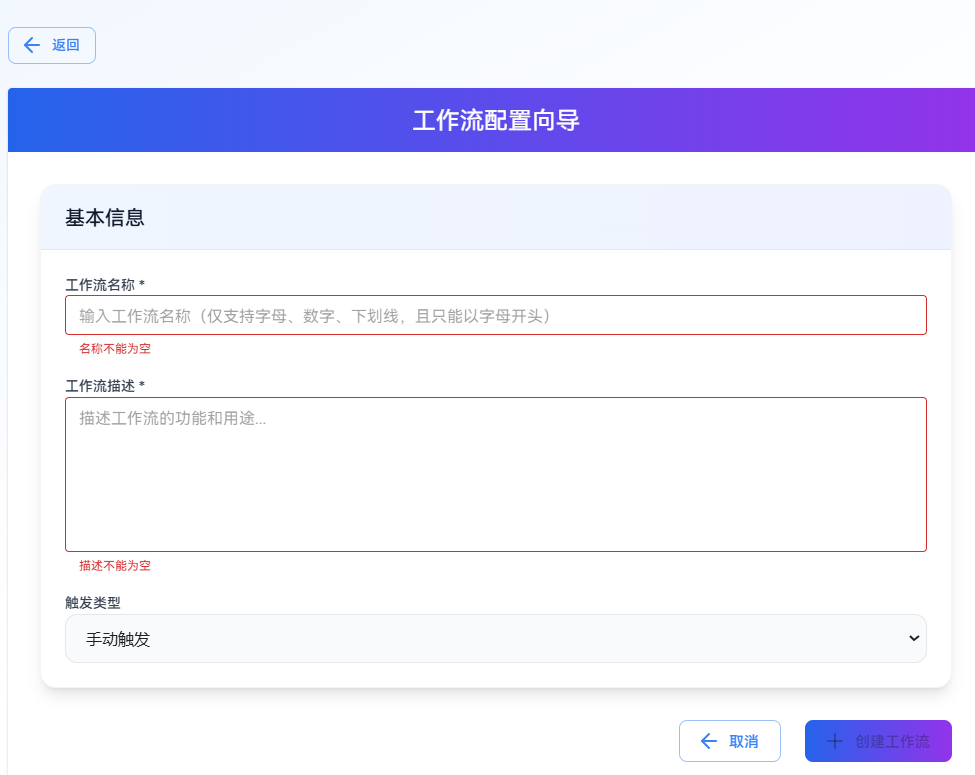
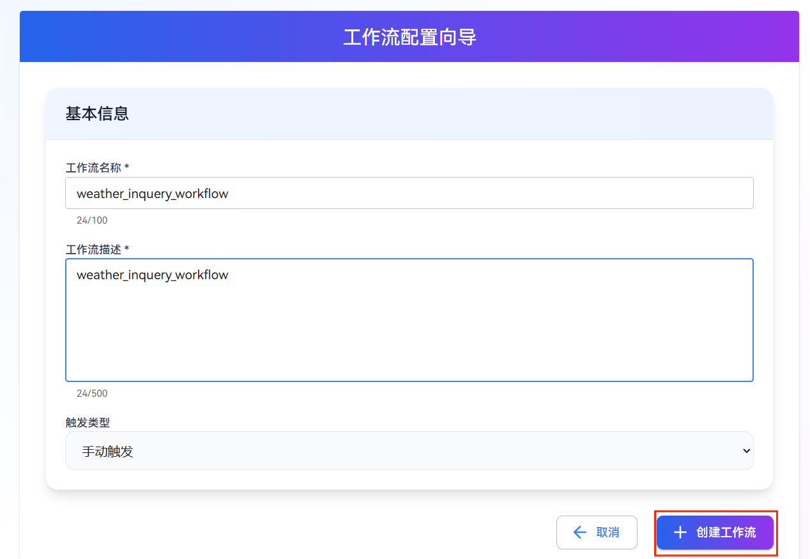
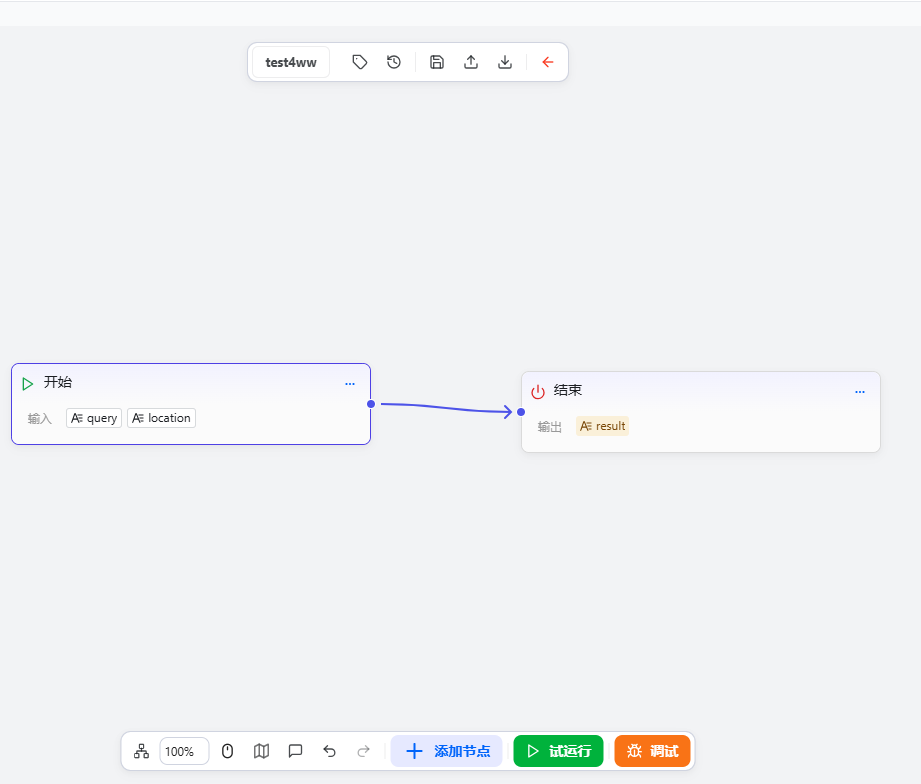
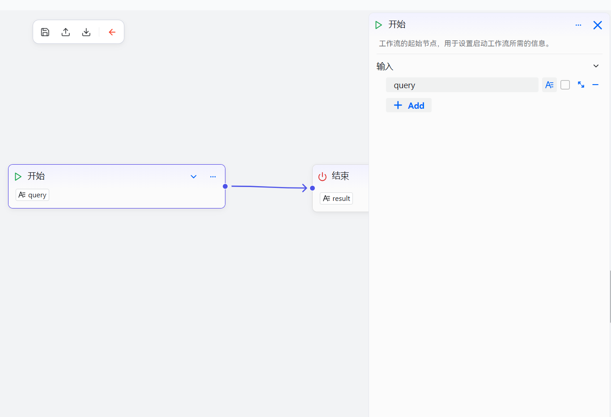
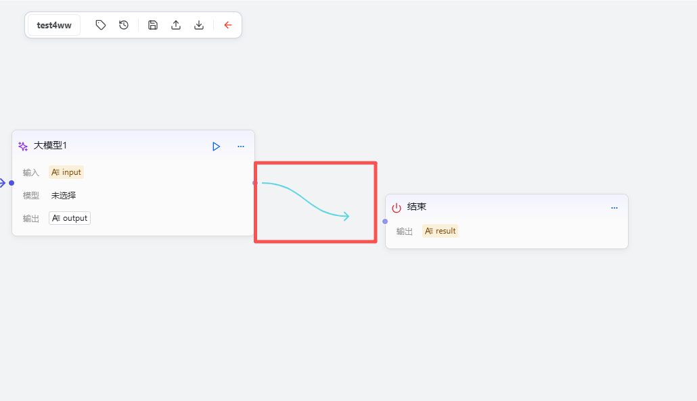
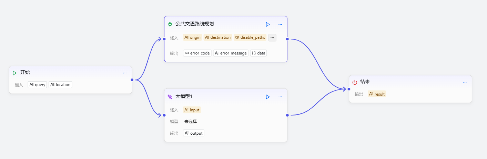
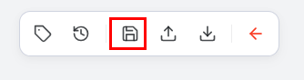
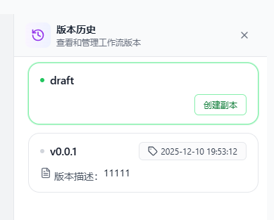
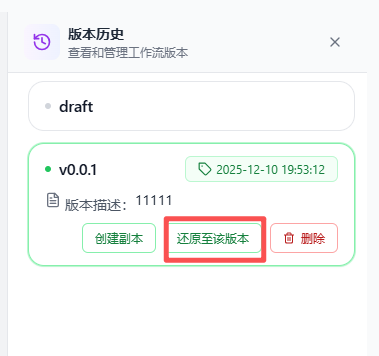

# Build a Workflow

This chapter explains in detail how to create, configure, and connect workflow components in the workflow editor, helping users quickly build workflows that are well-structured and logically correct. The openJiuwen workflow provides a feature-rich visual designer that supports intuitive drag-and-drop operations and intelligent connection configuration: users can easily drag components onto the canvas for free layout, and the system automatically validates connections to ensure logical correctness. It also supports real-time execution preview, custom component positioning, canvas zooming and panning, as well as undo/redo for flexible edits, and copy-paste to efficiently reuse existing components and workflow structures.

## Create a New Workflow

### Steps

1. Go to the openJiuwen homepage.
2. Open Workflow Orchestration from the left navigation.

3. Click Create.
On the Workflow Orchestration page, you will see a list of workflows. Click the Create Workflow button in the upper-right corner to start creating a new workflow.

4. Enter basic information.
Provide the following basic information for your workflow:

   | Parameter | Description |
   | --- | ---|
   | Workflow Name | A descriptive name. Only letters, numbers, and underscores are supported and it must start with a letter. |
   | Workflow Description | A brief description explaining the workflow’s main function and use case. |

   

5. Confirm creation.

   After completing the information, click Create Workflow. The system will automatically generate a unique workflow ID and navigate to the workflow editor, where you can start building the logic.

   

## Orchestrating the Workflow

### Steps

   1. Click a workflow to enter the workflow editor.

      

   2. Add components: Drag the required components from the component library onto the canvas. Each component represents a specific functional node, such as workflow, input/output, or business logic.

      

   3. Configure components: After adding a component, click it to open its configuration panel on the right. In the panel, you can set the component’s parameters, input/output formats, execution logic, and more. Adjust these according to the component type and your actual needs. For details, see [Configuration Components](./Configuration%20Components/README.md).

      

   4. Connect components: To define executable logic, connect components by clicking an output port of one component and dragging to the input port of another. These connections determine execution order and data flow paths.

      

   5. Adjust layout: To improve readability and maintainability, drag components to reposition them on the canvas. It’s recommended to arrange components in logical order for clarity.

      

   6. Save the workflow: After adding, configuring, and connecting components, click Save in the top toolbar to store the current configuration. You can return to the editor at any time to modify or optimize it.

      

## Test Run

### Steps

1. Click Trial Run to manually trigger the workflow execution.

   

2. Observe the results to verify whether the logic is correct.

   

## Save a Version

### Steps

1. Click Submit New Version to save a version.

   

## View and Roll Back Versions

### Steps

1. Click Version History to view all versions.

   

   

2. Click any saved version to manage it, including creating a copy, restoring to that version, or deleting it. Click Restore to This Version to roll back the canvas to the selected version.

   