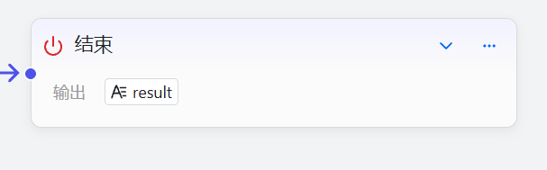
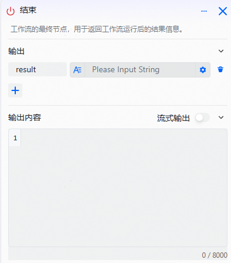

# End Component

The End node outputs the workflow result. It is the final (required) node of a workflow and marks its termination. After the workflow finishes running, it returns the specified output directly.

# Configure the Component

## Steps

1. Go to the openJiuwen platform homepage.
2. Open the Workflow Orchestration module in the left navigation.
3. Click the End component on the canvas to open its editing interface.

4. Add or delete input parameters: click `+` to add a parameter, click  to delete a parameter.

Parameter descriptions for the End component:

| Parameter | Description |
| --- | --- |
| Left input box | Key of the output parameter |
| Right input box | Data type: supports configuring various parameter types such as `String`, `Number`, and `Object`. The variable value can be a fixed value or reference the output of upstream components. |