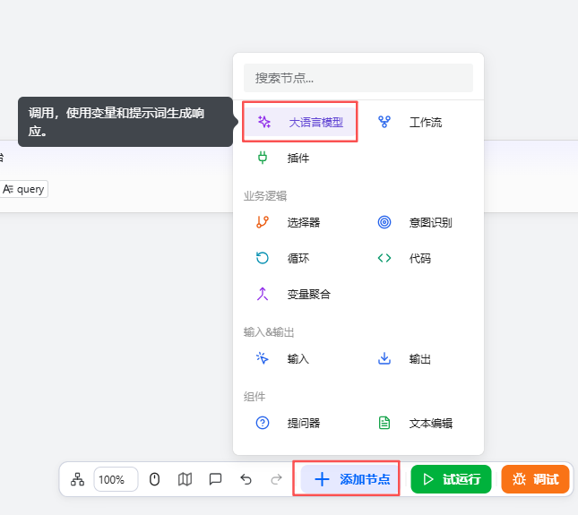

# Configuring the Large Model Component

The Large Model component is a core functional module provided by openJiuwen for integrating large language models (LLMs). Through user inputs and customized prompts, it flexibly generates high-quality natural language responses that meet specific role, tone, or format requirements. It is suitable for various text-processing scenarios such as creative writing and information extraction, and it supports fine-tuning of generation parameters to optimize output. The configuration process is as follows:

# Configure the Component

## Prerequisites

* A model has already been added in Model Management.

## Steps

1. Go to the openJiuwen platform homepage.
2. Navigate to the Workflow Orchestration module in the left sidebar.
3. Click the Add Component button at the bottom of the page and select Large Language Model.

4. Click the Large Model component that appears on the canvas to start configuring it.

The parameters to configure are as follows:

| Parameter | Description |
|------|------|
| Inputs | A collection of variables used to inject dynamic content into prompts. Each input parameter requires a name and a corresponding value. The value can be a fixed value or a reference to the output of upstream components. Both the system prompt and the user prompt can use these parameters via variable reference syntax, enabling dynamic content adjustments. |
| Model Selection | Specifies the large language model used to execute the task. The model’s capabilities directly affect output quality. Choose the most suitable model based on the application scenario (e.g., text generation, summarization, reasoning, etc.). |
| System Prompt | Defines the model’s role, behavioral guidelines, and response style in the conversation. Supports dynamically inserting input parameter content via variable reference syntax to enhance flexibility and contextual adaptability. |
| User Prompt | Represents the specific instruction or question sent by the user to the model in the current turn. This field supports referencing variables from the input parameters, allowing the prompt content to change dynamically based on runtime data, improving relevance and accuracy. |
| Outputs | Set the names and descriptions of output parameters. Clear parameter names and descriptions help the model return matching content accurately. When multiple output parameters are present, use meaningful names and add detailed descriptions. |