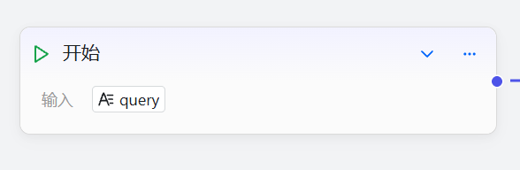
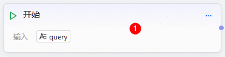
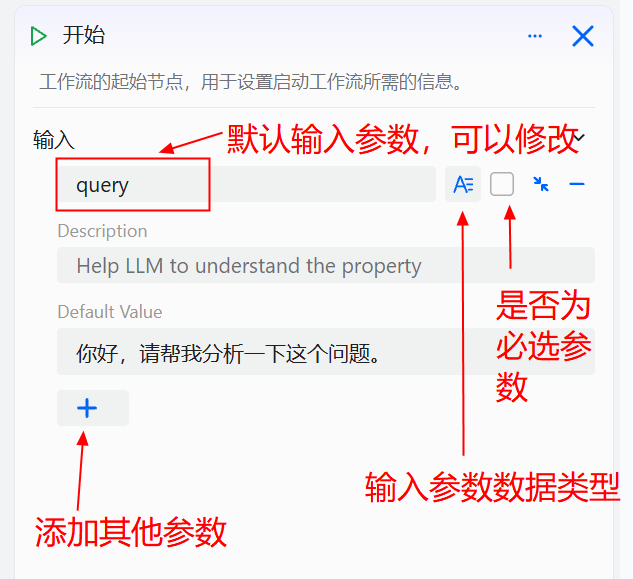

# Start Component

The Start component is the first node (required) in every workflow and serves as the starting point.
It is the entry point of the workflow, dedicated to configuring launch parameters. The Start component comes with a built-in `query` parameter representing user input and supports adding or modifying other parameters as needed.

# Configure the Component

## Steps

1. Go to the openJiuwen platform homepage.
2. Open the Workflow Orchestration module from the left navigation bar.
3. Click the Start component on the canvas to open the component editing interface.

4. Add or remove input parameters: click `+` to add a parameter, click `-` to delete a parameter.

Parameter description for the Start component:

| Parameter | Description |
| --- | --- |
| Left input field | Key of the output parameter |
| Right input field | Data type: supports configuring various types of input parameters such as `String`, `Number`, and `Object`. |
| Whether the parameter is required | Set whether the parameter is required. |
| Parameter description | Description of the parameter to help the model understand the meaning of the input. |
| Default value | Default input value for the parameter; can be modified. |