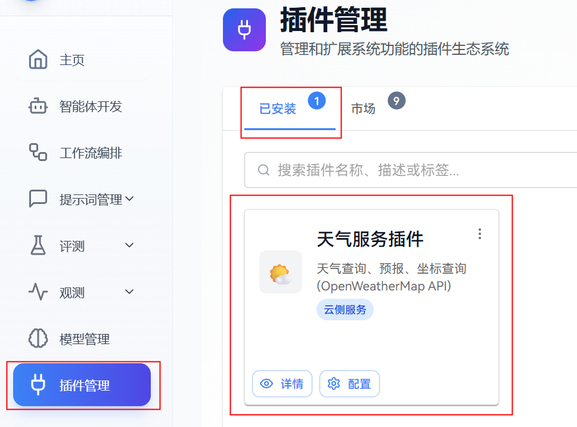
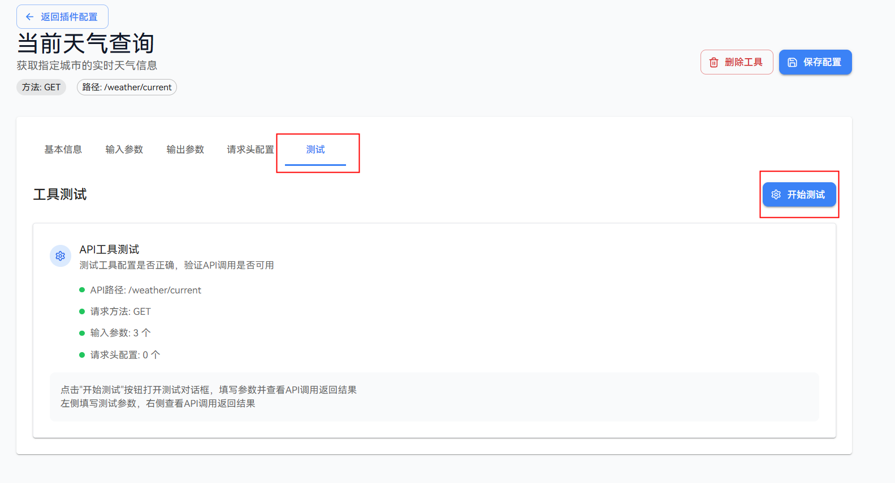
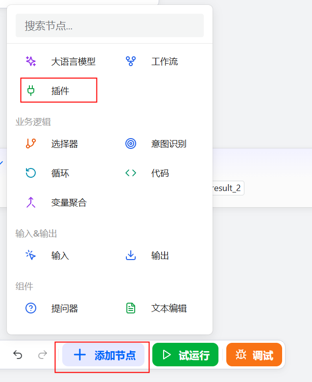
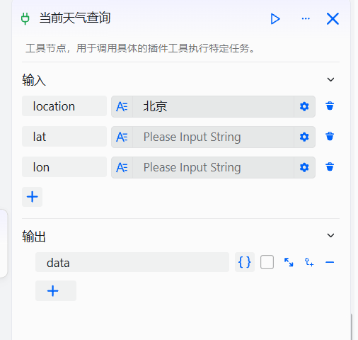
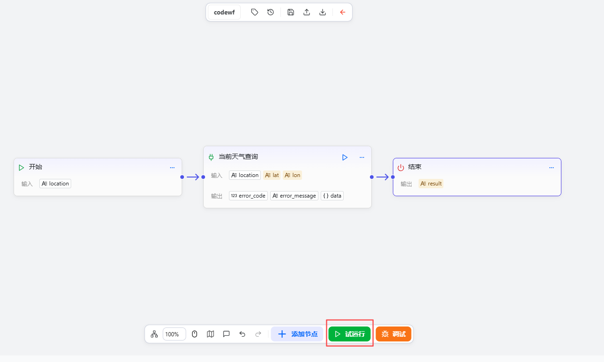
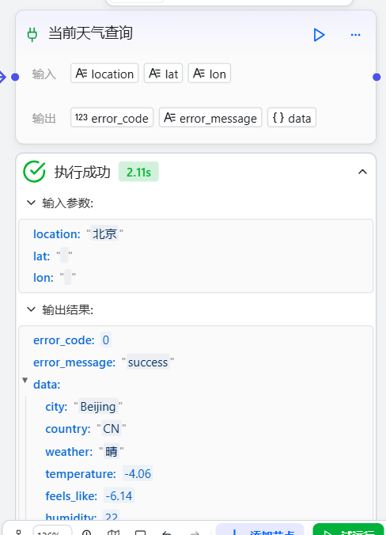

# Plugin Component

Workflow components are functional modules provided by openJiuwen that allow you to invoke external tools within a workflow, embedding packaged APIs as nodes in the process. These plugins can come from the platform marketplace or be user-defined, effectively extending an agent’s capabilities so it can perform richer tasks. The configuration process is as follows:

# Configure Component

## Prerequisites

- Available plugin tools have been prepared in Plugin Management. To add a plugin to a workflow, you need to complete its configuration in the Plugin Management interface, including inputs, outputs, versions, tools, and more. For detailed instructions, see the [Configure Plugin](../../../Configure%20Tool.md) section.

- The plugin has been verified to run independently. To avoid workflow interruptions caused by plugin exceptions, we recommend first testing the tool independently in the tool configuration interface. After confirming it runs correctly, add it to the workflow.

## Steps

1. Go to the openJiuwen platform homepage.
2. In the left navigation, open the Workflow Orchestration module.
3. Click the Add Component button at the bottom of the page, then click Plugin.

4. Choose a plugin in the pop-up dialog. From the plugin list, you can add any tool as a workflow node. Select a tool and click Confirm Selection to integrate it into the workflow canvas.

5. Specify data sources for required input parameters. A plugin node’s input and output structure is determined by the plugin tool’s defined I/O schema and does not support custom settings. You must specify data sources for required input parameters.

The current plugin output format is fixed: `error_code`, `error_message`, and `data`. The `data` (`Object`) contains the specific results returned by the plugin.

6. Execute the workflow. Click Trial Run at the bottom of the page to run the workflow with the component.

You can view the plugin’s execution results on the canvas.

