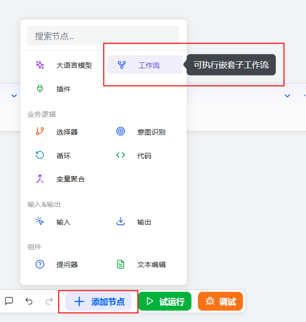
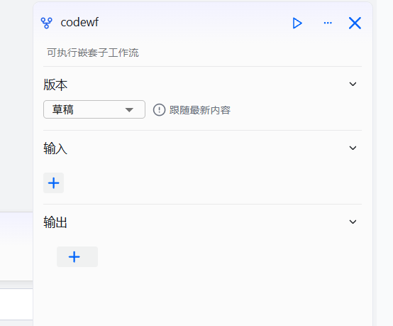

# Workflow Component

The Workflow component is a feature provided by openJiuwen that allows users to embed existing workflows as reusable submodules into other workflows. By nesting workflows, you can encapsulate standardized processes and flexibly assemble them, enabling efficient orchestration and automated execution of complex tasks.

# Configuring the Component

## Prerequisites

1. Ensure the target workflow has been created.
2. Follow the “test first, then integrate” principle: before adding it, run the sub-workflow independently and confirm it works correctly.

## Steps

1. Go to the openJiuwen platform homepage.
2. Open the Workflow Orchestration module from the left navigation bar.
3. Click the Add Component button at the bottom of the page, then click Workflow.

4. In the pop-up window, select an existing workflow.

5. After inserting the workflow, configure the following: set input parameters that have the same names as the start node of the sub-workflow; the outputs are the output parameters of the sub-workflow.

| Parameter | Description |
| --- | --- |
| Input | Input parameters of the sub-workflow, with the same names as the sub-workflow’s start node. Values can be fixed or reference outputs from upstream components. |
| Output | The sub-workflow’s input parameters, identical to the output of the sub-workflow’s end node |

6. Run the workflow. Click Test Run at the bottom of the page to run the workflow that includes the sub-workflow.

You can see the execution results of the sub-workflow on the canvas.

