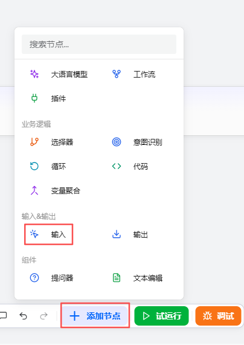
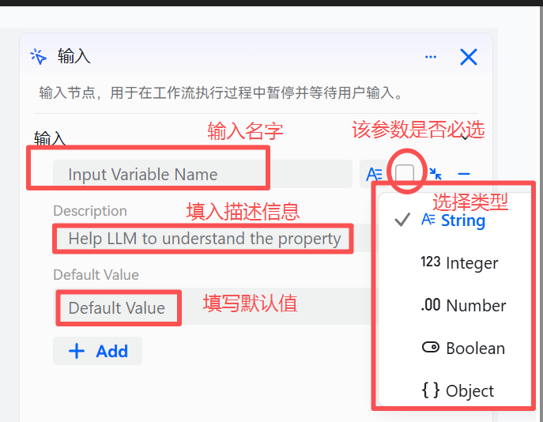
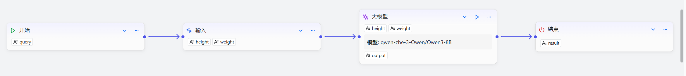

# Input Component

The Input component is used to dynamically obtain specific information required from the user during workflow execution. When the workflow reaches this component, it automatically pauses and waits for the user to submit the necessary input before continuing with subsequent steps, ensuring that complex tasks dependent on user data are completed smoothly and accurately.

# Configuring the Component

## Steps

1. Go to the openJiuwen platform homepage.
2. Open the Workflow Orchestration module in the left navigation.
3. Click the Add Component button at the bottom of the page and select Input.

4. Complete the configuration in the pop-up dialog.

The Input component supports one or more input parameters. Configure each parameter according to the following rules to ensure the workflow correctly collects data and runs:

| Field | Description |
|------|------|
| Input Variable Name | Required. Defines the unique identifier of the input parameter. This name will be referenced in later prompts or components using variable syntax (e.g., `{{parameter_name}}`). |
| Parameter Type (type) | Optional; defaults to `String`. Supports the following five data types: • String: text • Integer: integer • Number: floating-point or numeric • Boolean: true/false • Object: JSON object for structured input |
| Description (description) | Optional. Provide details about the parameter to clarify its purpose and expected content. Improves workflow readability and maintainability. |
| Default Value (default value) | Optional. Sets the value to use when no specific value is provided. If no default is set and the parameter is required, the user must provide a valid value at runtime. |
| Required | A checkbox that specifies whether the parameter is required. • If selected, a valid value must be provided when the workflow reaches this component; otherwise, execution will halt. • If not selected, the parameter is optional and the workflow will continue even if it is left blank. |

## Example

Use the Input component to collect height and weight, then call the model component to compute the corresponding BMI.

The key components of this workflow are as follows:

| Component Type | Configuration | Example |
| :------: | :------ | :------: |
| Input Component | Add two required parameters: ● height (the person's height) ● weight (the person's weight) |  |
| Large Model Component | Configure the following: ● Input: add the two inputs, height and weight ● System prompt: the agent persona; design as needed ● User prompt: the question for the model; reference the two input parameters ● Output: keep the default settings |  |