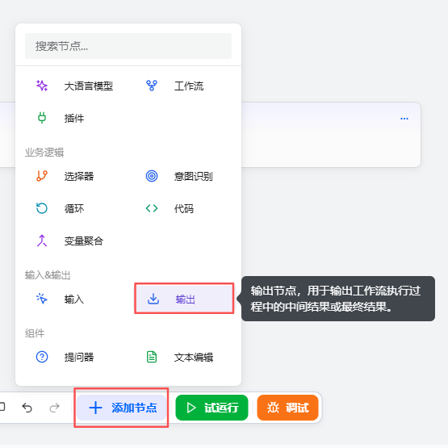
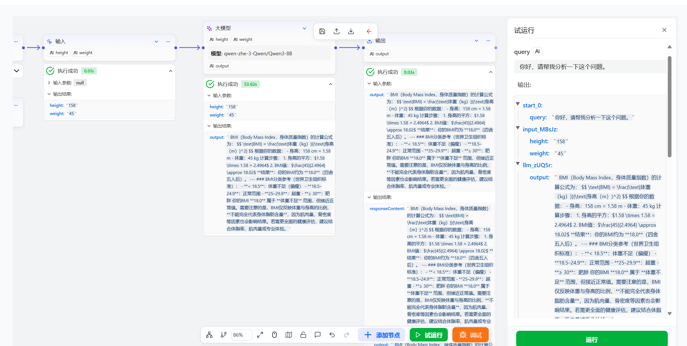

# Output Component

The Output component is used to convey information to users during workflow execution. It mainly supports two output scenarios: first, outputting interim messages, such as status prompts like “in progress” or reassurance, to help users understand the current progress and reduce anxiety or drop-off due to waiting; second, streaming the final result, which is suitable for long texts or scenarios requiring immediate feedback. By returning content in segments, it creates a real-time interaction experience and enhances the overall conversation.

# Configuring the Component

## Steps

1. Go to the openJiuwen platform homepage.
2. In the left navigation panel, open the Workflow Orchestration module.
3. Click the Add Component button at the bottom of the page and select Output.

4. Complete the configuration in the pop-up dialog.

The Output component supports configuring one or more output parameters. Each parameter requires the following two settings:

| Field | Description |
|------|------|
| Parameter Name (Input Key) | Required. Used to identify the purpose or key name of the output data. This name will be used as the variable name when subsequent components reference this output. It is recommended to use clear, semantic naming for ease of understanding and maintenance. |
| Stream Output | Optional. Controls the output mode via a toggle. • If enabled (checked), the output will be returned in a streaming manner, i.e., content is transmitted progressively. Suitable for real-time response or long text scenarios. • If disabled (unchecked), the model returns the complete result at once after generation finishes, suitable for scenarios that are not sensitive to latency and require the full content. |

## Example

If the workflow’s output is long, you can add an Output component to stream the output via an output parameter.

For example, use a Large Model component to compute the BMI based on height and weight:

Key components of this workflow:

| Component Type | Configuration | Example |
| :---: | :--- | :---: |
| Large Model Component | Set the following parameters: ● Input: add two input parameters, height and weight ● System prompt: the agent’s persona; design as needed ● User prompt: the question for the model to answer; reference the two input parameters here ● Output: keep the default values |  |
| Output Component | Set the following parameters: ● Input: add the parameter output, referencing the Large Model component’s output ● Output content: this component’s input {{output}} |  |