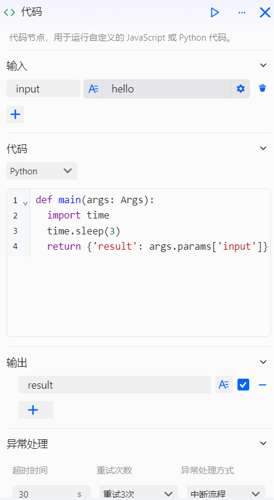
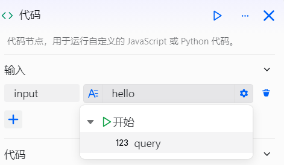
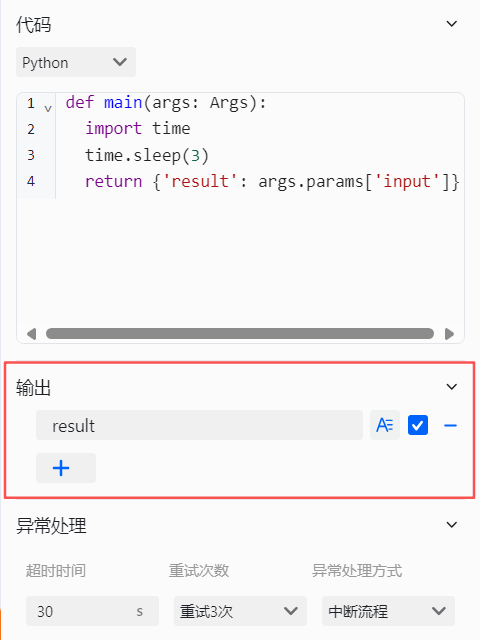
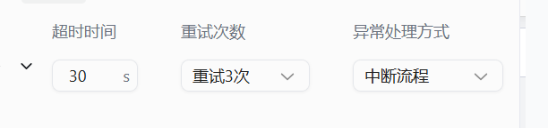
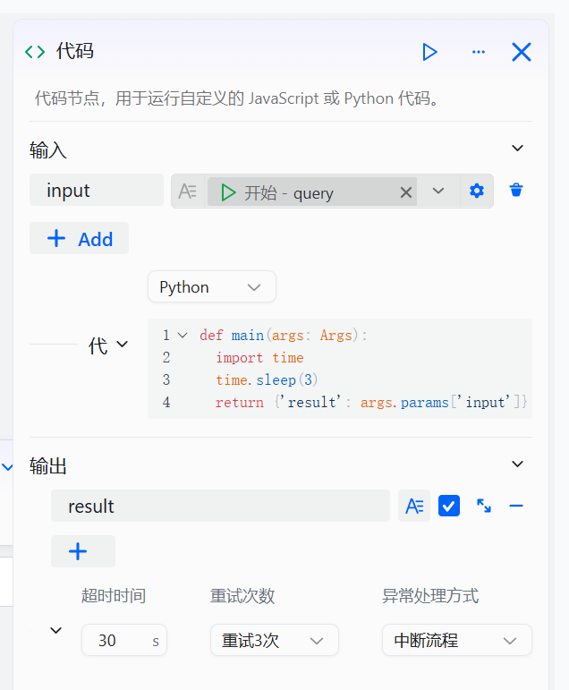
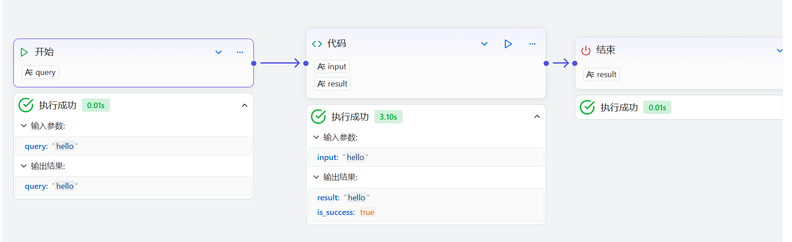

# Configure the Code Component

The code component is a custom data processing component in workflow design, tailored for workflow developers. It is used when personalized processing of workflow data is needed, meeting requirements such as data transformation, logical computation, and format organization. By supporting custom Python or JavaScript code, it processes input parameters passed from upstream components and returns results for downstream components, thereby flexibly extending the workflow’s data processing capabilities.

# Configure the Component

## Steps
1. Go to the openJiuwen platform homepage.
2. Go to the Workflow Orchestration module in the left navigation.
3. Click the Add Component button at the bottom of the page and select Code Component. 

4. Click the code component that appears on the canvas to start configuring it. 

5. Select input parameters and set them to parameters from upstream components. 

6. Select the code type; currently supports Python and JavaScript. 

7. Enter the code.

8. Configure the output parameters. 

9. Configure how to handle timeouts or exceptions. 

The code component configuration parameters are as follows:

| Configuration | Description |
| :------: | :------ |
| Input | When declaring variables to use in the code, add input parameters that reference output parameters from upstream components. In the code, you can access these inputs via params['input']. |
| Code | The snippet to be executed by the code component, which you can write directly. In the code, you can directly use variables from the input parameters and return a single value as the processing result. Note that you are limited to writing only one function, which must return an object whose keys are the output parameters. Currently, only JavaScript and Python are supported. |
| Output | After the code runs successfully, you can set one or more output parameters. If the exception handling method is set to Return specified content or Execute exception flow, you must also include isSuccess and errorBody in the output parameters to convey detailed information when an exception occurs. Ensure that the parameter names and types defined here match the keys returned by the code. |
| Timeout | The maximum allowed runtime of the component, from 0 to 30 seconds. |
| Retry Count | The number of retries when the component times out or throws an exception. Currently supports no retry, retry 1 time, 2 times, or 3 times. |
| Exception Handling Method | When the component times out or throws an exception, choose one of the following based on your needs: ● **Interrupt the workflow**: Stop immediately and do not execute subsequent components. ● **Return specified content**: The workflow continues, but returns custom content. It will also return two output parameters, isSuccess and errorBody, to convey details of the exception. ● **Execute exception flow**: The workflow is not interrupted and switches to the predefined exception handling flow. You need to configure specific processing steps for the newly added exception branch. Exception information will also be returned via the isSuccess and errorBody output parameters. |

## Examples
A specific example of the code component is shown below. Its function is to output the input parameters after a 3-second delay: 

An example of a workflow that includes a code component: 
