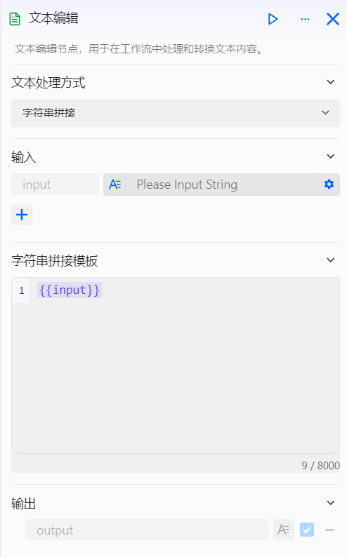
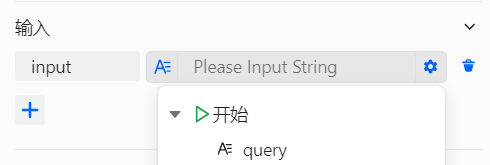
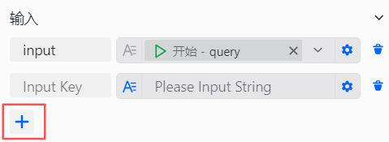
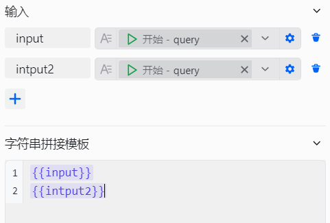
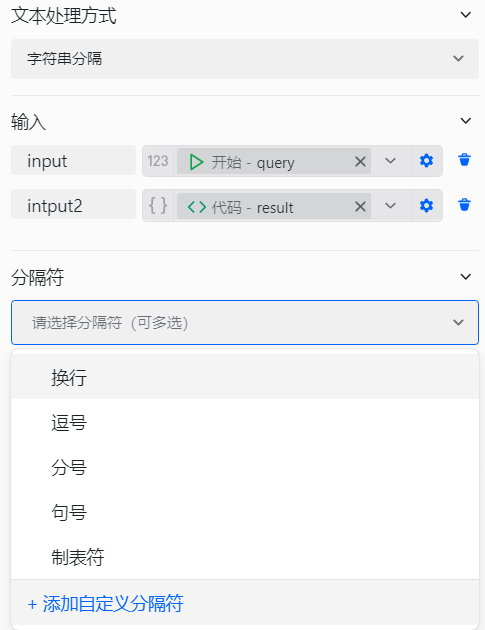
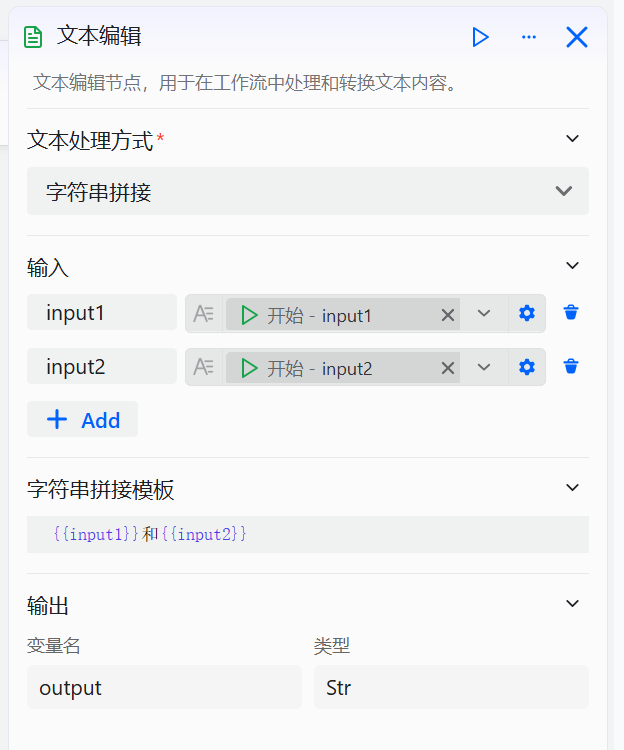
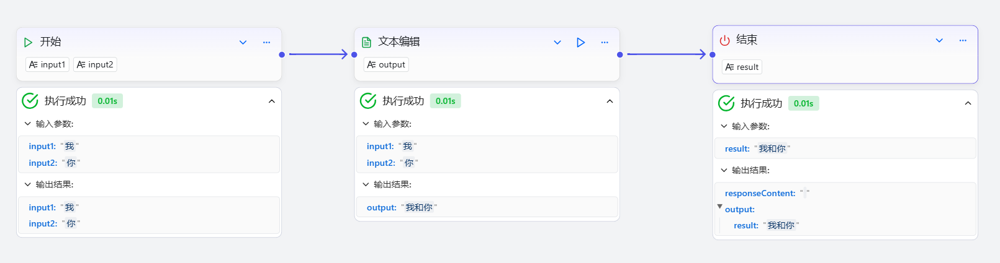
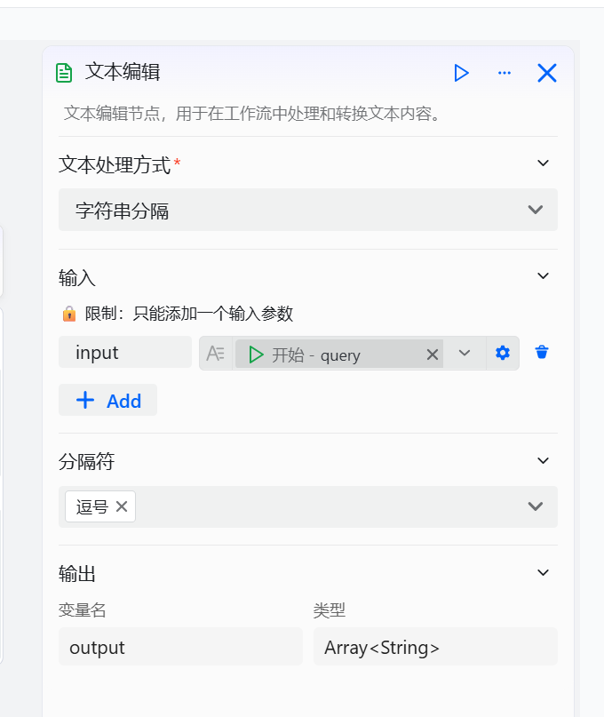

# Configure the Text Editing Component

The Text Editing component is a functional component in workflows for processing text data. It is designed for developers who need to handle text within workflows, suitable for scenarios such as secondary summarization, string concatenation, and text escaping. It solves issues like inconsistent text data formats and the need to combine or split strings within workflows.

# Configure the Component

## Steps
1. Go to the openJiuwen platform homepage.
2. Open the Workflow Orchestration module from the left navigation bar.
3. Click the Add Component button at the bottom of the page and select the Text Editing component. 

4. Click the Text Editing component that appears on the canvas to start configuring it. 

5. Choose the text processing method. Two main methods are supported: **String Concatenation** and **String Split**. 

6. Configure input parameters. 

7. Add and configure multiple input parameters. 

8. Configure input parameter names. 

9. Configure processing rules.
    1. String Concatenation — configure concatenation rules. 
    
    2. String Split — configure the delimiter. 
    

The configuration of the Text Editing component is as follows:

| Configuration | Description |
| :------: | :------ |
| Text Processing Method | The processing methods supported by the Text Editing component currently include two main options:  1. **String Concatenation**: Concatenate specified inputs in a defined order into a single string. This is useful for combining key information from upstream components to be used as inputs for downstream components.  2. **String Split**: Split the input content into an array of strings using a specified delimiter to facilitate processing by subsequent components. You need to specify the delimiter for splitting. Supported delimiters include: newline, comma, semicolon, period, and tab, and custom delimiters are also supported. |
| Input Parameters | The input parameters required for text processing; various types are supported. |
| Concatenation Template | Fill in when selecting the String Concatenation method; customize the output concatenation template. |
| Delimiter | Fill in when selecting the String Split method; specify the delimiter used to split the input, with support for custom delimiters. |

## Examples
1. String Concatenation
Example usage of String Concatenation is as follows: 
 
Execution result is as follows: 

2. String Split
Example usage of String Split is as follows, using "," as the delimiter: 
 
Execution result is as follows: 
