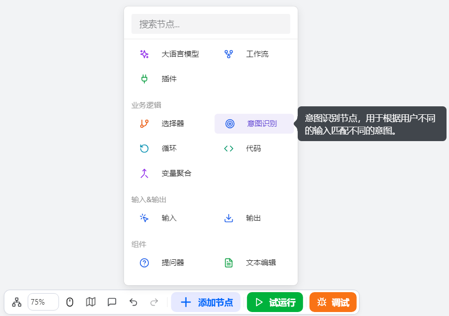
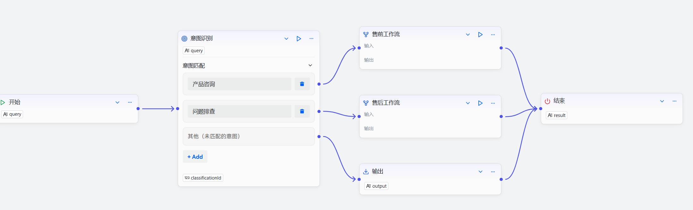

# Configure the Intent Recognition Component

The intent recognition component is a natural language understanding component in workflow design, tailored for workflow developers who need to build multi-branch conversational flows. It is suitable for scenarios such as customer service systems, medical consultation platforms, and multifunctional agents where user intents must be classified and routed to different handling flows.

When using it, you can configure input parameters, the model, system prompts, user prompts, and intent matching options to achieve accurate intent recognition and classification. For example, when a user says, "I want to see today's AI news," the intent is "view news," i.e., the specific action the user wants the agent to perform.

Supported actions:
- Automatically identify the user's true intent
- Route different intents to their corresponding workflow branches
- Support configuring a fallback strategy to handle unmatched intents

# Configure the Component
## Notes

After completing the configuration, you need to correctly connect the intent recognition component to other components to form a complete workflow.

- Each intent category needs to be connected to its corresponding handling component; otherwise, when that intent is recognized, it cannot trigger subsequent flows. For example, in a customer service agent, the product inquiry category can be connected to the product inquiry knowledge base component.
- It is strongly recommended to configure a fallback strategy for the intent recognition component, so that when the user's intent does not match any predefined category, an appropriate handling plan can be provided.

## Steps
1. Go to the openJiuwen platform homepage.
2. Open the Workflow Orchestration module in the left navigation bar.
3. Click the Add Component button at the bottom of the page and select the Intent Recognition component. 

4. Click the intent recognition component that appears on the canvas to start configuring it. 

5. Configure input parameters.
6. Configure the model.

7. Configure the system prompt. Describe the task and requirements for intent recognition, mapping user input to predefined intent categories.

8. Configure the user prompt.

9. Add intent matching options. Define the system-supported intent categories; each category corresponds to a task category in the system prompt. 

 
The configuration items of the intent recognition component are described as follows:

| Configuration item | Description |
|-----------|------------------------------------------------------------------------------------------------------------------------------------|
| Model | Select the large language model that performs intent recognition. You can adjust settings such as generation diversity and input/output parameters to better match your specific needs. |
| Input | Specify the content to be classified. The default input parameter is query. You can reference the output parameters of preceding components or directly input specified content. It is generally recommended to reference the user input from the Start component. |
| Intent matching | The user intent category options. Supports multiple categories (up to 50 intents in full mode). Intents that match a category will flow to the corresponding subsequent component; if no category is matched, the fallback strategy will be executed. |
| System prompt | An additional system prompt used to guide the model to accurately recognize and classify user intents. |
| User prompt | An additional user prompt used to further improve recognition. |
| Output | The component’s output parameters, which can be referenced by subsequent components. Fixed output parameters include: • **classificationId**: The unique identifier of the intent. It follows the order of the intent matching configuration from top to bottom; the ID of the first intent is 1. If no configured intent is matched, the ID is 0 and the “other” branch is executed. |

## Example

Using a customer service workflow as an example, the intent recognition component intelligently classifies user issues and routes them to different handling flows:

Core component design

- Intent Recognition Component: Classifies user queries into pre-sales inquiries or after-sales support. Provide typical examples for each category as a basis for recognition to improve model accuracy.
- Sub-workflows: Pre-sales and after-sales issues are routed to their respective specialized sub-workflows for processing.
- Output Component: As a fallback strategy, for intents that do not match any preset categories, output a friendly prompt guiding users to submit a ticket or contact a human agent.

