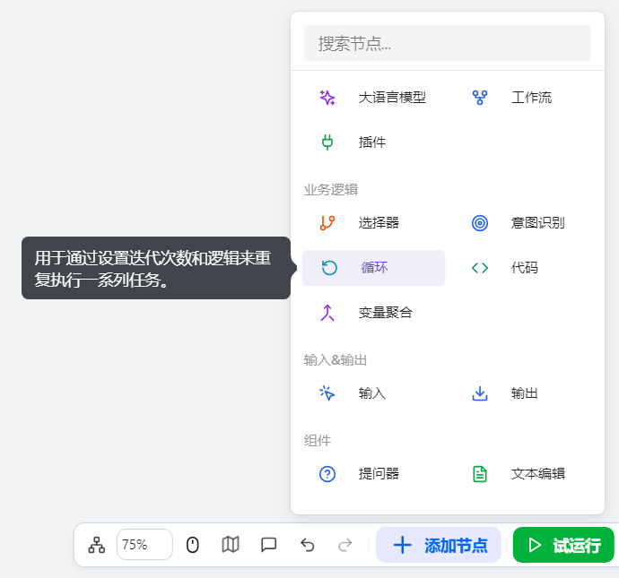
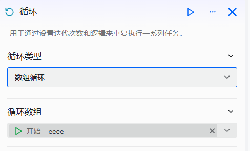
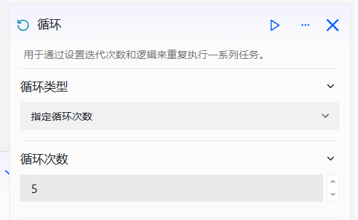

# Configure the Loop Component

The Loop Component is used to repeatedly execute a series of tasks until a specified condition is met.

# Configure the Component
## Steps
1. Go to the openJiuwen platform homepage.
2. In the left navigation panel, go to the Workflow Orchestration module.
3. Click the Add Component button at the bottom of the page and select the Loop Component. 

4. Click the Loop Component that appears on the canvas to start configuring it. 

5. Set the loop type. The Loop Component supports two loop modes: 
- **Array Loop**: Configure the loop array; this implements the `for` loop logic in programming. Think of it as an automated processing pipeline: by configuring this node, the workflow automatically iterates over a given array and repeats a predefined sequence of steps for each element, enabling efficient batch processing. 
  
- **Fixed Iterations**: Specify the number of iterations. 
  

6. Configure the intermediate variable. 
The Loop Component lets you declare an intermediate variable whose scope spans all iterations. This variable is typically used together with a “Set Variable” node inside the loop body: at the end of each iteration, assign it a new value, which takes effect in the next iteration, thereby maintaining and passing state across iterations.

7. Configure the loop body. 

8. Configure the loop output. The loop node provides two output modes to accommodate different downstream needs: 
- Aggregate results from all iterations: once the loop finishes, package outputs from all iterations into an array and pass it to downstream nodes.
- Directly select the output of a specific component inside the loop body as the final output of the loop node.

 
The Loop Component configuration items are as follows: 

| Setting | Description |
| :------: | :------ |
| Loop Type | The type of loop execution; supports Array Loop and Fixed Iterations |
| Iteration Count | When the loop type is Fixed Iterations, specify the number of iterations |
| Intermediate Variable Name | The name of the intermediate variable used to store and pass state information during the loop |
| Intermediate Variable Type | The data type of the intermediate variable; supports string, number, boolean, etc. |
| Loop Output | The output mode of the loop node; supports aggregating all iteration results or selecting an output from within the loop body |