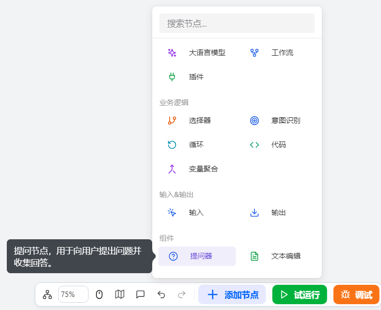
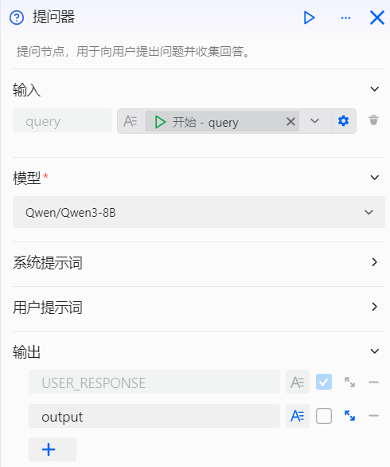
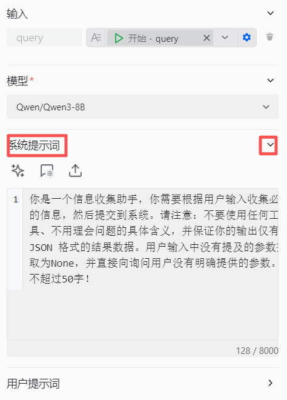

# Configure the Questioner Component

The Questioner component is an intelligent conversational interaction component for workflow design, tailored for developers who need to build smart dialog flows. It solves dependency issues on user information within workflows in scenarios where execution requires user-provided data or clarified intent. It collects information intelligently through the following:

- Active questioning: When a workflow triggers a process that includes the Questioner component, the agent proactively asks preset questions and waits for a response.
- Flexible interaction: Supports open-ended questions; users can reply in natural language, and the system extracts either the full content or key fields.
- Smart follow-up: If the user’s reply doesn’t match expectations (e.g., missing required fields or type mismatch), the system will automatically follow up until the necessary key information is obtained.

In this way, the Questioner component makes conversational interactions more natural and smooth, ensuring that when a workflow needs user input, it can collect information intelligently and efficiently. For example, in a weather inquiry scenario, the system asks for date and city, and extracts the location field from the user’s reply. If the information is incomplete, the system continues to ask questions to fill in the gaps.

# Configure the Component

## Steps
1. Go to the openJiuwen platform homepage.
2. Open the Workflow Orchestration module from the left navigation.
3. Click the Add Component button at the bottom of the page and select the Questioner component. 

4. Click the Questioner component on the canvas to start configuration. 

5. Configure input parameters. 

6. Configure the model.

7. Configure the system prompt. Describe the questions to ask or the scenario. 

8. Configure the user prompt. 

9. Configure output parameters.

The configuration items for the Questioner component are as follows:

| Setting | Description |
|-----------|----------------------------------------------------------------------------------------------------------------------------------------------------------------------------------------------------------------------------------------------------------------------------------------|
| Model | Select the model that executes this component; you can adjust parameters such as generation diversity to better fit your needs. |
| Input | Define parameters to be incorporated into the question. Parameter values can reference outputs from upstream components or be fixed text. |
| System Prompt | An additional system prompt to improve questioning effectiveness. |
| User Prompt | An additional user prompt to further guide the model’s behavior. |
| Output | In direct-response mode, the component outputs the USER_RESPONSE variable by default, representing the user’s full reply.   You can enable the field extraction feature to have the model automatically extract key information from the user’s reply and save it as variables for downstream components.   We recommend using meaningful variable names and providing detailed descriptions to help the model understand the variable definitions and extract information accurately.   Variables can be marked as required. If the user’s reply lacks required fields, the workflow will continue follow-up questions until it obtains the information or reaches the maximum number of inquiries (3 by default). The specific follow-up questions are generated dynamically by the model; you can add system prompts to define the model’s role and reply logic to make follow-ups more natural. |

## Example

Below is an example of the Questioner component. In a weather query workflow, the Questioner component is used to collect the city and time information required for querying the weather, providing necessary parameters for subsequent tool calls:

The core components of this weather query workflow include:
1. Questioner component: Intelligently collects the required weather query information and automatically extracts key fields. All information is set as required; if the user’s reply is incomplete, the system continues to follow up until complete information is obtained.
2. Plugin component: Calls the weather query tool with the city and time information output by the Questioner component to obtain specific weather data.