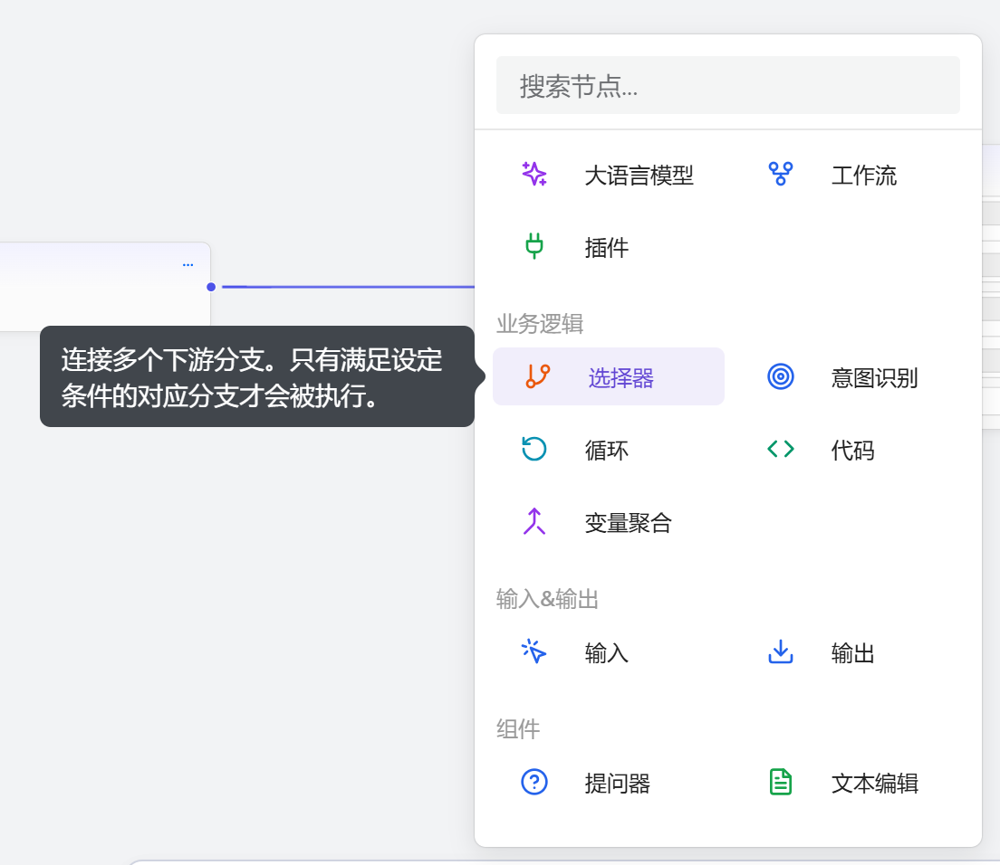
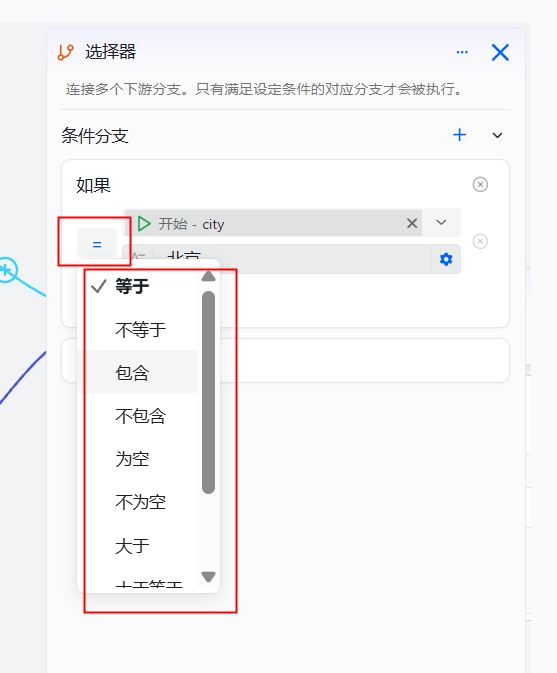
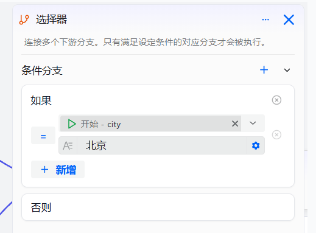

# Selector Component

The selector component is used to connect multiple downstream branches and control the workflow execution path by setting conditions. Only the branch whose conditions are met will be executed, equivalent to an if-else conditional node in software development. This component helps developers build complex branching logic and is suitable for scenarios where different processes need to run based on different conditions.

## Notes

* Condition evaluation is based on the workflow’s runtime context data; ensure the referenced variables are available.
* When multiple conditions are satisfied at the same time, only the first matching branch will be executed.
* It is recommended to configure a default branch to handle cases where none of the conditions are met.

## Steps

1. Log in to the openJiuwen platform.

2. Go to the Workflow Orchestration module in the left navigation bar.

3. Enter the workflow editing page.

4. Click the Add Component button at the bottom of the page, then click Selector.
    

5. Click the selector component node to open the component configuration panel.

6. Click the "Select Condition" button and choose a condition type.
   
   
   
   

7. Enter the specific condition content in the input box.
   
   

8. Click the `+` button to add conditions. Multiple conditions and multiple conditional branches are supported.
   
   

9. Configure the corresponding downstream nodes for each conditional branch to complete the selector component configuration.