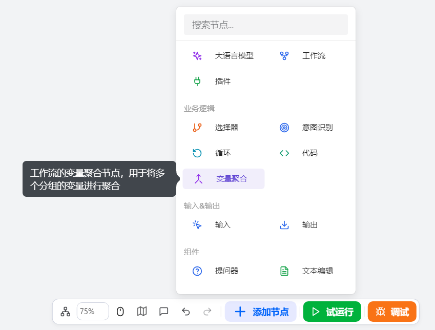

# Configure the Variable Aggregation Component

The Variable Aggregation Component is a core module in workflow design, built for workflow developers to solve unified aggregation and integration of multi-branch data flows in multi-branch workflow scenarios. By providing an efficient and flexible data aggregation mechanism, it allows developers to group and aggregate outputs from multiple branches, ultimately producing unified output variables.

**Key Features**

This component supports a group-based management capability that allows developers to classify and aggregate multiple sets of variables:
- Each group can contain multiple variables of the same type
- Each group is automatically merged into a single output variable
- Significantly improves data flow management efficiency in multi-branch scenarios

# Configure the Component

## Steps
1. Go to the openJiuwen platform homepage.
2. Navigate to the Workflow Orchestration module in the left sidebar.
3. Click the Add Component button at the bottom of the page, then select the Variable Aggregation Component. 

4. Click the Variable Aggregation Component that appears on the canvas to start configuring it. 

5. Add a group. One group is provided by default.

6. Add variables within the group. By default, each group contains one variable.

7. Add variables to the group. Each group can contain multiple variables; these variables must be of the same type and will be aggregated into a single output variable. 

The configuration of the Variable Aggregation Component is as follows:

| Configuration | Description |
| :------: | :------ |
| Aggregation Strategy | Choose a variable aggregation strategy. Options include: - First non-empty value: reads the first non-empty value within each group as the final output |
| Group Name | The output variable name for the current group, used to identify different sets of variables |
| Group Type | The output variable type for the current group; it must match the type of all variables in the group |
| Variables in Group | Select the upstream component parameters to aggregate. The types of multiple variables must be consistent |

## Example

A concrete example of the Variable Aggregation Component is shown below, consolidating outputs from large model nodes across multiple branches:

