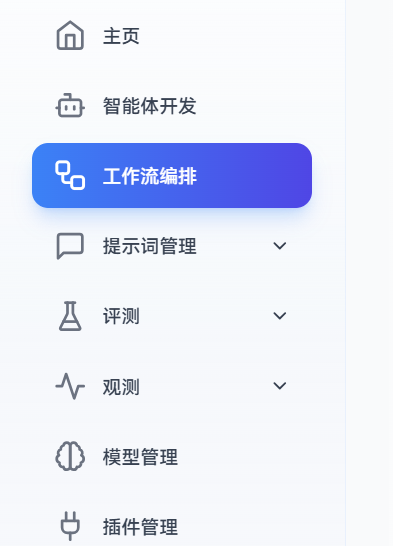
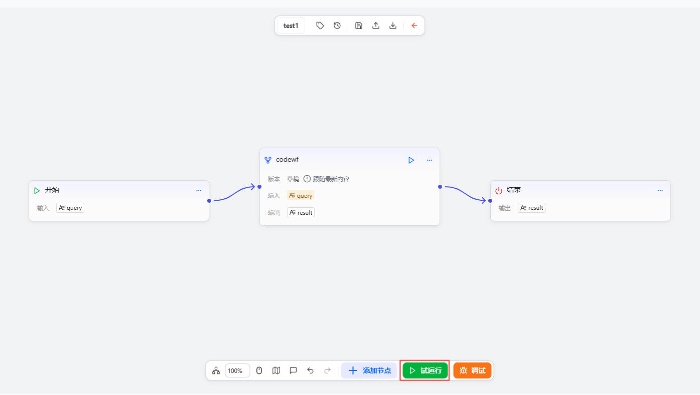
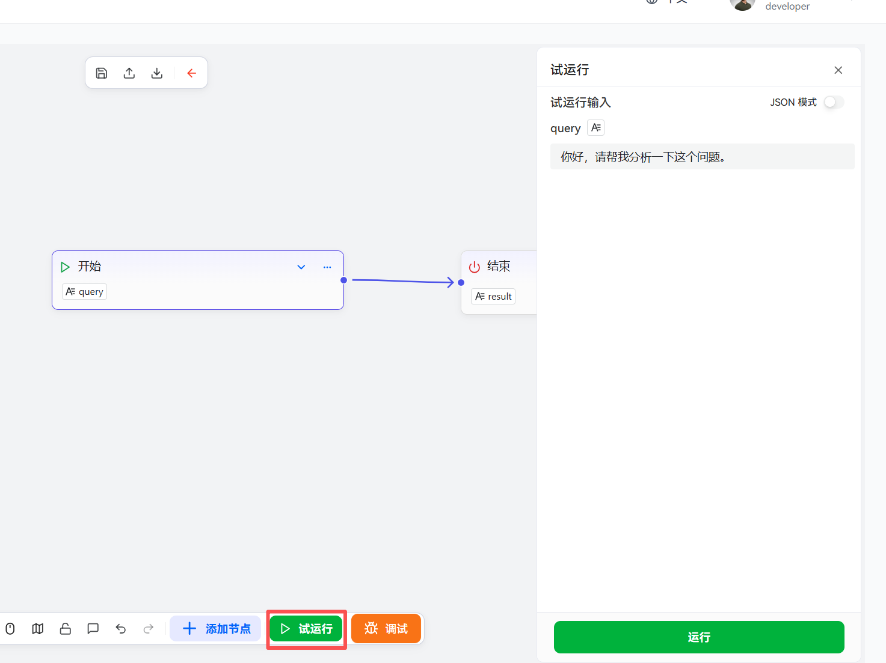
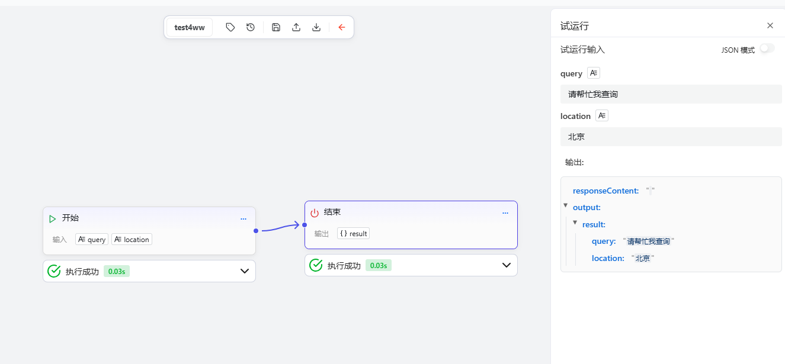

# Debugging and Running Workflows

This chapter explains how to execute and test workflows in the workflow editor, helping developers and users quickly verify the correctness and stability of workflow logic.

## Steps

1. Go to the openJiuwen platform homepage.
2. In the platform’s left navigation bar, go to the **Workflow Orchestration** module.

    

3. Click the workflow you want to debug to enter the workflow editing page.

    

4. Click the Trial Run button: In the workflow editing page, click “Trial Run” to enter test run mode. In this mode, the system simulates the workflow execution environment without affecting real data or external systems.

    

5. Enter test data: In the pop-up test configuration window, fill in the input parameters required by the workflow. These parameters can be mock data or example data from real-world scenarios.

   

6. Start execution: After confirming the inputs are correct, click “Run.” The system will start executing according to the workflow’s defined logic. During execution, you can view each node’s execution status and data flow in real time.

    

7. View execution results: After execution, the system will display complete execution logs, including:
* Execution status of each node (success, failure, skipped, etc.)
* Data transfer between nodes
* Performance metrics such as execution time

    

8. Debug and optimize: Adjust the workflow configuration based on the test results to optimize the execution logic.