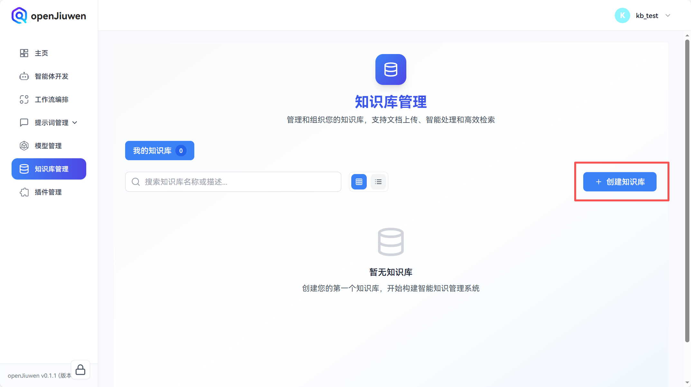
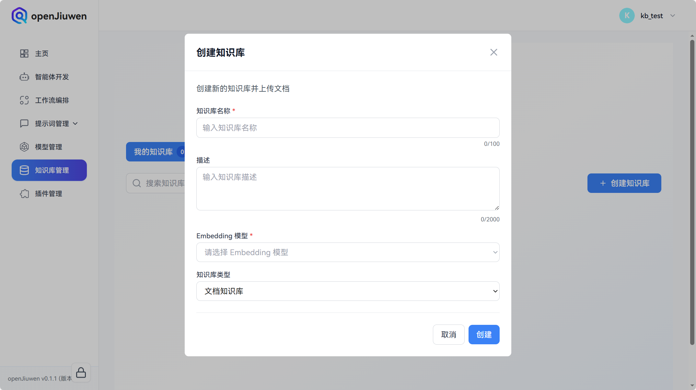
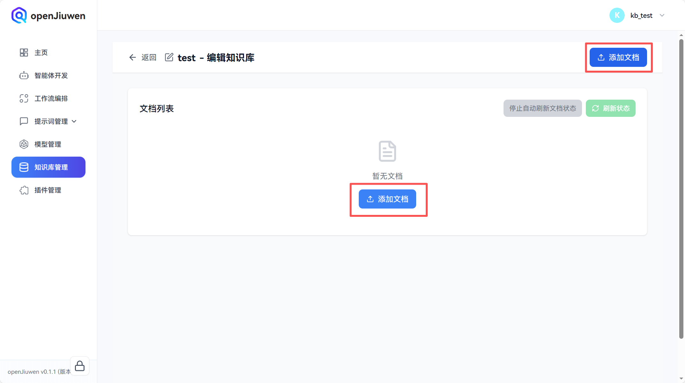
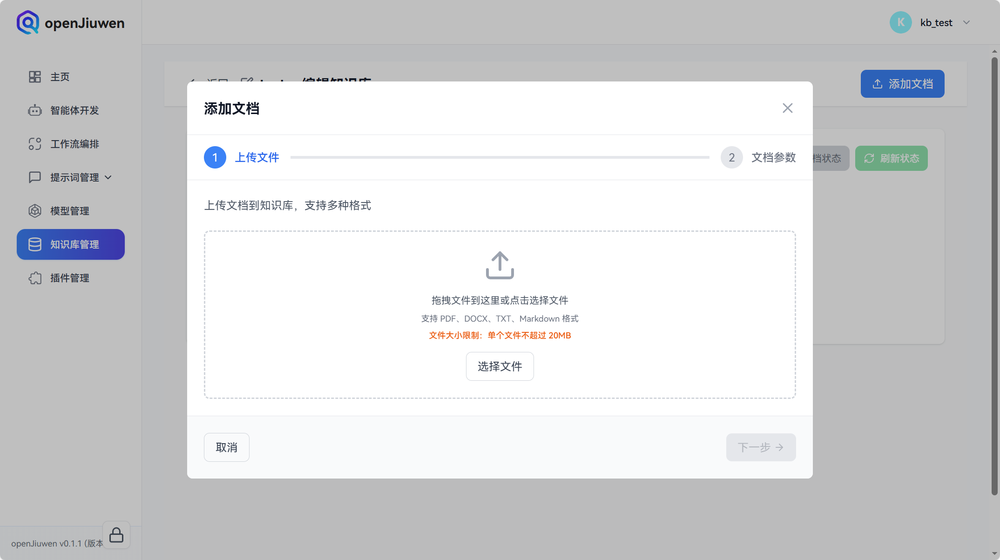
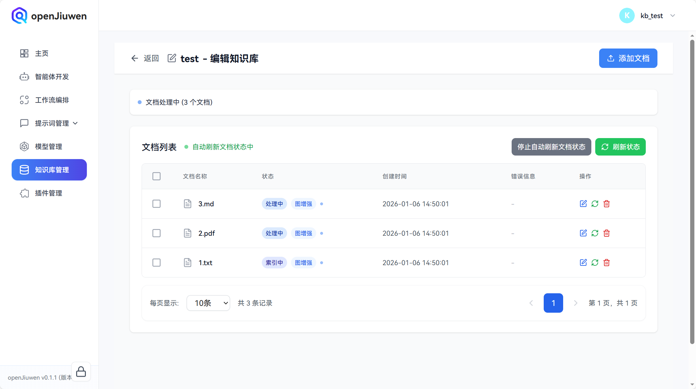

# Knowledge Base Management

Knowledge base is an important way for the openJiuwen platform to manage local knowledge. Users can enhance the agent's knowledge retrieval RAG capabilities by managing local knowledge bases.

# Create Knowledge Base

## Prerequisites

A usable model has been configured in the **Embedding Model** tab of the **Model Management** module. For how to configure Embedding models, please refer to the Model Management related sections.

## Operation Steps

1. Log in to the openJiuwen platform.

2. Navigate to the **Knowledge Base Management** module in the left sidebar of the platform.

3. Click the **Create Knowledge Base** button.

   

4. In the create knowledge base dialog, enter the **Knowledge Base Name** and **Description** (optional), select a model from the **Embedding Model** dropdown (Note: The Embedding model of a knowledge base cannot be changed after the knowledge base is created), and click **Create**.
   
   
   
5. On the created knowledge base card, click the **Edit** button.
   
   

6. On the edit knowledge base page, click **Add Document**.

   

7. In the add document dialog, select the files you want to upload to the knowledge base by dragging or clicking **Select Files** (multiple files can be selected), then click **Next**.

   

8. On the document parameters page, configure document parsing and indexing parameters, then click **Next**.

   

   The document parameter configuration descriptions are as follows:

   | Parameter Name     | Description                  | Configuration Instructions                                                                                                                                    |
   |----------|---------------------|-----------------------------------------------------------------------------------------------------------------------------------------|
   | Parsing Strategy     | Controls the document parsing method           | - **Quick Parsing**: Uses default parsing strategy to quickly process documents, suitable for most scenarios - **Note**: Currently only quick parsing mode is supported                                                                               |
   | Segmentation Strategy     | Controls the document text segmentation method         | - **Auto Segmentation and Cleaning**: System automatically performs text segmentation and cleaning, suitable for most scenarios - **Custom**: Manually configure segmentation parameters for precise control of segmentation effects - **Note**: After selecting "Custom", you need to configure sub-parameters: Maximum Tokens and Segmentation Overlap Percentage                        |
   | Maximum Tokens | Maximum number of tokens per segment (sub-parameter) | - **Function**: Controls the length of each text segment - **Range**: 16-1024 - **Default Value**: 512 - **Display Condition**: Only displayed when segmentation strategy is set to "Custom" - **Recommendation**: Set according to document type and retrieval needs. Too small may lose context, too large may affect retrieval accuracy |
   | Segmentation Overlap Percentage  | Overlap ratio between adjacent segments (sub-parameter)    | - **Function**: Controls the overlap degree between segments to maintain context coherence - **Range**: 0-50 - **Default Value**: 10 - **Display Condition**: Only displayed when segmentation strategy is set to "Custom" - **Recommendation**: Usually set to 10-20, can be adjusted according to document characteristics         |
   | Document Graph Construction    | Whether to build document graph             | - **Function**: After enabling, document graph index can be built to improve complex relationship retrieval effects - **Note**: Enabling document graph will increase index construction time and consume additional LLM tokens - **Note**: After enabling, you need to configure the sub-parameter LLM model                                 |
   | LLM Model    | Large language model used for document graph construction (sub-parameter)  | - **Function**: Model used to extract entities and relationships during document graph index construction - **Display Condition**: Only displayed when document graph construction is enabled, and must be selected - **Recommendation**: Choose a model with stable performance and support for long text                                         |                         |

9. After that, documents will be processed one by one. You can click **Refresh Status** to get the latest document status, and the page will automatically refresh document status. You can cancel automatic refresh by clicking **Stop Auto-refreshing Document Status**.

   

10. Indexed documents will display **Indexed**, and documents with document graph construction enabled will have a **Graph Enhanced** label, while those without will not. If you still need to upload documents, you can continue by clicking **Add Document** in the upper right corner.

   

