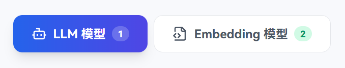
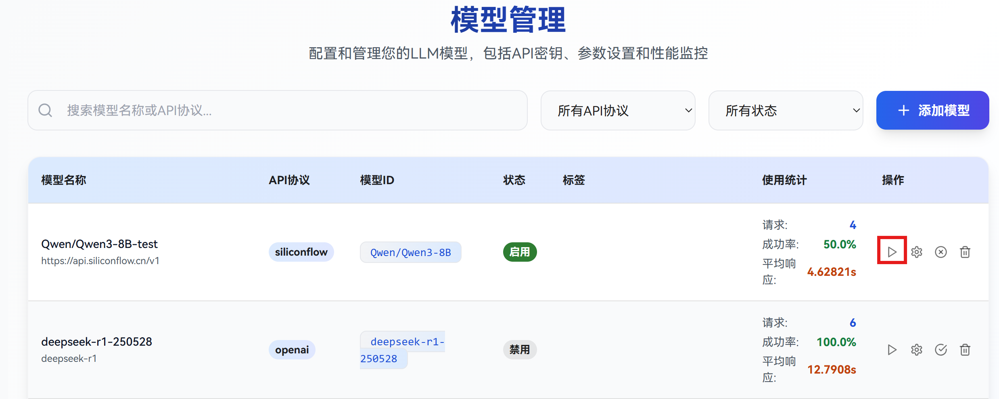
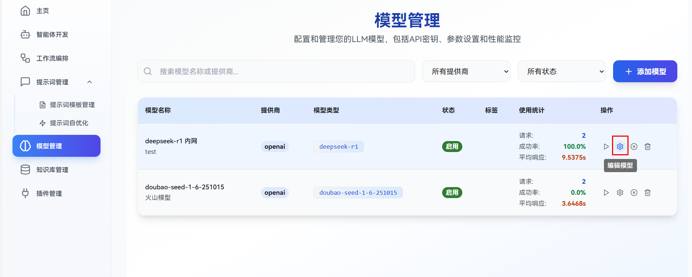
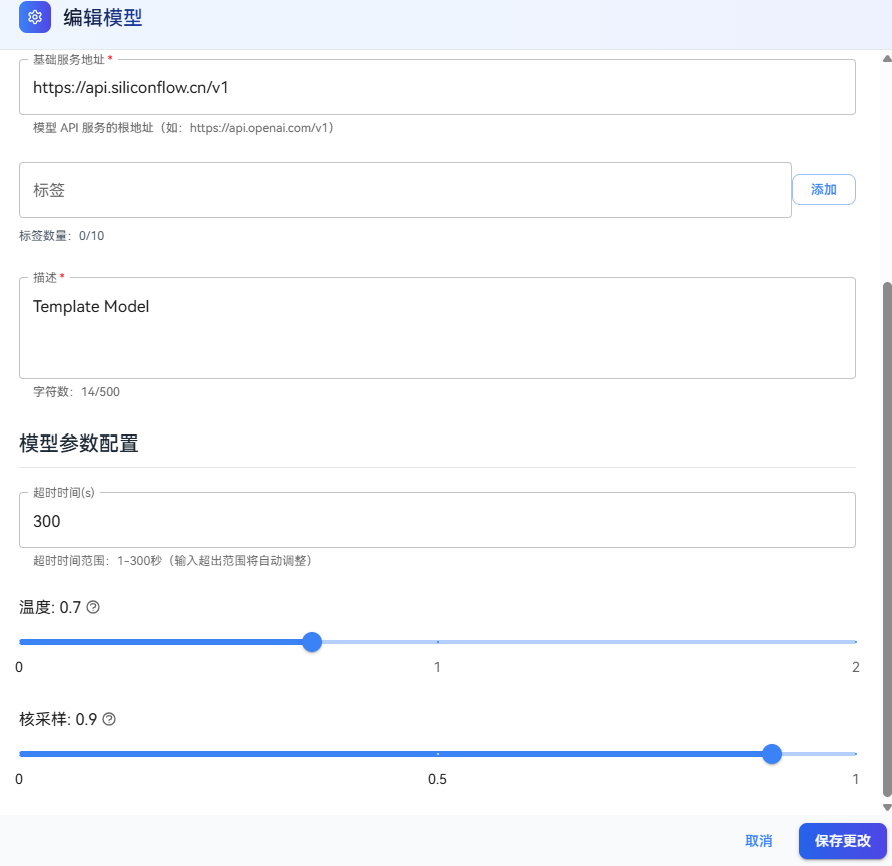

# Model Management

openJiuwen Studio Model Management supports the following actions: adding models, testing models, editing model configurations, disabling/enabling models, and deleting models. It includes LLM models and Embedding models. The specific guidelines are as follows:

# Add Model

## Prerequisites

1. Endpoint URL: You have obtained the **Base URL** of the model service;
2. API Key: You have obtained the **API Key** for the model service (usually from the service provider's console if authentication is required);
3. API Schema: You have confirmed that the model service's **API Schema** (e.g., the industry-standard OpenAI Chat Completion, Anthropic Claude, etc.) matches the types supported by this platform.

## Steps

1. Log in to the openJiuwen platform;
2. Navigate to the **Model Management** module in the left sidebar;
3. Select the model type to add (LLM Model or Embedding Model);<br>
   
4. Click the **Add Model** button in the top-right corner of the page;<br>
   
5. In the configuration dialog box, set the relevant parameters;<br>
   

   **Parameter Descriptions**
   
   | **Parameter**       | **Component**    | **Description**                                                                                                                                                                                                 |
   |-------------|-------------|-----------|
   | Model Name   | Common          | A custom, user-friendly alias for the model used for display on the platform, helping users identify it quickly.<br>Example: `General LLM v3` / `Embedding Model v3` |
   | Model ID| Common          | The specific identifier required by the API request. This must match the ID defined on the server side.<br>Example: `gpt-3.5-turbo` / `text-embedding-v3` |
   | API Schema | Common          | The API format standard, which determines the request structure, authentication method, and response parsing rules.<br>This must match the model service provider. For example, selecting "OpenAI" implies the standard Chat Completion API schema. |
   | API Key  | Common          | The authentication credential for the model service. It is usually obtained from the provider's console and will be encrypted and stored securely upon entry.<br>Example: `sk-xxxx` |
   | Base URL   | Common          | The root endpoint address for API calls.<br>Example: `https://api.openai.com/v1`|
   | Tags | Common          | Keywords used to categorize the model, facilitating quick filtering and identification. Separate multiple tags with commas.<br>Example: `"Chinese", "Chat", "LLM"` |
   | Description | LLM Model       | A brief summary of the model to help users understand its capabilities, applicable scenarios, and performance characteristics.<br>Example: `High-performance LLM optimized for Chinese dialogue`|
   | Timeout  | LLM Model       | The maximum duration allowed for a model request. This controls latency and prevents indefinite hanging.<br>Unit: seconds. Range: 0-300  |
   | Temperature  | LLM Model       |  Controls the randomness and creativity of the output. Higher values result in more diverse and random outputs; lower values produce more deterministic and conservative results.<br>Range: 0~2, Recommanded: 0.1~1.0.<br>Example: 0.7 (balanced)、1.2 (creative) |
   | Top-p (Nucleus Sampling)  | LLM Model       |  Limits the token selection to a cumulative probability threshold. The model samples only from the top tokens whose probabilities sum to this value. Lower values make results more focused; higher values increase diversity.<br>Range: 0~1, Recommended: 0.8~0.95.<br>Example: 0.9 (balance), 0.5 (focused) |
   | Maximum Batch Size  | Embedding Model | The maximum number of texts processed in batch, used to control the number of text items processed in a single API call to improve processing efficiency.<br>Range: 1-10, Default value: 5                                                                 |

# Test Model

To verify the validity of the configuration and connectivity, you can perform a quick functional test on the Model Management page.

## Notes

* Ensure core configurations (API Key, Base URL) are correct before testing.
* If the test fails, check your network connection first or contact the model service provider to verify service status.

## Steps

1. ​**Initiate Test**​: Click the **Test Model** button in the **Actions** column for the target model.<br>
   
2. ​**Execute Test**​: 
   - LLM Model: In the test dialog, use the default test prompt (e.g., "Hello, please introduce yourself") or enter a custom prompt. Click **Start Test** to send the request.<br>
   
   - Embedding Model: Click the **Test Model** button and the test will be performed automatically.
3. ​**View Results**​:
   - LLM Model: The test result shows test success and returns normal results.<br>
   
   - Embedding Model: A dialog displays test success.<br>
   


# Edit Model Configuration

When configuration updates are needed (e.g., API Key rotation, parameter tuning), you can modify settings via the Edit function.

## Notes

* After modifying the API Key or Base URL, it is recommended to run **Test Model** again to ensure connectivity.
* If the model is currently linked to live applications or workflows, modifying parameters may affect ongoing tasks. Proceed with caution.

## Steps

1. ​**Enter Edit Mode**: Locate the target model in the list and click the **Settings** icon (gear) in the **Actions** column.<br>
   
2. ​**Modify Parameters**: Adjust parameters such as Model Name, API Key, Timeout, Temperature, or Top-p as needed. (Note: Core parameters like "Model ID" may be read-only depending on platform restrictions).<br>
   
3. ​**Save Changes**: Click **Save**. The system will automatically validate the configuration and display an "Edit successful" message.


# Disable/Enable Model

You can temporarily revoke usage permissions for a model by disabling it, or restore access by enabling it.

## Notes

* Before disabling, ensure no running tasks depend on this model to avoid service interruption.
* Disabled models are not deleted and can be re-enabled at any time.

## Steps

1. ​**Toggle Status**: In the **Actions** column, click the **Disable** icon (cross) or **Enable** icon (checkmark, visible when disabled).<br>
   
2. ​**Confirm Action**: Click **Confirm** in the pop-up prompt.
3. ​**Status Explanation**:
   * Disabled: The model status changes to **Disabled**. It cannot be selected or called in workflows or prompt configurations.
   * Enabled: The model returns to **Normal** status and is available for use.


# Delete Model

If a model is no longer needed, you can permanently remove its configuration. This action is irreversible.

## Notes

* Backup configuration details (e.g., Base URL, API Key) before deletion if you plan to re-add the model later.
* Ensure no applications or workflows depend on this model; otherwise, related functions will fail.
* Before deleting an Embedding model, you need to delete all knowledge bases that use this model, otherwise deletion will fail.
* Deletion is permanent and cannot be undone.


## Steps

1. ​**Initiate Deletion**: Click the **Delete** icon (trash can) in the **Actions** column.<br>
   
2. ​**Confirm Deletion**: Verify the model name in the prompt and click **Confirm Delete**.
3. ​**Feedback**: The system will display "Delete successful," and the model will be removed from the list.


# Appendix

There are two primary ways to acquire Large Models: purchasing cloud-based LLM services from mainstream providers or deploying models locally.

## Purchase Cloud-based LLM Service

The following steps use Huawei Cloud as an example to demonstrate how to acquire a model service.

* Click <a href="https://console.huaweicloud.com/modelarts/?locale=zh-cn&region=cn-southwest-2#/model-studio/deployment" target="_blank" rel="nofollow noopener noreferrer">link</a> to enter the Online Inference section of the Huawei Cloud Model Hub.

* Select the desired model and click **Activate Service**.

  

* Once activated, click **Call Guide** to access the model connection details.

  

* Select the **OpenAI-Compatible API** tab and record the *Base URL* and *model configuration*.

* Click **API Key Management** and follow the official interface instructions to generate an *API Key*.

> Note: For detailed instructions, please refer to the <a href="https://support.huaweicloud.com/usermanual-maas-modelarts/maas-modelarts-0195.html" target="_blank" rel="nofollow noopener noreferrer">huaweicloud usermanual</a>

## Local Deployment of LLM Service

### 0. Download Model Weights

Download the Qwen3-32B model weights from communities such as HuggingFace or ModelScope.

Taking the OpenMind Hub as an example, first execute the following shell command to install the library required for downloading weights:

```shell
pip install openmind_hub
```

Then, run the following `Python` script：

```python
from openmind_hub import snapshot_download

snapshot_download(
    repo_id="MindSpore-Lab/Qwen3-32B",
    local_dir="/mnt/disk3/qwen3_32b",
    local_dir_use_symlinks=False
)
exit()
```

### 1. Environment Preparation

Refer to the MindSpore community documentation to install and deploy the inference service environment (vLLM v0.9.1 + MindSpore 2.7.1) on an Atlas 800 A2 server:
https://www.mindspore.cn/vllm_mindspore/docs/zh-CN/master/getting_started/installation/installation.html

Alternatively, you can use the Intelligence BooM docker image to quickly set up the environment:

```shell
docker pull hub.oepkgs.net/oedeploy/openeuler/aarch64/intelligence_boom:0.1.0-aarch64-800I-A2-mindspore2.7-openeuler24.03-lts-sp2-20251016
docker run --privileged \
     --name qwen3-32b \
     --device /dev/davinci0 \
     --device /dev/davinci1 \
     --device /dev/davinci2 \
     --device /dev/davinci3 \
     --device /dev/davinci4 \
     --device /dev/davinci5 \
     --device /dev/davinci6 \
     --device /dev/davinci7 \
     --device /dev/davinci_manager \
     --device /dev/devmm_svm \
     --device /dev/hisi_hdc \
     --network host \
     -v /dev/shm:/dev/shm \
     -v /usr/local/dcmi:/usr/local/dcmi \
     -v /usr/local/bin/npu-smi:/usr/local/bin/npu-smi \
     -v /usr/local/Ascend/driver/lib64:/usr/local/Ascend/driver/lib64 \
     -v /usr/local/Ascend/driver/version.info:/usr/local/Ascend/driver/version.info \
     -v /etc/ascend_install.info:/etc/ascend_install.info \
     -v /home:/home \
     -v /mnt:/mnt \
     -it hub.oepkgs.net/oedeploy/openeuler/aarch64/intelligence_boom:0.1.0-aarch64-800I-A2-mindspore2.7-openeuler24.03-lts-sp2-20251016 /bin/bash
```

> **Note**: The Intelligence BooM docker image is primarily for community development and has not undergone necessary security hardening. It is not recommended for production environments. Users can refer to the [dockerfile](https://gitee.com/mindspore/vllm-mindspore/blob/r0.4.0/Dockerfile) to customize the image.

### 2. Start Service

Execute the following shell command to start the Qwen3-32B inference service:

```shell
export VLLM_MS_MODEL_BACKEND=MindFormers
export ASCEND_RT_VISIBLE_DEVICES=4,5,6,7
export TENSOR_PARALLEL_SIZE=4
vllm-mindspore serve /mnt/disk3/Qwen3-32B --trust_remote_code --tensor-parallel-size $TENSOR_PARALLEL_SIZE --enable-auto-tool-choice --tool-call-parser hermes --reasoning-parser deepseek_r1 >./vllm_server.log 2>&1 &
```

**Parameter Descriptions**:

* `--model {ckpt_path}`: Specifies the path to the Qwen3-32B model safetensors weights. Example: `/mnt/disk3/Qwen3-32B`。
* `--tensor-parallel-size {tp_num}`: Sets the Tensor Parallelism (TP) dimension. Example: 4 (requires 4 Atlas 800 A2 accelerator cards).
* `--enable-auto-tool-choice`: Enables automatic tool selection, allowing the Qwen3-32B model to generate tool calls autonomously when appropriate.
* `--tool-call-parser {parse_name}`: Selects the tool parser. Qwen series models default to `hermes`.

### 3. Test Inference Service

Execute the following shell command to verify the Qwen3-32B inference service is running:

```shell
curl http://localhost:8000/v1/models
```

If the following JSON response is returned, the service has started successfully:

```json
{
    "object": "list",
    "data": [
        {
            "id": "/mnt/disk3/Qwen3-32B",
            "object": "model",
            "created": 1765417573,
            "owned_by": "vllm",
            "root": "/mnt/disk3/Qwen3-32B",
            "parent": null,
            "max_model_len": 40960,
            "permission": [
                {
                    "id": "modelperm-24606adb7e844bac8c376e910f059d5b",
                    "object": "model_permission",
                    "created": 1765417573,
                    "allow_create_engine": false,
                    "allow_sampling": true,
                    "allow_logprobs": true,
                    "allow_search_indices": false,
                    "allow_view": true,
                    "allow_fine_tuning": false,
                    "organization": "*",
                    "group": null,
                    "is_blocking": false
                }
            ]
        }
    ]
}
```