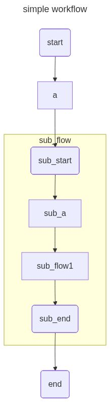
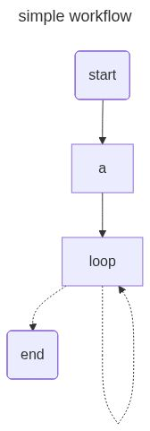

# Workflow Visualization

The openJiuwen development framework supports visual display of constructed workflows. After workflow construction is complete, users can generate [mermaid](https://mermaid.js.org/) scripts or rendered images through workflow visualization-related interfaces, facilitating intuitive workflow display and problem troubleshooting.

# Prerequisites

- Before using workflow visualization functionality, need to install and run [Jupyter Notebook](https://jupyter.org/).

1. Execute the following command to install Jupyter Notebook

    ```bash
    pip install notebook
    ```

2. Execute the following command to start Jupyter Notebook

    ```bash
    jupyter notebook
    ```

- Default image rendering requires network access to `https://mermaid.ink`. If the environment has normal network access, no configuration is needed. If the environment cannot access the network, need to install [mermaid.ink](https://github.com/jihchi/mermaid.ink) locally, and configure environment variable `MERMAID_INK_SERVER` to local `mermaid.ink` address. Environment variables can be configured using Python's built-in `os` package, please refer to [os.environ](https://docs.python.org/3.11/library/os.html#os.environ).

# Visualizing Simple Workflows

First, import modules needed for constructing workflows, and set environment variables to enable workflow visualization functionality.

```python
from openjiuwen.core.workflow import WorkflowComponent
from openjiuwen.core.workflow.components.component import Input, Output
from openjiuwen.core.workflow.components import Session
from openjiuwen.core.context_engine import ModelContext

# Set environment variables to enable workflow visualization functionality
import os
os.environ["WORKFLOW_DRAWABLE"] = "true"
```

Then define a custom component class for receiving input and returning empty results.

```python
# Custom component
class Node1(WorkflowComponent):
    def __init__(self):
        super().__init__()

    async def invoke(self, inputs: Input, session: Session, context: ModelContext) -> Output:
        return {}
```

Then build a simple workflow based on custom components, execute in order of start component `start`, custom component `a`, end component `end`, connections between components are all [normal connections](./Build%20Workflow.md#normal-connection).

```python
# Build workflow
flow = Workflow()
flow.set_start_comp("start", Start())
flow.add_workflow_comp("a", Node1())
flow.set_end_comp("end", End())
flow.add_connection("start", "a")
flow.add_connection("a", "end")
```

Visualize workflow as png image, title set to `simple workflow`.

```python
# Display rendered image
from IPython.display import Image, display
display(Image(flow.draw(title="simple workflow", output_format="png")))
```

Display the following image:

<div style="text-align: center">
</div>

# Visualizing Workflows with Streaming Edges

First, import modules needed for constructing workflows, and set environment variables to enable workflow visualization functionality.

```python
from openjiuwen.core.workflow import WorkflowComponent
from openjiuwen.core.workflow.components.component import Input, Output
from openjiuwen.core.workflow.components import Session
from openjiuwen.core.context_engine import ModelContext

# Set environment variables to enable workflow visualization functionality
import os
os.environ["WORKFLOW_DRAWABLE"] = "true"
```

Then define a custom component class for receiving input and returning empty results.

```python
# Custom component
class Node1(WorkflowComponent):
    def __init__(self):
        super().__init__()

    async def invoke(self, inputs: Input, session: Session, context: ModelContext) -> Output:
        return {}
```

Then build a workflow with streaming edges based on custom components, execute in order of start component `start`, custom component `a`, end component `end`. Connection between custom component `a` and end component `end` is [streaming connection](./Build%20Workflow.md#streaming-connection), connections between other components are [normal connections](./Build%20Workflow.md#normal-connection).

```python
# Build workflow
flow = Workflow()
flow.set_start_comp("start", Start())
flow.add_workflow_comp("a", Node1())
flow.set_end_comp("end", End())
flow.add_connection("start", "a")
# Use streaming connection between components
flow.add_stream_connection("a", "end")
```

To dynamically display [streaming connection](./Build%20Workflow.md#streaming-connection) between component `a` and component `end`, visualize workflow as svg image, title set to `simple workflow`.

```python
from IPython.display import SVG, display, HTML

svg_data = SVG(flow.draw(title="simple workflow", output_format="svg")).data
display(HTML(f'<div style="zoom:0.9">{svg_data}</div>'))
```

> **Note**
> 
> Directly displaying svg images may cause incomplete image display. Here HTML tags are used to scale the image.

Display the following image:

<div style="text-align: center">
</div>

# Visualizing Workflows with Branches

First, import modules needed for constructing workflows, and set environment variables to enable workflow visualization functionality.

```python
from openjiuwen.core.workflow import WorkflowComponent
from openjiuwen.core.workflow.components.component import Input, Output
from openjiuwen.core.workflow.components import Session
from openjiuwen.core.context_engine import ModelContext
from openjiuwen.core.workflow import Workflow
from openjiuwen.core.workflow import BranchRouter

# Set environment variables to enable workflow visualization functionality
import os
os.environ["WORKFLOW_DRAWABLE"] = "true"
```

Then define a custom component class for receiving input and returning empty results.

```python
# Custom component
class Node1(WorkflowComponent):
    def __init__(self):
        super().__init__()

    async def invoke(self, inputs: Input, session: Session, context: ModelContext) -> Output:
        return {}
```

Then build a workflow with branches based on custom components. Start component `start` goes to custom component `a` based on condition `${start.a} > 0`, goes to custom component `b` based on condition `${start.b} > 0`, both components `a` and `b` go to end component `end`. Connection between start component `start` and custom components `a`, `b` is [conditional connection](./Build%20Workflow.md#conditional-connection), connections between other components are all [normal connections](./Build%20Workflow.md#normal-connection).

```python
# Add branches to workflow
router = BranchRouter()
router.add_branch("${start.a} > 0", "a")
router.add_branch("${start.b} > 0", "b")

flow = Workflow()
flow.set_start_comp("start", Start(), inputs_schema={"a": "${a}", "b": "${b}"})
flow.add_workflow_comp("a", Node1())
flow.add_workflow_comp("b", Node1())
flow.set_end_comp("end", End())
flow.add_conditional_connection("start", router=router)
flow.add_connection("a", "end")
flow.add_connection("b", "end")
```

Visualize workflow as png image, title set to `simple workflow`.

```python
from IPython.display import Image, display

display(Image(flow.draw(title="simple workflow", output_format="png")))
```

Display the following image:

<div style="text-align: center"></div>

# Visualizing Nested Workflows

First, import modules needed for constructing workflows, and set environment variables to enable workflow visualization functionality.

```python
from openjiuwen.core.workflow import WorkflowComponent
from openjiuwen.core.workflow.components.component import Input, Output
from openjiuwen.core.workflow.components import Session
from openjiuwen.core.context_engine import ModelContext
from openjiuwen.core.workflow import Workflow
from openjiuwen.core.workflow import SubWorkflowComponent

# Set environment variables to enable workflow visualization functionality
import os
os.environ["WORKFLOW_DRAWABLE"] = "true"
```

Then define a custom component class for receiving input and returning empty results.

```python
# Custom component
class Node1(WorkflowComponent):
    def __init__(self):
        super().__init__()

    async def invoke(self, inputs: Input, session: Session, context: ModelContext) -> Output:
        return {}
```

Then create a sub-workflow `sub_flow` and main workflow `flow` respectively. Sub-workflow executes in order of start component `sub_start`, custom component `sub_a` and end component `sub_end`. Main workflow executes in order of start component `start`, custom component `a`, sub-workflow component `sub_flow`, end component `end`. Sub-workflow component `sub_flow` is constructed from sub-workflow. All connections between components are [normal connections](./Build%20Workflow.md#normal-connection).

```python

# Create sub-workflow
sub_flow = Workflow()
sub_flow.set_start_comp("sub_start", Start())
sub_flow.add_workflow_comp("sub_a", Node1())
sub_flow.set_end_comp("sub_end", End())
sub_flow.add_connection("sub_start", "sub_a")
sub_flow.add_connection("sub_a", "sub_end")

# Create main workflow and add sub-workflow to main workflow
flow = Workflow()
flow.set_start_comp("start", Start())
flow.add_workflow_comp("a", Node1())
flow.add_workflow_comp("sub_flow", SubWorkflowComponent(sub_flow))
flow.set_end_comp("end", End())
flow.add_connection("start", "a")
flow.add_connection("a", "sub_flow")
flow.add_connection("sub_flow", "end")
```

Visualize workflow as png image, title set to `simple workflow`, first do not expand sub-workflow, i.e., let function `draw`'s parameter `expand_subgraph` use default value `False`.

```python
from IPython.display import Image, display

# Do not expand sub-workflow
display(Image(flow.draw(title="simple workflow", output_format="png")))
```

Display the following image:

<div style="text-align: center"></div>

Visualize workflow as png image, title set to `simple workflow`, expand sub-workflow, i.e., set function `draw`'s parameter `expand_subgraph` value to `True`.

```python
# Expand sub-workflow
display(Image(flow.draw(title="simple workflow", expand_subgraph=True)))
```

Display the following image:

<div style="text-align: center"></div>

# Visualizing Multi-layer Nested Workflows

First, import modules needed for constructing workflows, and set environment variables to enable workflow visualization functionality.

```python
from openjiuwen.core.workflow import WorkflowComponent
from openjiuwen.core.workflow.components.component import Input, Output
from openjiuwen.core.workflow.components import Session
from openjiuwen.core.context_engine import ModelContext
from openjiuwen.core.workflow import Workflow
from openjiuwen.core.workflow import SubWorkflowComponent

# Set environment variables to enable workflow visualization functionality
import os
os.environ["WORKFLOW_DRAWABLE"] = "true"
```

Then define a custom component class for receiving input and returning empty results.

```python
# Custom component
class Node1(WorkflowComponent):
    def __init__(self):
        super().__init__()

    async def invoke(self, inputs: Input, session: Session, context: ModelContext) -> Output:
        return {}
```

Then create the following workflows:
- Main workflow executes in order of start component `start`, custom component `a`, sub-workflow component `sub_flow`, end component `end`. Sub-workflow component `sub_flow` is constructed from first-level sub-workflow.
- First-level sub-workflow executes in order of start component `sub_start`, custom component `sub_a`, sub-workflow component `sub_flow1`, end component `sub_end`. Sub-workflow component `sub_flow1` is constructed from second-level sub-workflow.
- Second-level sub-workflow executes in order of start component `sub_start1`, custom component `sub_a1` and end component `sub_end1`.

All connections between components are [normal connections](./Build%20Workflow.md#normal-connection).

```python

# Create second-level sub-workflow
sub_flow1 = Workflow()
sub_flow1.set_start_comp("sub_start1", Start())
sub_flow1.add_workflow_comp("sub_a1", Node1())
sub_flow1.set_end_comp("sub_end1", End())
sub_flow1.add_connection("sub_start1", "sub_a1")
sub_flow1.add_connection("sub_a1", "sub_end1")

# Create first-level sub-workflow and put second-level sub-workflow into created workflow
sub_flow = Workflow()
sub_flow.set_start_comp("sub_start", Start())
sub_flow.add_workflow_comp("sub_a", Node1())
sub_flow.add_workflow_comp("sub_flow1", SubWorkflowComponent(sub_flow1))
sub_flow.set_end_comp("sub_end", End())
sub_flow.add_connection("sub_start", "sub_a")
sub_flow.add_connection("sub_a", "sub_flow1")
sub_flow.add_connection("sub_flow1", "sub_end")

# Create main workflow and add first-level sub-workflow to main workflow
flow = Workflow()
flow.set_start_comp("start", Start())
flow.add_workflow_comp("a", Node1())
flow.add_workflow_comp("sub_flow", SubWorkflowComponent(sub_flow))
flow.set_end_comp("end", End())
flow.add_connection("start", "a")
flow.add_connection("a", "sub_flow")
flow.add_connection("sub_flow", "end")
```

Visualize workflow as png image, title set to `simple workflow`, first do not expand sub-workflow, i.e., let function `draw`'s parameter `expand_subgraph` use default value `False`.

```python
from IPython.display import Image, display

# Do not expand sub-workflow
display(Image(flow.draw(title="simple workflow", output_format="png")))
```

Display the following image:

<div style="text-align: center"></div>

Visualize workflow as png image, title set to `simple workflow`, expand one layer of sub-workflow, i.e., set function `draw`'s parameter `expand_subgraph` value to `1`.

```python
# Expand one layer of sub-workflow
display(Image(flow.draw(title="simple workflow", output_format="png", expand_subgraph=1)))
```

Display the following image:

<div style="text-align: center"></div>

Visualize workflow as png image, title set to `simple workflow`, expand two layers of sub-workflow, i.e., set function `draw`'s parameter `expand_subgraph` value to `2`. Since there are only two layers of sub-workflow in total, the effect is the same as setting `expand_subgraph` to `True`.

```python
# Expand two layers of sub-workflow
display(Image(flow.draw(title="simple workflow", output_format="png", expand_subgraph=2)))
```

Display the following image:

<div style="text-align: center"></div>

# Visualizing Workflows with Loops

First, import modules needed for constructing workflows, and set environment variables to enable workflow visualization functionality.

```python
from openjiuwen.core.workflow import WorkflowComponent
from openjiuwen.core.workflow.components.component import Input, Output
from openjiuwen.core.workflow.components import Session
from openjiuwen.core.context_engine import ModelContext
from openjiuwen.core.workflow import Workflow
from openjiuwen.core.workflow import LoopGroup, LoopComponent

# Set environment variables to enable workflow visualization functionality
import os
os.environ["WORKFLOW_DRAWABLE"] = "true"
```

Then define a custom component class for receiving input and returning empty results.

```python
# Custom component
class Node1(WorkflowComponent):
    def __init__(self):
        super().__init__()

    async def invoke(self, inputs: Input, session: Session, context: ModelContext) -> Output:
        return {}
```

Then create loop body and workflow respectively. Loop body executes in order of custom component `1`, custom component `2` and custom component `3`. Workflow executes in order of start component `start`, custom component `a`, loop component `loop` and end component `end`. Loop component is constructed from loop body. All connections between components are [normal connections](./Build%20Workflow.md#normal-connection).

```python

# Create loop body
loop_group = LoopGroup()
loop_group.add_workflow_comp("1", Node1())
loop_group.add_workflow_comp("2", Node1())
loop_group.add_workflow_comp("3", Node1())
loop_group.start_comp("1")
loop_group.end_comp("3")
loop_group.add_connection("1", "2")
loop_group.add_connection("2", "3")

# Create workflow and put loop body into workflow through loop component
flow = Workflow()
flow.set_start_comp("start", Start())
flow.add_workflow_comp("a", Node1())
flow.add_workflow_comp("loop", LoopComponent(loop_group, output_schema={}))
flow.set_end_comp("end", End())
flow.add_connection("start", "a")
flow.add_connection("a", "loop")
flow.add_connection("loop", "end")
```

Visualize workflow as png image, title set to `simple workflow`, first do not expand loop component, i.e., let function `draw`'s parameter `expand_subgraph` use default value `False`.

```python
from IPython.display import Image, display

# Do not expand loop component
display(Image(flow.draw(title="simple workflow", output_format="png")))
```

Display the following image:

<div style="text-align: center"></div>

Visualize workflow as png image, title set to `simple workflow`, expand loop component, i.e., set function `draw`'s parameter `expand_subgraph` value to `True`.

```python
# Expand loop component
display(Image(flow.draw(title="simple workflow", output_format="png", expand_subgraph=True)))
```

Display the following image:

<div style="text-align: center"></div>
