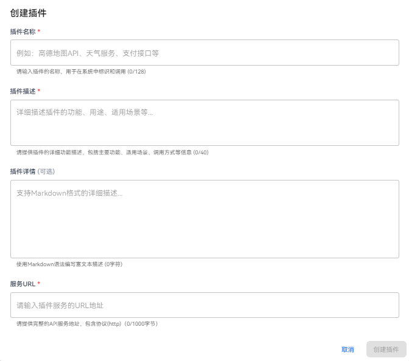
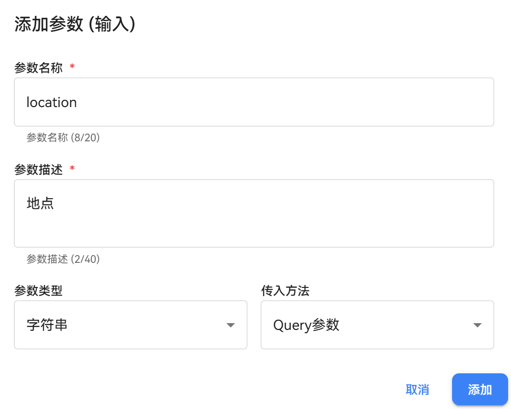
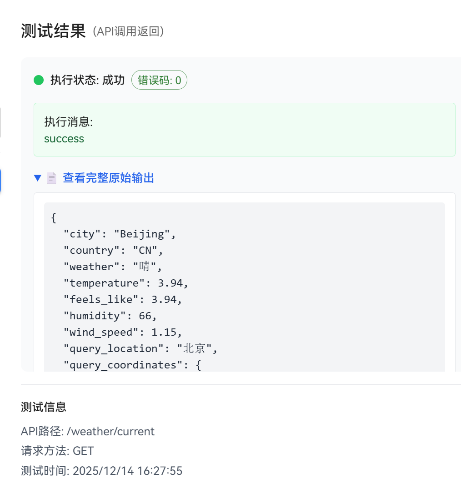
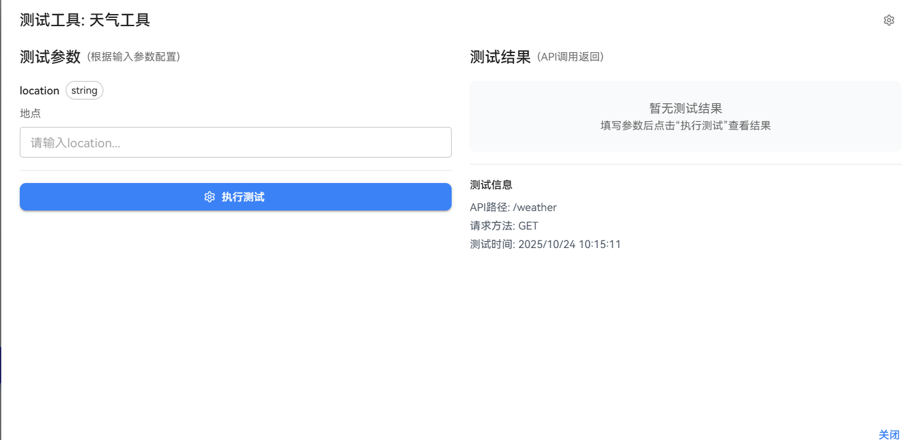

# Add Plugin

Plugins are a key method for extending the functionality of the openJiuwen platform. Users can add plugins to enrich the capabilities of workflows and agents. openJiuwen supports two methods for adding plugins: creating based on an existing service and manually creating a local code plugin.


## Method 1: Create Plugin Based on Existing Service
If the Service Request URL and request parameter information of a deployed plugin are known, users can create a plugin directly based on that Service URL.

### Prerequisites
1. The plugin service must be deployed, and the Service URL and request parameter information must be known. If users need to deploy the plugin service themselves, please refer to the section [Run Plugin Service in Background](#run-plugin-service-in-background).

### Steps
1. Log in to the openJiuwen platform.

2. Navigate to the **Plugin Management** module in the left sidebar.

3. Click the **Install Plugin** button and select **Create based on existing service**.
   
   

4. Fill in the plugin information:
   
   
   
   Configuration for creating a cloud-side plugin is as follows:
   
   | Configuration Item | Description |
   |:-----:|:---------------------------- |
   | Plugin Name | The display name of the plugin, used to identify the plugin. |
   | Plugin Description | A description of the plugin's functionality, helping users understand its purpose. |
   | Plugin Details | Detailed description of the plugin, supports markdown format, helps users understand the plugin's detailed configuration method. |
   | Service URL | The **Base URL** of the service corresponding to the plugin. The plugin will call service interfaces via this URL. |

5. Click the **Create** button to complete the plugin creation.
   
   

6. After creation, find the installed plugin in the installed list and click the **Settings** button to enter the plugin configuration page. To configure tools within the plugin, please refer to the [Add Tools to Plugin](#add-tools-to-plugin) section.

   


### Example
Suppose a user has a deployed weather plugin service with the URL `https://example.com/plugin/weather`. The interface path to get weather for a specific location is `/weather/current`. The service interface uses the GET method and specifies the location via the `location` field in the query parameters to retrieve weather information. The user can create a plugin based on this Service URL.

Example of filling in parameters for creating a cloud-side plugin:


Example of filling in plugin parameters:


Notes:
- Plugin parameters can set public parameters, such as api-key, which will be automatically added to request parameters when calling the plugin service.
- Plugin parameters can set non-runtime parameters, which require setting default values. Agents or workflows do not need to fill in input when calling the plugin, and cannot see this parameter, the default value will be used.
- Required parameters: Plugin parameters can be set as required parameters, which must be filled in when calling the plugin, otherwise an error will be reported.
   
Example of filling in tool information:


Example of tool input parameters:



After creating the plugin and tools, you can test them. Example results are as follows:



## Method 2: Manually Create Local Code Plugin
openJiuwen supports manually creating local code plugins. Users can write code directly (currently supports Python and JavaScript), and the written code is provided as a plugin for use.

### Steps
1. Log in to the openJiuwen platform.

2. Navigate to the **Plugin Management** module in the left sidebar.

3. Click the **Install Plugin** button and select **Local Code Plugin - Manual Creation**.
   
   

4. **Fill in plugin information**, described as follows:
   
   | Configuration Item | Description |
   |:------:|:--------------------------- |
   | Plugin Name | The display name of the plugin, used to identify the plugin. |
   | Plugin Description | A description of the plugin's functionality, helping users understand its purpose. |

5. Click the **Create Plugin** button to create the plugin and enter the plugin editing page.
   
   

6. In the **Tool Settings** under **Configuration Options**, click the **Add Code Tool** button to add a code tool.   

   

7. In the **Create Tool** dialog box, fill in the tool information and edit the code in the editor. Click the **Create** button when finished. The parameter descriptions are as follows:

   | Configuration Item | Description |
   |:------:|:--------------------------- |
   | Tool Name | The display name of the tool, used to identify the tool. |
   | Tool Description | A description of the tool's functionality, helping users understand its purpose. |
   | IDE Runtime | The language environment in which the code executes, currently supports Python, JavaScript |

   


# Run Plugin Service in Background
If users need to customize a plugin, they can refer to the current openJiuwen studio backend code examples to run the plugin service in the background. Then, when installing the plugin, they can select the plugin running in the background.

## Steps

1. Refer to the `plugin_server/routers/demo_router.py` code to write the interface information and business logic for the plugin tool.
   
      ```python
   from fastapi import HTTPException, Query

   from . import BasePluginRouter

   demo_router = BasePluginRouter(
       name="demo",
       description="your_demo_tool_description",
   )

   @demo_router.router.get("/run")
   async def run_demo(
       query: str = Query(..., description="query parameter description")
   ):
       try:
           return {
               "result": "success",
               "query": query,
           }
       except Exception as e:
           raise HTTPException(
               status_code=500,
               detail=f"run failed: {str(e)}"
           ) from e

   # Register endpoint information
   demo_router.register_endpoint("GET", "/run", run_demo, "run demo")
   ```

   The current `plugin_server/routers/demo_router.py` code defines a `/demo/run` GET interface. This interface accepts a query parameter and returns success along with the query parameter value.

2. Refer to the `plugin_server/run_restful.py` code to start the custom plugin service.

   ```python
   import uvicorn
   from dotenv import load_dotenv

   from restful_tool_router import app

   # Load environment variables from .env file
   load_dotenv()

   # Define main function (called by script entry point)
   def main():
      # Try multiple startup methods
      try:
         # Method 1: Standard way
         uvicorn.run(app, host="0.0.0.0", port=8185)
      except TypeError as e:
         if "loop_factory" in str(e):
               # Method 2: Compatible way
               import asyncio
               config = uvicorn.Config(app, host="0.0.0.0", port=8185)
               server = uvicorn.Server(config)
               asyncio.run(server.serve())
         else:
               raise

   if __name__ == "__main__":
      main()
   ```

   You need to specify the host and port. The default values are 0.0.0.0 and 8135 respectively.

3. To call this interface, configure the plugin URL as http://localhost:8185 in the cloud-side plugin creation popup.

   

   Refer to the **Add Tools to Plugin** section to configure the interface information. Add a `/demo/run` tool for the plugin. An example of the test result is as follows:
   
   


# Add Tools to Plugin

Plugin Tools are the specific functional implementations of a plugin. Each plugin can contain one or more tools. Tools define how the plugin interacts with external systems, including the API Schema, input parameters, output formats, etc. By configuring tools for a plugin, specific functional calls of the plugin can be realized.

## Steps

1. Log in to the openJiuwen platform.

2. Navigate to the **Plugin Management** module in the left sidebar.

3. Find the target plugin in the **Installed** plugin list and click the plugin configuration button.

   

4. After entering the plugin configuration page, click the **Tool Settings** tab, then click the **Add Tool** button.
   
   

5. Configure basic tool information (using a URL plugin as an example):
   
   
   
   **Fill in Create Tool Information:**
   
   | Configuration Item | Description |
   |:-----:|:---------------------------------------------------------------------------------------------------------------------------- |
   | Tool Name | Enter the display name of the tool. |
   | Tool Description | Describe the function of the tool. |
   | API Path | Enter the specific API Endpoint path.<br>Example: If the Service URL is `http://localhost:8000` and the weather query API path is `/weather`, the full URL will be `http://localhost:8000/weather`. |

6. Configure Tool Parameters:
   
   
   
   (1) **Input Parameter Configuration**
   
   | Configuration Item | Description |
   |:----:|:------------------------ |
   | Parameter Name | The identifier of the parameter. |
   | Parameter Type | string, number, boolean, etc. |
   | Required | Whether the parameter is mandatory. |
   | Description | Explanation of the parameter's purpose. |
   
     Example input parameters for a weather tool:
   
   | Configuration Item | Description |
   |:-----------------:|:---- |
   | city: string (Required) | City name |
   | date: string (Optional) | Date for the query |
   
   (2) **Output Parameter Configuration**
   
   | Configuration Item | Description |
   |:----:|:----------------------- |
   | Field Name | The name of the field in the returned data. |
   | Field Type | string, number, object, etc. |
   | Description | Explanation of the field's meaning. |
   
   (3) **Header Configuration**
   
   | Configuration Item | Description |
   |:------:|:------------------------------ |
   | Custom Headers | You can set custom HTTP request headers. |
   | Supported Standard Headers | Standard headers like Content-Type, Authorization, etc. |

7. After configuration, click the **Start Test** button to test the tool's functionality.
   
   

8. Enter test data based on the configured parameters and click **Execute** to view results.
   
   

9. The system will display the API call results. Verify if the returned data format is correct.

10. After passing the test, click the **Save** button to complete adding the tool.