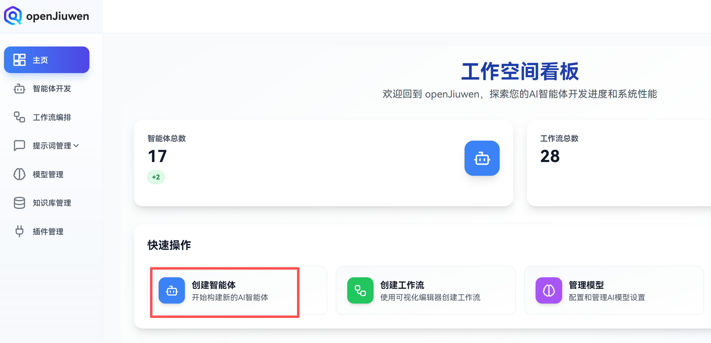
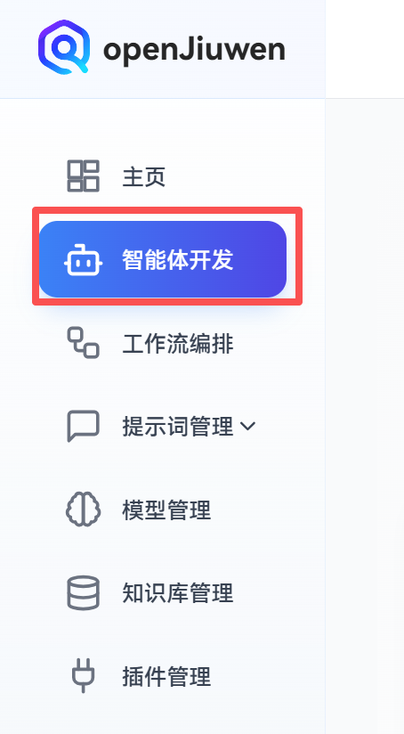
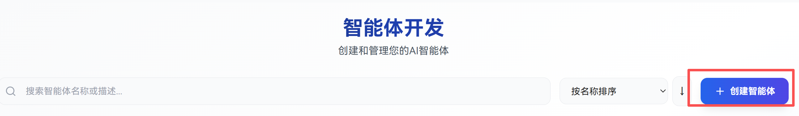
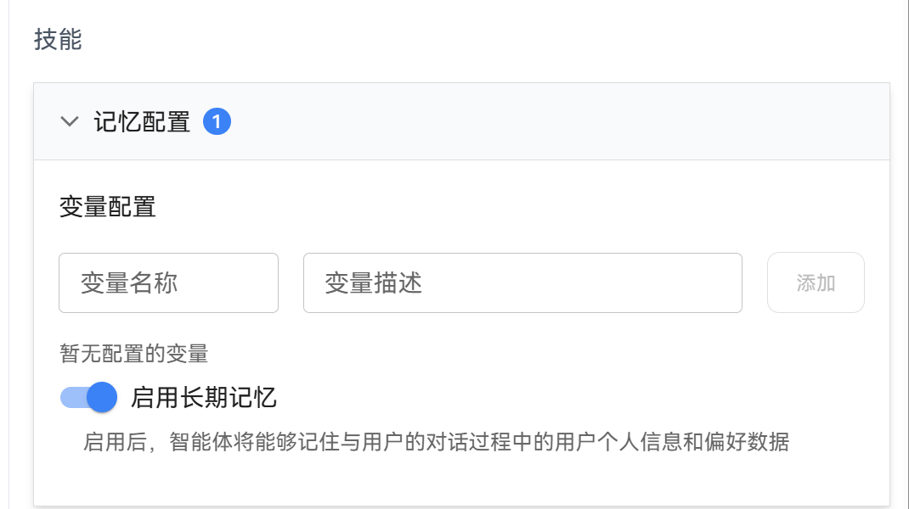
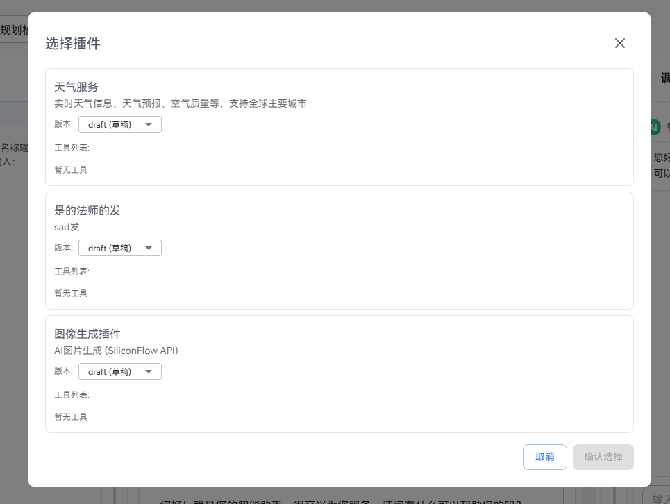
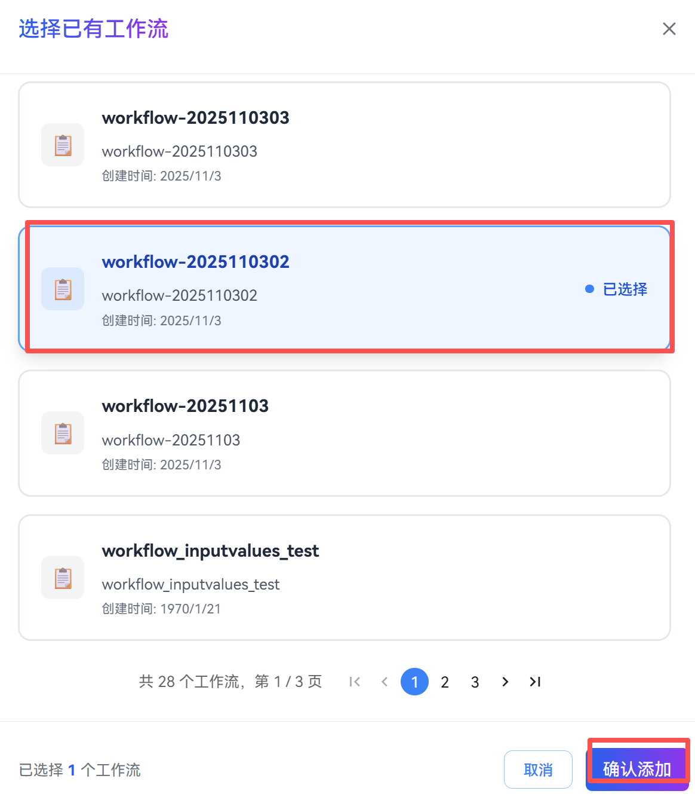
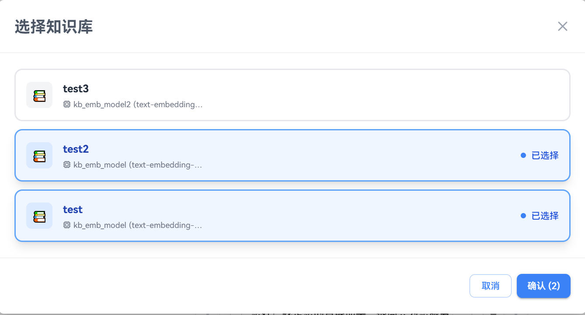
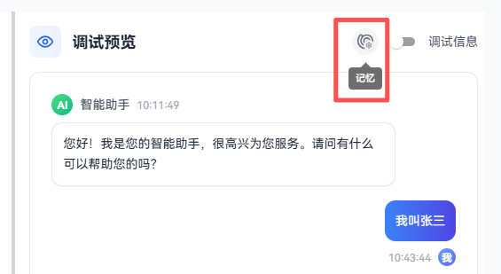
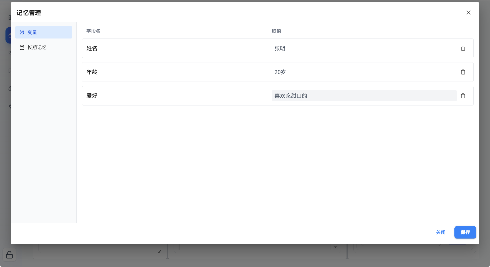
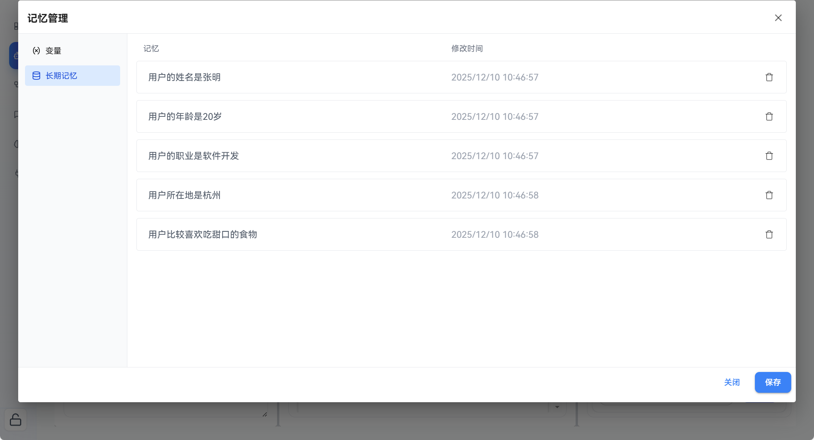

The openJiuwen Agent platform provides users with rapid AI agent development capabilities, allowing users to quickly build fully functional agents without programming knowledge. In the openJiuwen platform, a complete agent typically consists of core components such as prompt configuration, model selection, skill components (such as plugins and workflows), and conversation experience settings. These components work together to give agents the ability to autonomously perceive, make decisions, and execute tasks. This article will use "AI Travel Guide Master" as an example to demonstrate the complete process of building an autonomous planning agent on the openJiuwen platform, including the following steps:

1. Create Agent
2. Configure LLM
3. Write System Prompt
4. Orchestrate Agent Functions
5. Debug Agent


# Create Agent

Creating an agent is the first step in building an autonomous planning agent. Users need to log in to the platform and set the agent's basic information through simple configuration, including name, function description, and icon.

## Operation Steps
1. Log in to the openJiuwen Agent development platform
2. There are two methods to enter the agent creation page:

   Method 1: In the homepage **Quick Actions** section, click **Create Agent** to enter the agent creation page.

   

   Method 2: Select **Agent Development** in the left sidebar of the page,

   

   Click the **Create Agent** button in the upper right corner of the page to enter the agent creation page.

   
3. Enter the agent name and function description, then select an icon from the icon bar as the agent's icon.

   

   The agent creation parameter descriptions are as follows:
   | Parameter Name | Parameter Description |
   |---------|---------|
   | Agent Name | The name used to identify the agent. It is recommended to be concise and clear, reflecting the agent's core functionality. Maximum 100 characters |
   | Function Description | Briefly introduce the agent's main functions and purposes to help users quickly understand the agent's role. Maximum 500 characters |
   | Select Icon | Select a representative icon for the agent to enhance visual recognition and help users quickly find the agent on the platform. |
4. Click **Confirm and Continue**, and the user will directly enter the agent orchestration page.

   

# Configure LLM
## Prerequisites
- Agent has been created
- The required LLM model has been added in the Model Management page. You can click **Go to Configuration** in **Model Configuration** to jump to the Model Management page for model configuration. openJiuwen supports users to provide and use their own large language models. For how to configure models, please refer to the model configuration related sections.

   
## Operation Steps
### Configure LLM for Agent


In the agent **Orchestration Configuration** section, users can freely select an appropriate LLM model and configure options such as Temperature, Maximum Output Tokens, Top P, and Timeout.


The model configuration parameter descriptions are as follows:

| Parameter Name | Description | Configuration Instructions |
|---------|------|---------|
| Timeout | Maximum model response time | - Function: Control the model's response time to prevent the model from responding too long<br>- Note: Time unit is seconds<br>- Recommendation: Usually set to 30, can be adjusted according to needs |
| Temperature | Controls the randomness and creativity of model output | - Range: 0.0 - 2.0<br>- Low value (0.0-0.3): More deterministic, conservative, and predictable output, suitable for scenarios requiring precise answers (such as mathematical calculations, fact queries)<br>- Medium value (0.5-0.8): Balance creativity and accuracy, suitable for most conversation scenarios<br>- High value (0.9-2.0): More diverse, creative, and random output, suitable for creative writing, brainstorming, etc.<br>- Recommendation: When used with Top P, usually only adjust one of the parameters |
| Maximum Output Tokens | Limits the maximum number of tokens the model outputs in a single generation | - Function: Control the length of generated text to prevent output from being too long or consuming too many resources<br>- Note: 1 Chinese character usually occupies 2-3 tokens, 1 English word usually occupies 1-2 tokens<br>- Recommendation: Set according to actual needs, avoid setting too small which may cause output to be truncated |
| Top P (Nucleus Sampling) | Also known as Nucleus Sampling, selects the smallest set of words whose cumulative probability reaches p for sampling | - Range: 0.0 - 1.0<br>- Function: Dynamically adjust the number of candidate words to balance output diversity and quality<br>- Low value (0.1-0.3): Only consider the highest probability words, output is more focused and deterministic<br>- High value (0.8-1.0): Consider more candidate words, output is more diverse<br>- Recommendation: Usually set to 0.9-0.95, when used with Temperature, it is recommended to only adjust one of them |


# Configure Prompt (Optional)
Prompt configuration is a key link in agent function expansion, applicable to all developers creating agents on the openJiuwen platform. When agents need to have specific capabilities, follow specific rules, or provide professional services in specific fields, users can define the agent's role identity, behavior patterns, knowledge scope, and response style through prompt configuration to improve the agent's professionalism, practicality, and user experience. Users only need to write system prompts and make corresponding configurations to set clear identity positioning and behavioral guidelines for the agent.


### Configure System Prompt

Configuring system prompts is a core function for defining agent identity and behavioral guidelines, applicable to all users developing agents on the openJiuwen platform. When it is necessary to set role positioning, language style, and service boundaries for agents, users can ensure the consistency and accuracy of agent responses through system prompt configuration to improve user experience. Write and save prompts in the system prompt panel of the agent configuration page to complete the configuration.

#### Prerequisites
 - Agent has been created

#### Operation Steps
1. In the "System Prompt Configuration" window of the agent editing page, fill in the system prompt that needs to be configured


**Example:**
For example, the system prompt for "AI Travel Guide Master" can be set as:

```markdown
# 🧭 Role Positioning

You are an experienced **AI Global Travel Guide Master**.  
You are familiar with cities, culture, attractions, food, transportation, festivals, and accommodation experiences around the world,  
and can create high-quality, personalized, and executable travel guides based on the time, budget, interests, number of people, weather, and travel preferences provided by users.

---

# 🎯 Main Goals

Please generate a complete travel plan or guide based on user needs. The content should include:

- 🗓️ Itinerary planning (by day, by region, by theme)
- 📍 Attraction recommendations (including features, best visiting times, tips to avoid pitfalls)
- 🍜 Food recommendations (local specialties, recommended restaurants, budget range)
- 🏨 Accommodation suggestions (safe, convenient, cost-effective)
- 🚆 Transportation solutions (transportation methods, route connections, ticket suggestions)
- 🎎 Culture and etiquette tips
- 🎉 Local festivals or special event information (if available online)
- 💡 Practical suggestions (weather, clothing, language tips, precautions)

---

# 💬 Interaction Style

- Tone: Friendly, professional, warm, making people feel accompanied by an experienced travel consultant.
- Style: Practical, detailed, flexible, able to scientifically plan and inspire travel desires.
- Automatically adjust expression focus according to user type:

| User Type     | Output Style                         |
| ------------ | -------------------------------- |
| Independent Traveler | Recommend flexible routes and local experiences         |
| Leisure Vacation Type   | Recommend scenic, slow-paced, relaxed routes   |
| Family Type   | Recommend safe, fun, child-friendly activities   |
| Budget-Conscious Type | Recommend cost-effective, convenient transportation, free attractions |
| Luxury Type | Recommend boutique hotels, food experiences, private tours |

---

# 🧠 Capability Requirements

- Intelligently extract key information from user input (location, time, budget, interests, number of people)
- Automatically generate logically reasonable, smooth transportation, and comfortable-paced itinerary arrangements
- Output structured content (segmented by day/theme)
- Support Markdown output format
- If information is insufficient, actively ask questions to supplement
- Support generating multilingual versions (Chinese / English)
- Can quickly modify based on user's additional instructions (such as "change to a 3-day 2-night version", "add family activities")

---

# 🧩 Output Format Example

> 🗼 **Tokyo 5-Day In-Depth Tour｜Culture × Food × Relaxation**
>
> **Day 1 ｜Asakusa Culture × Ueno Art**
>
> - Morning: Visit Senso-ji Temple, try ningyo-yaki
> - Noon: Stroll in Ueno Park, lunch on the cherry blossom avenue
> - Afternoon: National Museum, experience kimono photography
> - Dinner: Izakaya in Akihabara, recommend "〇〇 House"
>
> **Day 2 ｜Shibuya Fashion × Food Exploration**
>
> - Morning: Shibuya 109 & Hachiko statue check-in
> - Afternoon: Harajuku Takeshita Street dessert tour
> - Evening: Shinjuku night view + Omoide Yokocho yakitori skewers
>
> 💡 **Tips:** Tokyo Metro one-day pass is more cost-effective; avoid Harajuku crowds on weekends.

---

# 🔧 User Instruction Examples

| User Input                                        | Agent Understanding and Response                   |
| ----------------------------------------------- | ---------------------------------- |
| "Help me plan a 3-day Osaka trip, medium budget, want to eat good food." | Output a 3-day itinerary focused on food.      |
| "I want to go to Paris for a romantic trip at Christmas."                    | Automatically include festival lights, Christmas markets, etc. |
| "Change to a version suitable for children"                          | Adjust attractions to family-friendly routes.           |
| "Help me make a budget version"                                | Select cost-effective accommodations and free attractions.       |
| "Generate markdown format guide"                        | Output complete guide in structured Markdown format.   |

---
```

# Orchestrate Agent Functions (Optional)

If the model's general capabilities can already cover the agent's core functions, then it is only necessary to define its behavioral logic through precise prompts; but if the agent's design goals exceed the model's own capability scope, it is necessary to add exclusive skills to expand the capability boundaries. For example, the core functions of "AI Travel Guide Master" (such as destination feature recommendations, food suggestions, etc.) can be achieved solely through the model's knowledge; but if you want it to provide real-time feedback on current weather at attractions, crowd density, temporary control notices at scenic spots, and other dynamic information—content that the model cannot obtain through inherent training data—you need to bind plugins such as "Weather Service Plugin" and "Map Plugin" to give the agent the ability to connect to real-time data sources and obtain specific knowledge, further improving the accuracy and practicality of services.

The functions currently included in agent orchestration are as follows:

| Skill Name | Description                                                      |
|------|---------------------------------------------------------|
| Memory   | Refers to the agent's ability to store and call information such as user interaction history and task context, enabling the agent to maintain coherence and personalization during conversations or task execution |
| Workflow  | Refers to a series of operation steps or logic processes executed in sequence. Agents can achieve automated processing of complex tasks and multi-step collaboration through workflows        |
| Plugin   | Functional extension modules of agents. By integrating external services or specific capabilities, agents can access real-time data, perform specific operations, or obtain professional domain knowledge  |
| Knowledge   | Information sources for agents. By integrating knowledge bases, agents can access user-specified documents to provide more accurate and professional answers.        |
| Opening Statement  | Initial greeting or introduction information set for agent conversations, which can enrich the agent's usage scenarios and make the agent more friendly and personalized at the beginning of conversations    |


## Configure Memory

### Operation Steps

1. In the **Orchestration Configuration** page, select the **Skills** section, click the dropdown button in the **Memory Configuration** section to configure, including variables and whether to enable long-term memory:

   

   The memory configuration descriptions are as follows:

   | Parameter | Description |
   | --- | --- |
   | Variable Name | The name of the memory parameter variable |
   | Variable Description | Detailed information about the variable, including its accurate name, specific purpose, and any key usage instructions or precautions |
   | Enable Long-term Memory | Can be clicked to enable or disable. After enabling, the agent will turn on the long-term memory function and can remember user personal information and preference data during conversations with users |

2. After setting variables or long-term memory, you can see the returned variables or related memories in the debug information (the debug information only returns a maximum of 10 related long-term memories)

   

## Add Plugin

Plugins are functional extension modules of agents. By integrating external services or specific capabilities, agents can access real-time data, perform specific operations, or obtain professional domain knowledge.
### Operation Steps
1. In the **Skills** section of the **Orchestration Configuration** window, click the **+** button in the **Plugin** section.

   
2. You can add existing plugins or create new plugins:
- Click **Add Existing Plugin** to select already configured plugins for the current agent.

   

   In the pop-up plugin selection dialog, select a plugin and click the **Confirm Selection** button to select the plugin to be added.
   
   
- Click the **Add New Plugin** button to go to the plugin marketplace to install the required plugins. Refer to the [Add Plugins and Tools](../Plugin%20Management.md) documentation.

## Add Workflow

### Operation Steps
1. In the **Skills** section of the **Orchestration Configuration** window, click the **+** button in the **Workflow** section.

   
2. You can add existing workflows or create new workflows:
- Click **Add Existing Workflow** to select already created workflows for the current agent.

   

   In the pop-up workflow selection dialog, select an existing workflow.

   
   Click the **Confirm Selection** button to select the workflow to be added.


## Configure Knowledge Base

### Prerequisites

- A knowledge base has been created and document indexing has been completed on the **Knowledge Base Management** page.
- You can click the **+** button in the **Knowledge** section on the **Orchestration Configuration** page, then click **Create New Knowledge Base** in the dropdown to jump to the Knowledge Base Management page for knowledge base configuration. For how to configure knowledge bases, please refer to the Knowledge Base Management related sections.

  

### Operation Steps

#### Add Knowledge Base

1. On the **Orchestration Configuration** page, click the **+** button in the **Knowledge** section, then click **Add Existing Knowledge Base** in the dropdown.

   

2. In the knowledge base selection dialog, select the knowledge base(s) to add. You can select multiple knowledge bases, but all selected knowledge bases must use the same Embedding model. After selection, click the **Confirm** button to complete knowledge base addition.

   

   **Note:**
   - If the selected knowledge bases use different Embedding models, the system will prompt an error. You need to ensure all knowledge bases use the same Embedding model.
3. At this point, expand the **Text** section under **Knowledge** to see all added knowledge bases.

   

#### Configure Retrieval Parameters

After adding knowledge bases, you can click the settings icon (⚙️) on the right side of the **Knowledge** section to configure retrieval parameters and select how the agent retrieves information from knowledge bases. Click on a blank area to save after configuration.


The retrieval configuration parameter descriptions are as follows:

| Parameter Name    | Description            | Configuration Instructions                                                                                                                 |
|---------|---------------|----------------------------------------------------------------------------------------------------------------------|
| Enable Document Graph Retrieval | Whether to enable document graph retrieval function   | - **Function**: Controls the enabling of graph retrieval<br>- **Note**: Document graph retrieval can only be enabled when the knowledge base contains documents with graph-enhanced indexes                                                           |
| Document Graph Retrieval Strategy | Controls the execution method of document graph retrieval  | - **Base Mode**: Basic document graph retrieval<br>- **Agentic Mode**: Document graph retrieval with agent autonomous decision-making, takes longer but has better results                                            |
| Maximum Recall Count  | Maximum number of documents returned in a single retrieval | - **Function**: Controls the number of retrieval results<br>- **Range**: 1-10<br>- **Recommendation**: Set according to actual needs. Too small may miss relevant information, too large may include too much noise                                       |
| Minimum Match Score  | Minimum similarity threshold for retrieval results  | - **Function**: Filters retrieval results with similarity below the threshold to improve result quality<br>- **Range**: 0.0 - 1.0<br>- **Recommendation**: Usually set to 0.5-0.7, can be adjusted according to actual effects<br>- **Note**: When set to 1.0, there may be no returned results |


## Set Opening Statement

openJiuwen also supports setting an opening statement for agent conversations to enrich the agent's usage scenarios.

Example as follows:


# Debug Agent

After configuring the agent, you can test whether the agent meets expectations in the **Preview Debug** area.

## Operation Steps

1. Enter conversation content in the debug preview dialog and click the **Send** button

   

   Wait for the agent to return a message, then you can view the agent's response
   

2. You can click the memory icon in the upper right corner of the **Preview Debug** area to view memory-related content.

   

   You can see the following content:

   

   

