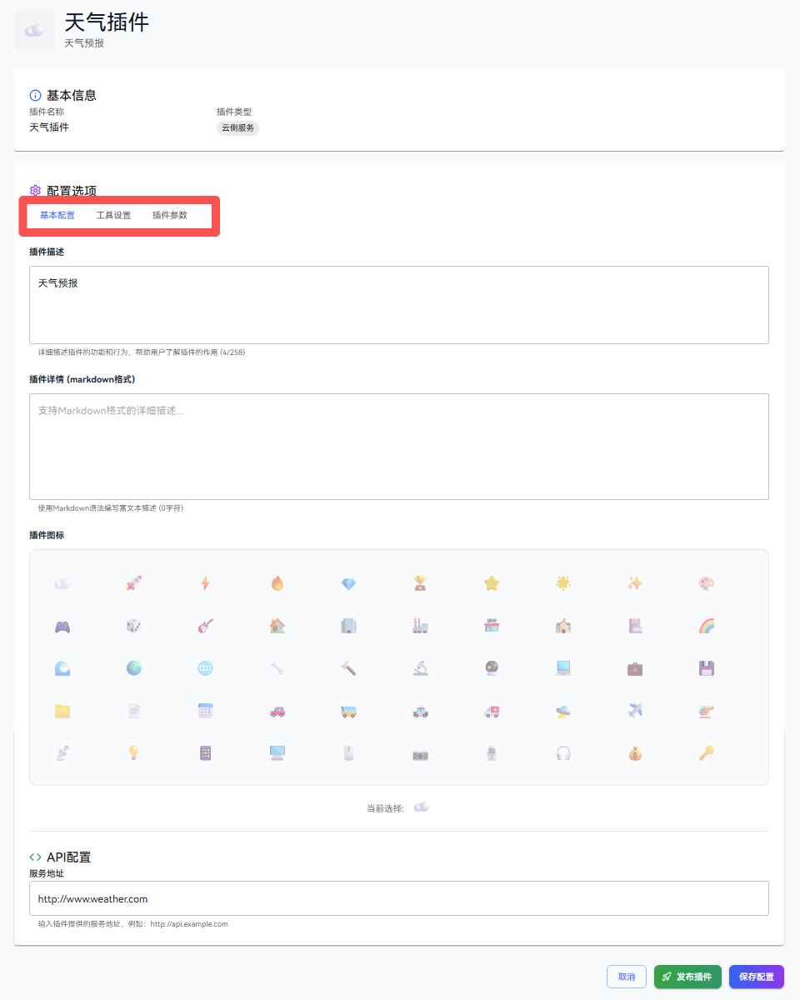
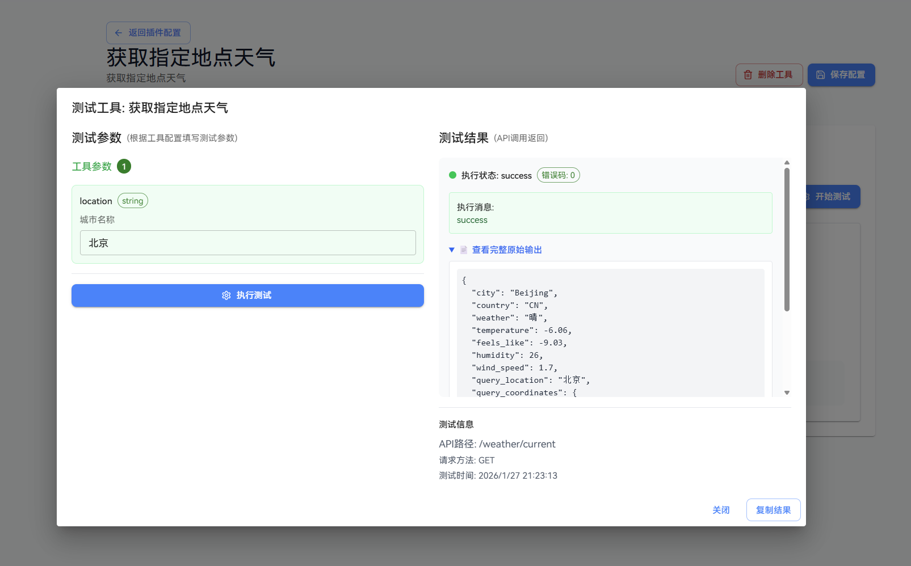
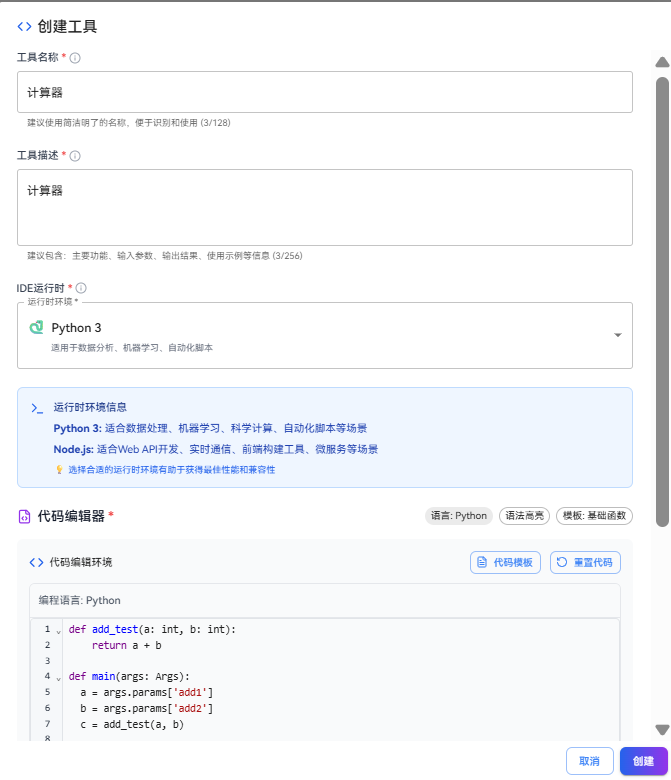
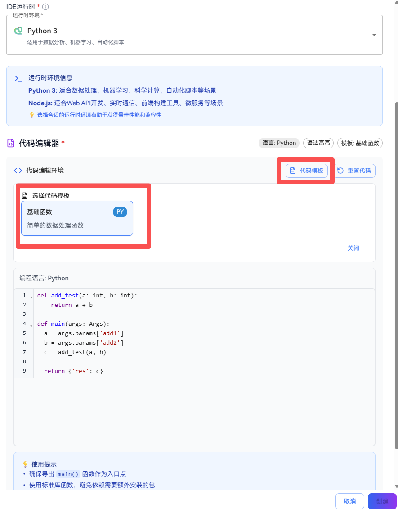
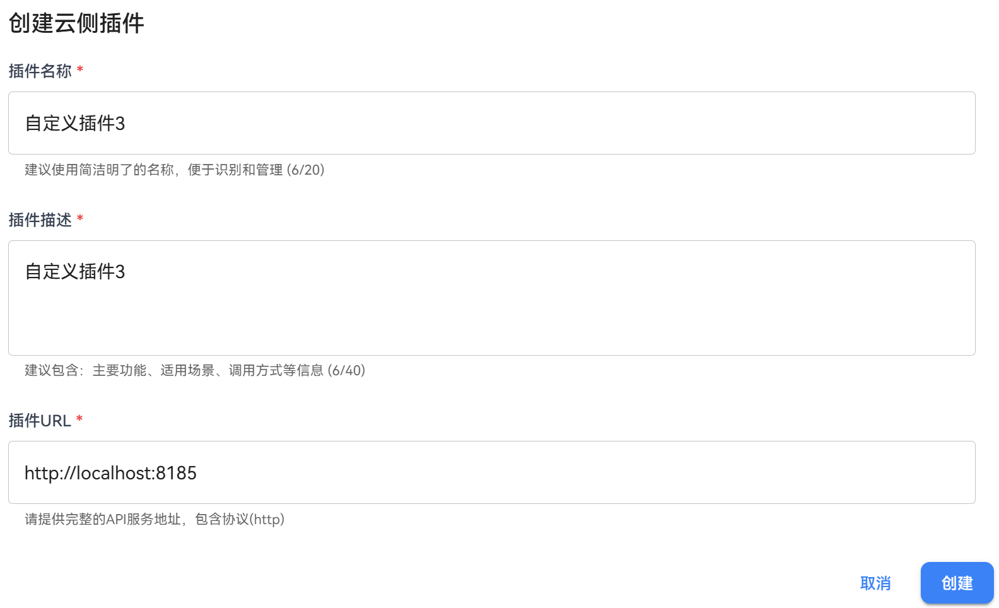

# Plugin Management

In the openJiuwen platform, plugins are a key method for extending the capabilities of workflows and agents. The platform supports three types of plugins: local custom plugin servers, external API calls, and code plugins. Each plugin can include multiple tools, and these tools must belong to the same domain. Each tool corresponds to an independent API.

# Add Plugin and Tool
In openJiuwen, you can add plugins in the following two ways:

`Cloud Plugin-Create plugin based on existing service`: Create from an existing service
Connect to an existing service, which can be either a custom plugin service you are running locally via [Running the Plugin Service in the Background](#run-plugin-service-in-background), or an external API that follows the RESTful format.

`IDE Plugin-Create in IDE`: Create manually code plugin
Define plugin tools by writing code and run the code plugin by [Starting the Local Sandbox Service](../../2.Installation%20Guide/Local%20Installation/Windows_Installation.md#windows-sandbox).


## Method 1: Create Plugin Based on Existing Service
If the Service Request URL and request parameter information of a deployed plugin are known, users can create a plugin directly based on that Service URL.

### Prerequisites
1. The plugin service must be deployed, and the Service URL and request parameter information must be known. If users need to deploy the plugin service themselves, please refer to the section [Run Plugin Service in Background](#run-plugin-service-in-background).

### Example
Assume a user has a deployed weather plugin service. Plugin parameters can be configured with public parameters such as api-key (example: 1234567890). The service URL is https://example.com/plugin/weather. Its interface for obtaining weather at a specified location has the path /weather/current. This service interface uses the GET method and specifies the location via the location field in the request query, allowing retrieval of weather information for that location. Users can create a plugin based on this service URL.

### Add a Plugin Steps
1. Log in to the openJiuwen platform.

2. Navigate to the **Plugin Management** module in the left sidebar.

3. Click the **Install Plugin** button and select **Cloud Plugin-Create plugin based on existing service**.
   
   

4. Fill in the plugin information, then click **Create Plugin** button:
   
   
   
   Configuration for creating a cloud-side plugin is as follows:
   
   | Configuration Item | Description |
   |:-----:|:---------------------------- |
   | Plugin Name | The display name of the plugin, used to identify the plugin. |
   | Plugin Description | A description of the plugin's functionality, helping users understand its purpose. |
   | Plugin Details | Detailed description of the plugin, supports markdown format, helps users understand the plugin's detailed configuration method. |
   | Service URL | The **Base URL** of the service corresponding to the plugin. The plugin will call service interfaces via this URL. |

5. After creation, on the plugin configuration page, you can modify the basic configuration, configure the tools within the plugin, or adjust the plugin parameters.

   

6. Click **Plugin Parameter** to set parameters for plugin.

     

   Notes:
   - Plugin parameters can set public parameters, such as api-key, which will be automatically added to request parameters when calling the plugin service.
   - Plugin parameters can set non-runtime parameters, which require setting default values. Agents or workflows do not need to fill in input when calling the plugin, and cannot see this parameter, the default value will be used.
   - Required parameters: Plugin parameters can be set as required parameters, which must be filled in when calling the plugin, otherwise an error will be reported.
   
### Add Tool Steps

1. Click **Tool Setting** and add a tool for the plugin by click **Add Tool** button.
   

2. Fill in the tool information
   

   **Fill in Create Tool Information:**
   
   | Configuration Item | Description |
   |:-----:|:---------------------------------------------------------------------------------------------------------------------------- |
   | Tool Name | Enter the display name of the tool. |
   | Tool Description | Describe the function of the tool. |
   | API Path | Enter the specific API Endpoint path.<br>Example: If the Service URL is `http://localhost:8000` and the weather query API path is `/weather`, the full URL will be `http://localhost:8000/weather`. |

3. Create input parameters for the tool:
   
   

   Example of filling in input parameters:

      
   
   **Input Parameter Configuration**
   
   |  Configuration Item  | Description                                                                                                                                                                                            |
   |:--------------------:|:-------------------------------------------------------------------------------------------------------------------------------------------------------------------------------------------------------|
   |    Parameter Name    | The identifier of the parameter.                                                                                                                                                                       |
   |     Description      | Explanation of the parameter's purpose.                                                                                                                                                                |
   |    Parameter Type    | string, number, boolean, etc.                                                                                                                                                                          |
   |     Send Method      | GET support Query\Header, POST support Query\Header\Body                                                                                                                                               |
   |       Required       | Whether the parameter is mandatory.                                                                                                                                                                    |
   | Un-Runtime Parameter | True: a default value for the parameter must be set. This default value will be automatically used as the actual input parameter for each invocation.                                                  |
   
   Example configuration of finished input parameters:
   
   
   
4. After creating the tool, the user can proceed to test them. Navigate to the **Testing** module, enter the required parameters, and click the **Execute Test** button.
   
   

   If the test result is `success`, the tool's status will be changed to `Enabled`. If the tool’s parameters are subsequently modified, its status will be automatically reverted to `Disabled`.

5. Other parameter settings

   **Output Parameter Configuration**
   
   | Configuration Item | Description |
   |:----:|:----------------------- |
   | Field Name | The name of the field in the returned data. |
   | Field Type | string, number, object, etc. |
   | Description | Explanation of the field's meaning. |
   
   **Header Configuration**
   
   | Configuration Item | Description |
   |:------:|:------------------------------ |
   | Custom Headers | You can set custom HTTP request headers. |
   | Supported Standard Headers | Standard headers like Content-Type, Authorization, etc. |

6. After creation is complete, plugins that have been created can be managed in the installed plugins list on the **Plugin Management** page.

## Method 2: Manually Create Local Code Plugin
openJiuwen supports manually creating local code plugins. Users can write code directly (currently supports Python and JavaScript), and the written code is provided as a plugin for use.

### Steps
1. Log in to the openJiuwen platform.

2. Navigate to the **Plugin Management** module in the left sidebar.

3. Click the **Install Plugin** button and select **IDE Plugin-Create in IDE**.
   
   

4. Fill in plugin information, described as follows:
   
   | Configuration Item | Description |
   |:------:|:--------------------------- |
   | Plugin Name | The display name of the plugin, used to identify the plugin. |
   | Plugin Description | A description of the plugin's functionality, helping users understand its purpose. |

5. Click the **Create Plugin** button to create the plugin and enter the plugin editing page.
   
   

6. In the **Tool Settings** under **Configuration Options**, click the **Add Code Tool** button to add a code tool.   

   

7. In the **Create Tool** dialog box, fill in the tool information and edit the code in the editor. Click the **Create** button when finished. The parameter descriptions are as follows:

   | Configuration Item | Description |
   |:------:|:--------------------------- |
   | Tool Name | The display name of the tool, used to identify the tool. |
   | Tool Description | A description of the tool's functionality, helping users understand its purpose. |
   | IDE Runtime | The language environment in which the code executes, currently supports Python, JavaScript |

   

8. After creating a tool, the system automatically redirects to the **Plugin Management** page, where you can configure the tool’s basic information, set input and output parameters, define the execution code, and perform testing.

    

### Example

Suppose a user wants to design a custom calculator plugin, where the plugin's function is to perform operations with custom operators. An example of creating a local code plugin is as follows:


The example for configuring a code tool is as follows:

1. Click the code template to retrieve a code example:

   Code Template:
   ```python
   def add_test(a: int, b: int):
       return a + b
   
   # The main function follows a fixed format
   # You can access input variables from the tool via `args.params`, where Args is a built-in sandbox function
   # The output variable adheres to the fixed template: {'output_name': output}
   def main(args: Args):
     a = args.params['add1']
     b = args.params['add2']
     c = add_test(a, b)
   
     return {'res': c}
   ```

2. After clicking `Create`, edit the input parameters. According to the code example, there are two input parameters: `add1` and `add2`, both of type int.


3. Edit the output parameters. According to the code example, there is one output parameter named `res`, of type int.


4. After saving the configuration, click the `Start Test` button on the testing page, enter the required content, then click `Execute Test` to obtain the test result.

   

   If the test result is `success`, the tool's status will be changed to `Enabled`. If the tool’s parameters are subsequently modified, its status will be automatically reverted to `Disabled`.

# <a id="run-plugin-service-in-background"></a> Run Plugin Service in Background
If users need to customize a plugin, they can refer to the current openJiuwen studio backend code examples to run the plugin service in the background. Then, when installing the plugin, they can select the plugin running in the background.

## Steps

1. Refer to the `plugin_server/routers/demo_router.py` code to write the interface information and business logic for the plugin tool.
   
      ```python
   from fastapi import HTTPException, Query

   from . import BasePluginRouter

   demo_router = BasePluginRouter(
       name="demo",
       description="your_demo_tool_description",
   )

   @demo_router.router.get("/run")
   async def run_demo(
       query: str = Query(..., description="query parameter description")
   ):
       try:
           return {
               "result": "success",
               "query": query,
           }
       except Exception as e:
           raise HTTPException(
               status_code=500,
               detail=f"run failed: {str(e)}"
           ) from e

   # Register endpoint information
   demo_router.register_endpoint("GET", "/run", run_demo, "run demo")
   ```

   The current `plugin_server/routers/demo_router.py` code defines a `/demo/run` GET interface. This interface accepts a query parameter and returns success along with the query parameter value.

2. Refer to the `plugin_server/run_restful.py` code to start the custom plugin service.

   ```python
   import uvicorn
   from dotenv import load_dotenv

   from restful_tool_router import app

   # Load environment variables from .env file
   load_dotenv()

   # Define main function (called by script entry point)
   def main():
      # Try multiple startup methods
      try:
         # Method 1: Standard way
         uvicorn.run(app, host="0.0.0.0", port=8185)
      except TypeError as e:
         if "loop_factory" in str(e):
               # Method 2: Compatible way
               import asyncio
               config = uvicorn.Config(app, host="0.0.0.0", port=8185)
               server = uvicorn.Server(config)
               asyncio.run(server.serve())
         else:
               raise

   if __name__ == "__main__":
      main()
   ```

   You need to specify the host and port. The default values are 0.0.0.0 and 8135 respectively.

3. To call this interface, configure the plugin URL as http://localhost:8185 in the cloud-side plugin creation popup.

   

   Refer to the **Add Tools to Plugin** section to configure the interface information. Add a `/demo/run` tool for the plugin. An example of the test result is as follows:
   
   
