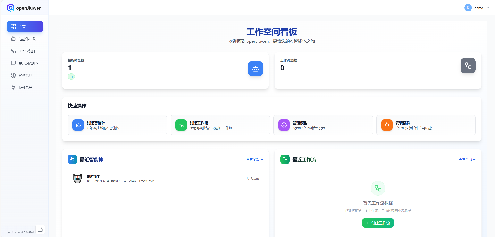
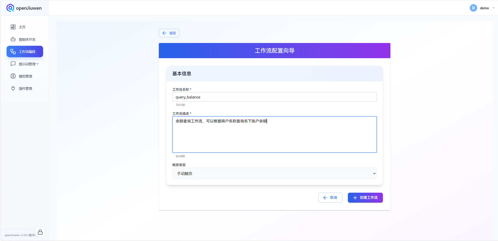
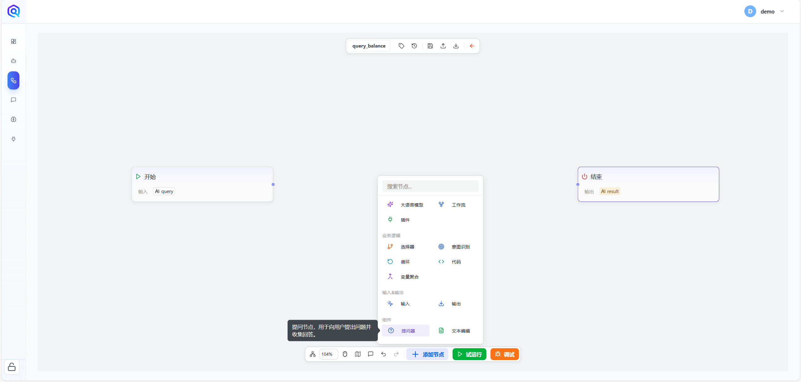
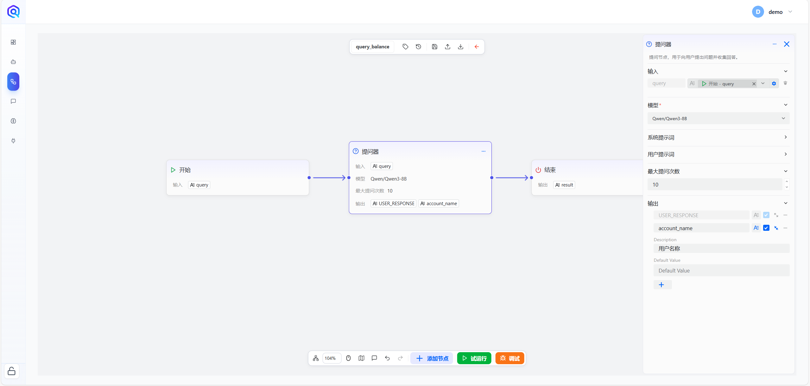
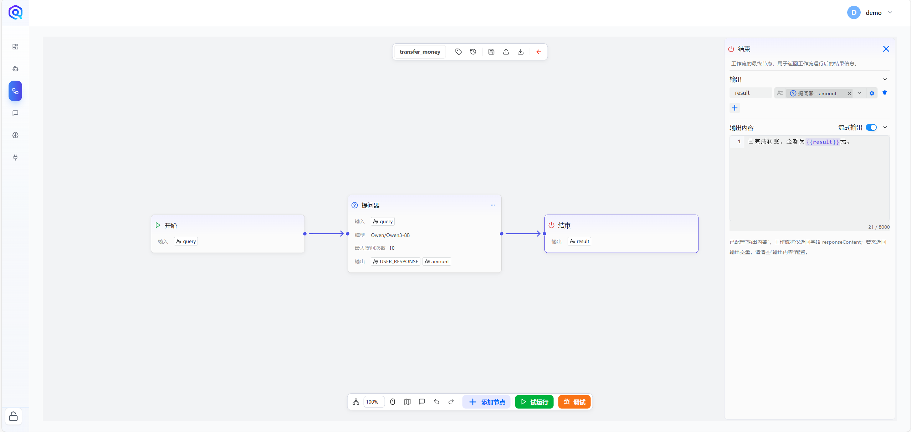
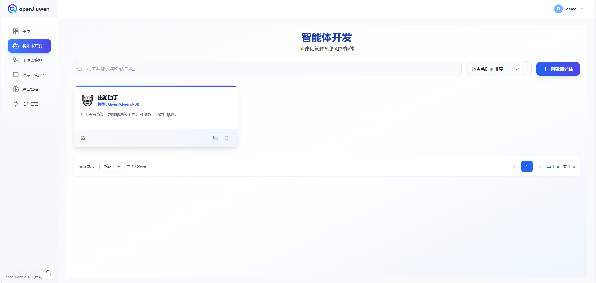
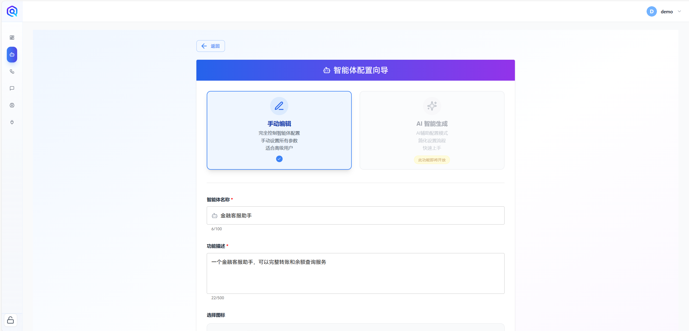
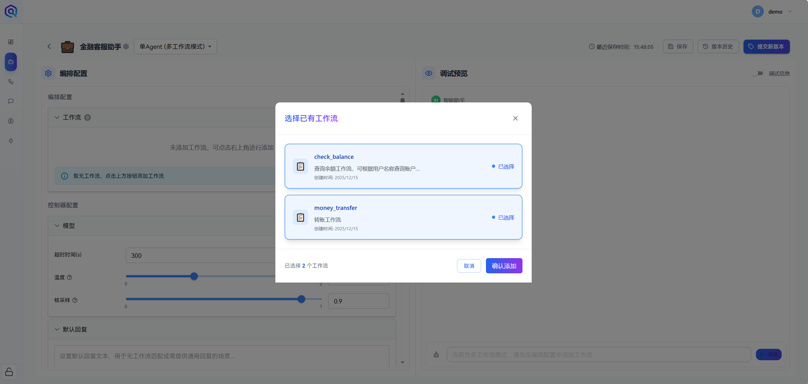
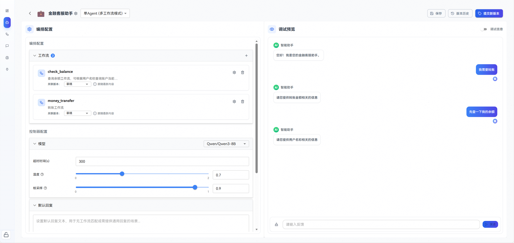
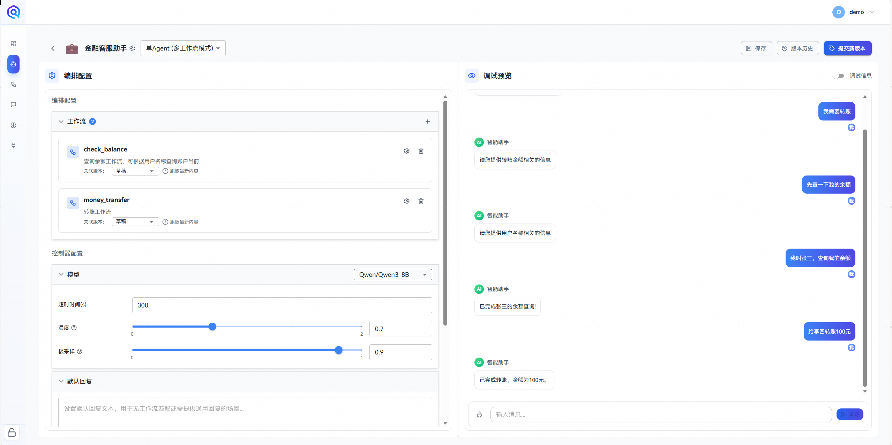

This article introduces a method for implementing a **multi-workflow intelligent agent** based on **openJiuwen** using a low-code development approach.

## 1. Building Workflows

Before constructing the intelligent agent, it is necessary to prepare the corresponding workflows. This article demonstrates the process using two example workflows: **Balance Inquiry Workflow** and **Transfer Workflow**.

### 1. Balance Inquiry Workflow Setup

This workflow is used to simulate a balance inquiry scenario.

- **Step 1**: On the homepage, click **“Create Workflow”** to enter the workflow development interface.  
  

- **Step 2**: Enter the workflow name `query_balance` and the description  
  `Balance inquiry workflow, which can query account balances under a user’s name`,  
  then click **“Confirm Creation”**.  
  

- **Step 3**: Add a **Questioner** node on the canvas and configure it according to the illustrations.  
    
  

- **Step 4**: In the **End** node, concatenate the output of the Questioner into the predefined output and enable **streaming output**.  
  

  At this point, the balance inquiry workflow setup is complete.

### 2. Transfer Workflow Setup

This workflow is used to simulate an account transfer scenario.

- **Step 1**: Following the same process as the balance inquiry workflow, create a new workflow and enter the canvas.  
  

- **Step 2**: Add a **Questioner** node and configure the parameters to be asked in the node settings.  
  

- **Step 3**: Connect all nodes properly and enable **streaming output** in the **End** node.  
  

  At this point, the transfer workflow setup is complete.

## 2. Building a Multi-Workflow Intelligent Agent

After completing the preparation of the two workflows above, you can start building a multi-workflow intelligent agent.

- **Step 1**: Enter the intelligent agent development interface and click **“Create Agent”**.  
  

- **Step 2**: Enter the agent name `Financial Customer Service Assistant` and the function description  
  `A financial customer service assistant that can provide complete transfer and balance inquiry services`.  
  

- **Step 3**: The default agent mode is `Autonomous Planning Mode`. Manually switch it to `Multi-Workflow Mode`.  
  

- **Step 4**: In the orchestration configuration, add the two created workflows, and configure the opening greeting in the conversation settings.  

After completing the above steps, a financial customer service assistant based on multi-workflow mode is successfully built.  

## 3. Effect Testing

Now let’s test the results.

First, enter the question `I need to make a transfer` in the chat box on the right. The agent correctly uses the Questioner in the transfer workflow to ask the user relevant questions.  

Next, input `Let me check my balance first`. You can see that the agent exits the current workflow and switches to the balance inquiry workflow, asking the user for the name to be queried.  

Then, tell the agent `My name is Zhang San, check my balance`. The agent successfully resumes the current workflow and completes the balance inquiry.  

Finally, input `Transfer 100 yuan to Li Si`. The agent restores the previous workflow state and completes the transfer operation.  

