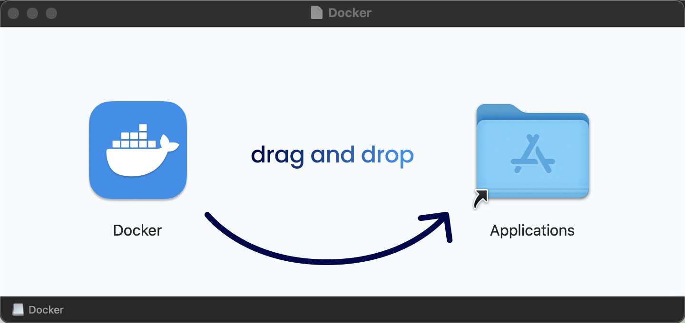

本指南介绍在 MacOS 系统采用 Docker 方式安装 openJiuwen。

## 一、环境准备

请确保机器满足以下要求：

* 硬件：
  * CPU：最低 2 核，推荐 4 核及以上
  * RAM：最低 4GB，推荐 8GB 及以上

* 操作系统：MacOS14.0（Sonoma）及以上

* 软件
  * Git：运行以下命令进行安装：
    ```
    /bin/bash -c "$(curl -fsSL https://raw.githubusercontent.com/Homebrew/install/HEAD/install.sh)" # 若未安装Homebrew

    brew install git
    ```

  * Docker：推荐使用 Docker Desktop 进行安装，安装方法详见下文

### 安装 Docker Desktop

* 下载：访问 <a href="https://www.docker.com/products/docker-desktop/" rel="nofollow">Docker Desktop 官网</a>，点击 “Download for Mac” 获取 .dmg 安装包。；
* 双击下载的文件，将 **Docker** 图标 拖拽到 Applications 文件夹；

  

* 打开 Launchpad，找到并启动 Docker 应用；
* 首次运行时，系统会提示输入 macOS 密码以授权安装虚拟机组件，点击 OK 继续；
* 首次启动需等待 Docker 完成初始化（下载基础镜像，约需几分钟）。

* 至此 Docker Desktop 安装完成。

> **说明**：若安装过程中出现报错，请参考 <a href="https://docs.docker.com/desktop/setup/install/windows-install/" rel="nofollow">Docker Desktop 官方安装指导</a>。


## 二、openJiuwen 安装

### 1. 下载版本包（若已获取版本包跳过此步骤）

* 单击版本下载链接，下载对应版本包至本地。

  x86_64 架构下载链接：<a href="https://openjiuwen-ci.obs.cn-north-4.myhuaweicloud.com/agentstudio/deployTool_v0.1.1_amd64.tar" target="_blank" rel="nofollow noopener noreferrer">openJiuwen v0.1.1</a>

  arm 架构下载链接：<a href="https://openjiuwen-ci.obs.cn-north-4.myhuaweicloud.com/agentstudio/deployTool_v0.1.1_arm64.tar" target="_blank" rel="nofollow noopener noreferrer">openJiuwen v0.1.1</a>

### 2. 启动 openJiuwen

* 新建 *openJiuwen 安装目录*，将版本包放至安装目录并解压。

* 进入 *openJiuwen 安装目录*。

* 在运行前，请先运行以下命令升级bash：

  ```
  brew install bash
  ```

  > **说明**：若需要启用记忆功能，可参考 [如何启用记忆功能](#docker-macos-memory) 进行配置。

* 进入 *service.sh* 所在目录，打开**终端**，输入以下命令启动 openJiuwen：

  ```bash
  ./service.sh up
  ```

* 启动成功后会输出 

  Local access: *本地访问地址*

  Network access: *网络访问地址*

### 3. 访问系统

* 若在本地查看，复制上述 *本地访问地址* 到浏览器地址栏，按下“回车键”将看到 openJiuwen 的界面。

* 若在外部机器查看，复制上述 *网络访问地址* 到浏览器地址栏，按下“回车键”将看到 openJiuwen 的界面。

## 三、常见问题（FAQ）

### <a id="docker-macos-memory"></a>问题一：如何启用记忆功能

记忆功能的体验与大模型的参数规模相关。
  
记忆功能的运行依赖向量模型，以下流程以华为云为例，介绍向量模型的获取步骤。


* 点击<a href="https://console.huaweicloud.com/modelarts/?locale=zh-cn&region=cn-southwest-2#/model-studio/square" target="_blank" rel="nofollow noopener noreferrer"> 链接</a> 进入模型广场。 

* 点击 “向量模型”，找到 BGE-M3 模型。

  

* 找到 BGE-M3 模型后点击推理调用，进入模型信息获取界面。

  

* 记录API地址（对应 EMBED_API_BASE）、model参数（对应 EMBED_MODEL_NAME）。

* 点击 “API Key 管理”，按照官方界面引导获取 API Key（对应 EMBED_API_KEY）。

* 获取向量模型信息后，请在 *openJiuwen 的安装目录* 进行如下配置：

* 若是初次启动 openJiuwen 平台，请在 *.env.custom* 中添加 embedding 相关的信息：

  | 变量名 | 变量说明 |
  | --- | --- |
  | **EMBEDDING_MODEL_DIMENTION**         | 嵌入模型的维度，根据EMBED_MODEL_NAME选择的模型确定                |
  | **EMBED_API_BASE**                    | 嵌入模型的接口地址                                                  |            
  | **EMBED_MODEL_NAME**                  | 嵌入模型的名称                                                             |
  | **EMBED_API_KEY**                     | 嵌入模型的API密钥，换成自己的                                                 |
  | **EMBED_TIMEOUT**                     | 嵌入模型的最大等待时间<br>默认为`200` |
  | **EMBED_MAX_RETRIES**                 | 嵌入模型请求失败时的最大重试次数<br>默认为`1000`                 |

* 配置完成后启动 openJiuwen 平台即可使用记忆功能。

* 若是在启动 openJiuwen 之后启用记忆功能，请在 *.env* 文件同级目录运行 `cp .env.xxxxx .env`（xxxxx为需要使用记忆功能的容器运行时生成的随机码，可以通过docker ps -a查看），在 *.env* 中添加 embedding 相关的信息；配置完成后，重新启动 openJiuwen 平台使配置生效即可使用记忆功能：

  ```
  ./service.sh up -f .env
  ```

> **注意**：在配置 *EMBEDDING_MODEL_DIMENTION* 之后启用了记忆，请不要再次修改，否则记忆功能会无法使用。embedding模型的其他配置也不建议修改，可能会影响效果。

### 问题二：openJiuwen 包含的 Docker 镜像清单
  
| 镜像名 | 镜像版本                     | license       | 源码地址                                                     |
| ------ | ---------------------------- | ------------- | ------------------------------------------------------------ |
| mysql  | 8.4.5                        | GPL 2.0       | <a href="https://github.com/mysql/mysql-server/tree/mysql-8.4.5" target="_blank" rel="nofollow noopener noreferrer"> 源码链接</a>       |
| minio  | RELEASE.2024-12-18T13-15-44Z | GNU AGPL 3.0      | <a href="https://github.com/minio/minio/tree/RELEASE.2024-12-18T13-15-44Z" target="_blank" rel="nofollow noopener noreferrer"> 源码链接</a> |
| milvus | 2.6.2                       | Apache 2.0    | -                                                            |
| etcd   | 3.5.18                      | Apache 2.0    | -                                                            |

### 问题三：如何停止 openJiuwen

输入以下命令停止 openJiuwen：

```
./service.sh down
```