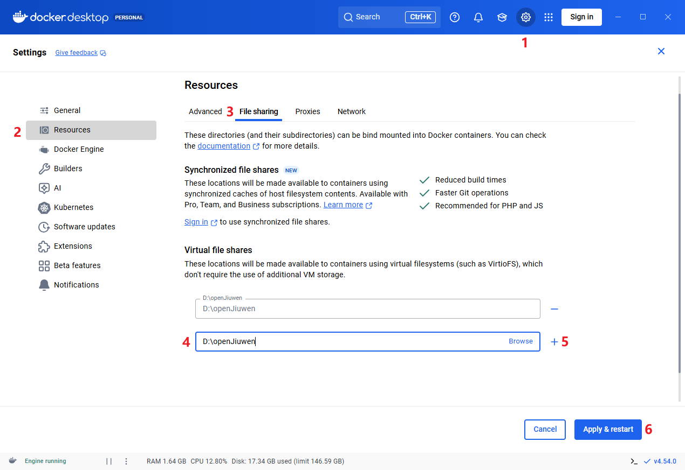

本指南介绍在 Windows 系统采用 Docker 方式安装 openJiuwen。

## 一、环境准备

请确保机器满足以下要求：

* 硬件：
  * CPU：最低 2 核，推荐 4 核及以上
  * RAM：最低 4GB，推荐 8GB 及以上

* 操作系统：Windows10及以上

* 软件
  * Git：点击 <a href="https://mirrors.huaweicloud.com/git-for-windows/v2.51.0.windows.1/Git-2.51.0-64-bit.exe" target="_blank" rel="nofollow noopener noreferrer"> 下载</a> 进行下载并安装
  * Docker：推荐使用 Docker Desktop 进行安装，安装方法详见下文

### 安装Docker Desktop
Window 上运行 Docker Desktop 依赖虚拟化功能。

**1. 启用虚拟化功能**

* 按下 `Win+R` → 输入 `optionalfeatures.exe` 打开「Windows 功能」窗口；

* 勾选「Hyper-V」下的 **所有子选项** → 点击「确定」：

  > **说明**：若无「Hyper-V」选项，请参考 <a href="https://docs.docker.com/desktop/setup/install/windows-install/" target="_blank" rel="nofollow noopener noreferrer"> 官方指导</a> 安装 Docker Desktop。

  
* 安装完成后，请重启电脑；
* 重启后，**请再次确认上述 Hyper-V 选项已勾选**。

**2. 安装 Docker Desktop**

* 下载：前往 <a href="https://www.docker.com/products/docker-desktop/" target="_blank" rel="nofollow noopener noreferrer"> Docker 官网</a> 下载 Windows 版本安装包（X86 机器请选择 AMD64 版本）；
* 运行安装包：​**取消勾选​「Use WSL 2 instead of Hyper-V」选项**，跟随向导完成安装：

  
* 安装完成后，请重启电脑；
* 重启后，打开 Docker Desktop，等待加载完成（首次启动可能需要 5 ~ 10 分钟）；
* Docker Desktop 启动后，若临时试用，可点击欢迎界面的 `Continue without signing in` 直接进入；长期使用请参考 <a href="https://docs.docker.com/desktop/setup/sign-in" target="_blank" rel="nofollow noopener noreferrer"> 官方指导</a>。

* 至此 Docker Desktop 安装完成。

> **说明**：若安装过程中出现报错，请参考 <a href="https://docs.docker.com/desktop/setup/install/windows-install/" target="_blank" rel="nofollow noopener noreferrer"> Docker Desktop 官方安装指导</a>。


## 二、openJiuwen 安装

### 1. 下载版本包

* 单击版本下载链接，下载对应版本包至本地。

  x86_64 架构下载链接：<a href="https://openjiuwen-ci.obs.cn-north-4.myhuaweicloud.com/agentstudio/deployTool_v0.1.0-beta_amd64.tar" target="_blank" rel="nofollow noopener noreferrer">openJiuwen v0.1.0-beta</a>

  arm 架构下载链接：<a href="https://openjiuwen-ci.obs.cn-north-4.myhuaweicloud.com/agentstudio/deployTool_v0.1.0-beta_arm64.tar" target="_blank" rel="nofollow noopener noreferrer">openJiuwen v0.1.0-beta</a>

* 新建 *openJiuwen 安装目录*，将版本包移至安装目录并解压。

### 2. Docker Desktop 设置 Virtual file shares

* 打开 Docker Desktop，按照图示步骤，在序号 4 处输入 *openJiuwen 的安装目录*（例如：`D:\openJiuwen`）；

* 点击 “Apply & restart” 重启 Docker Desktop。

  

### 3. 启动 openJiuwen
* 进入 *openJiuwen 安装目录*。

* 进入 *service.sh* 所在目录，在空白处右键打开 Git Bash，输入以下命令确认 Docker Desktop 已启动：

  ```bash
  docker info >nul 2>&1 && (echo Docker Desktop 已启动) || (echo Docker Desktop 未启动)
  ```
  > **说明**：若提示 “Docker Desktop 未启动”，请参考 <a href="https://docs.docker.com/desktop/setup/install/windows-install/" target="_blank" rel="nofollow noopener noreferrer"> Docker Desktop 官方指导</a>。

  > **说明**：若需要启用记忆功能，可参考 [如何启用记忆功能](#docker-windows-memory) 进行配置。

* 输入以下命令启动 openJiuwen：

  ```bash
  ./service.sh up
  ```

* 启动成功后会输出 Local access：*访问地址*。

### 4. 访问系统

复制上述 *访问地址* 到浏览器地址栏，按下“回车键”将看到 openJiuwen 的界面。

### 5. 停止 openJiuwen

请输入以下命令停止 openJiuwen：

```
./service.sh down
```

## 三、常见问题（FAQ）

### <a id="docker-windows-memory"></a>问题一：如何启用记忆功能

记忆功能的体验与大模型的参数规模相关。
  
记忆功能的运行依赖向量模型，以下流程以华为云为例，介绍向量模型的获取步骤。

* 点击<a href="https://console.huaweicloud.com/modelarts/?locale=zh-cn&region=cn-southwest-2#/model-studio/square" target="_blank" rel="nofollow noopener noreferrer"> 链接</a> 进入模型广场。 

* 点击 “向量模型”，找到 BGE-M3 模型。

  

* 找到 BGE-M3 模型后点击推理调用，进入模型信息获取界面。

  

* 记录API地址（对应 EMBED_API_BASE）、model参数（对应 EMBED_MODEL_NAME）。

* 点击 “API Key 管理”，按照官方界面引导获取 API Key（对应 EMBED_API_KEY）。

* 获取向量模型信息后，请在 *openJiuwen 的安装目录* 进行如下配置：

* 若是初次启动 openJiuwen 平台，请在 *.env.custom* 中添加 embedding 相关的信息：

  | 变量名 | 变量说明 |
  | --- | --- |
  | **EMBEDDING_MODEL_DIMENTION**         | 向量模型的维度，根据 EMBED_MODEL_NAME 选择的模型确定                |
  | **EMBED_API_BASE**                    | 向量模型的接口地址                                                  |            
  | **EMBED_MODEL_NAME**                  | 向量模型的名称                                                             |
  | **EMBED_API_KEY**                     | 向量模型的 API 密钥                               |
  | **EMBED_TIMEOUT**                     | 向量模型的最大等待时间 |
  | **EMBED_MAX_RETRIES**                 | 向量模型请求失败时的最大重试次数                 |

* 配置完成后启动 openJiuwen 平台即可使用记忆功能。

* 若是在启动 openJiuwen 之后启用记忆功能，请在 *.env* 文件同级目录运行 `cp .env.xxxxx .env`（xxxxx为需要使用记忆功能的容器运行时生成的随机码，可以通过docker ps -a查看），在 *.env* 中添加 embedding 相关的信息；配置完成后，重新启动 openJiuwen 平台使配置生效即可使用记忆功能：

  ```
  ./service.sh up -f .env
  ```

> **注意**：在配置 *EMBEDDING_MODEL_DIMENTION* 之后不要再次修改。

### 问题二：openJiuwen 包含的 Docker 镜像清单

| 镜像名 | 镜像版本                     | license       | 源码地址                                                     |
| ------ | ---------------------------- | ------------- | ------------------------------------------------------------ |
| mysql  | 8.4.5                        | GPL 2.0       | <a href="https://github.com/mysql/mysql-server/tree/mysql-8.4.5" target="_blank" rel="nofollow noopener noreferrer"> 源码链接</a>       |
| minio  | RELEASE.2024-12-18T13-15-44Z | GNU AGPL 3.0      | <a href="https://github.com/minio/minio/tree/RELEASE.2024-12-18T13-15-44Z" target="_blank" rel="nofollow noopener noreferrer"> 源码链接</a> |
| milvus | 2.6.2                       | Apache 2.0    | -                                                            |
| etcd   | 3.5.18                      | Apache 2.0    | -                                                            |
