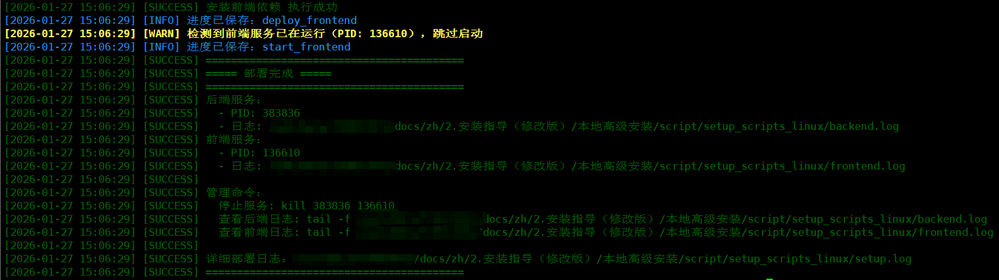

本指南介绍在 Linux 系统采用本地方式安装 openJiuwen。本地高级安装提供两种方法：

* **方法一：使用一键安装部署脚本**：自动完成大部分安装和配置工作，包括前后端和所有依赖服务，简化安装流程，适合快速部署。
* **方法二：全部手动安装**（不推荐）：需要手动安装和配置所有依赖服务，适合需要灵活调整配置的开发者。

## 一、环境准备

请确保机器满足以下要求：

* 硬件：
  * CPU：最低 2 核，推荐 4 核及以上
  * RAM：最低 4GB，推荐 8GB 及以上

* 操作系统：
  * Ubuntu：最低 Ubuntu 20.04，推荐 Ubuntu 22.04 (Jammy) 及以上
    > **注意**：Ubuntu 官方与主流软件源已停止支持 Ubuntu 20.04 (Focal) 及以下版本系统。
  * EulerOS：Huawei Cloud EulerOS 2.0及以上

* 软件（安装方法详见下文）	 
  * Git 2.40及以上 
  * Node.js 20.0及以上 
  * npm 10.0及以上 
  * Python 3.11及以上 
  * uv 0.5.0及以上 
  * MySQL 8.0及以上 
  * Milvus 2.6.2及以上

## 二、安装方法

### 方法一：使用一键安装部署脚本

一键安装脚本可以自动完成基础工具检查、代码拉取、环境配置和服务启动等步骤，大幅简化安装流程。

#### 1. 获取安装脚本

* 下载 <a href="https://openjiuwen-ci.obs.cn-north-4.myhuaweicloud.com/agentstudio/setup_scripts/setup_scripts_linux_v2.zip" target="_blank" rel="nofollow noopener noreferrer"> 安装包脚本</a>，安装包脚本包含以下文件：
  * `setup.sh`：主安装脚本，串联整个安装流程
  * `check_curl.sh`：检查并安装 curl
  * `check_git.sh`：检查并安装 Git
  * `check_nodejs.sh`：检查并安装 Node.js（通过 NVM）
  * `check_python.sh`：检查并安装 Python 3.11
  * `fetch_codes.sh`：克隆 agent-studio 代码仓库

#### 2. 运行安装脚本

* 进入脚本目录：

  ```bash
  cd setup_scripts_linux
  ```

* 运行主安装脚本（脚本会自动检查和修复执行权限）：

  ```bash
  # 默认使用 MySQL 数据库
  ./setup.sh

  # 或指定使用 SQLite 数据库
  ./setup.sh --db_type=sqlite
  ```

  > **注意**：如果遇到权限问题，可以手动赋予执行权限：`chmod +x *.sh`，或使用 `bash setup.sh` 执行。

* 脚本会自动执行以下步骤：
  1. 检查并安装基础工具（curl、git、nodejs、python）
  2. 拉取 agent-studio 代码仓库
  3. 生成 AES 密钥
  4. 配置 .env 文件（根据 --db_type 参数设置数据库类型）
  5. 部署后端服务（创建虚拟环境、安装依赖、启动服务）
  6. 部署前端服务（安装依赖、启动服务）

* 脚本执行完成后，会输出后端和前端服务的PID、日志文件路径、前端页面访问地址，在浏览器中访问输出的页面访问地址即可进入openJiuwen界面。

 

#### 3. 脚本常用参数说明

  ```bash
  # 查看前后端服务状态和访问地址
  ./setup.sh --status
  
  # 停止后端和前端服务
  ./setup.sh --stop

  # 重启后端和前端服务
  ./setup.sh --restart

  # 查看脚本支持的所有参数
  ./setup.sh --help
  ```


### 方法二：全部手动安装（不推荐）

> **注意**：此方法需要手动安装所有依赖服务，步骤复杂，不推荐使用。建议优先使用方法一或方法二。

进行正式安装前需先完成依赖的安装，再执行源码获取和安装等后续步骤。

#### 1. 安装依赖（以下以 Ubuntu 22.04 为例）

##### 1.1. 安装 Git

* 运行以下命令安装Git：

  ```bash
  sudo apt update
  sudo apt install git
  ```

##### 1.2. 安装 Node.js 和 npm

* 运行以下命令安装 Node.js 和 npm：

  ```bash
  sudo apt update
  sudo apt install -y nodejs

  # 确认 node 与 npm 版本号
  node -v && npm -v
  ```
  > **注意**：部分 linux 系统软件源 nodejs 与 npm 版本较老，如 node 版本号低于 20.0 或 npm 版本号低于10.0，请参考 <a href="https://nodejs.org/zh-cn/download" target="_blank" rel="nofollow noopener noreferrer"> nodejs 官网</a> 安装新版本。

##### 1.3. 安装 Python 和 uv

* 运行以下命令安装 Python3.11：

  ```bash
  sudo add-apt-repository ppa:deadsnakes/ppa

  sudo apt update
  sudo apt install python3.11 python3-pip
  ```
  > **注意**：Deadsnakes PPA 已停止支持 Ubuntu 20.04 (Focal) 及以下版本系统。如您的系统为上述版本，请参考 <a href="https://www.anaconda.com/docs/getting-started/miniconda/install" target="_blank" rel="nofollow noopener noreferrer"> Miniconda 官方指导</a> 使用 conda 创建 Python 3.11 环境。

* 运行以下命令安装 uv：

  ```bash
  pip3 install uv
  ```

  > **注意**：若安装失败，请参考 <a href="https://uv.doczh.com/getting-started/installation/#_1" target="_blank" rel="nofollow noopener noreferrer"> uv 官方指导</a> 。
  

##### 1.4. 安装 MySQL（可选组件）

* **SQLite vs MySQL**：
  * SQLite 无需额外安装和配置，适合开发和测试环境，但功能受限（如不支持高并发写入、无用户权限管理等）。
  * MySQL 功能更完善，能够满足复杂场景的需求，因此在实际工程和生产环境中更推荐使用。

###### 1.4.1 SQLite

* **说明**：默认使用 SQLite，只需 `.env.example` 保持 `DB_TYPE` 为 `sqlite` 即可直接启动后端服务，无需额外安装或配置。

###### 1.4.2 MySQL

* **说明**：若需使用 MySQL，请将 `.env.example` 中的 `DB_TYPE` 改为 `mysql`，并按照下列步骤完成 MySQL 的安装与配置。

* 运行以下命令安装 MySQL：

  ```bash
  sudo apt update
  sudo apt install mysql-server
  sudo apt install libmysqlclient-dev pkg-config build-essential python3-dev
  ```

* 安装完成后，运行以下命令登录 MySQL：
   
  ```bash
  sudo mysql -u root
  ```

* 在 MySQL 中执行以下命令创建数据库：
  > 说明：`your_user_name`、`your_password` 需自行设置，后续配置 .env 文件将会用到。

  ```sql
  # 新建数据库
  CREATE DATABASE openjiuwen_agent;
  CREATE DATABASE openjiuwen_ops;
  # 新建 MySQL 用户
  CREATE USER 'your_user_name'@'localhost' IDENTIFIED BY 'your_password';
  # 用户授权并刷新
  GRANT ALL PRIVILEGES ON openjiuwen_agent.* TO 'your_user_name'@'localhost';
  GRANT ALL PRIVILEGES ON openjiuwen_ops.* TO 'your_user_name'@'localhost';
  FLUSH PRIVILEGES;
  ```

##### 1.5. Milvus（可选组件）

* **说明**：`.env.example` 默认使用 Chroma，只需保持 `INDEX_MANAGER_TYPE` 为 `chroma` 即可直接启动后端服务，无需额外安装或配置；若需使用 Milvus，请将 `.env.example` 中的 `INDEX_MANAGER_TYPE` 改为 `milvus`，并参考 [如何启用记忆及知识库功能](#linux-memory) 完成 Milvus 的安装配置。

* **Chroma vs Milvus**：
  * Chroma 无需额外安装，配置简单，只需要获取向量模型，适合快速体验，适合开发和测试环境。 向量模型的获取可参考 [如何获取向量模型](#linux-embed-model)。
  * Milvus 功能更完善，能够满足复杂场景的需求，因此在实际工程和生产环境中更推荐使用。

#### 2. openJiuwen 安装

##### 2.1. 获取源码

* 请确认已获取 <a href="https://gitcode.com/org/openJiuwen" target="_blank" rel="nofollow noopener noreferrer"> openJiuwen 代码仓</a> 的访问权限，若无权限请及时申请。

* 在 gitcode 代码仓按照图示步骤 2 获取 Git 的全局配置，输入以下命令配置 Git：

  ```bash
  git config --global user.name your_username
  git config --global user.email your_useremail
  ```

  

* 按照图示步骤 3 获取个人访问令牌，克隆代码时需要输入 gitcode 账号以及个人访问令牌。

* 执行以下命令克隆源码并进入源码根目录：

  ```bash
  # 安装过程需要多次 git 操作，建议配置凭证存储，避免认证错误。
  git config --global credential.helper store

  git clone https://gitcode.com/openJiuwen/agent-studio.git
  cd agent-studio
  ```

##### 2.2. 生成 AES 密钥（可选）

* 如果不需要对关键字段加密存储，可跳过当前步骤
* 运行以下命令生成密钥：
  ```bash
  cd backend
    
  bash build_AES_master_key.sh
  ```
* 脚本执行完，会将密钥打屏输出，可按需使用，推荐作为环境变量使用并另行保存。
  ```bash
  export SERVER_AES_MASTER_KEY_ENV=your_aes_key
  ```
* 注意，AES密钥需要保持稳定，中途更换密钥会导致已加密数据无法解密。

##### 2.3. 启动 openJiuwen

* 进入源码根目录；

* 复制 *.env* 文件：
  ```bash
  cp .env.example .env
  ```

* 请在 *.env* 文件中根据实际情况修改以下变量的值（勿覆盖其他变量）：

  > **说明**：DB_HOST、DB_PORT 等变量的值可替换为实际数据库信息，DB_USER、DB_PASSWORD 为上文新建的 MySQL 用户与密码。如果密码中包含特殊字符，可参考 [特殊字符转义表](#linux-special-char) 将特殊字符替换为 URL 编码。

  ```env
   # 配置数据库（样例）
   DB_HOST=localhost
   DB_PORT=3306
   DB_USER=your_user_name
   DB_PASSWORD=your_password

   # 向量索引类型配置（样例，可选值：chroma、milvus，默认值：chroma）
   INDEX_MANAGER_TYPE=chroma
  
   # 记忆数据存储路径（样例，默认值：memory-data,可根据实际情况修改）
   MEMORY_DATA_PATH=memory-data

   # 配置Milvus（样例，仅当 INDEX_MANAGER_TYPE=milvus 时需要配置）
   MILVUS_HOST=127.0.0.1
   MILVUS_PORT=19530
   MILVUS_COLLECTION_NAME=memory_vector

   # 记忆相关配置（如果不使用记忆功能，可以不提供下面的参数）
   EMBEDDING_MODEL_DIMENTION=1024
   EMBED_API_BASE=""
   EMBED_MODEL_NAME=""
   EMBED_API_KEY=""
   EMBED_TIMEOUT=5
   EMBED_MAX_RETRIES=1

   # 配置代码沙箱服务（样例，启动代码执行沙箱服务详情请见[问题二：如何启用沙箱功能]）
   CODE_SANDBOX_URL=http://localhost:8188/run

   # 配置插件服务（样例，启动插件服务详情请见[问题三：如何启用插件服务]）
   VITE_PLUGIN_SERVICE_URL=http://localhost:8185
   VITE_PLUGIN_CONFIG_PATH=/config.json
   ```

  变量说明可参考如下表格，如需选择 Milvus 启用记忆功能，请参考 [如何启用记忆及知识库功能](#linux-memory)，如果选择 Chroma 启用记忆功能，只需要获取向量模型，可参考 [如何获取向量模型](#linux-embed-model)。

   | 变量名                                   | 变量说明                              | 配置样例                                                                      |
   |---------------------------------------|-----------------------------------|---------------------------------------------------------------------------|
   | **DB_HOST**                           | 数据库的主机地址                          | `localhost`                                                               |
   | **DB_PORT**                           | 数据库的端口号                           | `3306`                                                                    |
   | **DB_USER**                           | 数据库的用户名                           | `your_user_name`                                                             |
   | **DB_PASSWORD**                       | 数据库的密码                            | `your_password`                                                         |
   | **INDEX_MANAGER_TYPE**        | 向量数据库类型，可选值：chroma、milvus，默认值：chroma | `chroma`                              |
   | **MEMORY_DATA_PATH**          | 记忆数据存储路径,默认值：memory-data    | `memory-data`                         |
   | **MILVUS_HOST**                 | Milvus服务的主机地址                     | `127.0.0.1`                                                                    |
   | **MILVUS_PORT**                 | Milvus服务的端口                       | `19530`                                                                    |
   | **MILVUS_COLLECTION_NAME**                | Milvus服务的数据库名                     | `memory_vector`                                                                    
   | **EMBEDDING_MODEL_DIMENTION**         | 向量模型的维度，根据EMBED_MODEL_NAME选择的模型确定 | `1024`                                                                    |                  
   | **EMBED_API_BASE**                    | 向量模型的接口地址                         | `https://example.com/embedding_model`            |            
   | **EMBED_MODEL_NAME**                  | 向量模型的名称                           | `text-embedding-model`                                                       |
   | **EMBED_API_KEY**                     | 向量模型的API密钥                        | `sk-xxx`                                                                  |
   | **EMBED_TIMEOUT**                     | 向量模型的最大等待时间（单位秒），默认值`60`             | `5`                                                                     |
   | **EMBED_MAX_RETRIES**                 | 向量模型请求失败时的最大重试次数，默认值`3`              | `1`                                                                    |
   | **CODE_SANDBOX_URL**                 | 代码沙箱服务地址                          | `http://localhost:8188/run`                                                                    |
   | **VITE_PLUGIN_SERVICE_URL**                 | 插件服务地址                            | `http://localhost:8185`                                                                    |
   | **VITE_PLUGIN_CONFIG_PATH**                 | 前端使用的插件服务配置文件                     | `/config.json`                                                                    |

* 在源码根目录下，运行以下命令启动后端服务，并耐心等待：
   
  ```bash
  cd backend
  uv venv
  uv sync
  ```

  > **注意**：如果持续卡死超过 20 分钟，请按下 “Ctrl + C”，尝试修改本目录下 “pyproject.toml” 文件中 [[tool.uv.index]] 的 url 值，切换成其他可用源后，再重新执行 “uv sync”。

  > **注意**：若执行 `uv sync` 失败，可尝试：`uv sync --native-tls`  强制使用系统原生TLS库（解决HTTPS下载兼容问题）

  ```bash
  mkdir -p logs/run
  source .venv/bin/activate
  python main.py
  ```

  启动成功后，会输出 "Application startup complete"。

  > **说明**：若需代码执行沙箱服务，可参考 [如何启用沙箱功能](#linux-sandbox) 完成沙箱服务启动和配置。若需插件服务，可参考 [如何启用插件服务](#linux-plugin) 完成插件服务启动和配置。

* 新打开一个窗口，在源码根目录下，运行以下命令安装依赖：

  ```bash
  cd frontend
  npm install
  ```
  > **注意**：图示漏洞为 npm 官方已知漏洞，不影响后续运行。

  

* 运行以下命令启动前端服务：

  ```
  npm run dev
  ```

* 启动成功后会输出:

  Local：*本地访问地址*

  Network：*网络访问地址*

##### 2.4. 访问系统

  * 若在本地查看，ctrl+左键单击 *本地访问地址* 可在本地浏览器查看到 openJiuwen 的界面；或者复制上述 *本地访问地址* 到浏览器地址栏，按下“回车键”将看到 openJiuwen 的界面。
  
  * 若在外部机器查看，复制上述 *网络访问地址* 到浏览器地址栏，按下“回车键”将看到 openJiuwen 的界面。

## 三、常见问题（FAQ）

<a id="linux-memory"></a>
### 问题一：如何启用记忆及知识库功能

记忆功能的体验与大模型的参数规模相关。

记忆及知识库功能支持 Chroma 和 Milvus 两种向量数据库，如果选择 Milvus，具体安装步骤可参考下文。

#### 1. 启动 Milvus

* 启动 Milvus 推荐使用 Docker 方式，请参照 <a href="https://docs.docker.com/engine/install/" target="_blank" rel="nofollow noopener noreferrer">Docker 官方安装指南</a> 以及 <a href="https://docs.docker.com/compose/install/" target="_blank" rel="nofollow noopener noreferrer">Docker Compose 官方安装指南</a> 完成配置。
* 安装后请执行命令启动 Docker：`sudo systemctl start docker`。

* 执行以下命令，将在当前目录下保存 “standalone_embed.sh” 脚本

  ```
  curl -sfL https://raw.githubusercontent.com/milvus-io/milvus/master/scripts/standalone_embed.sh -o standalone_embed.sh
  ```
* 执行以下命令拉取镜像：

  ```bash
  # x86 架构
  docker pull swr.cn-north-4.myhuaweicloud.com/openjiuwen/milvusdb/milvus-amd64:v2.6.2
  ```

  ```bash
  # arm 架构
  docker pull swr.cn-north-4.myhuaweicloud.com/openjiuwen/milvusdb/milvus-arm64:v2.6.2
  ```

* 将 “standalone_embed.sh” 文件内的 milvus 官方镜像名（比如： `milvusdb/milvus:v2.6.7`） 内容修改为 对应的镜像名（X86机器镜像名：`swr.cn-north-4.myhuaweicloud.com/openjiuwen/milvusdb/milvus-amd64:v2.6.2`）。
  
* 修改完成后，执行以下命令运行，将 Milvus 作为 Docker 容器启动：

  ```
  bash standalone_embed.sh start
  ```

* 启动后，输入 `docker ps -a` 命令可查看到名为 Milvus-standalone 的 docker 容器在 `19530` 端口启动。

  > **说明**：若在部署过程中出现问题可参考 <a href="https://milvus.io/docs/zh/install_standalone-docker.md" target="_blank" rel="nofollow noopener noreferrer"> Milvus官方指导文档</a>

* 若要停止 Milvus，请执行以下命令

  ```
  bash standalone_embed.sh stop
  ```

* 若启动之后使用记忆或知识库时出现如下报错信息
    ```text
    ""Milvus 连接失败: <MilvusException: (code=2, message=Fail connecting to server on milvus-standalone:19530, illegal connection params or server unavailable)>"
    ```
    需修改.env中的MILVUS_HOST配置，与启动Milvus服务的IP保持一致

<a id="linux-embed-model"></a>
#### 2. 获取向量模型

记忆及知识库功能的运行依赖向量模型，以下流程以华为云为例，介绍向量模型的获取步骤。

* 点击<a href="https://console.huaweicloud.com/modelarts/?locale=zh-cn&region=cn-southwest-2#/model-studio/square" target="_blank" rel="nofollow noopener noreferrer"> 链接</a> 进入模型广场。 

* 体验记忆及知识库功能请点击 “向量模型”，可根据需要自行选择向量模型，以下内容以 BGE-M3 为例。

  

* 找到合适的向量模型后点击推理调用，进入模型信息获取界面。

  

* 记录API地址（对应 EMBED_API_BASE）、model参数（对应 EMBED_MODEL_NAME）。

* 点击 "API Key 管理"，按照官方界面引导获取 API Key（对应 EMBED_API_KEY）。
> **注意**：在配置 *EMBEDDING_MODEL_DIMENTION* 之后启用了记忆，请不要再次修改，否则记忆功能会无法使用。embedding模型的其他配置也不建议修改，可能会影响效果。

<a id="linux-sandbox"></a>
### 问题二：如何启用沙箱功能

若要配置代码插件或在工作流中使用代码节点，需开启沙箱服务，需要进行如下操作：

1. 参考 `sandbox_server/python_server/.env.example` 文件，在 `sandbox_server/python_server` 目录下创建 `.env` 文件，示例如下：

   ```env
   HOST=0.0.0.0
   PORT=5001
   ```

   然后启动沙箱 Python 服务，即运行 `sandbox_server/python_server/openjiuwen_sandbox_pyserver/kernel.py` 脚本，其中 `HOST` 和 `PORT` 是沙箱 Python 服务运行的 IP 和端口。

2. 启动沙箱 JS 服务，运行 `sandbox_server/js_server/kernel.js` 脚本，JS 服务的 IP 和端口参考如下代码：

   ```javascript
   const PORT = process.env.PORT || 5002;
   server.listen(PORT, "0.0.0.0", () => {
     console.log(`✅ JS sandbox listening on http://0.0.0.0:${PORT}`);
   });
   ```

3. 参考 `sandbox_server/gateway/.env.example` 文件，在 `sandbox_server/gateway` 目录下创建 `.env` 文件，示例如下：

   ```env
   ENABLE_LINUX_SANDBOX=0
   HOST=0.0.0.0
   PORT=8188
   PYTHON_SANDBOX_URL=http://localhost:5001/run
   JS_SANDBOX_URL=http://localhost:5002/run
   ```

   其中 `ENABLE_LINUX_SANDBOX` 表示是否启动 bwrap 沙箱，`PYTHON_SANDBOX_URL` 和 `JS_SANDBOX_URL` 为前面两步启动的 Python 和 JS 服务 URL。

   如果需要启动 bwrap 沙箱，请将 `ENABLE_LINUX_SANDBOX` 设置为1，并修改 `sandbox_server/gateway/openjiuwen_sandbox_gateway/conf/sandbox_config.yaml`，确保 Python 解释器和 Js 解释器以及相关依赖都包的路径都在 `mount` 配置中，以及 `PATH` 环境变量中包含了 Python 解释器和 Js 解释器所在路径。示例如下：

   ```
   mount:
   [
     {src: '/lib', dst: '/lib', mode: 'read'},
     {src: '/lib64', dst: '/lib64', mode: 'read'},
     {src: '/usr/bin', dst: '/usr/bin', mode: 'read'},
     {src: '/usr/lib', dst: '/usr/lib', mode: 'read'},
     {src: '/usr/lib64', dst: '/usr/lib64', mode: 'read'},
     {src: '/usr/share/nodejs', dst: '/usr/share/nodejs', mode: 'read'},
   ]

   sandbox:
     type: bubblewrap
     path: bwrap

   interpreter:
     python_path: python3
     node_path: node

   environment:
     PATH: /bin:/usr/bin
   ```

   最后启动沙箱网关服务，即运行 `sandbox_server/gateway/openjiuwen_sandbox_gateway/server.py` 脚本。

4. 启动沙箱服务后请在`.env`文件中配置沙箱服务的路径，例如：`CODE_SANDBOX_URL=http://localhost:8188/run`

<a id="linux-plugin"></a>
### 问题三：如何启用插件服务

若要配置插件，需开启插件服务，需要进行如下操作：

1. 参考 `plugin_server/openjiuwen_plugin_server` 文件，创建所需的插件，然后启动插件服务，即运行 `plugin_server/openjiuwen_plugin_server/run_restful.py` 脚本，其中 `uvicorn.run(app, host="0.0.0.0", port=8185)` 定义了插件服务的 IP 和端口。

2. 启动插件服务后请在`.env`文件中配置插件服务的路径，例如：`VITE_PLUGIN_SERVICE_URL=http://localhost:8185`

<a id="linux-special-char"></a>
### 问题四：特殊字符转义表

| 字符   | URL编码 | 字符   | URL编码 | 字符   | URL编码 | 字符   | URL编码 | 字符   | URL编码 |
|--------|---------|--------|---------|--------|---------|--------|---------|--------|---------|
| 空格 | %20    | "      | %22     | #      | %23     | %      | %25     | &   | %26     |
| (      | %28    | )      | %29     | +      | %2B     | ,      | %2C     | /      | %2F     |
| :      | %3A    | ;      | %3B     | <   | %3C     | =      | %3D     | >   | %3E     |
| ?      | %3F    | @      | %40     | \      | %5C     | \|     | %7C     | -      | -       |

### 问题五：本地安装为何默认使用http协议而非https协议

在本地安装方式下，系统默认通过HTTP协议进行通信。这一设计主要考虑到本地环境通常用于开发与测试，避免强制要求证书配置，从而降低初始使用门槛。
相比之下，Docker安装方式已预置了HTTPS支持，用户无需额外配置即可直接使用安全通信。
如需在本地环境启用HTTPS，开发者需根据实际部署需求自行完成证书生成与配置。