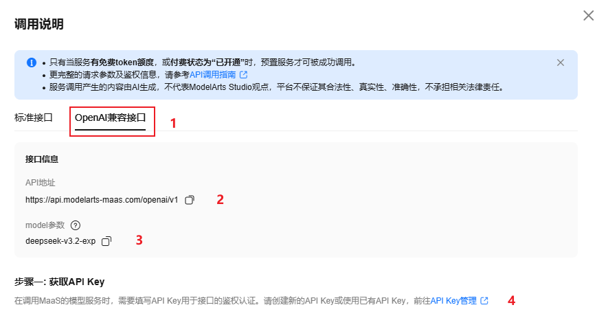
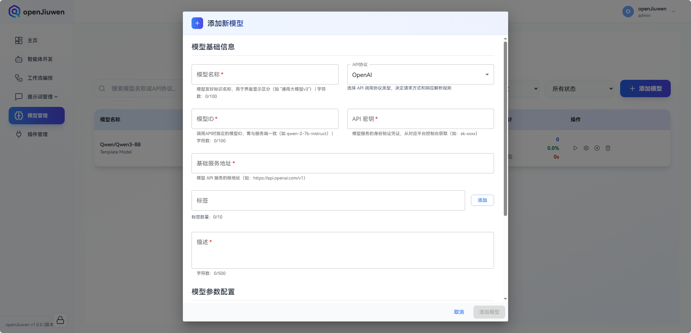
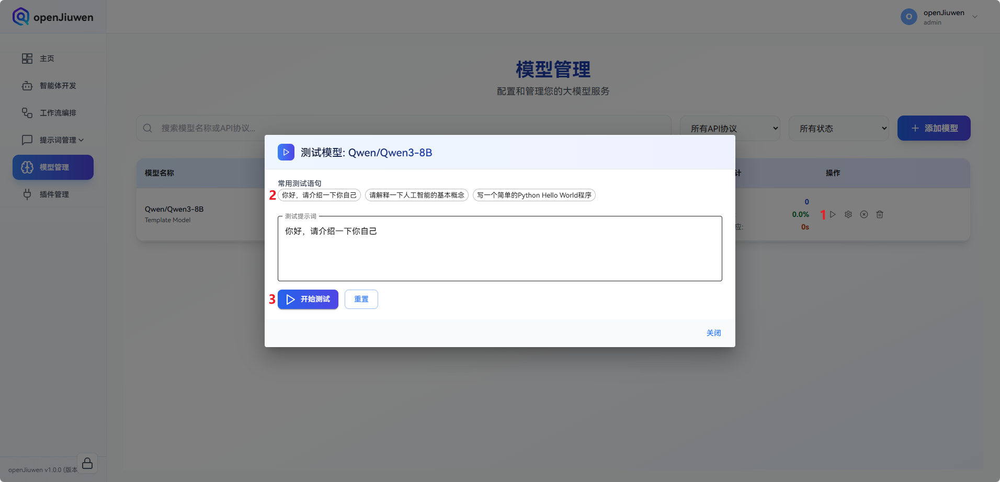
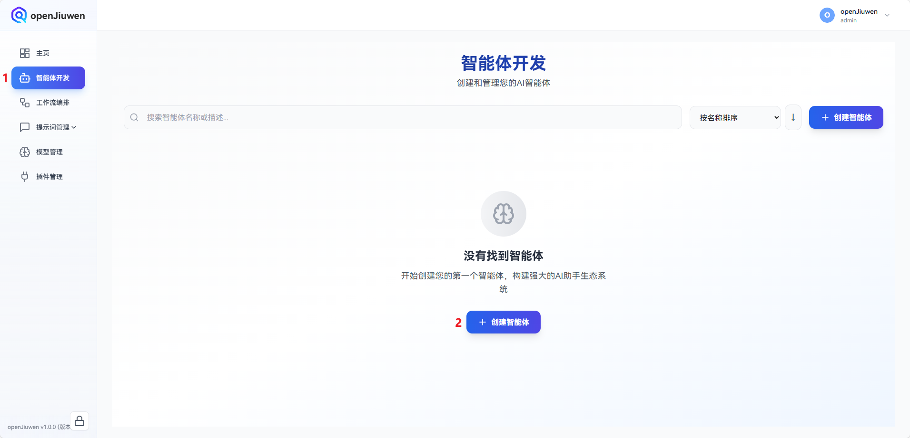
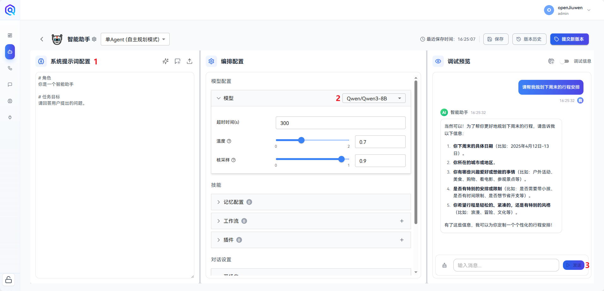

无论是否有编程基础，用户都可以在 openJiuwen 平台快速搭建 AI 智能体。

本文介绍了基于 openJiuwen 搭建智能助手智能体。  

## 一、准备阶段

### 1. 获取大模型API Key

智能体的运行依赖大模型服务，可从主流大模型服务提供商购买大模型服务或本地搭建大模型服务。以下流程以华为云为例，介绍大模型服务的获取步骤。

* 点击<a href="https://console.huaweicloud.com/modelarts/?locale=zh-cn&region=cn-southwest-2#/model-studio/deployment" target="_blank" rel="nofollow noopener noreferrer">链接</a>进入华为云模型广场的在线推理模型界面。

* 选择合适的模型，点击“开通服务”。

  

* 开通服务后，点击“调用说明”进入模型信息获取界面。

  

* 点击“OpenAI兼容接口”，记录*API地址*、*model参数*。

* 点击“API Key管理”，按照官方界面引导获取*API Key*。

> 说明：模型获取详细指导请参考 <a href="https://support.huaweicloud.com/usermanual-maas-modelarts/maas-modelarts-0195.html" target="_blank" rel="nofollow noopener noreferrer">华为云官方指导</a>

### 2. 模型配置
进入模型管理界面，点击“添加模型”。在模型配置界面中，依次填入`模型名称`、`模型ID`、`API 密钥`、`基础服务地址`以及`描述`。

* ​**模型名称**​：系统显示名称，用户可自定义。
* ​**模型ID**​：由模型服务提供商定义的调用名称，可在各提供商的官方网站查询。（对应从华为云获取的*model参数*）
* **API 密钥**：模型的API Key（对应从华为云获取的*API Key*）
* **基础服务地址**：由模型服务提供商定义的API地址，可在各提供商的官方网站查询。（对应从华为云获取的*API地址*）
* **描述**：模型的详细描述，用户可自定义

  
  
openJiuwen 提供了便捷的模型测试功能。

* 在模型管理界面中，点击已添加的模型的测试按钮；

* 选择一个常用测试语句点击；

* 点击开始按钮，稍作等待后输出“测试成功”表示模型配置成功。

  

> 说明：若模型测试失败，请确认提供的模型配置信息是否正确。

## 二、搭建智能体

* 准备好大模型服务后，进入智能体开发界面，点击“创建智能体”。

  

* 在智能体配置向导中，填写“智能体名称”与“功能描述”，下滑页面至底部，点击“确认并继续”。

  

* 智能体开发界面主要由三部分组成：

  * 左侧为系统提示词配置，可根据需求自由设定提示词，例如：

    ```text
    # 角色
    你是一个智能助手

    # 任务目标
    请回答用户提出的问题。
    ```

  * 中间为智能体的编排配置，可选择已配置的模型。

  * 右侧为调试预览区域，可在此处与智能体进行实时交互。在对话框输入问题后点击“发送”按钮，智能体将针对问题进行回答。

    

至此，智能助手智能体已完成搭建。如需探索更多功能特性，可参考《开发指南》与《实践教程》相关内容。
