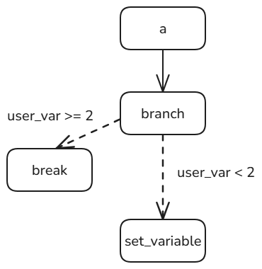

# 开始组件

`Start`组件为openJiuwen工作流的内置开始组件，该组件定义了工作流的入口点，用于接收用户的输入。

定义工作流，并通过`set_start_comp`方法将开始组件`start`添加到工作流中。其中`inputs_schema`用于明确规定开始组件`start`输入参数的来源，需要遵循key-value的配置规则，key来源于`conf`中"inputs"的参数id值，value可使用`${}`的方式引用工作流输入变量值：

```python
from openjiuwen.core.workflow import Workflow, Start

workflow = Workflow()
workflow.set_start_comp("s", Start(), 
    inputs_schema={"query": "${user_inputs.query}","tokens": "${user_inputs.tokens}"})
```

通过`inputs`配置工作流输入，并运行工作流：

```python
import asyncio
from openjiuwen.core.workflow import create_workflow_session

session = create_workflow_session()
result = asyncio.run(workflow.invoke(inputs={"user_inputs": {"query": "hello world", "tokens": ["a", "b"]}}, session=session))
```

`Start`组件会基于用户的`inputs`参数直接输出inputs_schema，此时输出的结果为：

```python
{
    "query": "hello world",
    "tokens": ["a", "b"]
}
```
要输出工作流的最终结果，需要配置`End`组件。以下是一个配置`Start`组件、`End`组件，并运行输出的完整示例：

```python
from openjiuwen.core.workflow import Start
from openjiuwen.core.workflow import End
from openjiuwen.core.workflow import Workflow
from openjiuwen.core.workflow import create_workflow_session
import asyncio

start = Start()

# 新建工作流
workflow = Workflow()
workflow.set_start_comp("s", start, 
    inputs_schema={"query": "${user_inputs.query}", "tokens": "${user_inputs.tokens}"})

# 配置End组件，可以带模板（conf），也可以不带
end_conf = {"response_template": "Query:{{param1}}, Infos:{{param2}}, Tokens:{{param3}}"}
end = End(conf=end_conf)
workflow.set_end_comp("e", end, 
    inputs_schema={"param1": "${s.query}", "param2": "${s.infos}", "param3": "${s.tokens}"})

# 连接start和end节点
workflow.add_connection("s", "e")

# 输入并运行
inputs = {
    "user_inputs": {
        "query": "你好 openJiuwen",
        "tokens": ["a", "b"]
    }
}
session = create_workflow_session()
result = asyncio.run(workflow.invoke(inputs=inputs, session=session))
print(result.result)
```

上述代码中，`End`组件会对格式化后的输入参数进行模板渲染，并输出如下结果：

```python
{'response': "Query:你好 openJiuwen, Infos:['c', 'd'], Tokens:['a', 'b']"}
```

如果`End`组件未配置模板conf（即直接`End()`），则输出为：

```python
{'output': {'param1': '你好 openJiuwen', 'param2': ['c', 'd'], 'param3': ['a', 'b']}}
```


# 结束组件

`End`组件是openJiuwen工作流的内置结束组件，该组件定义了工作流的输出点。将`End`组件添加到工作流时可根据input_schema格式化`End`组件的输入参数，创建`End`组件时可通过`conf`模板渲染工作流的输出信息。`End`组件实现了基类组件`ComponentExecutable`的四个能力 `invoke`，`stream`，`transform`和`collect`，实现的原理是对不同的输入进行相应的格式化输出。`End`组件的模板采用标准语言规范，使用`{{}}`语法表示占位槽位，模板渲染的过程，根据`End`组件实际输入对这些槽位进行动态填充，最终生成完整的输出结果。

- **invoke**：同步执行组件，一次性返回最终结果，适合一次性获取完整结果的场景。当`End`组件配置了模板（`conf`中包含`response_template`）时，返回结果中包含`response`字段，表示模板渲染后的结果；当`End`组件未配置模板时，返回结果中包含`output`字段，表示`End`组件的输出结果。
  
  构造简单工作流，并添加`Start`组件到工作流：
  
  ```python
  from openjiuwen.core.workflow import Start
  from openjiuwen.core.workflow import Workflow
  flow = Workflow()
  # 增加Start节点
  flow.set_start_comp("s", Start({}),
                    inputs_schema={"query": "${user_inputs.query}", "content": "${user_inputs.content}"})
  ```
  
  创建不带`conf`模板的`End`组件并添加到工作流，inputs_schema指定`End`组件的输入格式：
  
  ```python
  from openjiuwen.core.workflow import End
  flow.set_end_comp("e", End(), inputs_schema={"param1": "${s.query}", "param2": "${s.content}"})
  ```
  
  连接`Start`组件和`End`组件，并运行工作流，工作流输入为`{"user_inputs": {"query": "你好", "content": "杭州"}`：
  
  ```python
  import asyncio
  from openjiuwen.core.workflow import create_workflow_session

  flow.add_connection("s", "e")
  # 调用工作流
  session = create_workflow_session()
  result = asyncio.run(flow.invoke(inputs={"user_inputs": {"query": "你好", "content": "杭州"}}, session=session))
  # 输出结果
  print(result.result)
  ```
  
  则`Start`组件输出即`End`组件输入为`{"query": "你好", "content": "杭州"}`，inputs_schema会格式化`End`组件输入为`{"param1": "你好", "param2": "杭州"}`，并输出到output字段，输出结果如下：
  
  ```python
  {'output': {'param1': '你好', 'param2': '杭州'}}
  ```
  
  若创建带`conf`模板的`End`组件：
  
  ```python
   conf = {"response_template": "渲染结果:{{param1}},{{param2}}"}
   flow.set_end_comp("e", End(conf=conf), inputs_schema={"param1": "${s.query}", "param2": "${s.content}"})
  ```
  
  则会对`End`组件输入进行模板渲染后输出到response字段，输出结果如下：
  
  ```python
  {'response': '渲染结果:你好,杭州'}
  ```

- **stream**：`End`组件将批结果格式化为多帧`OutputSchema`格式的流式数据，适合需要实时反馈的场景，流式数据基于`payload`进行输出，支持渲染和非渲染情况。
  
  构造简单工作流，并添加`Start`组件到工作流：
  
  ```python
  from openjiuwen.core.workflow import Workflow
  from openjiuwen.core.workflow import Start
  from openjiuwen.core.workflow import End
  
  flow = Workflow()
  # 为工作流增加Start节点
  flow.set_start_comp("s", Start(), inputs_schema={"query": "${user_inputs.query}", "content": "${user_inputs.content}"})
  ```
  
  创建不带`conf`模板的`End`组件并添加到工作流，inputs_schema指定`End`组件的输入格式：
  
  ```python
  flow.set_end_comp("e", End(), inputs_schema={"param1": "${s.query}", "param2": "${s.content}"},response_mode="streaming")
  ```
  
  连接`Start`组件和`End`组件，并运行工作流，工作流输入为`{"user_inputs": {"query": "你好", "content": "杭州"}`：
  
  ```python
  import asyncio

  from openjiuwen.core.workflow import create_workflow_session
  from openjiuwen.core.session.stream import BaseStreamMode

  # 连接Start组件和End组件
  flow.add_connection("s", "e")

  async def main():
      # 调用工作流流式输出接口
      session = create_workflow_session()
      result = flow.stream(inputs={"user_inputs": {"query": "你好", "content": "杭州"}}, session=session,
                           stream_modes=[BaseStreamMode.OUTPUT])

      streams = []
      async for s in result:
          print(s)
          streams.append(s)

      return streams

  # 运行异步函数
  if __name__ == "__main__":
      asyncio.run(main())
  ```
  
  `End`组件会遍历每个输入字段，分别作为流式数据的`payload`进行流式输出，输出结果如下：
  
  ```python
  # 每一帧都为End组件一个字段的输入
  type='end node stream' index=0 payload={'output': {'param1': '你好'}}
  type='end node stream' index=1 payload={'output': {'param2': '杭州'}}
  ```
  
  若创建带`conf`模板的`End`组件：
  
  ```python
  # 为工作流增加End节点，并提供渲染模板
  conf = {"response_template": "渲染结果:{{param1}},{{param2}}"}
  flow.set_end_comp("e", End(conf=conf), inputs_schema={"param1": "${s.query}", "param2": "${s.content}"},response_mode="streaming")
  ```
  
  对`End`组件输入数据，系统会先根据槽位符号将其模板分解为多个子模板，然后逐一渲染这些子模板，并将每个渲染结果作为流式数据的`payload`进行输出，最终写入response字段。最终结果：
  
  ```python
  # 子模板的渲染结果
   type='end node stream' index=0 payload={'response': '渲染结果:'}
   type='end node stream' index=1 payload={'response': '你好'}
   type='end node stream' index=2 payload={'response': ','}
   type='end node stream' index=3 payload={'response': '杭州'}
  ```

- **transform**：`End`组件将流式输入逐帧格式化为`OutputSchema`格式的流式数据，`payload`为每个流式输入的内容，不支持渲染输出。
  
  例如，首先创建一个mock节点，用来流式输出：
  
  ```python
  from typing import AsyncIterator

  from openjiuwen.core.workflow import ComponentAbility, WorkflowComponent, Workflow
  from openjiuwen.core.workflow.components.component import Input, Output
  from openjiuwen.core.workflow.components import Session
  from openjiuwen.core.context_engine import ModelContext

  class MockStreamCmp(WorkflowComponent):
      async def stream(self, inputs: Input, session: Session, context: ModelContext) -> AsyncIterator[Output]:
          yield inputs
  ```
  
  构造简单工作流，并添加`Start`组件到工作流：
  
  ```python
  from openjiuwen.core.workflow import Workflow
  from openjiuwen.core.workflow import Start

  flow = Workflow()
  # 为工作流增加Start节点
  flow.set_start_comp("s", Start(),inputs_schema={"query": "${user_inputs.query}", "content": "${user_inputs.content}"})
  ```
  
  为工作流增加mock节点：
  
  ```python
  from openjiuwen.core.workflow import ComponentAbility
  
  # 为工作流增加mock节点
  flow.add_workflow_comp("n", MockStreamCmp(), inputs_schema={"param1": "${s.query}", "param2": "${s.content}"},
                          comp_ability=[ComponentAbility.STREAM], wait_for_all=True)
  ```
  
  为工作流增加End节点：
  
  ```python
  from openjiuwen.core.workflow import End

  # 为工作流增加End节点
  flow.set_end_comp("e", End(), stream_inputs_schema={"param1": "${n.param1}", "param2": "${n.param2}"}, response_mode="streaming")
  ```
  
  连接`Start`组件、Mock组件和`End`组件：
  
  ```python
  # 连接组件
  flow.add_connection("s", "n")
  flow.add_stream_connection("n", "e")
  ```
  
  工作流输入为`{"user_inputs": {"query": "你好", "content": "杭州"}`，触发`End`组件的`transform`能力：
  
  ```python
  import asyncio

  from openjiuwen.core.workflow import create_workflow_session
  from openjiuwen.core.session.stream import BaseStreamMode
  async def main():
      # 调用工作流流式输出接口
      result = flow.stream(inputs={"user_inputs": {"query": "你好", "content": "杭州"}}, session=create_workflow_session(),
                           stream_modes=[BaseStreamMode.OUTPUT])

      streams = []
      async for s in result:
          print(s)
          streams.append(s)

      return streams

  if __name__ == "__main__":
      asyncio.run(main())
  ```
  
  输出为：
  
  ```python
  type='end node stream' index=0 payload={'output': {'param1': '你好'}}
  type='end node stream' index=1 payload={'output': {'param2': '杭州'}}
  ```
   若创建带`conf`模板的`End`组件：
  
  ```python
  # 为工作流增加End节点，并提供渲染模板
  conf = {"response_template": "渲染结果:{{param1}},{{param2}}"}
  flow.set_end_comp("e", End(conf=conf),
                    stream_inputs_schema={"param1": "${n.param1}", "param2": "${n.param2}"},
                    response_mode = "streaming")
  ```
  
  对`End`组件输入流数据，系统会先根据槽位符号将其模板分解为多个子模板，然后逐一渲染这些子模板，并逐帧输出:

  ```python
  type='end node stream' index=0 payload={'response': '渲染结果:'}
  type='end node stream' index=1 payload={'response': '你好'}
  type='end node stream' index=2 payload={'response': ','}
  type='end node stream' index=3 payload={'response': '杭州'}
  ```
  
- **collect**：`End`组件对流式数据进行汇聚并合并为一次完整的返回。当`End`组件配置了模板（`conf`中包含`response_template`）时，返回结果中包含`response`字段，表示所有收集到的流式数据进行模板渲染后的最终结果；当`End`组件未配置模板时，返回结果中包含`collect_output`字段，表示所有收集的原始流式输出内容。 
   例如，首先创建一个mock节点，用来流式输出：
  
   ```python
  from typing import AsyncIterator

  from openjiuwen.core.workflow import ComponentAbility, WorkflowComponent, Workflow
  from openjiuwen.core.workflow.components.component import Input, Output
  from openjiuwen.core.workflow.components import Session
  from openjiuwen.core.context_engine import ModelContext

  class MockStreamCmp(WorkflowComponent):
      async def stream(self, inputs: Input, session: Session, context: ModelContext) -> AsyncIterator[Output]:
          yield inputs
   ```
  
  构造简单工作流，并添加`Start`组件到工作流：
  
  ```python
  from openjiuwen.core.workflow import Workflow
  from openjiuwen.core.workflow import Start

  flow = Workflow()
  # 为工作流增加Start节点
  flow.set_start_comp("s", Start(),inputs_schema={"query": "${user_inputs.query}", "content": "${user_inputs.content}"})
  ```
  
  为工作流增加mock节点：
  
  ```python
  from openjiuwen.core.workflow import ComponentAbility
  # 为工作流增加mock节点
  flow.add_workflow_comp("n", MockStreamCmp(), inputs_schema={"param1": "${s.query}", "param2": "${s.content}"},comp_ability=[ComponentAbility.STREAM], wait_for_all=True)
  ```
  
  为工作流增加End节点：
  
  ```python
  from openjiuwen.core.workflow import End
  # 为工作流增加End节点
  flow.set_end_comp("e", End(), stream_inputs_schema={"param1": "${n.param1}", "param2": "${n.param2}"})
  ```
  
  连接`Start`组件、Mock组件和`End`组件：
  
  ```python
  # 连接组件
  flow.add_connection("s", "n")
  flow.add_stream_connection("n", "e")
  ```
  
  工作流输入为`{"user_inputs": {"query": "你好", "content": "杭州"}`，触发`End`组件的`collect`能力：
  
  ```python
  import asyncio
  from openjiuwen.core.workflow import create_workflow_session
  
  # 调用工作流的invoke接口
  result = asyncio.run(flow.invoke(inputs={"user_inputs": {"query": "你好", "content": "杭州"}}, session=create_workflow_session()))
  print(result)
  ```

  输出为：
  
  ```python
  result={'collect_output': [{'param1': '你好'}, {'param2': '杭州'}], 'output': None} state=<WorkflowExecutionState.COMPLETED: 'COMPLETED'>
  ```
  若创建带`conf`模板的`End`组件：
  
  ```python
  # 为工作流增加End节点，并提供渲染模板
  conf = {"response_template": "渲染结果:{{param1}},{{param2}}"}
  flow.set_end_comp("e", End(conf=conf), stream_inputs_schema={"param1": "${s.query}", "param2": "${s.content}"})
  ```
  
  对`End`组件输入流数据，系统会先根据槽位符号将其模板分解为多个子模板，然后逐一渲染这些子模板，并将每个渲染结果作为流式数据的`payload`进行输出，最终写入`response`字段。最终结果：
  
  ```python
  result={'response': '渲染结果:你好,杭州'} state=<WorkflowExecutionState.COMPLETED: 'COMPLETED'>
  ```

# 大模型组件

大模型组件通过调用大语言模型，并根据输入提示词生成输出内容，支持将用户自定义的输入变量填充到预定义的提示词模板中，并可选择是否启用对话历史记录，支持JSON、Markdown、Text等多种输出格式。

创建大模型组件的配置信息对象`LLMCompConfig`，指定组件调用的大模型的具体配置信息`model`、大模型提示词模板信息`template_content`、输出格式信息`response_format`、输出参数信息`output_config`。大模型组件也支持是否启用对话历史记录`enable_history`。

```python
from openjiuwen.core.foundation.llm import ModelConfig, BaseModelInfo
from openjiuwen.core.workflow import LLMCompConfig

# 定义模型配置变量（实际使用时需要替换为真实值）
MODEL_PROVIDER = "openai"  # 示例值
MODEL_NAME = "gpt-3.5-turbo"  # 示例值
API_BASE = "https://xxx"  # 示例值
API_KEY = "your-api-key"  # 示例值

model_config = ModelConfig(
    model_provider=MODEL_PROVIDER,
    model_info=BaseModelInfo(
        model=MODEL_NAME,
        api_base=API_BASE,
        api_key=API_KEY,
        temperature=0.7,
        top_p=0.9,
        timeout=30,
    )
)

config = LLMCompConfig(
    model=model_config,
    template_content=[
        {"role": "system", "content": "你是一个AI助手。"},
        {"role": "user", "content": "{{query}}"}
    ],
    response_format={"type": "text"},
    output_config={
        "output": {"type": "string", "description": "输出结果", "required": True}
    },
    enable_history=False
)
```

创建大模型组件对象`LLMComponent`：

```python
from openjiuwen.core.workflow import LLMComponent
llm_component = LLMComponent(config)
```

大模型组件的输入定义只包含用户自定义的key-value键值对，不含固定输入字段。

通过`Workflow`的`add_workflow_comp`方法将大模型组件对象添加到工作流中，定义组件名称为"llm"，输入参数为自定义的key-value键值对，其中key为`"query"`、value为`"生成一句关于月亮的诗句"`：

```python
from openjiuwen.core.workflow import Workflow

flow = Workflow()
flow.add_workflow_comp(
            "llm",
            llm_component,
            inputs_schema={"query": "生成一句关于月亮的诗句"},
        )
```

`LLMCompConfig`中的提示词模板使用了`{{}}`格式的占位符用于填充用户输入中的参数，因此用户输入中的query字段值被用于填充提示词模板，填充完整的提示词为：

```json
[
    {"role": "system", "content": "你是一个AI助手。"},
    {"role": "user", "content": "生成一句关于月亮的诗句"}
]
```

大模型组件的输出定义来自于用户自定义的输出参数，具体对应的是`LLMCompConfig`中的`output_config`中的key（例如本例中的`output`字段）。

因此当用户在调用工作流时，根据大模型组件定义的输出格式（`response_format`的`"type"`字段的对应值），输出结果为：

- 如果定义了text的输出格式，即`response_format={"type": "text"}`，输出结果示例为：
  
  ```json
  {
      "output": "月走随人远，风来带桂香"
  }
  ```

- 如果定义了markdown的输出格式，即`response_format={"type": "markdown"}`，输入请求`query="生成一句关于月亮的诗句"`不变的情况下，输出结果示例为：
  
  ```json
  {
      "output": "# **月走随人远，风来带桂香**"
  }
  ```

- 如果定义了json的输出格式，即`response_format={"type": "json"}`，输入请求`query="提取《我爱北京天安门》歌名中的地点信息"`，则输出Key-Value键值对`{"output": "北京"}`，并且统一作为自定义输出参数：
  
  ```json
  {
      "output": "北京"
  }
  ```

> **说明**
> `output_config`在输出text或markdown（`response_format`的`"type"`字段配置为`"text"`或`"markdown"`）时，只能配置一个单独的输出字段；而当输出为json（`response_format`的`"type"`字段配置为`"json"`）时，则需要配置至少一个输出字段。

# 插件组件

插件组件，可调用工具（包括外部API、本地函数），通过向工具输入参数、执行工具逻辑、最终输出工具的执行结果，实现如搜索信息、浏览网页、生成图像、文件处理等功能，从而扩展智能体、工作流的能力。

使用`RestfulApi`创建插件，用于对接提供Restful接口的插件服务，定义插件名称name、描述description、输入参数params、请求URL地址path、请求头、请求方法等信息：

```python
from openjiuwen.core.foundation.tool import RestfulApi, RestfulApiCard

weather_card = RestfulApiCard(
    name="WeatherReporter",
    description="天气查询插件",
    url="user's path to weather service",
    method="GET",
    headers={},
    input_params={
        "type": "object",
        "properties": {
            "location": {
                "type": "string",
                "description": "天气查询的地点，必须为英文"
            },
            "date": {
                "type": "string",
                "description": "天气查询的时间，格式为YYYY-MM-DD"
            }
        },
        "required": ["location", "date"]
    },
)
weather_tool = RestfulApi(card=weather_card)
```

创建插件组件的配置信息`ToolComponentConfig`，当前不涉及具体配置，仅作为预留。

```python
from openjiuwen.core.workflow import ToolComponentConfig

tool_config = ToolComponentConfig()
```

插件组件的输入没有固定参数，由开发者根据插件的实际输入，保证正确的输入参数。在本例中即为`"location"`和`"date"`。

创建插件组件对象`ToolComponent`，并通过`bind_tool`关联工具对象：

```python
from openjiuwen.core.workflow import ToolComponent

tool_component = ToolComponent(tool_config)
# 插件组件绑定RestfulAPI对象
tool_component.bind_tool(weather_tool)
```

通过`Workflow`的`add_workflow_comp`方法将插件组件对象添加到工作流中，定义组件名称为"tool"，输入参数为自定义参数的若干key-value键值对，例如绑定天气插件的示例中，输入两对键值对`{"location":"hangzhou","date":"2025-08-01"}`。

```python
from openjiuwen.core.workflow import Workflow

flow = Workflow()
flow.add_workflow_comp(
            "tool",
            tool_component ,
            inputs_schema={
                "location": "hangzhou",
                "date": "2025-08-01"
            },
        )
```

插件组件的输出定义包括插件执行的返回码`error_code`、插件执行失败时透传插件返回的错误信息`error_message`以及插件执行成功时返回的序列化后的数据`data`。

当用户在调用工作流时，根据插件的执行状态会有以下结果输出：

- 若插件服务返回成功，则插件组件输出的执行错误码`error_code`为0，插件执行错误的原因`error_message`为空，`data`为插件运行结果：
  
  ```python
  {
      "error_code": 0,
      "error_message": "",
      "data": "{'city': 'Shanghai', 'country': 'CN', 'feels_like': 36.21, 'humidity': 86, 'temperature': 29.21, 'weather': '多云', 'wind_speed': 5.81}"
  }
  ```

- 若插件服务返回失败，则插件组件输出的返回具体的插件执行错误码`error_code`和插件执行错误的原因`error_message`：
  
  ```python
  {
      "error_code": 10000,  # 插件的自定义错误码
      "error_message": "plugin service unavailable",  # 插件的自定义错误错误信息
      "data": ""
  }
  ```

此外，框架支持基于本地函数创建工具对象，具体使用方式参见[自定义工具](../../基础功能/自定义工具.md)。插件组件可通过调用`bind_tool`接口关联创建完成的工具对象。

> **说明**
>
> - 插件组件支持校验工具输入参数类型，校验依据是插件组件绑定工具(`Tool`)的`params`(`List[Param]`)，如果插件组件的输入参数类型无法转化为Param.type指定的类型，则抛出异常；插件组件也支持填充必选输入参数的默认值，填充依据也是插件组件绑定工具(`Tool`)的`params(List[Param])`，如果输入参数是必选参数、但未输入插件组件，则插件组件用`Param.default_value`作为该输入参数的实际输入值。
> - 一个插件组件只能绑定唯一一个工具对象，如果多次调用`bind_tool`，则只关联最后绑定的工具对象。

# 意图识别组件

意图识别组件基于大语言模型服务对用户输入进行精准的意图识别与分类，并根据用户设置的下游分支路由规则，自动将任务流转至对应的工作流组件进行处理。

创建意图组件的配置对象`IntentDetectionCompConfig`，指定组件调用的大模型的具体配置信息`model`、判断用户意图的提示词信息`user_prompt`、意图分类的名称列表`category_name_list`、是否依赖对话历史`enable_history`等信息。

```python
from openjiuwen.core.foundation.llm import ModelConfig, BaseModelInfo
from openjiuwen.core.workflow import IntentDetectionCompConfig, IntentDetectionComponent

# 定义模型配置变量（实际使用时需要替换为真实值）
MODEL_PROVIDER = "openai"  # 示例值
MODEL_NAME = "gpt-3.5-turbo"  # 示例值
API_BASE = "https://xxx"  # 示例值
API_KEY = "your-api-key"  # 示例值

model_config = ModelConfig(
    model_provider=MODEL_PROVIDER,
    model_info=BaseModelInfo(
        model=MODEL_NAME,
        api_base=API_BASE,
        api_key=API_KEY,
        temperature=0.7,
        top_p=0.9,
        timeout=30,
    )
)

config = IntentDetectionCompConfig(
    user_prompt="请判断用户意图",
    category_name_list=["查询某地天气"],
    model=model_config,
    example_content=["示例1：今天下雨吗？这是查询天气的意图"],
    enable_history=False
)
```

> **说明**
> 意图识别组件提供了默认的提示词模板，可使用`IntentDetectionCompConfig`中的字段信息填充该默认的提示词模板，更好地引导大模型识别用户输入的请求。
>
> - `user_prompt`：用户自定义的提示词信息，该信息将作为片段填充到意图识别组件自带的提示词模板中，用于提示大模型更好地识别用户意图。
> - `example_content`：用户自定义的示例，该信息将作为片段填充到意图识别组件自带的提示词模板中，用于提供示例、提示大模型更好地识别用户意图。
> - `category_name_list`：意图标识和意图信息按规则拼接后填充到意图识别组件的提示词模板中；并且补充默认意图（即用户定义的所有意图均匹配不上的时候，则作为兜底输出）。
> - 用户输入：对应意图识别组件的输入中的`"query"`字段的值，作为意图识别组件的识别对象。
> - 对话历史：当`enable_history`开关打开，则当前对话上下文中的历史信息将被填充到提示词模板中。

创建意图识别组件的对象`IntentDetectionComponent`，并通过`add_branch`方法添加路由到下游分支的规则，如果是查天气意图，则路由到llm分支进行处理，否则路由到end分支结束流程：

```python
intent_component = IntentDetectionComponent(config)
intent_component.add_branch("${intent.classification_id} == 1", ["llm"], "查询天气分支")
intent_component.add_branch("${intent.classification_id} == 0", ["end"], "默认分支")
```

> **说明**
> 默认分支的`classification_id`固定为0，自定义分支的`classification_id`从1开始，依次递增。

意图识别组件的固定输入参数为`query`，表示意图识别组件将根据该输入信息，识别其意图。

通过`Workflow`的`add_workflow_comp`方法将意图识别组件对象添加到工作流中，定义组件名称为"intent"，输入参数中引用了开始组件的query字段的值。

```python
from openjiuwen.core.workflow import Workflow

workflow = Workflow()
workflow.add_workflow_comp(
    "intent",
    intent_component,
    inputs_schema={"query": "${start.query}"},
)
```

意图识别组件的输出定义包含表示意图识别编号的`classification_id`和意图分类的理由`reason`。

当用户在调用工作流时，根据用户输入的不同会有以下结果输出：

- 当用户输入为`"查询今天上海的天气"`时，识别为查询天气请求，则可能输出示例如下：
  
  ```json
  {
      "classification_id": 1,
      "reason": "用户问上海的天气怎么样，识别为查询天气的请求",
      "category_name": "查询某地天气"
  }
  ```

- 当用户输入为`"请推荐一家餐厅"`时，识别不是查天气请求，则使用默认意图，可能输出示例如下：
  
  ```json
  {
      "classification_id": 0,
      "reason": "用户请求未匹配任一意图，归类为默认意图",
      "category_name": "默认意图"
  }
  ```

# 提问器组件

提问器组件支持配置预设问题、并基于预设问题主动向用户提问并收集反馈。同时，支持配置参数提取开关，一旦开启，系统将结合用户反馈和可选的对话历史，提取指定参数。在不超过最大追问次数的前提下，可持续追问，引导用户完善信息。此外，组件还支持灵活对接自定义的三方大模型，灵活配置提取参数的提示词模板。

创建提问器组件的配置对象`QuestionerConfig`，指定组件调用的大模型的具体配置信息`model`、自定义的预设问题`question_content`、是否提取参数`extract_fields_from_response`、需提取的参数信息`field_names`、是否基于外部对话历史提取参数`with_chat_history`。其他配置信息将被填充到提问器自带的提示词模板中。

```python
from openjiuwen.core.foundation.llm import ModelConfig, BaseModelInfo
from openjiuwen.core.workflow import FieldInfo, QuestionerConfig, QuestionerComponent

# 定义模型配置变量（实际使用时需要替换为真实值）
MODEL_PROVIDER = "openai"  # 示例值
MODEL_NAME = "gpt-3.5-turbo"  # 示例值
API_BASE = "https://xxx"  # 示例值
API_KEY = "your-api-key"  # 示例值

model_config = ModelConfig(
    model_provider=MODEL_PROVIDER,
    model_info=BaseModelInfo(
        model=MODEL_NAME,
        api_base=API_BASE,
        api_key=API_KEY,
        temperature=0.7,
        top_p=0.9,
        timeout=30,
    )
)
# FieldInfo描述了需要提取的参数信息，包含参数名field_name、参数描述信息description、是否必须提取required以及参数默认值default_value。如果是必选参数且没有默认值，就必须提取该待提取参数的值。
key_fields = [
    FieldInfo(
        field_name="location",
        description="地点",
        required=True
    ),
    FieldInfo(
        field_name="date",
        description="时间",
        required=True,
        default_value="today",
    ),
]
config = QuestionerConfig(
    model=model_config,
    question_content="",
    extract_fields_from_response=True,
    field_names=key_fields,
    with_chat_history=False,
    extra_prompt_for_fields_extraction="开发者自定义的参数提取的约束",
    example_content="开发者自定义的样例"
)
```

> **说明**
> 提问器组件提供默认的提示词模板，依赖`QuestionerConfig`中的字段信息完成填充，能够更好地引导大模型提取用户自定义的待提取参数。
>
> - `field_names`：提取待提取参数的参数名，并按照固定模板拼接为一段文本；当前的拼接方式结果为：`"地点、时间2个必要信息"`。此外，所有待提取参数的参数名和参数描述信息，按照固定模板、拼接成一段文本、填充到默认提示词模板中；当前的拼接规则为`参数名: 参数描述`：`"location：地点\n date：时间"`。
> - `extra_prompt_for_fields_extraction`：用户自定义的提示词信息，该信息将作为片段填充到提问器组件自带的提示词模板中，用于提供约束信息、提示大模型更好地提取参数信息。
> - `example_content`：用户自定义的示例，该信息将作为片段填充到提问器组件自带的提示词模板中，用于提供示例、提示大模型更好地提取参数信息。
> - 对话历史：当`with_chat_history`开关打开时，提问器组件能够从上下文中获取对话历史信息，填充到提示词模板中。当`with_chat_history`开关关闭，则对话历史中只包含最近一次`role=user`的用户消息；当`with_chat_history`开关打开，则对话历史中除了最近一次的用户消息，还包含当前会话的历史交互信息，即若干轮`role=user`和`role=assistant`对话。

创建提问器组件对象`QuestionerComponent`：

```python
from openjiuwen.core.workflow import QuestionerComponent
questioner_component = QuestionerComponent(config)
```

提问器组件的输入定义包含固定入参`query`，和用户自定义参数的key-value键值对。

通过`Workflow`的`add_workflow_comp`方法将提问器组件对象添加到工作流中，组件名称为"questioner"，输入参数引用了开始组件的`query`字段的值：

```python
from openjiuwen.core.workflow import Workflow
from openjiuwen.core.workflow import Start

workflow = Workflow()
workflow.set_start_comp("start", Start({"inputs": [{"id": "query", "type": "String", "required": "true", "sourceType": "ref"}]}), inputs_schema={"query": "${query}"})
workflow.add_workflow_comp(
    "questioner",
    questioner_component,
    inputs_schema={"query": "${start.query}"}
)
workflow.add_connection("start", "questioner")
```

通过在提问器组件内部调用会话/交互模块的`interact`接口，中断提问器执行流程，并向用户追问。开发者编排的工作流中含有提问器组件时，该工作流的返回值中包含了追问的问题。开发者可通过工作流输出的数据结构`WorkflowOutput`中的字段`state=WorkflowExecutionState.INPUT_REQUIRED`，判断是否为人机交互的返回结果。

以下示例中执行工作流：

```python
import asyncio
from openjiuwen.core.workflow import create_workflow_session

session_id = "test_questioner"
session = create_workflow_session(session_id=session_id)  # 使用同一 session_id 以支持断点继续
workflow_result = asyncio.run(workflow.invoke({"query": "时间是2025年8月1日", "conversation_id": "c123"}, session))
print(repr(workflow_result))
```

工作流输出结果如下：

```python
WorkflowOutput(
    result=[OutputSchema(type='__interaction__', index=0, payload=InteractionOutput(id='questioner', value='请您提供地点相关的信息'))], 
    state=<WorkflowExecutionState.INPUT_REQUIRED: 'INPUT_REQUIRED'>
)
```

可看到状态为`WorkflowExecutionState.INPUT_REQUIRED`，需用户构造输入进行交互。

通过创建`InteractiveInput`对象，携带上用户的反馈信息，可再次调用`invoke_workflow`执行工作流，触发断点继续执行，重新执行提问器的流程，根据用户反馈，继续提取参数。

```python
from openjiuwen.core.session.interaction.interactive_input import InteractiveInput

# 用户反馈追问的地点信息`"地点是杭州"`后，继续执行工作流
user_input = InteractiveInput()
for item in workflow_result.result:
    user_input.update(item.payload.id, "地点是杭州")  # 从上一次追问用户的信息中能够获取到工作流中的断点组件id，并且反馈用户结果
session = create_workflow_session(session_id=session_id)  # 复用同一 session_id，会话中的状态维持不变，从而实现工作流的断点继续执行
result = asyncio.run(workflow.invoke(user_input, session))
```

> **说明**
>
> - 要继续使用原有的`session_id`，才能保证工作流从之前的断点继续执行，本例中即为等待用户反馈的提问器组件。
> - 若仍然无法提取完全所有的待提取参数，则重复追问-中断流程-等待用户反馈-断点继续执行的流程，直至提取完全所有的参数，提问器输出参数提取的结果。如果超过最大次数仍然无法提取完全所有的待提取参数，则抛出异常。

提问器组件的输出定义包括最近一次向用户追问的内容`question`、最近一次用户的反馈内容`user_response`以及以key-value键值对的形式输出提问器提取到的参数。

当用户在调用工作流时，根据用户输入的不同会有以下结果输出：

- 当用户输入是`"2025年8月1日的上海"`，参数提取完整，输出结果如下：
  
  ```json
  {
      "question": "",
      "user_response": "",
      "location": "上海",
      "date": "2025-08-01"
  }
  ```

- 当用户输入是`"时间是2025年8月1日"`，参数提取不完整，如未达到最大追问次数的情况，则提问器组件将向用户主动提问，对应前面示例中的`WorkflowOutput`中的`payload`字段信息：
  
  ```json
  id = "questioner"  # 工作流中断的组件id
  value = "请您提供地点相关的信息"  # 提问器向用户追问的问题内容
  ```
  
  用户反馈追问的地点信息`"地点是杭州"`后，继续执行Workflow对象，提问器组件最终的输出结果为：
  
  ```json
  {
      "question": "请您提供地点相关的信息",
      "user_response": "地点是杭州",
      "location": "杭州",
      "date": "2025-08-01"
  }
  ```

- 当用户输入是无关信息时（例如`"帮我订机票"`），参数提取不完整，如已达到最大追问轮数，则抛出异常。
  
  ```text
  错误码为101074
  错误信息为"Questioner component exceed max response."
  ```

# 分支组件

在工作流执行过程中，常常需要根据当前数据状态来决定后续应走的流程分支。除了依赖工作流本身提供的条件连接能力之外，openJiuwen还预置了分支组件`BranchComponent`，以更简洁的方式支持分支逻辑控制。通过分支组件，工作流可被拆分为多个并行的分支路径，并根据用户定义的条件判断来选择具体执行的分支。这样不仅增强了流程的灵活性，还提升了执行的高效性与可控性。

> **说明**
> 分支组件为可选组件，若在工作流中添加该组件，则无需显式地调用工作流的`add_connection`或`add_conditional_connection`方法来定义该组件和目标组件之间的连接，且需要遵循以下约束：
>
> - 输入：支持添加多个条件分支。但请注意，至少要设置一个分支在执行时能满足预设条件，以确保工作流能够正常运行。其中，分支预设条件的判断遵循以下规则：
>   - 分支组件按顺序逐个判断当前工作流数据状态是否满足分支中预设的条件，一旦发现某个分支满足条件，将立即跳转到该分支对应的目标组件继续执行，其余分支将不再进行判断及执行。
>   - 如果所有分支均不满足条件，会导致工作流执行失败并抛出`JiuWenBaseException`异常，错误码为101102，错误信息为"Branch meeting the condition was not found."。
> - 输出：支持通过条件分支将工作流定向至一个或多个预定义的目标组件。但请注意，返回的目标组件ID将用于控制工作流流程跳转，若不希望产生无效的分支，需要将所有目标组件ID均设置为已在工作流中定义注册的组件ID。当分支逻辑返回一个目标组件时，执行完分支组件将直接执行该目标组件；而当分支逻辑返回多个目标组件时，将通过任务调度机制并行执行列表中的目标组件。

以下将介绍如何利用分支组件设计工作流的分支逻辑，包括分支组件实例的创建、条件判断分支的添加，以及运行工作流以观察分支执行结果的流程。具体目标是设计一条具有分支逻辑的工作流，根据输入数值的不同范围（正数、负数、零值），灵活地执行不同的处理路径。

创建一个默认配置的分支组件实例：

```python
from openjiuwen.core.workflow import BranchComponent

branch_comp = BranchComponent()
```

使用分支组件的`add_branch`方法可添加分支的预设条件和目标组件ID列表，实现分支逻辑。预设条件支持 `str`、`Condition`和`Callable[[], bool]`三种类型。以在分支组件中添加三条分支为例，分别介绍三种不同的预设条件的使用方式。

- 添加`str`类型分支：设置预设条件为`"${start.query} > 0"`，目标组件为结束组件，分支名为pos_branch。

```python
# str类型，表示字符串形式的bool表达式
expression_str = "${start.query} > 0"
branch_comp.add_branch(expression_str, ["end"], "pos_branch")
```

- 添加`Condition`类型分支：设置预设条件为`ExpressionCondition("${start.query} < 0")`，目标组件为自定义的绝对值计算组件，分支名为neg_branch。

```python
from openjiuwen.core.workflow import ExpressionCondition
# Condition类型，表示一个预定义的、可调用的条件对象
expression_condition = ExpressionCondition("${start.query} < 0")
branch_comp.add_branch(expression_condition, ["abs"], "neg_branch")
```

- 添加`Callable[[], bool]`类型分支：设置预设条件为`expression_callable`方法，目标组件为自定义的绝对值计算组件，分支名为zero_branch。

```python
import os

# Callable[[], bool]类型，表示一个返回值为bool类型的函数，用于判断条件是否满足
def expression_callable() -> bool:
   return str(os.environ.get("ALLOW_ZERO", "false")).lower() == "true"
branch_comp.add_branch(expression_callable, ["abs"], "zero_branch")
```

添加完条件判断逻辑，将分支组件添加到具有开始组件、自定义的绝对值计算组件和结束组件的工作流中，然后执行工作流。完整示例：

```python
import asyncio
import os

from openjiuwen.core.common.exception.exception import JiuWenBaseException
from openjiuwen.core.workflow import ExpressionCondition
from openjiuwen.core.workflow import ComponentAbility, WorkflowComponent, Workflow
from openjiuwen.core.workflow.components.component import Input, Output
from openjiuwen.core.workflow.components import Session
from openjiuwen.core.context_engine import ModelContext
from openjiuwen.core.workflow import create_workflow_session
from openjiuwen.core.workflow import Workflow, WorkflowOutput

from openjiuwen.core.workflow import Start
from openjiuwen.core.workflow import End
from openjiuwen.core.workflow import BranchComponent


class AbsComponent(WorkflowComponent):
    async def invoke(self, inputs: Input, session: Session, context: ModelContext) -> Output:
        num = inputs["num"]
        if num < 0:
            return {"result": -num}
        return {"result": num}


async def run_workflow(num: int) -> tuple[WorkflowOutput | str, bool]:
    # 初始化工作流
    workflow = Workflow()

    # 添加开始、结束组件到工作流
    workflow.set_start_comp("start", Start(), inputs_schema={"query": "${user_inputs.query}"})
    workflow.set_end_comp("end", End(), inputs_schema={"raw": "${start.query}", "updated": "${abs.result}"})

    # 添加实现绝对值计算的自定义组件
    abs_comp = AbsComponent()
    workflow.add_workflow_comp("abs", abs_comp, inputs_schema={"num": "${start.query}"})

    # 添加分支组件
    branch_comp = BranchComponent()
    # 1. 分支pos_branch：condition为str类型
    expression_str = "${start.query} > 0"
    branch_comp.add_branch(expression_str, ["end"], "pos_branch")

    # 2. 分支neg_branch：condition为Condition类型
    expression_condition = ExpressionCondition("${start.query} < 0")
    branch_comp.add_branch(expression_condition, ["abs"], "neg_branch")

    # 3. 分支zero_branch：condition为Callable[[], bool]类型
    def expression_callable() -> bool:
        return str(os.environ.get("ALLOW_ZERO", "false")).lower() == "true"

    branch_comp.add_branch(expression_callable, ["abs"], "zero_branch")
    workflow.add_workflow_comp("branch", branch_comp)

    # 定义组件连接：分支组件的条件边无需显式地调用工作流的add_connection或add_conditional_connection方法
    workflow.add_connection("start", "branch")
    workflow.add_connection("abs", "end")
    # 构造输入、工作流会话，调用工作流
    inputs = {"user_inputs": {"query": num}}
    session = create_workflow_session()

    try:
        workflow_output = await workflow.invoke(inputs, session)
        return workflow_output, True
    except JiuWenBaseException as e:
        print(f"workflow execute error: {e}")
        return e.message, False


async def main():
    # 场景1：用户输入为10
    workflow_output, run_success = await run_workflow(num=10)
    run_status = "workflow run success" if run_success else "workflow run failed"
    result = workflow_output.result
    print(f"When the user input num is 10, {run_status}, result is {result}.")

    # 场景2：用户输入为-10
    workflow_output, run_success = await run_workflow(num=-10)
    run_status = "workflow run success" if run_success else "workflow run failed"
    result = workflow_output.result
    print(f"When the user input num is -10, {run_status}, result is {result}.")

    # 场景3：用户输入为0，环境变量ALLOW_ZERO为true
    os.environ["ALLOW_ZERO"] = "true"
    workflow_output, run_success = await run_workflow(num=0)
    run_status = "workflow run success" if run_success else "workflow run failed"
    result = workflow_output.result
    print(f"When the user input num is 0, ALLOW_ZERO is true, {run_status}, result is {result}.")

    # 场景4：用户输入为0，环境变量ALLOW_ZERO为false
    os.environ["ALLOW_ZERO"] = "false"
    workflow_output, run_success = await run_workflow(num=0)
    run_status = "workflow run success" if run_success else "workflow run failed"
    result = workflow_output
    print(f"When the user input num is 0, ALLOW_ZERO is false, {run_status}, result is {result}")


asyncio.run(main())
```

输出结果为：

```
When the user input num is 10, workflow run success, result is {'output': {'raw': 10}}.

When the user input num is -10, workflow run success, result is {'output': {'raw': -10, 'updated': 10}}.

When the user input num is 0, ALLOW_ZERO is true, workflow run success, result is {'output': {'raw': 0, 'updated': 0}}.

When the user input num is 0, ALLOW_ZERO is false, workflow run failed, result is Branch meeting the condition was not found.
```

从工作流执行结果可看出：

- 当用户输入为10时，满足分支`pos_branch`，依次执行组件`start`，`branch`，`end`，工作流执行成功，输出结果为`{'output': {'raw': 10}}`。
- 当用户输入为-10时，满足分支`neg_branch`，依次执行组件`start`，`branch`，`abs`，`end`，工作流执行成功，输出结果为`{'output': {'raw': -10, 'updated': 10}}`。
- 当用户输入为0，环境变量`ALLOW_ZERO`为`true`时，满足`zero_branch`，依次执行组件`start`，`branch`，`abs`，`end`，工作流执行成功，输出结果为`{'output': {'raw': 0, 'updated': 0}}`。
- 当用户输入为0，环境变量`ALLOW_ZERO`为`false`时，找不到满足的条件分支，工作流执行失败并抛出`JiuWenBaseException`异常，错误信息为"Branch meeting the condition was not found."。

# 循环组件

在工作流编排中，简单的循环流程可通过条件连接，将流程跳转回已执行的前置组件以实现重复执行。而对于某些需要多组件协同、逻辑较复杂的子流程循环场景，则应使用功能更强大的循环组件 `LoopComponent`。该组件支持配置循环条件，可灵活控制循环的继续或终止，从而实现更复杂、更精细的流程控制逻辑。

循环组件通过`LoopGroup`定义循环体，结合循环配置控制循环流程，支持实现多种循环场景。此外，可配合变量设置组件`LoopSetVariableComponent`实现循环体内的变量赋值与传递，实现灵活的变量控制，配合终止循环组件`LoopBreakComponent`在特定条件下主动跳出循环，实现循环的提前终止。

循环组件支持4种循环场景，通过`loop_type`参数进行配置：

| 场景类型         | `loop_type`值   | 描述                                                                     |
| ---------------- | --------------- |------------------------------------------------------------------------|
| **数组循环**     | `"array"`       | 遍历数组，以数组的每个元素作为变量输入，循环次数为数组长度。可基于前置组件以数组类型输出的变量来配置数组，也可指定特定的数组数据。    |
| **指定次数循环** | `"number"`      | 指定固定的循环次数，次数的配置可基于已执行组件的输出变量值，也可固定配置。                                |
| **无限循环**     | `"always_true"` | 实现无限循环，循环体内的组件在最大次数限制内（最大1000次）执行无限循环，完全依赖`LoopBreakComponent`实现中止循环流程的逻辑。 |
| **表达式循环**   | `"expression"`  | 通过表达式控制循环条件，当表达式计算结果为真时继续循环，否则终止循环。可结合中间变量实现复杂的循环控制逻辑。                |


在循环体内，可通过`${loop_id.变量名}`的形式访问循环相关变量，其中`loop_id`为循环组件的id，该id可自定义为其他字段，例如`loop1`、`loop2`等。举例：

- `loop_id.index`：当前循环索引（从0开始）
- `loop_id.数组循环当前元素名`：数组循环中的当前元素，如`loop_id.item`
- `loop_id.自定义变量名`：通过intermediate_var定义的中间变量。举例：`workflow.add_workflow_comp("loop", loop_component,  inputs_schema={..., "intermediate_var": {"user_var": "openJiuwen"}} )`，在循环体内可通过`loop.user_var`访问到自定义变量。

当循环体中需要使用自定义的中间变量时，可通过`intermediate_var`参数初始化这些变量。这些中间变量可通过`LoopSetVariableComponent`在循环过程中更新，从而实现复杂的状态管理和循环控制逻辑。

> **注意**
>
> 1. 将循环组件添加到工作流时，配置数组循环的 `loop_array` 参数、指定次数循环的 `loop_number` 参数、`LoopSetVariableComponent`参数以及 `intermediate_var`参数时，​不支持使用下标方式（如`"loop_array": {"item": "${a.b}[0]"}`、`"loop_number": "${a.b}[0]['c']"`、`LoopSetVariableComponent({"${loop.user_var": "${a.b}[0]"})`、`"intermediate_var": {"user_var": "${a.b}[0]['c']"}`等），否则会报错“LoopComponent error”​。
> 2. 循环组件不支持循环嵌套。
> 3. LoopSetVariableComponent不支持更新前序组件的输出变量。

## 数组循环

数组循环是最常用的循环类型，用于遍历数组中的每个元素并执行相同的操作。下面以典型的数组循环为例，详细介绍循环组件的使用方式。

创建循环体，在循环体内添加组件与在工作流中添加组件方式一致。并通过`start_nodes`和`end_nodes`方法分别指定起始组件和结束组件。

```python
from openjiuwen.core.workflow import LoopGroup, LoopComponent
from openjiuwen.core.workflow import ComponentAbility, WorkflowComponent, Workflow
from openjiuwen.core.workflow.components.component import Input, Output
from openjiuwen.core.workflow.components import Session
from openjiuwen.core.context_engine import ModelContext

# 通用节点组件，返回输入值
class CommonNode(WorkflowComponent):
    async def invoke(self, inputs: Input, session: Session, context: ModelContext) -> Output:
        return {"output": inputs["value"]}

# 创建LoopGroup
loop_group = LoopGroup()

# 为LoopGroup添加3个工作流组件(以数组循环为例)
# ${loop.item}表示当前数组元素，item在把循环组件添加到工作流时定义，${loop.index}表示当前索引
loop_group.add_workflow_comp("a", CommonNode(), inputs_schema={"value": "${loop.item}"})
loop_group.add_workflow_comp("b", CommonNode(), inputs_schema={"value": "${loop.item}"})
loop_group.add_workflow_comp("c", CommonNode(), inputs_schema={"value": "${loop.item}"})
# 指定组件"a"为循环开始，组件"c"为循环结束
loop_group.start_nodes(["a"])
loop_group.end_nodes(["c"])

# LoopGroup中的连接3个组件
loop_group.add_connection("a", "b")
loop_group.add_connection("b", "c")
```

创建循环组件，指定循环体和输出模式，输出模式定义了如何从循环结果中提取数据。

```python
# 创建LoopComponent
# 第一个参数是循环体(LoopGroup实例)，第二个参数定义了循环组件的输出模式
loop_component = LoopComponent(
    loop_group, 
    {"output": {"a": "${a.output}", "b": "${b.output}", "c": "${c.output}"}}
)
```

添加循环组件到工作流：

```python
from openjiuwen.core.workflow import Workflow
from openjiuwen.core.workflow import Start
from openjiuwen.core.workflow import End

# 创建工作流实例
workflow = Workflow()

# 添加开始组件，定义输入参数
workflow.set_start_comp("s", Start({}),
                        inputs_schema={"query": "${user_input}"})

# 添加结束组件，引用loop组件的输出结果
workflow.set_end_comp("e", End({}),
                   inputs_schema={"user_var": "${loop.output}"})


# 添加循环组件，设置数组循环类型和数组来源，这里的item与loop_group.add_workflow_comp中的loop.item对应
# 注意：loop_array配置不支持使用下标访问变量（如${a.b}[0]）
workflow.add_workflow_comp("loop", loop_component,
                           inputs_schema={"loop_type": "array",
                                          "loop_array": {"item": "${s.query}"}})

# 串行连接组件：start->loop->end
workflow.add_connection("s", "loop")
workflow.add_connection("loop", "e")
```

运行带有循环组件的工作流，输出的结果为3轮循环后循环体内3个组件的输出值，再分别拼接为数组：

```python
from openjiuwen.core.workflow import create_workflow_session
import asyncio

# 准备输入参数
inputs = {
    "user_input": [1, 2, 3]  # 要循环遍历的数组
}

# 调用invoke方法执行工作流
result = asyncio.run(workflow.invoke(inputs, create_workflow_session()))

assert result.result["output"]["user_var"] == {"a": [1, 2, 3], "b": [1, 2, 3], "c": [1, 2, 3]}
```

## 指定次数循环

指定次数循环用于执行固定次数的循环操作，适合已知需要重复执行次数的场景。

LoopComponent配置`loop_type`为"number"，并通过`loop_number`指定循环次数。在循环体内，可通过`${loop.index}`获取当前的循环索引（从0开始）：

```python
from openjiuwen.core.workflow import LoopGroup, LoopComponent
from openjiuwen.core.workflow import ComponentAbility, WorkflowComponent, Workflow
from openjiuwen.core.workflow.components.component import Input, Output
from openjiuwen.core.workflow.components import Session
from openjiuwen.core.context_engine import ModelContext
# 为LoopGroup添加3个工作流组件，每个组件输入都是当前循环索引
# （使用前面定义的CommonNode组件）
class CommonNode(WorkflowComponent):
    async def invoke(self, inputs: Input, session: Session, context: ModelContext) -> Output:
        return {"output": inputs["value"]}

loop_group = LoopGroup()
loop_group.add_workflow_comp("a", CommonNode(), inputs_schema={"value": "${loop.index}"})
loop_group.add_workflow_comp("b", CommonNode(), inputs_schema={"value": "${loop.index}"})
loop_group.add_workflow_comp("c", CommonNode(), inputs_schema={"value": "${loop.index}"})
loop_group.start_nodes(["a"])
loop_group.end_nodes(["c"])
loop_group.add_connection("a", "b")
loop_group.add_connection("b", "c")

# 创建循环组件，设置输出模式
loop_component = LoopComponent(
    loop_group,
    {"output": {"a": "${a.output}", "b": "${b.output}", "c": "${c.output}"}}
)
```

添加到工作流时设置循环类型和次数：

```python
from openjiuwen.core.workflow import Workflow
from openjiuwen.core.workflow import Start
from openjiuwen.core.workflow import End

# 创建工作流实例
workflow = Workflow()

# 添加开始组件，定义输入参数
workflow.set_start_comp("s", Start({}),
                        inputs_schema={"query": "${user_input}"})

# 添加结束组件，引用loop组件的输出结果
workflow.set_end_comp("e", End({}),
                    inputs_schema={"user_var": "${loop.output}"})


# 添加循环组件，设置数组循环类型和数组来源
# 注意：loop_number配置不支持使用下标访问变量（如${a.b}[0]）
workflow.add_workflow_comp("loop", loop_component,
                           inputs_schema={"loop_type": "number",
                                          "loop_number": "${s.query}"})

# 串行连接组件：start->loop->end
workflow.add_connection("s", "loop")
workflow.add_connection("loop", "e")
```

工作流结构不变，运行工作流输入为`3`，输出为循环体内组件各自3次循环输出结果的数组

```python
from openjiuwen.core.workflow import create_workflow_session
import asyncio

# 准备输入参数
inputs = {
    "user_input": 3  # 要循环遍历的次数
}

# 调用invoke方法执行工作流
result = asyncio.run(workflow.invoke(inputs, create_workflow_session()))

assert result.result["output"]["user_var"] == {"a": [0, 1, 2], "b": [0, 1, 2], "c": [0, 1, 2]}
```

## 表达式循环

表达式循环通过表达式动态控制循环的继续或终止，提供了最灵活的循环控制方式，适合复杂的循环条件判断。LoopComponent配置`loop_type`为"expression"，通过`bool_expression`参数设置循环条件表达式，同时可通过`intermediate_var`定义中间变量实现复杂的循环状态管理。

首先创建循环体和相关组件，表达式循环通常需要配合中间变量和变量设置组件来实现复杂的状态管理：

```python
import asyncio
from openjiuwen.core.workflow import LoopComponent, LoopGroup
from openjiuwen.core.workflow import LoopSetVariableComponent
from openjiuwen.core.workflow import ComponentAbility, WorkflowComponent, Workflow
from openjiuwen.core.workflow.components.component import Input, Output
from openjiuwen.core.workflow.components import Session
from openjiuwen.core.context_engine import ModelContext
from openjiuwen.core.workflow import create_workflow_session

# 简单的加法组件，将输入值加10
class AddTenNode(ComponentExecutable, WorkflowComponent):
    def __init__(self, node_id: str = None):
        super().__init__()
        self.node_id = node_id

    async def invoke(self, inputs: Input, session: Session, context: ModelContext) -> Output:
        # 安全处理输入
        if inputs is None or "source" not in inputs:
            return {"result": 10}
        return {"result": inputs["source"] + 10}

# 创建LoopGroup
loop_group = LoopGroup()
# 添加第一个组件，从循环索引(loop.index)获取输入
loop_group.add_workflow_comp("1", AddTenNode("1"), inputs_schema={"source": "${loop.index}"})
# 添加第二个组件，从中间变量中获取user_var值作为输入
loop_group.add_workflow_comp("2", AddTenNode("2"),
                             inputs_schema={"source": "${loop.user_var}"})
# 创建变量设置组件，将第二个组件的结果更新到中间变量user_var中
set_variable_component = LoopLoopSetVariableComponent({"${loop.user_var}": "${2.result}"})  
loop_group.add_workflow_comp("3", set_variable_component)

# 指定起始和结束组件
loop_group.start_nodes(["1"])
loop_group.end_nodes(["3"])

# 设置组件连接
loop_group.add_connection("1", "2")
loop_group.add_connection("2", "3")
```

创建循环组件，指定循环体和输出模式：

```python
# 创建LoopComponent
loop_component = LoopComponent(loop_group, {"results": "${1.result}", "user_var": "${loop.user_var}"})
```

添加循环组件到工作流，设置表达式循环类型和循环条件：

```python
from openjiuwen.core.workflow import Workflow
from openjiuwen.core.workflow import Start
from openjiuwen.core.workflow import End

# 创建工作流实例
workflow = Workflow()

# 添加开始组件
workflow.set_start_comp("s", Start({}),
                        inputs_schema={"input_number": "${input_number}",
                                       "loop_number": "${loop_number}"})

# 添加结束组件，引用loop组件的输出结果
workflow.set_end_comp("e", End({}),
                      inputs_schema={"array_result": "${loop.results}", "user_var": "${loop.user_var}"})

# 添加循环组件，设置表达式循环类型、循环条件和中间变量
# 注意：intermediate_var配置不支持使用下标访问变量（如${a.b}[0]）
workflow.add_workflow_comp("loop", loop_component, 
                           inputs_schema={"loop_type": "expression",
                                          "bool_expression": "(${loop.index} != ${s.loop_number})",
                                          "intermediate_var": {"user_var": "${s.input_number}"}})

# 串行连接组件：start->loop->end
workflow.add_connection("s", "loop")
workflow.add_connection("loop", "e")
```

运行工作流并验证结果：

```python
import asyncio
from openjiuwen.core.workflow import create_workflow_session

# 准备输入参数
inputs = {
    "input_number": 2,  # 初始化user_var的初始值
    "loop_number": 2   # 控制循环次数
}

# 调用invoke方法执行工作流
result = asyncio.run(workflow.invoke(inputs, create_workflow_session()))

# 验证结果
output = result.result.get("output", {})

# 预期结果：
# - results: [10, 11] 是循环中每个AddTenNode("1")处理后的结果数组
#   (索引0+10=10, 索引1+10=11)
# - user_var: 22 是循环结束后的最终中间变量值，计算过程：
#   初始值2 → 2+10=12 → 12+10=22（共2次循环）
assert output.get("array_result") == [10, 11]
assert output.get("user_var") == 22
```

## 无限循环

无限循环适用于需要根据运行时条件动态决定何时停止的场景，通过`LoopBreakComponent`实现循环的提前终止。

LoopComponent配置`loop_type`为"always_true"，实现无限循环，循环体会一直执行直到遇到`LoopBreakComponent`或达到系统最大循环次数限制（默认1000次）。以下示例展示如何使用无限循环结合条件判断和终止循环组件实现灵活的循环控制。

循环体内流程如下图：

<div align="center">
  
</div>

创建循环体，注册自定义组件、分支组件、变量设置组件和终止循环组件

```python
from openjiuwen.core.workflow import ComponentAbility, WorkflowComponent, Workflow
from openjiuwen.core.workflow.components.component import Input, Output
from openjiuwen.core.workflow.components import Session
from openjiuwen.core.context_engine import ModelContext
from openjiuwen.core.workflow import LoopGroup
from openjiuwen.core.workflow import LoopBreakComponent
from openjiuwen.core.workflow import LoopSetVariableComponent
from openjiuwen.core.workflow import BranchComponent

# 创建LoopGroup
loop_group = LoopGroup()

# 创建通用节点作为循环体核心组件
class CommonNode(ComponentExecutable, WorkflowComponent):
    async def invoke(self, inputs: Input, session: Session, context: ModelContext) -> Output:
        # 模拟循环体的工作，返回结果
        return {"output": True}

# 创建递增组件，用于递增循环变量
class IncrementNode(ComponentExecutable, WorkflowComponent):
    async def invoke(self, inputs: Input, session: Session, context: ModelContext) -> Output:
        # 从输入中获取当前值并递增
        current_value = inputs.get("value", 0)
        return {"result": current_value + 1}

# 为LoopGroup添加工作流组件
loop_group.add_workflow_comp("a", CommonNode())

# 创建分支组件用于条件判断
branch_component = BranchComponent()
loop_group.add_workflow_comp("branch", branch_component)

# 创建递增组件，将循环变量的当前值加1
increment_node = IncrementNode()
loop_group.add_workflow_comp("increment", increment_node, inputs_schema={"value": "${loop.user_var}"})

# 创建变量设置组件，将递增后的值赋值回循环变量
set_variable_component = LoopLoopSetVariableComponent({"${loop.user_var}": "${increment.result}"})
loop_group.add_workflow_comp("setVar", set_variable_component)

# 创建终止循环组件
break_node = LoopBreakComponent()
loop_group.add_workflow_comp("break", break_node)

# 指定组件"a"为循环开始，组件"setVar"为正常循环结束
loop_group.start_nodes(["a"])
loop_group.end_nodes(["setVar"])

# 设置BranchComponent的分支条件
# 分支1: 继续循环，执行increment和LoopSetVariableComponent
branch_component.add_branch("${loop.index} < 2", ["increment"])
# 分支2: 终止循环，执行break组件
branch_component.add_branch("${loop.index} >= 2", ["break"])

# 设置组件连接
loop_group.add_connection("a", "branch")
loop_group.add_connection("increment", "setVar")
```

创建循环组件，设置中间变量：

```python
from openjiuwen.core.workflow import LoopComponent

# 创建LoopComponent，设置输出模式，捕获最终的中间变量、循环计数和循环结果
loop_component = LoopComponent(loop_group, {"user_var": "${loop.user_var}", "loop_count": "${loop.index}", "results": "${a.output}"})
```

添加到工作流：

```python
from openjiuwen.core.workflow import End
from openjiuwen.core.workflow import Start

# 创建工作流实例
workflow = Workflow()

# 添加开始组件
workflow.set_start_comp("s", Start({}))

# 添加结束组件，引用loop组件的输出结果
workflow.set_end_comp("e", End({}),
                      inputs_schema={"user_var": "${loop.user_var}", "loop_count": "${loop.loop_count}", "results": "${loop.results}"})

# 添加循环组件，设置为always_true循环类型和中间变量初始值
# 注意：intermediate_var配置不支持使用下标访问变量（如${a.b}[0]）
workflow.add_workflow_comp("loop", loop_component,
                           inputs_schema={"loop_type": "always_true",
                                          "intermediate_var": {"user_var": 0}})
# 串行连接组件：start->loop->end
workflow.add_connection("s", "loop")
workflow.add_connection("loop", "e")
```

工作流结构不变，运行工作流，循环体内无限循环直到中间变量值为2时终止循环，将最后的中间变量值输出：

```python
import asyncio
from openjiuwen.core.workflow import create_workflow_session

# 调用invoke方法执行工作流
result = asyncio.run(workflow.invoke({}, create_workflow_session()))

print(f"执行结果: {result.result}")
output = result.result.get('output', {})
# 验证循环执行了3次（索引0、1、2）
assert output.get("loop_count") == 3  # 最后一次循环的索引是3
# 验证每个循环的执行结果
assert output.get("results") == [True, True, True], f"Expected [True, True, True], got {output.get('results')}"
```

# 工作流执行组件

在一些复杂的工作流场景中，往往需要实现工作流的嵌套调用。此时，可在主工作流中引入工作流执行组件。openJiuwen框架提供了预置组件`SubWorkflowComponent`，用于支持子工作流的执行。通过该组件，可将一个完整的工作流嵌入到主工作流中，并作为单一组件运行。这种机制有效提升了工作流的模块化和可复用性，使用户能够更灵活地组织与管理复杂的任务流程。

以下示例介绍了如何使用`SubWorkflowComponent`实现工作流嵌套的功能。

首先，定义`CustomComponent`组件：

```python
from openjiuwen.core.workflow import ComponentAbility, WorkflowComponent, Workflow
from openjiuwen.core.workflow.components.component import Input, Output
from openjiuwen.core.workflow.components import Session
from openjiuwen.core.context_engine import ModelContext

class CustomComponent(WorkflowComponent):
    """自定义组件"""

    def __init__(self):
        super().__init__()

    async def invoke(self, inputs: Input, session: Session, context: ModelContext) -> Output:
        """处理输入并返回用户query"""
        query = inputs.get("query", "")
        return {
            "result": query
    }
```

其次，定义子工作流，包含`Start`、`CustomComponent`和`End`组件：

```python
from openjiuwen.core.workflow import Workflow
from openjiuwen.core.workflow import Start
from openjiuwen.core.workflow import End

# 初始化子工作流
sub_workflow = Workflow()

# 添加以sub_start、sub_node、sub_end为ID的3个组件到子工作流
sub_workflow.set_start_comp("sub_start", Start(), inputs_schema={"query": "${query}"})
sub_workflow.add_workflow_comp("sub_custom_comp", CustomComponent(), inputs_schema={"query": "${sub_start.query}"})
sub_workflow.set_end_comp("sub_end", End(), inputs_schema={"result": "${sub_custom_comp.result}"})

# 设置子工作流拓扑连接，sub_start -> sub_custom_comp -> sub_end
sub_workflow.add_connection("sub_start", "sub_custom_comp")
sub_workflow.add_connection("sub_custom_comp", "sub_end")
```

最后，定义主工作流，并将子工作流添加到工作流中：

```python
from openjiuwen.core.workflow import SubWorkflowComponent

# 初始化主工作流
main_workflow = Workflow()

# 使用之前构造的子工作流实例构造工作流执行组件
sub_workflow_comp = SubWorkflowComponent(sub_workflow)

# 添加以start、sub_workflow_comp、end为ID的3个组件到主工作流
main_workflow.set_start_comp("start", Start({}), inputs_schema={"query": "${user_inputs.query}"})
main_workflow.add_workflow_comp("sub_workflow_comp", sub_workflow_comp, inputs_schema={"query": "${start.query}"})
main_workflow.set_end_comp("end", End({}), inputs_schema={"result": "${sub_workflow_comp.output.result}"})

# 设置主工作流拓扑连接，start -> sub_workflow_comp -> end
main_workflow.add_connection("start", "sub_workflow_comp")
main_workflow.add_connection("sub_workflow_comp", "end")
```

执行主工作流，通过工作流执行组件调用已经创建的子工作流：

```python
import asyncio
from openjiuwen.core.workflow import create_workflow_session

async def run_workflow():
    # 创建工作流运行时
    session = create_workflow_session(session_id="test_session")

    # 构造输入
    inputs = {"user_inputs": {"query": "hello"}}

    # 调用工作流
    result = await main_workflow.invoke(inputs, session)
    return result


res = asyncio.run(run_workflow())
print(f"main workflow with sub workflow run result: {res}")
```

执行完成后得到结果：

```
main workflow with sub workflow run result: result={'output': {'result': 'hello'}} state=<WorkflowExecutionState.COMPLETED: 'COMPLETED'>
```
