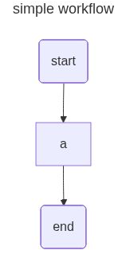

openJiuwen开发框架支持可视化展示构建完成的工作流，用户可在工作流构建完成后，通过调用工作流的可视化相关接口生成[mermaid](https://mermaid.js.org/)脚本或其渲染出的图片，方便工作流的直观展示与问题排查。

# 前提条件

- 使用可视化工作流功能前，需要安装并运行[Jupyter Notebook](https://jupyter.org/)。

1. 执行如下命令，安装Jupyter Notebook

    ```bash
    pip install notebook
    ```

2. 执行如下命令，启动Jupyter Notebook

    ```bash
    jupyter notebook
    ```

- 默认的图片渲染需要联网访问`https://mermaid.ink`，若使用环境联网正常，则无需配置，若使用环境无法联网，需本地安装[mermaid.ink](https://github.com/jihchi/mermaid.ink)，并配置环境变量`MERMAID_INK_SERVER`为本地`mermaid.ink`的地址，环境变量可使用`python`内置的`os`包来配置，请参见[os.environ](https://docs.python.org/3.11/library/os.html#os.environ)。

# 可视化简单工作流

首先，导入构造工作流需要的模块，并设置环境变量，启用工作流可视化功能。

```python
from openjiuwen.core.workflow import WorkflowComponent
from openjiuwen.core.workflow.components.component import Input, Output
from openjiuwen.core.workflow.components import Session
from openjiuwen.core.context_engine import ModelContext

# 设置环境变量，启用工作流可视化功能
import os
os.environ["WORKFLOW_DRAWABLE"] = "true"
```

接着自定义一个组件类，用于接收输入并返回空结果。

```python
# 自定义的组件
class Node1(WorkflowComponent):
    def __init__(self):
        super().__init__()

    async def invoke(self, inputs: Input, session: Session, context: ModelContext) -> Output:
        return {}
```

然后基于自定义组件搭建一个简单的工作流，按开始组件`start`、自定义组件`a`、结束组件`end`的顺序执行，各组件之间的连接都是[普通连接](构建工作流.md#普通连接)。

```python
# 构建工作流
flow = Workflow()
flow.set_start_comp("start", Start())
flow.add_workflow_comp("a", Node1())
flow.set_end_comp("end", End())
flow.add_connection("start", "a")
flow.add_connection("a", "end")
```

可视化工作流为png图片，标题设置为`simple workflow`。

```python
# 展示渲染出的图片
from IPython.display import Image, display
display(Image(flow.draw(title="simple workflow", output_format="png")))
```

展示出如下图片：

<div style="text-align: center">
</div>

# 可视化带流式边的工作流

首先，导入构造工作流需要的模块，并设置环境变量，启用工作流可视化功能。

```python
from openjiuwen.core.workflow import WorkflowComponent
from openjiuwen.core.workflow.components.component import Input, Output
from openjiuwen.core.workflow.components import Session
from openjiuwen.core.context_engine import ModelContext

# 设置环境变量，启用工作流可视化功能
import os
os.environ["WORKFLOW_DRAWABLE"] = "true"
```

接着自定义一个组件类，用于接收输入并返回空结果。

```python
# 自定义的组件
class Node1(WorkflowComponent):
    def __init__(self):
        super().__init__()

    async def invoke(self, inputs: Input, session: Session, context: ModelContext) -> Output:
        return {}
```

然后基于自定义组件搭建一个带流式边的工作流，按开始组件`start`、自定义组件`a`、结束组件`end`的顺序执行，自定义组件`a`和结束组件`end`之间的连接为[流式连接](构建工作流.md#流式连接)，其余组件之间的连接为[普通连接](构建工作流.md#普通连接)。

```python
# 搭建工作流
flow = Workflow()
flow.set_start_comp("start", Start())
flow.add_workflow_comp("a", Node1())
flow.set_end_comp("end", End())
flow.add_connection("start", "a")
# 组件间使用流式连接
flow.add_stream_connection("a", "end")
```

为了动态地显示组件`a`和组件`end`之间的[流式连接](构建工作流.md#流式连接)，可视化工作流为svg图片，标题设置为`simple workflow`。

```python
from IPython.display import SVG, display, HTML

svg_data = SVG(flow.draw(title="simple workflow", output_format="svg")).data
display(HTML(f'<div style="zoom:0.9">{svg_data}</div>'))
```

> **说明**
> 
> 直接显示svg图片可能导致图片显示不全，这里用HTML标签对图片进行了缩放。

展示出如下图片：

<div style="text-align: center">
</div>

# 可视化带分支的工作流

首先，导入构造工作流需要的模块，并设置环境变量，启用工作流可视化功能。

```python
from openjiuwen.core.workflow import WorkflowComponent
from openjiuwen.core.workflow.components.component import Input, Output
from openjiuwen.core.workflow.components import Session
from openjiuwen.core.context_engine import ModelContext
from openjiuwen.core.workflow import Workflow
from openjiuwen.core.workflow import BranchRouter

# 设置环境变量，启用工作流可视化功能
import os
os.environ["WORKFLOW_DRAWABLE"] = "true"
```

接着自定义一个组件类，用于接收输入并返回空结果。

```python
# 自定义的组件
class Node1(WorkflowComponent):
    def __init__(self):
        super().__init__()

    async def invoke(self, inputs: Input, session: Session, context: ModelContext) -> Output:
        return {}
```

然后基于自定义组件搭建一个带分支的工作流，开始组件`start`根据条件`${start.a} > 0`走向自定义组件`a`，根据条件`${start.b} > 0`走向自定义组件`b`，组件`a`、`b`都走向结束组件`end`。开始组件`start`和自定义组件`a`、组件`b`之间为[条件连接](./构建工作流.md#条件连接)，其余组件之间的连接都是[普通连接](./构建工作流.md#普通连接)。

```python
# 工作流添加分支
router = BranchRouter()
router.add_branch("${start.a} > 0", "a")
router.add_branch("${start.b} > 0", "b")

flow = Workflow()
flow.set_start_comp("start", Start(), inputs_schema={"a": "${a}", "b": "${b}"})
flow.add_workflow_comp("a", Node1())
flow.add_workflow_comp("b", Node1())
flow.set_end_comp("end", End())
flow.add_conditional_connection("start", router=router)
flow.add_connection("a", "end")
flow.add_connection("b", "end")
```

可视化工作流为png图片，标题设置为`simple workflow`。

```python
from IPython.display import Image, display

display(Image(flow.draw(title="simple workflow", output_format="png")))
```

展示出如下图片：

<div style="text-align: center"></div>

# 可视化嵌套工作流

首先，导入构造工作流需要的模块，并设置环境变量，启用工作流可视化功能。

```python
from openjiuwen.core.workflow import WorkflowComponent
from openjiuwen.core.workflow.components.component import Input, Output
from openjiuwen.core.workflow.components import Session
from openjiuwen.core.context_engine import ModelContext
from openjiuwen.core.workflow import Workflow
from openjiuwen.core.workflow import SubWorkflowComponent

# 设置环境变量，启用工作流可视化功能
import os
os.environ["WORKFLOW_DRAWABLE"] = "true"
```

接着自定义一个组件类，用于接收输入并返回空结果。

```python
# 自定义的组件
class Node1(WorkflowComponent):
    def __init__(self):
        super().__init__()

    async def invoke(self, inputs: Input, session: Session, context: ModelContext) -> Output:
        return {}
```

然后分别创建一个子工作流`sub_flow`和主工作流`flow`，子工作流按开始组件`sub_start`、自定义组件`sub_a`和结束组件`sub_end`的顺序执行，主工作流则按开始组件`start`、自定义组件`a`、子工作流组件`sub_flow`、结束组件`end`的顺序执行，子工作流组件`sub_flow`由子工作流构造而来，所有组件之间的连接都是[普通连接](./构建工作流.md#普通连接)。

```python

# 创建子工作流
sub_flow = Workflow()
sub_flow.set_start_comp("sub_start", Start())
sub_flow.add_workflow_comp("sub_a", Node1())
sub_flow.set_end_comp("sub_end", End())
sub_flow.add_connection("sub_start", "sub_a")
sub_flow.add_connection("sub_a", "sub_end")

# 创建主工作流，并将子工作流加入主工作流中
flow = Workflow()
flow.set_start_comp("start", Start())
flow.add_workflow_comp("a", Node1())
flow.add_workflow_comp("sub_flow", SubWorkflowComponent(sub_flow))
flow.set_end_comp("end", End())
flow.add_connection("start", "a")
flow.add_connection("a", "sub_flow")
flow.add_connection("sub_flow", "end")
```

可视化工作流为png图片，标题设置为`simple workflow`，先不展开子工作流，即让函数`draw`的参数`expand_subgraph`使用默认值`False`。

```python
from IPython.display import Image, display

# 不展开子工作流
display(Image(flow.draw(title="simple workflow", output_format="png")))
```

展示出如下图片：

<div style="text-align: center"></div>

可视化工作流为png图片，标题设置为`simple workflow`，展开子工作流，即让函数`draw`的参数`expand_subgraph`的值设置为`True`。

```python
# 展开子工作流
display(Image(flow.draw(title="simple workflow", expand_subgraph=True)))
```

展示出如下图片：

<div style="text-align: center"></div>

# 可视化多层嵌套工作流

首先，导入构造工作流需要的模块，并设置环境变量，启用工作流可视化功能。

```python
from openjiuwen.core.workflow import WorkflowComponent
from openjiuwen.core.workflow.components.component import Input, Output
from openjiuwen.core.workflow.components import Session
from openjiuwen.core.context_engine import ModelContext
from openjiuwen.core.workflow import Workflow
from openjiuwen.core.workflow import SubWorkflowComponent

# 设置环境变量，启用工作流可视化功能
import os
os.environ["WORKFLOW_DRAWABLE"] = "true"
```

接着自定义一个组件类，用于接收输入并返回空结果。

```python
# 自定义的组件
class Node1(WorkflowComponent):
    def __init__(self):
        super().__init__()

    async def invoke(self, inputs: Input, session: Session, context: ModelContext) -> Output:
        return {}
```

然后，创建如下工作流：
- 主工作流按开始组件`start`、自定义组件`a`、子工作流组件`sub_flow`、结束组件`end`的顺序执行，子工作流组件`sub_flow`由一级子工作流构造而来。
- 一级子工作流按开始组件`sub_start`、自定义组件`sub_a`、子工作流组件`sub_flow1`、结束组件`sub_end`的顺序执行，子工作流组件`sub_flow1`由二级子工作流构造而来。
- 二级子工作流按开始组件`sub_start1`、自定义组件`sub_a1`和结束组件`sub_end1`的顺序执行。

所有组件之间的连接都是[普通连接](构建工作流.md#普通连接)。

```python

# 创建二级子工作流
sub_flow1 = Workflow()
sub_flow1.set_start_comp("sub_start1", Start())
sub_flow1.add_workflow_comp("sub_a1", Node1())
sub_flow1.set_end_comp("sub_end1", End())
sub_flow1.add_connection("sub_start1", "sub_a1")
sub_flow1.add_connection("sub_a1", "sub_end1")

# 创建一级子工作流，并将二级子工作流放入创建的工作流中
sub_flow = Workflow()
sub_flow.set_start_comp("sub_start", Start())
sub_flow.add_workflow_comp("sub_a", Node1())
sub_flow.add_workflow_comp("sub_flow1", SubWorkflowComponent(sub_flow1))
sub_flow.set_end_comp("sub_end", End())
sub_flow.add_connection("sub_start", "sub_a")
sub_flow.add_connection("sub_a", "sub_flow1")
sub_flow.add_connection("sub_flow1", "sub_end")

# 创建主工作流，并将一级子工作流加入主工作流中
flow = Workflow()
flow.set_start_comp("start", Start())
flow.add_workflow_comp("a", Node1())
flow.add_workflow_comp("sub_flow", SubWorkflowComponent(sub_flow))
flow.set_end_comp("end", End())
flow.add_connection("start", "a")
flow.add_connection("a", "sub_flow")
flow.add_connection("sub_flow", "end")
```

可视化工作流为png图片，标题设置为`simple workflow`，先不展开子工作流，即让函数`draw`的参数`expand_subgraph`使用默认值`False`。

```python
from IPython.display import Image, display

# 不展开子工作流
display(Image(flow.draw(title="simple workflow", output_format="png")))
```

展示出如下图片：

<div style="text-align: center"></div>

可视化工作流为png图片，标题设置为`simple workflow`，展开一层子工作流，即让函数`draw`的参数`expand_subgraph`的值设置为`1`。

```python
# 展开一层子工作流
display(Image(flow.draw(title="simple workflow", output_format="png", expand_subgraph=1)))
```

展示出如下图片：

<div style="text-align: center"></div>

可视化工作流为png图片，标题设置为`simple workflow`，展开两层子工作流，即让函数`draw`的参数`expand_subgraph`的值设置为`2`，因总共只有两层子工作流，其效果与`expand_subgraph`设置为`True`相同。

```python
# 展开两层子工作流
display(Image(flow.draw(title="simple workflow", output_format="png", expand_subgraph=2)))
```

展示出如下图片：

<div style="text-align: center"></div>

# 可视化带循环的工作流

首先，导入构造工作流需要的模块，并设置环境变量，启用工作流可视化功能。

```python
from openjiuwen.core.workflow import WorkflowComponent
from openjiuwen.core.workflow.components.component import Input, Output
from openjiuwen.core.workflow.components import Session
from openjiuwen.core.context_engine import ModelContext
from openjiuwen.core.workflow import Workflow
from openjiuwen.core.workflow import LoopGroup, LoopComponent

# 设置环境变量，启用工作流可视化功能
import os
os.environ["WORKFLOW_DRAWABLE"] = "true"
```

接着自定义一个组件类，用于接收输入并返回空结果。

```python
# 自定义的组件
class Node1(WorkflowComponent):
    def __init__(self):
        super().__init__()

    async def invoke(self, inputs: Input, session: Session, context: ModelContext) -> Output:
        return {}
```

然后分别创建循环体和工作流，循环体按自定义组件`1`、自定义组件`2`和自定义组件`3`的顺序执行，工作流按开始组件`start`、自定义组件`a`、循环组件`loop`和结束组件`end`的顺序执行，其中循环组件由循环体构造而成，所有组件之间的连接都是[普通连接](./构建工作流.md#普通连接)。

```python

# 创建循环体
loop_group = LoopGroup()
loop_group.add_workflow_comp("1", Node1())
loop_group.add_workflow_comp("2", Node1())
loop_group.add_workflow_comp("3", Node1())
loop_group.start_comp("1")
loop_group.end_comp("3")
loop_group.add_connection("1", "2")
loop_group.add_connection("2", "3")

# 创建工作流，并将循环体通过循环组件放入工作流中
flow = Workflow()
flow.set_start_comp("start", Start())
flow.add_workflow_comp("a", Node1())
flow.add_workflow_comp("loop", LoopComponent(loop_group, output_schema={}))
flow.set_end_comp("end", End())
flow.add_connection("start", "a")
flow.add_connection("a", "loop")
flow.add_connection("loop", "end")
```

可视化工作流为png图片，标题设置为`simple workflow`，先不展开循环组件，即让函数`draw`的参数`expand_subgraph`使用默认值`False`。

```python
from IPython.display import Image, display

# 不展开循环组件
display(Image(flow.draw(title="simple workflow", output_format="png")))
```

展示出如下图片：

<div style="text-align: center"></div>

可视化工作流为png图片，标题设置为`simple workflow`，展开循环组件，即让函数`draw`的参数`expand_subgraph`的值设置为`True`。

```python
# 展开循环组件
display(Image(flow.draw(title="simple workflow", output_format="png", expand_subgraph=True)))
```

展示出如下图片：

<div style="text-align: center"></div>
