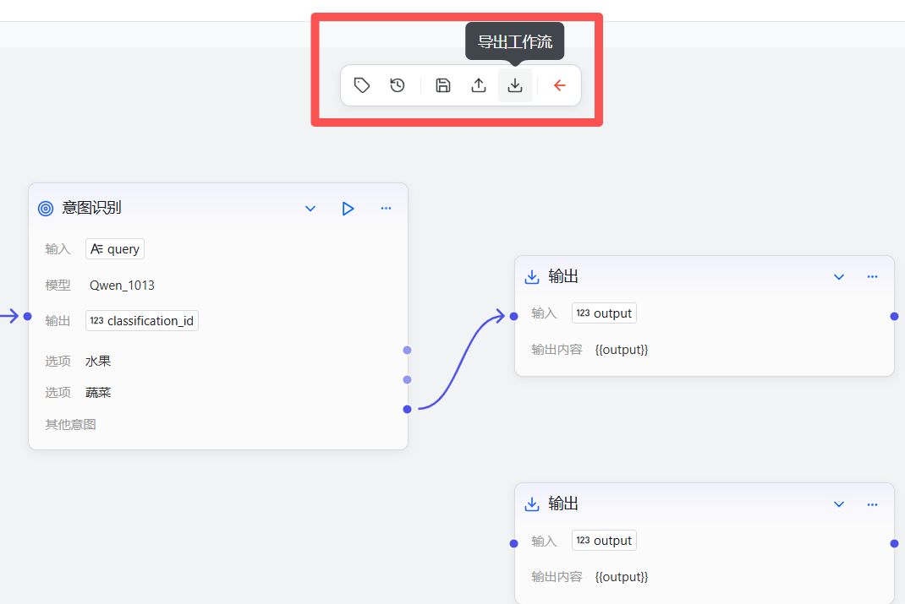
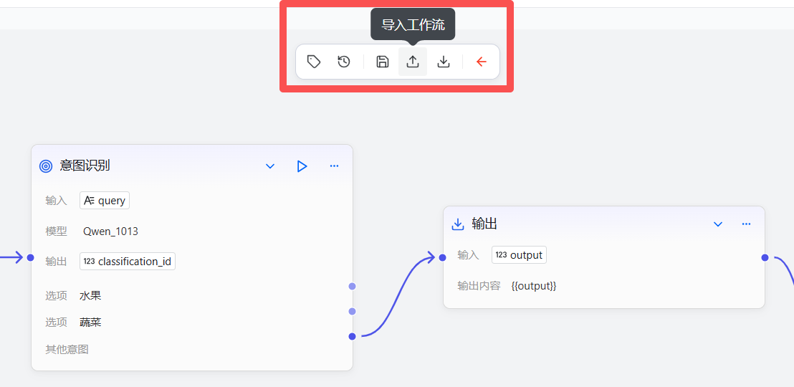
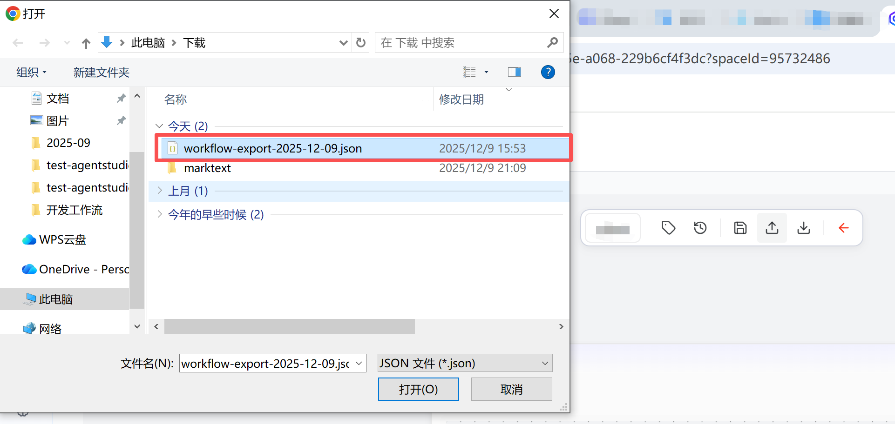

# 导入与导出工作流

工作流支持导出为JSON格式的文本文件。开发者下载该文件到本地后，可将该文件导入至工作流编译器来恢复至导入时的工作流。该功能可帮助开发者高效管理工作流历史版本、实现跨域分享，适用于版本控制、团队协作等多种场景。

## 导出工作流

### 操作步骤

1. 登录openJiuwen平台。

2. 进入平台左侧导航栏的工作流编排模块。

3. 进入工作流编辑页面。

4. 单击页面右上角的"导出"按钮，浏览器将自动下载生成的JSON文件到本地，导出工作流名称为 workflow-export-${当前年份-当前月份-当前日期}.json。
   
   

### 示例

导出的工作流文件以JSON格式展示工作流的结构，包括工作流名称、描述、模式、图标、语法版本、节点和连线等定义。示例如下：

```json
# 基本信息结构
workflow: name: "工作流名称"
description: "工作流描述"
version: "1.0"
syntax_version: "v1"

# 节点定义
nodes: - id: "节点ID"
type: "节点类型"
title: "节点标题"
config: # 节点配置参数

# 连线定义
edges: - source: "源节点ID"
target: "目标节点ID"
# 连线配置
```

## 导入工作流

### 前提条件

* 已在本地保存工作流JSON文件

### 注意事项
* **导入工作流会覆盖当前工作流，确保操作前已备份好当前工作流。**

### 操作步骤

1. 登录openJiuwen平台。

2. 进入平台左侧导航栏的工作流编排模块。

3. 进入工作流编辑页面。

4. 单击页面右上角的"导入"按钮。
   
   

5. 在弹出的对话框中选择本地已导出的工作流JSON文件。
   

6. 单击"打开"按钮完成导入，导入完成后，即可在工作流编辑页面中看到导入的工作流。
