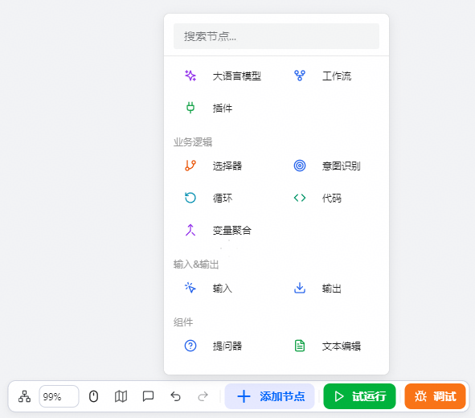
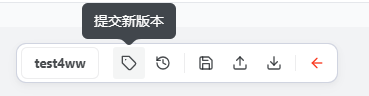
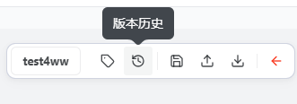

# 构建工作流

本章将详细介绍如何在工作流编辑器中创建、配置和连接工作流组件，帮助用户快速构建结构清晰、逻辑正确的工作流流程。openJiuwen 工作流提供了一个功能丰富的可视化流程设计器，支持直观的拖拽操作与智能连线配置：用户可轻松将各类组件拖放到画布上进行自由布局，系统会自动检测连接的有效性以确保流程逻辑正确；同时支持实时预览执行效果、自定义调整组件位置、画布缩放与平移，并提供撤销/重做功能以便灵活修改，还支持复制粘贴，便于高效复用已有组件和流程结构。

## 创建新工作流

### 操作步骤

1. 进入openJiuwen平台主页。
2. 进入平台左侧导航栏的**工作流编排**模块。

3. 单击创建按钮。
在「工作流编排」页面中，您将看到一个工作流列表。单击页面右上角的「​**创建工作流**​」按钮，开始新建一个工作流。

4. 填写基本信息。
为您的工作流填写基本信息：

   | 参数 | 说明 |
   | --- | ---|
   | 工作流名称 | 一个具有描述性的名称，仅支持字母、数字、下划线，且只能以字母开头 |
   | 工作流描述 | 一段简要的描述，说明该工作流的主要功能和应用场景 |

   

5. 确认创建。

   完成信息填写后，单击「创建工作流」按钮，系统将自动生成一个唯一的工作流ID，并自动跳转至工作流的编辑界面。此时，用户可以开始构建具体的工作流逻辑。

   

## 编排工作流

### 操作步骤
   
   1. 单击工作流进入工作流编辑页面

      

   2. 添加组件：用户可以通过拖拽的方式，将所需的组件从组件库中添加到画布上。每个组件代表一个特定的功能节点，例如工作流、输入输出、业务逻辑等。

      

   3. 配置组件：添加组件后，用户需要对其进行配置。单击组件，右侧将显示该组件的配置面板。在配置面板中，用户可以设置组件的参数、输入输出格式、执行逻辑等。配置过程需根据组件类型和实际需求进行调整，详细可见[配置组件](./配置组件/README.md)。

      

   4. 连接组件：为了使工作流具备执行逻辑，用户需要将各个组件之间建立连接。单击一个组件的输出端口，拖拽至另一个组件的输入端口，即可完成数据或控制流的连接。这种连接方式决定了工作流的执行顺序和数据流动路径。

      

   5. 调整布局：为了提升工作流的可读性和维护性，用户可以拖动组件位置，调整其在画布上的布局。建议按照逻辑顺序排列组件，使整个流程清晰易懂。

      

   6. 保存工作流：完成组件添加、配置和连接后，用户可以单击顶部工具栏中的「保存」按钮，将当前工作流的配置保存到系统中。保存后，用户可以随时返回编辑界面进行修改或优化。

      

## 测试运行

### 操作步骤

1. 单击试运行，手动触发工作流的执行
用户可以单击试运行，手动触发工作流的执行。

   

2. 观察其运行结果，验证逻辑是否正确。

   

## 版本保存

### 操作步骤

1. 单击**提交新版本**进行版本保存。

   

## 查看和回滚版本

### 操作步骤

1. 单击**版本历史**查看到所有的版本。

   

   

2. 单击想要任一已保存的版本，可以对其进行管理，包括创建副本、还原置该版本和删除，单击**还原至该版本**可以将画布上的内容回滚到选择的版本。

   