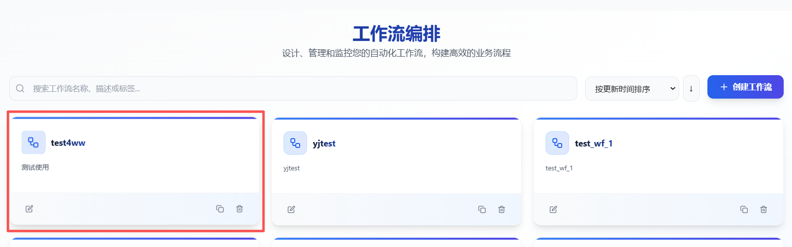
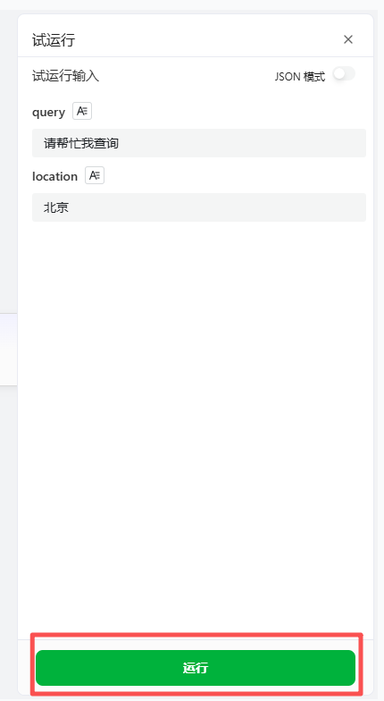

# 调试运行工作流

本章将详细介绍如何在工作流编辑器中执行和测试工作流，帮助开发者和用户快速验证工作流逻辑的正确性与稳定性。

## 操作步骤

1. 进入openJiuwen平台主页。
2. 进入平台左侧导航栏的**工作流编排**模块。

    

3. 单击需要调试的工作流,进入工作流编辑界面

    

4. 单击试运行按钮：在工作流编辑界面中，单击「试运行」按钮，进入测试运行模式。该模式下，系统将模拟工作流的执行环境，但不会对真实数据或外部系统产生影响。

    

5. 输入测试数据：在弹出的测试配置界面中，填写工作流所需的输入参数。这些参数可以是模拟数据，也可以是真实场景中的示例数据。

   

6. 开始执行：确认输入无误后，单击「运行」按钮，系统将按照工作流定义的逻辑开始执行。执行过程中，用户可以实时查看每个节点的执行状态和数据流转情况。

    

7. 查看执行结果：执行结束后，系统将展示完整的执行日志，包括：
* 每个节点的执行状态（成功、失败、跳过等）
* 节点之间的数据传递情况
* 执行耗时等性能指标

    

8. 调试与优化：根据测试结果调整工作流配置，优化执行逻辑
