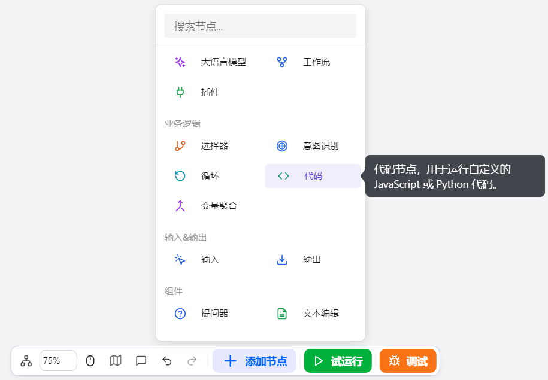
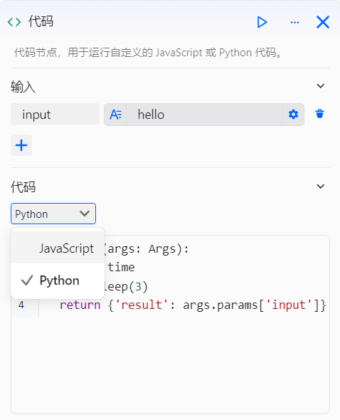

# 配置代码组件

代码组件是工作流设计中的自定义数据处理组件，专为工作流开发者设计，用于在需要对工作流数据进行个性化处理的场景下，满足数据转换、逻辑计算、格式整理等自定义数据处理需求。它通过支持运行自定义的 Python 或 JavaScript 代码，对上游组件传入的输入参数进行个性化处理，并返回处理后的结果供下游组件调用，从而灵活拓展工作流的数据处理能力。

# 配置组件

## 操作步骤
1. 进入openJiuwen平台主页。
2. 进入平台左侧导航栏的工作流编排模块。
3. 单击页面下方的添加组件按钮并单击代码组件。 

4. 单击在画布上出现的代码组件即可开始配置代码组件。 

5. 选择输入参数，设置为上游组件的参数。 

6. 选择代码类型，目前支持 Python 和 JavaScript。 

7. 输入代码。

8. 配置输出参数。 

9. 配置超时或者异常的处理方式。 

代码组件的配置参数说明如下：

| 配置 | 说明 |
| :------: | :------ |
| 输入 | 在声明代码中需要使用的变量时，可以通过添加输入参数来实现，该参数引用上游组件的输出参数。如果想在代码中引用这些输入参数，可以直接通过 params['input']的方式来获取 |
| 代码 | 代码组件中需要执行的片段，可以由你直接编写，在代码中，你可以直接使用输入参数中的变量，并通过一个返回值来输出处理结果。需要注意的是，函数限制为只能编写一个函数，返回一个 object 对象值，返回值的 key 为输出参数。目前仅支持 JavaScript 和 python 两种编程语言。|
| 输出 |代码运行成功后，可以设置一个或多个输出参数。如果组件的异常处理方式设置为返回设定内容或执行异常流程，那么在输出参数中还需要包含 isSuccess 和 errorBody 参数，用于在组件执行异常的时传递详细信息。确保此处定义的参数名和类型与代码中返回的对象的 key 一致|
| 超时时间 | 组件运行的最大允许时间，范围为 0 到 30 秒 |
| 重试次数 | 组件运行超时或者异常时，重试的次数，目前支持不重试、重试 1 次、重试 2 次和重试 3 次 |
| 异常处理方式 | 当组件运行超时或者异常时，用户可以根据具体需求，选择以下几种异常处理方式： ● **中断流程**：立即停止，不再继续运行后续组件。 ● **返回设定内容**：工作流继续执行，但是返回自定义内容，此外还返回 isSuccess 和 errorBody 两个输出参数，用于传递组件异常的详细信息。 ● **执行异常流程**：工作流不会中断，转到预设的异常处理流程。用户需要为新增的异常分支配置具体的处理步骤。异常信息同样会通过 isSuccess 和 errorBody 两个输出参数返回。 |

## 示例
代码组件的具体示例如下，具体功能为将输入参数间隔3s后进行输出： 

一个包含代码组件的工作流例子： 
