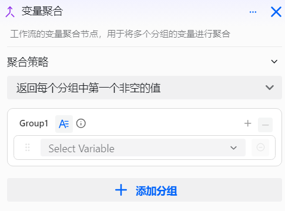
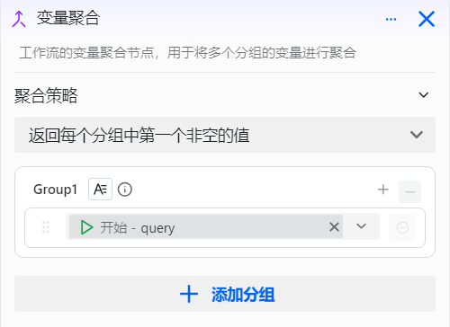
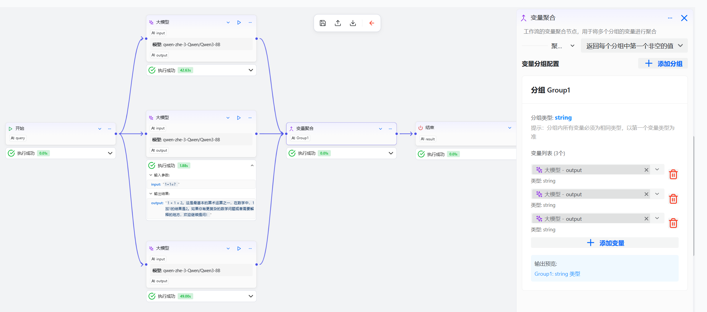

# 配置变量聚合组件

变量聚合组件是工作流设计中的核心组，专为工作流开发者设计，用于在多分支工作流场景下，解决多分支数据流的统一汇总与集成问题。它通过提供高效、灵活的数据汇总机制，允许开发者将多个分支的输出结果进行分组管理和聚合处理，最终生成统一的输出变量。

**核心特性**

该组件支持**分组式管理**功能，允许开发者将多组变量进行归类聚合：
- 每组内可包含多个同类型变量
- 每个组最终自动合并为一个统一的输出变量
- 极大提升多分支场景下的数据流管理效率

# 配置组件

## 操作步骤
1. 进入openJiuwen平台主页。
2. 进入平台左侧导航栏的工作流编排模块。
3. 单击页面下方的添加组件按钮并单击变量聚合组件。 

4. 单击在画布上出现的变量聚合组件即可开始配置变量聚合组件。 

5. 添加分组。默认为一个分组。

6. 分组内添加变量。默认每个分组内有一个变量。

7. 给该分组添加变量，每个分组可以有多个变量，这些变量必须类型一致，它们会聚合为一个输出变量。 

变量聚合组件的配置如下：

| 配置 | 说明 |
| :------: | :------ |
| 聚合策略 | 选择变量聚合策略，可选值包括： - 第一个非空值：读取每个分组中的第一个非空值，作为最终输出 |
| 分组名称 | 当前分组输出的变量名称，用于标识不同的变量集合 |
| 分组类型 | 当前分组输出的变量类型，必须与分组内所有变量类型一致 |
| 分组内变量 | 选择需要聚合的上游组件参数，多个变量的类型必须保持一致 |

## 示例

变量聚合组件的具体示例如下，实现多个分支上大模型节点的输出结果汇总：

