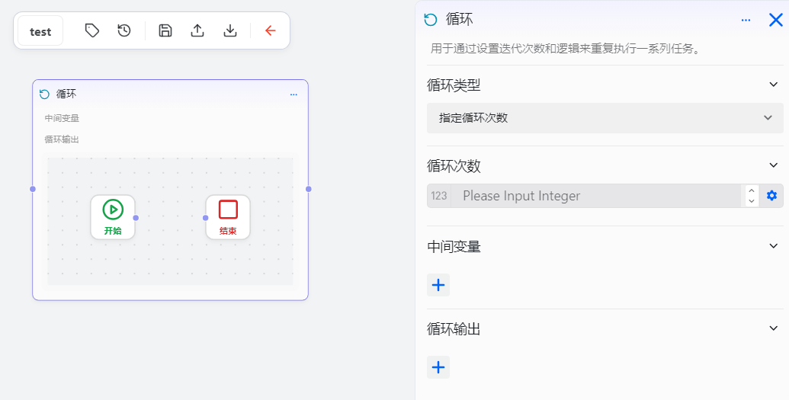
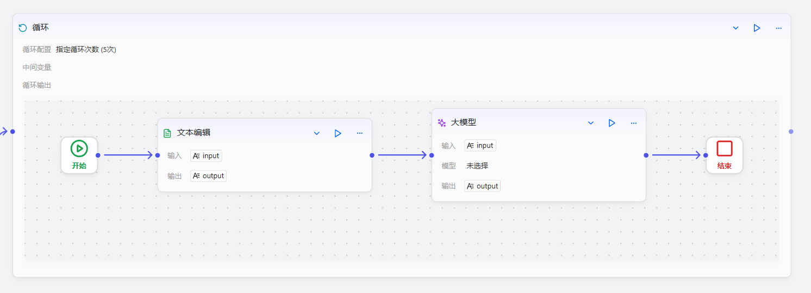

# 配置循环组件

循环组件用于重复执行一系列任务，直到满足某个条件为止。

# 配置组件
## 操作步骤
1. 进入openJiuwen平台主页。
2. 进入平台左侧导航栏的工作流编排模块。
3. 单击页面下方的添加组件按钮并单击循环组件。 

4. 单击在画布上出现的循环组件即可开始配置循环组件。 

5. 设置循环类型。循环组件支持两种循环： 
* ​**数组循环**​：需配置循环数组，实现了编程中的 `for` 循环逻辑。可将其理解为一个自动化处理流水线：通过配置此节点，工作流能自动遍历一个给定的数组序列，并针对其中的每一个元素，重复执行预设的步骤序列，从而高效完成批量处理任务。 
  
* **指定循环次数**：需配置循环的次数。 
  

6. 设置中间变量。 
循环组件允许用户声明一个中间变量，其作用域覆盖所有循环轮次。此变量通常与循环体内的“设置变量”节点配合使用：在当次循环结束时为其赋予新值，此新值将在紧随其后的下一次循环中生效，从而实现在循环迭代间持续维护和传递状态信息。

7. 设置循环体。 

8. 设置循环输出。循环节点提供两种输出模式，以适应不同的下游处理需求： 
* 汇总所有循环的执行结果，当循环完全结束后，将所有次数的输出打包成一个数组，统一传递给下游节点。
* ​直接指定循环体内部的某一个组件的输出，作为整个循环节点的最终输出结果。

 
循环组件的配置项说明如下： 

| 配置 | 说明 |
| :------: | :------ |
| 循环类型 | 执行数组的循环类型，支持数组循环和指定循环次数 |
| 循环次数 | 当循环类型为指定循环次数时，需配置循环的次数 |
| 中间变量名称 | 循环过程中使用的中间变量名称，用于存储和传递循环过程中的状态信 |
| 中间变量类型 | 中间变量的数据类型，支持字符串、数字、布尔值等 |
| 循环输出 | 循环节点的输出模式，支持汇总所有循环结果或指定循环体内部组件的输出 |

