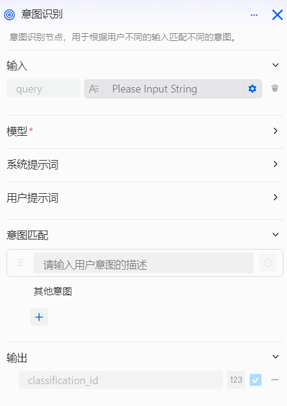
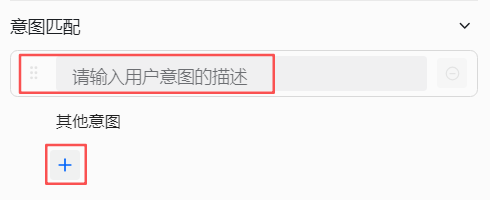

# 配置意图识别组件

意图识别组件是工作流设计中的自然语言理解组件，专为需要构建多分支对话流程的工作流开发者设计。它适用于客户服务系统、医疗咨询平台、多功能智能体等需要对用户意图进行分类并导向不同处理流程的场景。

使用时，您可以通过配置输入参数、模型、系统提示词、用户提示词和意图匹配选项来实现用户意图的准确识别和分类。例如，当用户在对话中说"我想查看今天的 AI 新闻"时，"查看新闻"就是用户的意图，即用户希望智能体执行的具体操作。

**支持的操作：**
- 自动识别用户输入的真实意图
- 将不同意图导向相应的工作流分支
- 支持配置兜底策略处理未匹配的意图

# 配置组件
## 注意事项

配置完成后，需要将意图识别组件与其他组件正确连接，形成完整的工作流。

- 每个意图分类都需要连接到相应的处理组件，否则当该意图被识别时无法触发后续流程。例如，在客服智能体中，产品咨询分类可以连接到产品咨询知识库组件。
- 强烈建议为意图识别组件配置兜底策略，当用户意图未匹配到任何预设分类时，能够提供合适的处理方案。

## 操作步骤
1. 进入openJiuwen平台主页。
2. 进入平台左侧导航栏的工作流编排模块。
3. 单击页面下方的添加组件按钮并单击意图识别组件。 

4. 单击在画布上出现的意图识别组件即可开始配置意图识别组件。 

5. 配置输入参数。
6. 配置模型。

7. 配置系统提示词。描述意图识别的任务和要求，将用户输入映射到预定义的意图分类。

8. 配置用户提示词。

9. 添加意图匹配选项。定义系统支持的意图分类，每个分类对应系统提示词中的一个任务分类。 

 
意图识别组件的配置项说明如下： 

| 配置项 | 说明 |
|-----------|------------------------------------------------------------------------------------------------------------------------------------|
| 模型 | 选择执行意图识别的大模型，支持调整生成多样性、输入输出参数等配置，使识别效果更符合您的具体需求。 |
| 输入 | 指定需要进行意图识别的内容。默认输入参数为 query，可引用前置组件的输出参数，或直接输入指定内容。通常建议引用开始组件的用户输入。|
| 意图匹配  | 用户意图的分类选项，支持设置多个分类（完整模式下最多支持 50 个意图）。匹配到分类的意图会流转到对应的后续组件；未匹配任何分类时，将执行兜底策略。|
| 系统提示词 | 附加的系统提示词，用于指导大模型准确识别和分类用户意图。 |
| 用户提示词 | 附加的用户提示词，用于进一步优化识别效果。 |
| 输出 | 组件的输出参数，可作为变量被后续组件引用。固定输出参数包括： • **classificationId**：意图的唯一标识符。按照意图匹配配置的顺序从上到下依次排序，第一个意图的 ID 为 1；未命中任何已配置意图时，ID 为 0，执行其他分支。 |

## 示例

以客户服务工作流为例，通过意图识别组件对用户问题进行智能分类，并导向不同的处理流程：

**核心组件设计**

- **意图识别组件**：将用户问题智能分类为售前咨询或售后支持，为每个分类提供典型示例作为识别依据，提升模型识别准确性。
- **子工作流**：售前和售后问题分别流转到专门的子工作流进行处理。
- **输出组件**：作为兜底策略，对于未命中任何预设分类的意图，统一输出友好提示，引导用户提交工单或联系人工客服。

